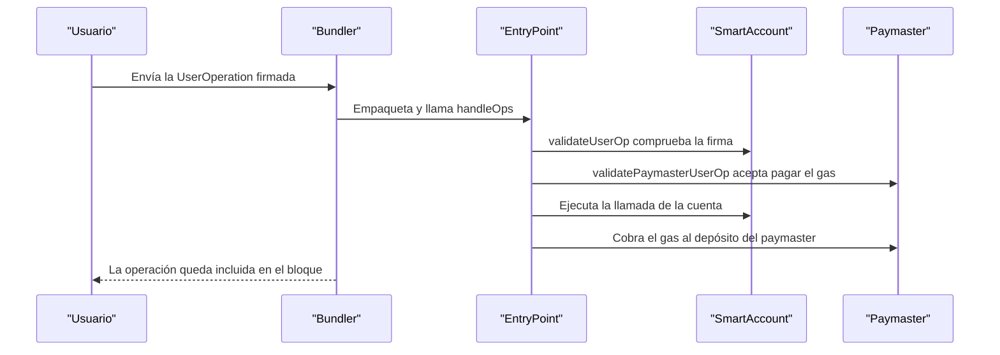
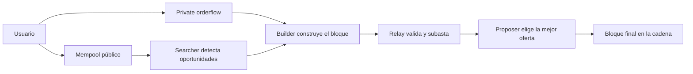

# 15 · Arquitectura avanzada

> **Nivel:** Avanzado · ⏱️ **Duración estimada:** 180 min · **Fuente:** ERC-4337 / EIP-7702 (abstracción de cuenta) e investigación de Flashbots (MEV)
> [⬅️ Currículo](../README.md) · [📚 Bibliografía](../../docs/bibliografia.md)
> 🧭 ⬅️ **Anterior:** [14 · Privacidad y zero knowledge](../14-privacidad-zk/README.md) · [📚 Índice](../README.md) · ➡️ **Siguiente:** [16 · Infraestructura y operación de nodos](../16-infraestructura-nodos/README.md)
> 📖 [Glosario de términos](../../docs/glosario.md) · 🌱 [¿Nuevo en esto? Empieza aquí](../../docs/empieza-aqui.md)

---

## 🎯 Objetivos

- Integrar la abstracción de cuenta con ERC-4337 (UserOperations, bundlers, paymasters) y EIP-7702 para EOAs en Pectra (2025).
- Diseñar sistemas actualizables con patrones proxy (UUPS, Transparent) cuidando el storage layout y sus riesgos.
- Analizar el MEV (front-running, sandwich) y las respuestas de mercado como PBS y mev-boost.
- Redactar un documento de arquitectura que cubra amenazas, invariantes, costos, gobernanza, privacidad, legalidad y operación.
- Argumentar cuándo la decisión más madura es reducir o eliminar componentes blockchain.

## 📚 Resultados de aprendizaje

Al finalizar, el estudiante podrá:

1. **Explicar** el flujo de una UserOperation en ERC-4337 y en qué se diferencia de EIP-7702.
2. **Diseñar** un contrato actualizable seguro justificando el patrón proxy y el storage layout.
3. **Identificar** vectores de MEV en un flujo de usuario y proponer mitigaciones.
4. **Elaborar** un documento de arquitectura con activos, actores, amenazas e invariantes explícitos.
5. **Evaluar** tokenomics de un diseño con un simulador de suministro y contrastarlo con sus objetivos.
6. **Decidir** con criterio cuándo una alternativa no-blockchain resuelve mejor el problema.

## 🗺️ Temas

| # | Tema | Por qué importa |
|---|------|-----------------|
| 1 | ERC-4337 (UserOps, bundlers, paymasters) | Habilita cuentas programables y patrocinio de gas sin cambiar el protocolo |
| 2 | EIP-7702 (EOAs con código en Pectra) | Da capacidades de smart account a cuentas existentes desde 2025 |
| 3 | Proxies y upgrades (UUPS, Transparent) | Permiten evolucionar contratos; un error de storage puede corromper el estado |
| 4 | MEV: front-running y sandwich | El orden de las transacciones es un activo que se explota |
| 5 | PBS y mev-boost | Separan proponer de construir bloques para acotar el poder del validador |
| 6 | Tokenomics y economía de mecanismos | Alinea incentivos; un mal diseño rompe el sistema aunque el código sea correcto |
| 7 | Observabilidad y respuesta a incidentes | Sin monitoreo no hay detección ni contención de un fallo |
| 8 | Cumplimiento y decisión de no usar blockchain | La madurez incluye reconocer cuándo blockchain no aporta |

## 🧠 Modelo mental

Piensa en la arquitectura avanzada como el plano de un edificio, no como el ladrillo. La abstracción de cuenta cambia las cerraduras (quién puede firmar y cómo se paga la entrada), los proxies son las reformas que permiten cambiar habitaciones sin demoler la estructura, y el MEV es el portero que decide en qué orden entran los visitantes y puede cobrar por adelantar a unos frente a otros. El documento de arquitectura es la memoria del proyecto: qué se construye, para quién, con qué riesgos y qué se hace cuando algo falla.

La analogía se queda corta en un punto esencial: a diferencia de un edificio, aquí muchas veces la mejor decisión de diseño es construir menos. Añadir un componente blockchain introduce costes, superficie de ataque y rigidez de actualización; la madurez técnica se demuestra sabiendo cuándo una base de datos, una firma o un servicio convencional resuelven el problema con menos riesgo. El plano correcto puede ser el que retira ladrillos.

## 🧩 Esquema visual

Flujo de una UserOperation en ERC-4337, con patrocinio de gas por un paymaster:



La cadena de suministro del MEV bajo PBS: cada eslabón compite por capturar valor del orden de las transacciones.



## 📖 Conceptos y definiciones

- **Abstracción de cuenta**: capacidad de que la lógica de validación de una cuenta sea programable, en lugar de fija como en una EOA clásica.
- **UserOperation**: intención firmada que un bundler empaqueta y envía en ERC-4337, procesada por un contrato EntryPoint.
- **Paymaster**: contrato que puede patrocinar el gas de una UserOperation, habilitando pagos en tokens o gas gratuito condicionado.
- **EIP-7702**: mecanismo de Pectra (2025) que permite a una EOA delegar en código de contrato, acercándola a una smart account.
- **Proxy UUPS/Transparent**: patrón que separa lógica y almacenamiento para permitir upgrades; exige preservar el storage layout.
- **MEV**: valor extraíble por reordenar, insertar o censurar transacciones dentro de un bloque; incluye front-running y sandwich.
- **PBS (proposer-builder separation)**: separación entre quien propone el bloque y quien lo construye, para limitar la extracción de MEV.
- **mev-boost**: software que implementa un mercado de construcción de bloques externo para validadores de Ethereum.
- **Invariante**: propiedad que el sistema debe cumplir siempre (por ejemplo "el suministro total nunca disminuye salvo por quema").
- **Tokenomics**: diseño económico del token (emisión, distribución, incentivos) que determina la sostenibilidad del sistema.

## 🔬 Profundización

### ERC-4337 frente a EIP-7702: dos caminos hacia la cuenta programable

ERC-4337 (2023) construyó la abstracción de cuenta *sin tocar el protocolo*: un mempool alternativo de UserOperations, bundlers que las empaquetan y un contrato EntryPoint que orquesta validación y ejecución. EIP-7702 (Pectra, mayo de 2025) atacó el problema desde el protocolo: una EOA existente puede firmar una autorización de delegación que hace que su dirección ejecute el código de un contrato, conservando su clave y su dirección de siempre.

| Dimensión | ERC-4337 | EIP-7702 |
|-----------|----------|----------|
| Tipo de cuenta | Contrato smart account nuevo, con dirección propia | La EOA de siempre, con código delegado |
| Cambio de protocolo | Ninguno; infraestructura fuera del protocolo | Sí; nuevo tipo de transacción en Pectra (2025) |
| Migración del usuario | Debe mover activos a la cuenta nueva | Ninguna; conserva dirección e historial |
| Batching de llamadas | Sí, nativo en la cuenta | Sí, vía el código delegado |
| Session keys y políticas | Sí, con lógica de validación arbitraria | Sí, según el contrato delegado |
| Sponsorship de gas | Paymasters vía EntryPoint | Compatible: una 7702-EOA puede actuar como cuenta 4337 |
| Riesgo característico | Complejidad del EntryPoint y de los bundlers | Delegar en un contrato malicioso entrega la cuenta entera |

No son rivales sino complementarios: el diseño previsto es que las EOA con 7702 deleguen en implementaciones de smart account compatibles con 4337, unificando ambos mundos. Las cifras de adopción (cuentas 4337 activas, delegaciones 7702) cambian mes a mes: consúltalo en vivo en paneles como los de BundleBear en [Dune](https://dune.com/).

### MEV en números: anatomía de un sandwich

Un sandwich explota la tolerancia al deslizamiento (slippage) de un swap visible en el mempool. Ejemplo numérico simplificado:

1. Alicia envía un swap de 100 000 USDC por ETH en un AMM, con un slippage máximo del 1%: acepta recibir como mínimo el 99% del precio actual.
2. Un searcher lo ve en el mempool y compra ETH justo antes (front-run), empujando el precio al alza dentro del margen que Alicia toleró.
3. El swap de Alicia se ejecuta al peor precio permitido: recibe ~1% menos de ETH, es decir, hasta ~1 000 USDC de valor cedido.
4. El searcher vende inmediatamente después (back-run) el ETH comprado, capturando la diferencia menos el gas y el pago al builder por la posición en el bloque.

El valor no aparece de la nada: sale del slippage de Alicia. Las mitigaciones atacan cada eslabón: el *private orderflow* (enviar la transacción directamente a un builder o a un RPC protegido) evita exponerla en el mempool público; las *batch auctions* tipo CoW Protocol liquidan muchas órdenes a un precio uniforme por lote, eliminando la ventaja del orden intra-bloque; y MEV-Share invierte el juego devolviendo al usuario parte del valor que su flujo genera. En paralelo, PBS con mev-boost no elimina el MEV, pero lo saca de las manos del validador individual y lo convierte en un mercado competitivo de builders, más observable y menos discrecional.

### Runbook de un upgrade seguro

Un upgrade de contrato es una operación de producción con usuarios y fondos en juego; improvisar es la principal causa de incidentes autoinfligidos. Secuencia mínima:

1. **Proponer**: publicar el código nuevo, su auditoría o revisión, el diff del storage layout y la motivación del cambio; abrir la propuesta a la gobernanza correspondiente.
2. **Timelock público**: encolar la ejecución en un timelock en cadena (por ejemplo, de 48 horas a varios días) para que el cambio sea inevitablemente visible antes de aplicarse.
3. **Comunicar**: anunciar por los canales oficiales qué cambia, cuándo y qué debe hacer un usuario que no esté de acuerdo; el silencio convierte un upgrade legítimo en indistinguible de un ataque.
4. **Ventana de salida**: garantizar que durante el timelock los usuarios pueden retirar fondos o revocar aprobaciones si rechazan el cambio; sin salida real, la gobernanza es cosmética.
5. **Ejecución multisig**: ejecutar desde un multisig con umbral y firmantes públicos, verificando que el calldata ejecutado coincide byte a byte con lo propuesto y encolado.
6. **Verificación post-upgrade**: comprobar en cadena la nueva dirección de implementación, correr los invariantes sobre el estado migrado, verificar el código en el explorador y monitorizar métricas y eventos anómalos durante las primeras horas, con un plan de contención listo por si algo falla.

### Un sándwich de MEV, contado en números

El MEV se entiende cuando se ve el dinero moverse. Sigamos el caso más común: alguien intenta comprar un token y un bot le extrae valor sin robarle nada en sentido técnico.

**La víctima envía:** comprar 100 000 USDC de TOKEN, con una tolerancia de deslizamiento del 3 %.

Ese último número es la puerta. Le está diciendo al mundo: *acepto pagar hasta un 3 % peor de lo que veo ahora*.

**El bot lo ve en el mempool y construye tres transacciones seguidas:**

```text
1. [BOT compra]     sube el precio del pool hasta el borde del 3 %
2. [VÍCTIMA compra] se ejecuta al precio empeorado — pero dentro de su tolerancia,
                    así que NO revierte y para ella "funcionó"
3. [BOT vende]      deshace su posición al precio que la víctima acaba de crear
```

**El resultado, con números redondos:**

```text
La víctima recibe ~3 % menos TOKEN del que habría recibido sin el bot
  3 % de 100 000 USDC  ≈  3 000 USDC de valor extraído
Menos el gas del bot y su pago al constructor del bloque → beneficio neto para el bot
```

**Lo incómodo del asunto:** no hubo hackeo, ni bug, ni contrato malicioso. Todo funcionó como está escrito. El valor extraído sale de un parámetro que la víctima eligió y probablemente no entendía.

**Qué reduce la exposición, y qué no:**

| Medida | Efecto real |
|---|---|
| Bajar el deslizamiento al 0,5 % | Reduce mucho lo extraíble: el margen del sándwich es literalmente ese número |
| Enviar por un **RPC privado** | La transacción no pasa por el mempool público, así que el bot no la ve venir |
| Operar en pools con liquidez profunda | Mover el precio cuesta más, y el ataque deja de compensar |
| "Poner más gas" | **No ayuda**: el bot puja por posición igual y suele pujar mejor |

> 💡 **En una frase:** el deslizamiento no es un ajuste técnico, es cuánto autorizas a que te extraigan. El sándwich se cobra exactamente esa cifra.

<details>
<summary><strong>🎓 Si ya dominas esto</strong> — el MEV como capa de mercado</summary>

- **PBS no elimina el MEV: lo organiza.** Separar quien propone el bloque de quien lo construye evita que solo los validadores sofisticados capturen valor, y reparte la renta con los pequeños. Es mitigación de centralización, no de extracción.
- **No todo el MEV es dañino.** El arbitraje entre mercados alinea precios y las liquidaciones mantienen solventes los protocolos de préstamo. El sándwich, en cambio, es extracción pura del usuario. Meterlos en el mismo saco impide razonar sobre política de diseño.
- **Los RPC privados cambian el riesgo, no lo borran.** Dejas de estar expuesto al mempool público a cambio de confiar en el operador del relay, que sí ve tu transacción. Es un cambio de contraparte.
- **En una L2 con secuenciador único, el MEV lo captura el operador**, no un mercado abierto. Puede ser más justo o mucho menos, según su política — y esa política suele ser una decisión de empresa, no un mecanismo verificable.
- **La abstracción de cuenta reordena la superficie.** Con ERC-4337, las UserOperations viajan por un mempool alternativo con sus propios bundlers, así que la extracción se traslada ahí. Cambia el sitio, no la existencia.

</details>

## 🧪 Laboratorio guiado

> 🧪 Estas prácticas están catalogadas y **resueltas paso a paso** en el [catálogo de laboratorios](../../labs/CATALOG.md).

Ejecuta el simulador de suministro para la parte de tokenomics y luego integra los hallazgos en el documento de arquitectura. El proyecto integrador vive en `capstone` y en `projects/community-funding`.

1. Lanza el simulador de tokenomics y registra las curvas de emisión y suministro resultantes.

```bash
pnpm lab:tokenomics
```

2. Varía los parámetros de emisión y observa el efecto sobre el suministro total y los incentivos.
3. Documenta el patrón de upgrade elegido (UUPS o Transparent) y verifica que el storage layout se preserva entre versiones.
4. Traza el flujo de una UserOperation (ERC-4337) y contrasta el modelo con una delegación EIP-7702 desde una EOA.
5. Analiza dónde aparece MEV en el flujo de usuario y qué mitigación aplicarías (por ejemplo envío privado o subasta de bloques).

## 📝 Reto verificable

Entrega un documento de arquitectura del proyecto integrador que incluya: problema y usuarios, decisión blockchain vs. alternativas, componentes y límites de confianza, activos/actores/amenazas, invariantes, costos y escalabilidad, administración y gobernanza, privacidad y aspectos legales, y pruebas/despliegue/monitoreo/retiro.

**Criterio de aceptación:** el documento contiene las nueve secciones citadas, define al menos tres invariantes verificables, justifica explícitamente la decisión de usar (o no) blockchain frente a alternativas, y adjunta los resultados del simulador `pnpm lab:tokenomics` que respaldan el diseño económico.

## ⚠️ Errores frecuentes

| Síntoma | Causa y cómo comprobarlo |
|---------|--------------------------|
| Upgrade que corrompe el estado | Cambio en el storage layout; compara las variables de almacenamiento entre versiones |
| Confundir ERC-4337 con EIP-7702 | Uno usa UserOps vía EntryPoint, el otro delega desde una EOA; revisa el flujo de cada uno |
| Ignorar el MEV en el diseño | Se asume orden neutral; simula un sandwich sobre el flujo de swap |
| Paymaster sin límites | Patrocinio ilimitado se explota; verifica cuotas y validación del paymaster |
| Tokenomics sin invariantes | El incentivo se rompe silenciosamente; define y prueba invariantes de suministro |
| Usar blockchain por defecto | No se evaluó la alternativa; documenta por qué una base de datos no bastaba |

## 🛡️ Seguridad y ética

- Trabaja en local o testnet; no despliegues con fondos reales ni utilices claves privadas reales en el laboratorio.
- No incluyas datos personales reales en el documento de arquitectura ni en el simulador.
- Declara los límites de confianza y las claves administrativas; ocultar un poder de upgrade es una omisión ética.
- Reconoce el impacto del MEV en los usuarios y prioriza diseños que reduzcan la extracción a su costa.
- Considera el cumplimiento legal y la privacidad desde el diseño, no como un añadido posterior.

## 🔗 Referencias

- ERC-4337, Account Abstraction Using Alt Mempool — <https://eips.ethereum.org/EIPS/eip-4337>
- EIP-7702, Set EOA account code (Pectra) — <https://eips.ethereum.org/EIPS/eip-7702>
- Flashbots, investigación sobre MEV — <https://writings.flashbots.net/>
- OpenZeppelin, Upgrades Plugins — <https://docs.openzeppelin.com/upgrades-plugins/>
- Voshmgir, S., *Token Economy* — <https://github.com/Token-Economy-Book/3rdEdition-English>
- Fuente primaria: Daian et al., *Flash Boys 2.0* — <https://arxiv.org/abs/1904.05234>

## ✅ Criterio de dominio

- Explicas el flujo de ERC-4337 y su diferencia con EIP-7702 sin apoyo.
- Diseñas un upgrade seguro razonando el storage layout y el patrón proxy elegido.
- Produces un documento de arquitectura con invariantes verificables y una decisión justificada sobre usar o no blockchain.

---

## 🧭 Navegación

⬅️ [Módulo 14 · Privacidad y zero knowledge](../14-privacidad-zk/README.md) · [📚 Índice del currículo](../README.md) · ➡️ [Módulo 16 · Infraestructura y operación de nodos](../16-infraestructura-nodos/README.md)
