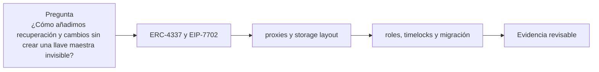

# Clase 31 · Cuentas programables y actualizaciones

> **Clase independiente 31 de 66** · **Nivel:** Avanzado · **Fuente base:** ERC-4337 / EIP-7702 (abstracción de cuenta) e investigación de Flashbots (MEV)
>
> [⬅️ Clase anterior](../14-privacidad-zk/clase-30-snark-stark-y-privacidad-real.md) · [📚 Índice de las 66 clases](../README.md) · [🗂️ Mapa del tema](README.md) · [➡️ Clase siguiente](../15-arquitectura-avanzada/clase-32-mev-y-arquitectura-de-produccion.md)

## Punto de partida

**Pregunta guía:** ¿Cómo añadimos recuperación y cambios sin crear una llave maestra invisible?

**Caso que abre la clase:** Una actualización válida corrompe storage y bloquea retiros.

Una actualización útil se enfrenta a corrupción de storage y abuso administrativo. La clase exige procedimiento de migración y reversión junto con el patrón técnico.

## Fundamentos que sostienen la respuesta

1. **ERC-4337 y EIP-7702.** En esta clase delimita qué objeto o relación estamos observando antes de sacar conclusiones. Localízalo explícitamente en «Una actualización válida corrompe storage y bloquea retiros.» y anota qué dato faltaría para refutar tu lectura.
2. **proxies y storage layout.** En esta clase explica el mecanismo que conecta la situación inicial con el cambio observable. Localízalo explícitamente en «Una actualización válida corrompe storage y bloquea retiros.» y anota qué dato faltaría para refutar tu lectura.
3. **roles, timelocks y migración.** En esta clase permite contrastar el resultado y formular el límite de la evidencia. Localízalo explícitamente en «Una actualización válida corrompe storage y bloquea retiros.» y anota qué dato faltaría para refutar tu lectura.

### ERC-4337 frente a EIP-7702: dos caminos hacia la cuenta programable

ERC-4337 (2023) construyó la abstracción de cuenta *sin tocar el protocolo*: un mempool alternativo de UserOperations, bundlers que las empaquetan y un contrato EntryPoint que orquesta validación y ejecución. EIP-7702 (Pectra, mayo de 2025) atacó el problema desde el protocolo: una EOA existente puede firmar una autorización de delegación que hace que su dirección ejecute el código de un contrato, conservando su clave y su dirección de siempre.

| Dimensión | ERC-4337 | EIP-7702 |
|-----------|----------|----------|
| Tipo de cuenta | Contrato smart account nuevo, con dirección propia | La EOA de siempre, con código delegado |
| Cambio de protocolo | Ninguno; infraestructura fuera del protocolo | Sí; nuevo tipo de transacción en Pectra (2025) |
| Migración del usuario | Debe mover activos a la cuenta nueva | Ninguna; conserva dirección e historial |
| Batching de llamadas | Sí, nativo en la cuenta | Sí, vía el código delegado |
| Session keys y políticas | Sí, con lógica de validación arbitraria | Sí, según el contrato delegado |
| Sponsorship de gas | Paymasters vía EntryPoint | Compatible: una 7702-EOA puede actuar como cuenta 4337 |
| Riesgo característico | Complejidad del EntryPoint y de los bundlers | Delegar en un contrato malicioso entrega la cuenta entera |

No son rivales sino complementarios: el diseño previsto es que las EOA con 7702 deleguen en implementaciones de smart account compatibles con 4337, unificando ambos mundos. Las cifras de adopción (cuentas 4337 activas, delegaciones 7702) cambian mes a mes: consúltalo en vivo en paneles como los de BundleBear en [Dune](https://dune.com/).

## Gráfico pedagógico

Recorre el gráfico en voz alta: identifica supuestos, transformaciones y el punto exacto donde aparece evidencia.

## Trabajo práctico

**Método propio:** revisión de arquitectura y rollback.

**Actividad:** Diseñar cuenta recuperable y plan de upgrade con rollback.

Trabaja en entorno local, regtest, signet o testnet según corresponda. Conserva entradas, comandos, salidas y bloque o instante de corte. Una captura aislada no demuestra reproducibilidad.

## Demostración de aprendizaje

**Entregable:** ADR con invariantes, autoridad, demora y procedimiento de emergencia.

**Comprobación formativa:** ¿Qué poder conserva el administrador después del timelock y cómo se limita?

Para aprobar debes conectar el hecho observado con el concepto correcto, descartar al menos una interpretación alternativa y redactar una conclusión cuyo alcance no exceda la prueba.

## Errores que esta clase corrige

- Tratar **ERC-4337 y EIP-7702** como una etiqueta suficiente, sin identificar actores, dato y frontera.
- Usar **proxies y storage layout** como explicación aunque el caso no aporte la evidencia necesaria.
- Dar por respondido «¿Cómo añadimos recuperación y cambios sin crear una llave maestra invisible?» sin contrastar **roles, timelocks y migración**.

Vuelve al caso inicial, elige el error más peligroso y describe una comprobación concreta que lo detectaría.

## Fuentes para comprobar y ampliar

- ERC-4337, Account Abstraction Using Alt Mempool — <https://eips.ethereum.org/EIPS/eip-4337>
- EIP-7702, Set EOA account code (Pectra) — <https://eips.ethereum.org/EIPS/eip-7702>
- Ethereum.org, guía operativa y de seguridad de EIP-7702 — <https://ethereum.org/roadmap/pectra/7702/>
- Ethereum Foundation, activación de Pectra en mainnet (7 de mayo de 2025) — <https://blog.ethereum.org/en/2025/04/23/pectra-mainnet>
- Flashbots, investigación sobre MEV — <https://writings.flashbots.net/>
- OpenZeppelin, Upgrades Plugins — <https://docs.openzeppelin.com/upgrades-plugins/>
- Voshmgir, S., *Token Economy* — <https://github.com/Token-Economy-Book/3rdEdition-English>
- Fuente primaria: Daian et al., *Flash Boys 2.0* — <https://arxiv.org/abs/1904.05234>

Consulta además la [bibliografía razonada](../../docs/bibliografia.md), que declara procedencia y uso.

## Cierre de la clase

Responde otra vez la pregunta guía sin mirar notas. Si tu respuesta no menciona evidencia, supuesto y límite, todavía describe el tema pero no lo domina. Continúa solo cuando otra persona pueda reproducir tu entregable.
