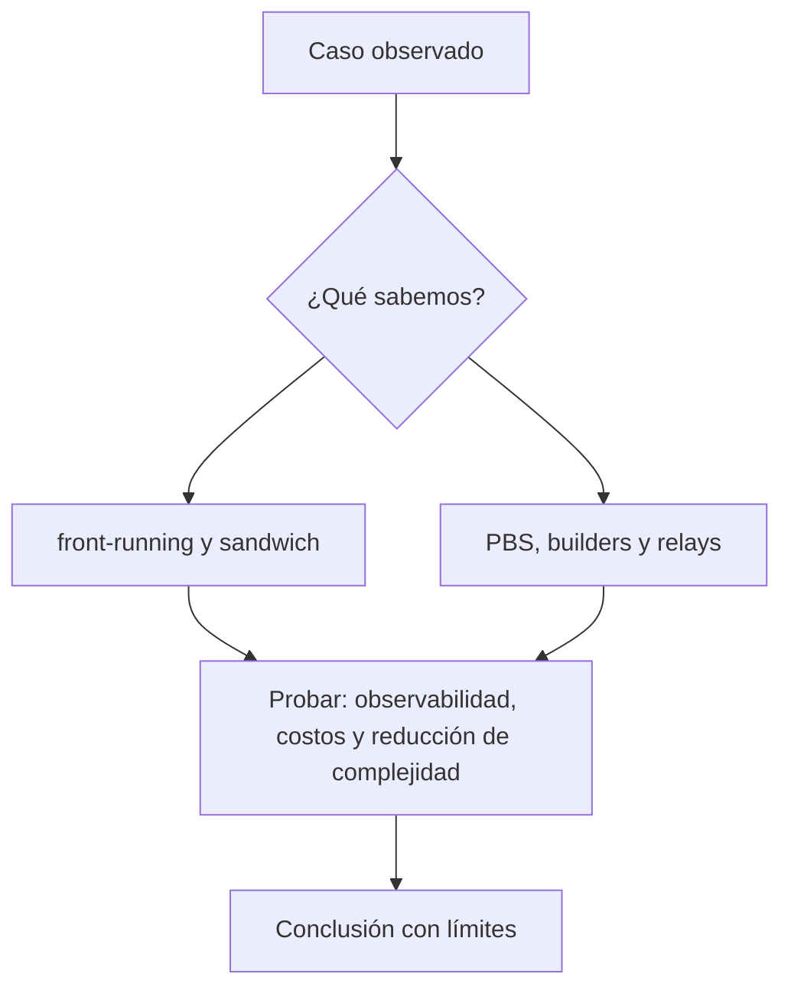

# Clase 32 · MEV y arquitectura de producción

> **Clase independiente 32 de 66** · **Nivel:** Avanzado · **Fuente base:** ERC-4337 / EIP-7702 (abstracción de cuenta) e investigación de Flashbots (MEV)
>
> [⬅️ Clase anterior](../15-arquitectura-avanzada/clase-31-cuentas-programables-y-actualizaciones.md) · [📚 Índice de las 66 clases](../README.md) · [🗂️ Mapa del tema](README.md) · [➡️ Clase siguiente](../16-infraestructura-nodos/clase-33-operar-nodos-con-objetivos-medibles.md)

## Punto de partida

**Pregunta guía:** ¿Qué actores pueden reordenar operaciones y cómo cambia el diseño?

**Caso que abre la clase:** Una operación grande pierde valor por hacerse visible en el mempool.

Usuarios, searchers, builders, relays y proponentes compiten por ordenar una operación. El MEV se observa como consecuencia arquitectónica y económica.

## Gráfico pedagógico

Recorre el gráfico en voz alta: identifica supuestos, transformaciones y el punto exacto donde aparece evidencia.



## Fundamentos que sostienen la respuesta

1. **front-running y sandwich.** En esta clase delimita qué objeto o relación estamos observando antes de sacar conclusiones. Localízalo explícitamente en «Una operación grande pierde valor por hacerse visible en el mempool.» y anota qué dato faltaría para refutar tu lectura.
2. **PBS, builders y relays.** En esta clase explica el mecanismo que conecta la situación inicial con el cambio observable. Localízalo explícitamente en «Una operación grande pierde valor por hacerse visible en el mempool.» y anota qué dato faltaría para refutar tu lectura.
3. **observabilidad, costos y reducción de complejidad.** En esta clase permite contrastar el resultado y formular el límite de la evidencia. Localízalo explícitamente en «Una operación grande pierde valor por hacerse visible en el mempool.» y anota qué dato faltaría para refutar tu lectura.

### MEV en números: anatomía de un sandwich

Un sandwich explota la tolerancia al deslizamiento (slippage) de un swap visible en el mempool. Ejemplo numérico simplificado:

1. Alicia envía un swap de 100 000 USDC por ETH en un AMM, con un slippage máximo del 1%: acepta recibir como mínimo el 99% del precio actual.
2. Un searcher lo ve en el mempool y compra ETH justo antes (front-run), empujando el precio al alza dentro del margen que Alicia toleró.
3. El swap de Alicia se ejecuta al peor precio permitido: recibe ~1% menos de ETH, es decir, hasta ~1 000 USDC de valor cedido.
4. El searcher vende inmediatamente después (back-run) el ETH comprado, capturando la diferencia menos el gas y el pago al builder por la posición en el bloque.

El valor no aparece de la nada: sale del slippage de Alicia. Las mitigaciones atacan cada eslabón: el *private orderflow* (enviar la transacción directamente a un builder o a un RPC protegido) evita exponerla en el mempool público; las *batch auctions* tipo CoW Protocol liquidan muchas órdenes a un precio uniforme por lote, eliminando la ventaja del orden intra-bloque; y MEV-Share invierte el juego devolviendo al usuario parte del valor que su flujo genera. En paralelo, PBS con mev-boost no elimina el MEV, pero lo saca de las manos del validador individual y lo convierte en un mercado competitivo de builders, más observable y menos discrecional.

### Runbook de un upgrade seguro

Un upgrade de contrato es una operación de producción con usuarios y fondos en juego; improvisar es la principal causa de incidentes autoinfligidos. Secuencia mínima:

1. **Proponer**: publicar el código nuevo, su auditoría o revisión, el diff del storage layout y la motivación del cambio; abrir la propuesta a la gobernanza correspondiente.
2. **Timelock público**: encolar la ejecución en un timelock en cadena (por ejemplo, de 48 horas a varios días) para que el cambio sea inevitablemente visible antes de aplicarse.
3. **Comunicar**: anunciar por los canales oficiales qué cambia, cuándo y qué debe hacer un usuario que no esté de acuerdo; el silencio convierte un upgrade legítimo en indistinguible de un ataque.
4. **Ventana de salida**: garantizar que durante el timelock los usuarios pueden retirar fondos o revocar aprobaciones si rechazan el cambio; sin salida real, la gobernanza es cosmética.
5. **Ejecución multisig**: ejecutar desde un multisig con umbral y firmantes públicos, verificando que el calldata ejecutado coincide byte a byte con lo propuesto y encolado.
6. **Verificación post-upgrade**: comprobar en cadena la nueva dirección de implementación, correr los invariantes sobre el estado migrado, verificar el código en el explorador y monitorizar métricas y eventos anómalos durante las primeras horas, con un plan de contención listo por si algo falla.

### Un sándwich de MEV, contado en números

El MEV se entiende cuando se ve el dinero moverse. Sigamos el caso más común: alguien intenta comprar un token y un bot le extrae valor sin robarle nada en sentido técnico.

**La víctima envía:** comprar 100 000 USDC de TOKEN, con una tolerancia de deslizamiento del 3 %.

Ese último número es la puerta. Le está diciendo al mundo: *acepto pagar hasta un 3 % peor de lo que veo ahora*.

**El bot lo ve en el mempool y construye tres transacciones seguidas:**

```text
1. [BOT compra]     sube el precio del pool hasta el borde del 3 %
2. [VÍCTIMA compra] se ejecuta al precio empeorado — pero dentro de su tolerancia,
                    así que NO revierte y para ella "funcionó"
3. [BOT vende]      deshace su posición al precio que la víctima acaba de crear
```

**El resultado, con números redondos:**

```text
La víctima recibe ~3 % menos TOKEN del que habría recibido sin el bot
  3 % de 100 000 USDC  ≈  3 000 USDC de valor extraído
Menos el gas del bot y su pago al constructor del bloque → beneficio neto para el bot
```

**Lo incómodo del asunto:** no hubo hackeo, ni bug, ni contrato malicioso. Todo funcionó como está escrito. El valor extraído sale de un parámetro que la víctima eligió y probablemente no entendía.

**Qué reduce la exposición, y qué no:**

| Medida | Efecto real |
|---|---|
| Bajar el deslizamiento al 0,5 % | Reduce mucho lo extraíble: el margen del sándwich es literalmente ese número |
| Enviar por un **RPC privado** | La transacción no pasa por el mempool público, así que el bot no la ve venir |
| Operar en pools con liquidez profunda | Mover el precio cuesta más, y el ataque deja de compensar |
| "Poner más gas" | **No ayuda**: el bot puja por posición igual y suele pujar mejor |

> 💡 **En una frase:** el deslizamiento no es un ajuste técnico, es cuánto autorizas a que te extraigan. El sándwich se cobra exactamente esa cifra.

<details>
<summary><strong>🎓 Si ya dominas esto</strong> — el MEV como capa de mercado</summary>

- **PBS no elimina el MEV: lo organiza.** Separar quien propone el bloque de quien lo construye evita que solo los validadores sofisticados capturen valor, y reparte la renta con los pequeños. Es mitigación de centralización, no de extracción.
- **No todo el MEV es dañino.** El arbitraje entre mercados alinea precios y las liquidaciones mantienen solventes los protocolos de préstamo. El sándwich, en cambio, es extracción pura del usuario. Meterlos en el mismo saco impide razonar sobre política de diseño.
- **Los RPC privados cambian el riesgo, no lo borran.** Dejas de estar expuesto al mempool público a cambio de confiar en el operador del relay, que sí ve tu transacción. Es un cambio de contraparte.
- **En una L2 con secuenciador único, el MEV lo captura el operador**, no un mercado abierto. Puede ser más justo o mucho menos, según su política — y esa política suele ser una decisión de empresa, no un mecanismo verificable.
- **La abstracción de cuenta reordena la superficie.** Con ERC-4337, las UserOperations viajan por un mempool alternativo con sus propios bundlers, así que la extracción se traslada ahí. Cambia el sitio, no la existencia.

</details>

## Trabajo práctico

**Método propio:** simulación de cadena de suministro de bloques.

**Actividad:** Modelar el recorrido de una orden y sus puntos de extracción.

Trabaja en entorno local, regtest, signet o testnet según corresponda. Conserva entradas, comandos, salidas y bloque o instante de corte. Una captura aislada no demuestra reproducibilidad.

## Errores que esta clase corrige

- Tratar **front-running y sandwich** como una etiqueta suficiente, sin identificar actores, dato y frontera.
- Usar **PBS, builders y relays** como explicación aunque el caso no aporte la evidencia necesaria.
- Dar por respondido «¿Qué actores pueden reordenar operaciones y cómo cambia el diseño?» sin contrastar **observabilidad, costos y reducción de complejidad**.

Vuelve al caso inicial, elige el error más peligroso y describe una comprobación concreta que lo detectaría.

## Demostración de aprendizaje

**Entregable:** Arquitectura final con amenaza MEV, mitigación y costo residual.

**Comprobación formativa:** Señala dónde se hace visible la intención y quién puede beneficiarse de ella.

Para aprobar debes conectar el hecho observado con el concepto correcto, descartar al menos una interpretación alternativa y redactar una conclusión cuyo alcance no exceda la prueba.

## Fuentes para comprobar y ampliar

- ERC-4337, Account Abstraction Using Alt Mempool — <https://eips.ethereum.org/EIPS/eip-4337>
- EIP-7702, Set EOA account code (Pectra) — <https://eips.ethereum.org/EIPS/eip-7702>
- Ethereum.org, guía operativa y de seguridad de EIP-7702 — <https://ethereum.org/roadmap/pectra/7702/>
- Ethereum Foundation, activación de Pectra en mainnet (7 de mayo de 2025) — <https://blog.ethereum.org/en/2025/04/23/pectra-mainnet>
- Flashbots, investigación sobre MEV — <https://writings.flashbots.net/>
- OpenZeppelin, Upgrades Plugins — <https://docs.openzeppelin.com/upgrades-plugins/>
- Voshmgir, S., *Token Economy* — <https://github.com/Token-Economy-Book/3rdEdition-English>
- Fuente primaria: Daian et al., *Flash Boys 2.0* — <https://arxiv.org/abs/1904.05234>

Consulta además la [bibliografía razonada](../../docs/bibliografia.md), que declara procedencia y uso.

## Cierre de la clase

Responde otra vez la pregunta guía sin mirar notas. Si tu respuesta no menciona evidencia, supuesto y límite, todavía describe el tema pero no lo domina. Continúa solo cuando otra persona pueda reproducir tu entregable.
