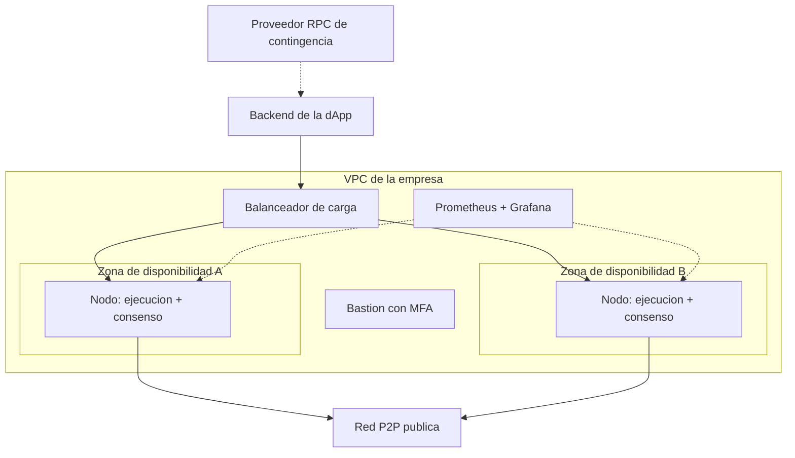
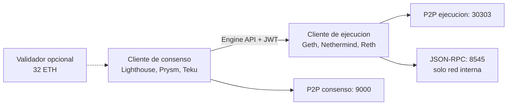

# 16 · Infraestructura y operación de nodos

> **Nivel:** Avanzado-Producción · ⏱️ **Duración estimada:** 180 min · **Fuente:** documentación de clientes de nodo (ethereum.org, Geth, Lighthouse) y guías de operación de EthStaker
> [⬅️ Currículo](../README.md) · [📚 Bibliografía](../../docs/bibliografia.md)
> 🧭 ⬅️ **Anterior:** [15 · Arquitectura avanzada](../15-arquitectura-avanzada/README.md) · [📚 Índice](../README.md) · ➡️ **Siguiente:** [17 · Blockchain en la empresa: valor, casos y costos](../17-blockchain-en-la-empresa/README.md)
> 📖 [Glosario de términos](../../docs/glosario.md) · 🌱 [¿Nuevo en esto? Empieza aquí](../../docs/empieza-aqui.md)

---

Hasta aquí el programa habló de protocolos; este módulo habla de **discos, memoria,
máquinas y facturas**. Qué hardware necesita cada tipo de nodo, dónde corre físicamente
(casa, datacenter o nube), con qué comandos se levanta y cómo se opera sin caerse.

## 🎯 Objetivos

- Dimensionar el hardware real (CPU, RAM, NVMe, red) que exige cada tipo de nodo.
- Comparar las cuatro opciones físicas de despliegue: casa, colocation, nube y nodo gestionado.
- Levantar un nodo de desarrollo con Docker y consultarlo por JSON-RPC.
- Diseñar una topología de nodos redundante para servir RPC en producción.
- Ubicar dónde viven físicamente las claves (hardware wallet, HSM, MPC, multisig).

## 📚 Resultados de aprendizaje

Al finalizar, el estudiante podrá:

1. **Especificar** la máquina para un full node de Bitcoin o Ethereum y justificar cada componente.
2. **Explicar** por qué las IOPS del disco —y no la CPU— son el cuello de botella de un nodo.
3. **Levantar** un cliente de ejecución en modo desarrollo con Docker y verificarlo con `cast`.
4. **Presupuestar** a orden de magnitud un despliegue en nube (instancia, disco, egreso, réplica).
5. **Diseñar** una topología con dos zonas de disponibilidad y contingencia externa.
6. **Distinguir** la infraestructura del nodo de la infraestructura de firma de claves.

## 🗺️ Temas

| # | Tema | Por qué importa |
|---|------|-----------------|
| 1 | Requisitos de hardware por tipo de nodo | Un presupuesto errado mata el proyecto antes de empezar |
| 2 | IOPS, NVMe y por qué el disco manda | Es la causa número uno de nodos que nunca sincronizan |
| 3 | Ejecución + consenso en Ethereum post-Merge | Son dos procesos con secreto JWT compartido, no uno |
| 4 | Casa vs. colocation vs. nube vs. gestionado | Cada opción es un modelo de amenaza y de costo distinto |
| 5 | Nube en concreto: instancias, discos, egreso | Las facturas reales salen del egreso y los snapshots |
| 6 | Docker y orquestación de flotas | La unidad de despliegue de la industria |
| 7 | Monitoreo y alertas del nodo | Peers, distancia a la punta y disco libre: lo que despierta a un operador |
| 8 | Infraestructura de firma: HSM, MPC, multisig | Las claves nunca viven en el nodo |

## 🧠 Modelo mental

Un nodo es una **bodega con un mostrador**: la bodega (el disco) recibe camiones de
historia todos los días y el mostrador (la API RPC) atiende consultas. Si la bodega es
lenta, la fila de camiones crece y nunca te pones al día; si el mostrador se expone a la
calle sin control, cualquiera te lo revienta a consultas. La empresa seria tiene dos
bodegas en barrios distintos y un proveedor externo por si ambas fallan.

El límite de la analogía: a diferencia de una bodega, el nodo **verifica** cada camión
criptográficamente — correr tu propio nodo es lo que te libera de confiar en el
mostrador de otro.

## 🧩 Esquema visual

Topología mínima seria para servir RPC propio en producción:



Anatomía de un nodo Ethereum post-Merge — dos procesos, un secreto compartido:



## 📖 Conceptos y definiciones

- **IOPS**: operaciones de entrada/salida por segundo del disco; un nodo hace millones de lecturas aleatorias, por eso NVMe es obligatorio y HDD imposible.
- **Full node**: verifica y almacena el estado reciente de la cadena (~700 GB Bitcoin, 1,2-2 TB Ethereum, orientativo — consúltalo en vivo).
- **Archive node**: conserva todos los estados históricos; con Erigon/Reth ronda 2,5-3 TB, con clientes clásicos mucho más.
- **Checkpoint sync**: arranque del cliente de consenso desde un estado finalizado confiable, en minutos en vez de días.
- **Snap sync**: sincronización de la ejecución descargando el estado reciente en lugar de reproducir toda la historia.
- **JWT secret**: secreto compartido entre cliente de ejecución y de consenso para autenticar la Engine API.
- **Egreso**: tráfico saliente de la nube; se factura aparte y domina el costo de servir RPC público.
- **Nodo gestionado**: RPC como servicio (Alchemy, Infura, QuickNode); rapidez de arranque a cambio de dependencia y límites de tasa.
- **HSM / MPC**: hardware o cómputo multiparte donde viven las claves de firma; el nodo nunca custodia fondos.
- **Home staking**: validador operado en casa (mini-PC, UPS, fibra); aporta descentralización real a la red.

## 🔬 Profundización

### La tabla que define el presupuesto

| Nodo | CPU | RAM | Disco (orientativo) | Red | Nota |
|---|---|---|---|---|---|
| Bitcoin full | 2-4 núcleos | 4-8 GB | ~700 GB SSD | 50+ GB/mes | Descarga inicial: días |
| Ethereum full | 4-8 núcleos | 16-32 GB | 1,2-2 TB **NVMe** | 25+ Mbps | Ejecución + consenso |
| Ethereum archive | 8-16 núcleos | 32-64 GB | 2,5-3 TB NVMe (Erigon/Reth) | 25+ Mbps | Para indexación histórica |
| Validador Ethereum | 4 núcleos | 16-32 GB | 2 TB NVMe | estable | + 32 ETH por validador |
| Solana validator | 12+ núcleos | 256+ GB | varios TB NVMe separados | 1+ Gbps | Otra liga; verifica requisitos vivos |

### Nube en números

Para **un** nodo Ethereum full: AWS `i4i.2xlarge` (8 vCPU, 64 GB, NVMe local 1,9 TB) o
`m7i.2xlarge` + EBS `gp3` con IOPS aprovisionadas; GCP `n2-standard-8` + Local SSD;
Azure serie `L` optimizada en almacenamiento. Orden de magnitud: **150-800 USD/mes** por
nodo según instancia y disco — y produción seria duplica por la réplica en otra zona.
Partidas que los presupuestos olvidan: egreso, snapshots de 2 TB y el proveedor externo
de contingencia. Verifica en las calculadoras oficiales de cada nube.

### Diversidad de clientes: por qué importa

Si un solo cliente de ejecución concentra la supermayoría y tiene un bug, la red entera
puede finalizar un estado inválido. Elegir cliente minoritario (Nethermind, Besu, Reth;
Lighthouse, Teku, Nimbus) es una decisión de ingeniería **y** de salud de la red —
métricas vivas en <https://clientdiversity.org/>.

### Qué pasa, minuto a minuto, cuando un validador se cae

La lista de comprobación dice "ten un SAI". Esta sección explica **qué te cuesta no tenerlo**, que es lo que hace que la gente lo compre.

Un validador de Ethereum tiene un trabajo continuo: **atestiguar** en cada época (unos 6,4 minutos) que ve la cadena correcta. Si está apagado, no atestigua.

| Tiempo caído | Qué ocurre | Coste aproximado |
|---|---|---|
| Un corte de segundos entre épocas | Nada: no había atestación en juego | 0 |
| Minutos | Se pierden atestaciones. La penalización por *no* atestiguar es **similar en magnitud** a la recompensa que habrías ganado | Dejas de ganar y pierdes algo parecido: el doble de daño que "solo no cobrar" |
| Horas o días | Sigue el goteo, pero la cadena finaliza igual porque la mayoría está en línea | Pérdida lineal y lenta; recuperable |
| Caída masiva (>1/3 de la red a la vez) | Se activa la **fuga de inactividad**: la penalización crece de forma cuadrática hasta que los ausentes pierden peso suficiente para que la cadena vuelva a finalizar | Aquí sí se destruye capital rápido |

La lección que cambia decisiones: **para un validador doméstico, estar caído no es una emergencia**. Pierdes poco a poco y lo recuperas al volver. Lo que sí destruye capital es el **doble voto** — dos máquinas firmando con la misma clave a la vez — porque eso es *slashing*, se penaliza deliberadamente y no se recupera.

De ahí la regla que parece contraintuitiva y es la correcta:

> Ante la duda, **apaga**. Nunca arranques un segundo validador "por si acaso el primero está caído". Un validador apagado pierde céntimos; dos validadores encendidos con la misma clave pierden el depósito.

Esto reordena la lista de prioridades: la contingencia no es "tener otra máquina lista para arrancar", es "tener la certeza de que solo una está firmando".

### El presupuesto que casi nadie calcula bien

Comparemos nodo propio contra RPC gestionado con números, porque la intuición falla en las dos direcciones.

**Nodo de ejecución + consenso en la nube, uso interno:**

| Partida | Estimación mensual | Nota |
|---|---:|---|
| VM (8 vCPU, 32 GB) | 150–250 USD | El cálculo que todo el mundo hace |
| Disco NVMe de 4 TB | 300–500 USD | La partida que se subestima: el disco cuesta más que la máquina |
| Egreso de datos | 20–200 USD | **La sorpresa**: no aparece en la calculadora de la VM |
| Snapshots / respaldo | 40–80 USD | |
| **Total** | **≈ 500–1 000 USD** | Sin contar el tiempo de la persona que lo opera |

**RPC gestionado:** desde gratis (con límites de tasa) hasta 50–500 USD/mes según volumen.

La conclusión honesta no es "el nodo propio es caro", sino: **el nodo propio casi nunca se paga por precio; se paga por lo que compra.**

- **Soberanía:** nadie puede censurar tus consultas ni cerrarte la cuenta.
- **Privacidad:** un proveedor externo ve todas tus consultas, y de ahí se deduce qué direcciones te importan y cuándo.
- **Verificación propia:** un nodo completo comprueba las reglas por sí mismo. Confiar en un RPC es confiar en que quien te responde no miente.

Si tu proyecto no necesita ninguna de las tres, el RPC gestionado es la decisión racional, y decirlo así es más profesional que montar infraestructura por costumbre. Lo que **no** es defendible es depender de un único proveedor sin plan B: eso no es ahorrar, es tener un punto único de fallo que no controlas.

> 💡 **En una frase:** el disco y el egreso, no la CPU, deciden la factura; y el nodo propio se justifica por soberanía, privacidad y verificación, no por precio.

<details>
<summary><strong>🎓 Si ya dominas esto</strong> — lo que decide en operación real</summary>

- **IOPS aleatorios, no MB/s secuenciales.** Un disco de red que anuncia 500 MB/s puede rendir peor que un NVMe local para sincronizar, porque la carga son millones de lecturas pequeñas dispersas. La cifra a exigir al proveedor es IOPS 4K aleatorios y latencia p99, no ancho de banda.
- **Erigon y Reth cambian la ecuación de disco.** Su modelo de base de datos plana reduce un nodo de archivo de cifras de dos dígitos de TB a ~2,5–3 TB, lo que convierte "nodo de archivo" de proyecto de infraestructura a partida de presupuesto normal.
- **Checkpoint sync no es hacer trampa.** Arrancar el cliente de consenso desde un estado finalizado confiable es la práctica recomendada: reduce días a minutos y el nodo sigue verificando todo hacia adelante. Lo que hereda es el supuesto de que ese punto de partida era correcto, y por eso conviene contrastar el checkpoint con dos fuentes.
- **La diversidad de clientes es riesgo sistémico, no preferencia.** Si un cliente con más de 1/3 de la red tiene un bug de consenso, la cadena deja de finalizar; si supera 2/3, puede finalizar una cadena incorrecta. Elegir el cliente minoritario es una decisión de red, no de gusto.
- **El JWT de la Engine API es el enlace crítico.** Ejecución y consenso se autentican con ese secreto compartido; si se regenera en uno y no en otro, el nodo queda mudo con un error que no menciona el JWT por ningún lado.

</details>

## 🧪 Laboratorio guiado

> 🧪 Estas prácticas están catalogadas y **resueltas paso a paso** en el [catálogo de laboratorios](../../labs/CATALOG.md).

El laboratorio usa un nodo real en **modo desarrollo** (cadena efímera, sin sincronizar
terabytes) para practicar la operación exacta de producción. Requiere Docker y Foundry.

1. Levanta un cliente de ejecución real (Geth) en modo dev:

```bash
docker run -d --name geth-dev -p 127.0.0.1:8545:8545 \
  ethereum/client-go:stable --dev --http --http.addr 0.0.0.0 \
  --http.api eth,net,web3
```

2. Opéralo por JSON-RPC igual que un nodo de producción:

```bash
cast chain-id --rpc-url http://127.0.0.1:8545
cast block-number --rpc-url http://127.0.0.1:8545
cast rpc eth_syncing --rpc-url http://127.0.0.1:8545
cast rpc net_peerCount --rpc-url http://127.0.0.1:8545
```

3. Observa los logs como lo haría un operador y detén el nodo limpiamente:

```bash
docker logs --tail 20 geth-dev
docker stop geth-dev && docker rm geth-dev
```

4. Compara con Anvil (`anvil` + los mismos comandos `cast`): misma interfaz RPC, distinto motor — esa uniformidad es la que permite cambiar de proveedor sin tocar la dApp.
5. Consulta los requisitos vivos de un full node en <https://ethereum.org/developers/docs/nodes-and-clients/run-a-node/> y anota disco y RAM vigentes.

## 📝 Reto verificable

Una empresa te pide **RPC propio con disponibilidad ante la caída de una zona** para su
dApp en una L2. Entrega un documento de una página con: (a) topología (diagrama con dos
zonas, balanceador y contingencia externa), (b) especificación de máquina por nodo, (c)
presupuesto mensual con precios citados de la calculadora del proveedor elegido y fecha
de consulta, y (d) tres alertas de monitoreo con su umbral.

**Criterio de aceptación:** el diagrama no expone el puerto RPC a internet; el
presupuesto incluye réplica, egreso y snapshots (no solo la VM); cada alerta indica
métrica, umbral y acción del operador.

## ⚠️ Errores frecuentes

| Síntoma | Causa y cómo comprobarlo |
|---------|--------------------------|
| El nodo "nunca termina de sincronizar" | Disco sin IOPS suficientes (HDD o SSD de red lento); mide latencia de disco y compara con NVMe |
| Factura de nube el triple de lo esperado | Egreso y snapshots no presupuestados; revisa el desglose de facturación, no la calculadora de VM |
| El validador queda offline en cada corte de luz | Sin UPS ni reinicio automático; prueba el ciclo de energía completo |
| "Me hackearon el nodo" | Puerto 8545 expuesto a internet; el RPC va por red interna o autenticado, solo el P2P es público |
| Todo funciona hasta que cae el proveedor RPC | Sin contingencia: configura fallback (nodo propio ↔ proveedor externo) y pruébalo apagando uno |
| Pánico por "perder el nodo" | El nodo es reconstruible; lo irrecuperable son las claves — están en HSM/MPC/hardware wallet, no en el nodo |

## 🛡️ Seguridad y ética

- El nodo del laboratorio corre en modo dev local: jamás expongas `--http.addr 0.0.0.0` en una máquina con IP pública sin firewall.
- Las claves de validador y de tesorería se generan y respaldan **fuera** del nodo (ceremonia documentada, respaldo físico); el nodo es desechable, las claves no.
- Concentrar validadores en dos o tres nubes daña la descentralización que da valor a la red; la diversidad geográfica y de cliente es parte de la ética del operador.
- Respeta los términos de las redes públicas: un nodo que abusa del P2P o replica spam degrada el servicio de todos.

## 🔗 Referencias

- ethereum.org — *Run a node* y *Nodes and clients*: <https://ethereum.org/developers/docs/nodes-and-clients/run-a-node/>
- Geth — documentación oficial: <https://geth.ethereum.org/docs>
- Lighthouse Book (Sigma Prime): <https://lighthouse-book.sigmaprime.io/>
- Bitcoin Core — requisitos de full node: <https://bitcoin.org/en/full-node>
- EthStaker — guías de staking y hardware: <https://ethstaker.org/>
- Diversidad de clientes: <https://clientdiversity.org/>
- Calculadoras: AWS <https://calculator.aws/>, GCP <https://cloud.google.com/products/calculator>, Azure <https://azure.microsoft.com/pricing/calculator/>

## ✅ Criterio de dominio

- Especificas y presupuestas la máquina de un full node justificando disco, RAM y red con fuentes vivas.
- Levantas y consultas un nodo por JSON-RPC con Docker y `cast` sin exponer el RPC.
- Explicas dónde viven las claves y por qué el nodo es desechable pero las claves no.

---

## 🧭 Navegación

⬅️ [Módulo 15 · Arquitectura avanzada](../15-arquitectura-avanzada/README.md) · [📚 Índice del currículo](../README.md) · ➡️ [Módulo 17 · Blockchain en la empresa](../17-blockchain-en-la-empresa/README.md)
