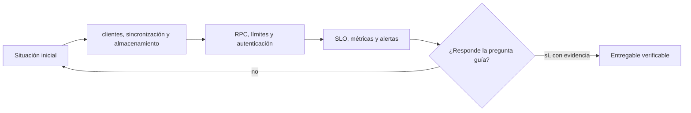

# Clase 33 · Operar nodos con objetivos medibles

> **Clase independiente 33 de 66** · **Nivel:** Avanzado-Producción · **Fuente base:** documentación de clientes de nodo (ethereum.org, Geth, Lighthouse) y guías de operación de EthStaker
>
> [⬅️ Clase anterior](../15-arquitectura-avanzada/clase-32-mev-y-arquitectura-de-produccion.md) · [📚 Índice de las 66 clases](../README.md) · [🗂️ Mapa del tema](README.md) · [➡️ Clase siguiente](../16-infraestructura-nodos/clase-34-resiliencia-actualizacion-e-incidentes.md)

## Punto de partida

**Pregunta guía:** ¿Qué servicio presta el nodo y qué disponibilidad necesita el negocio?

**Caso que abre la clase:** Un RPC público saturado impide retiros aunque la cadena siga funcionando.

Primero se define el servicio que necesita el negocio y su tolerancia a fallos. Recién después se eligen cliente, disco, RPC y monitoreo.

## Fundamentos que sostienen la respuesta

1. **clientes, sincronización y almacenamiento.** En esta clase delimita qué objeto o relación estamos observando antes de sacar conclusiones. Localízalo explícitamente en «Un RPC público saturado impide retiros aunque la cadena siga funcionando.» y anota qué dato faltaría para refutar tu lectura.
2. **RPC, límites y autenticación.** En esta clase explica el mecanismo que conecta la situación inicial con el cambio observable. Localízalo explícitamente en «Un RPC público saturado impide retiros aunque la cadena siga funcionando.» y anota qué dato faltaría para refutar tu lectura.
3. **SLO, métricas y alertas.** En esta clase permite contrastar el resultado y formular el límite de la evidencia. Localízalo explícitamente en «Un RPC público saturado impide retiros aunque la cadena siga funcionando.» y anota qué dato faltaría para refutar tu lectura.

### La tabla que define el presupuesto

| Nodo | CPU | RAM | Disco (orientativo) | Red | Nota |
|---|---|---|---|---|---|
| Bitcoin full | 2-4 núcleos | 4-8 GB | ~700 GB SSD | 50+ GB/mes | Descarga inicial: días |
| Ethereum full | 4-8 núcleos | 16-32 GB | 1,2-2 TB **NVMe** | 25+ Mbps | Ejecución + consenso |
| Ethereum archive | 8-16 núcleos | 32-64 GB | 2,5-3 TB NVMe (Erigon/Reth) | 25+ Mbps | Para indexación histórica |
| Validador Ethereum | 4 núcleos | 16-32 GB | 2 TB NVMe | estable | + 32 ETH por validador |
| Solana validator | 12+ núcleos | 256+ GB | varios TB NVMe separados | 1+ Gbps | Otra liga; verifica requisitos vivos |

### Nube en números

Para **un** nodo Ethereum full: AWS `i4i.2xlarge` (8 vCPU, 64 GB, NVMe local 1,9 TB) o
`m7i.2xlarge` + EBS `gp3` con IOPS aprovisionadas; GCP `n2-standard-8` + Local SSD;
Azure serie `L` optimizada en almacenamiento. Orden de magnitud: **150-800 USD/mes** por
nodo según instancia y disco — y produción seria duplica por la réplica en otra zona.
Partidas que los presupuestos olvidan: egreso, snapshots de 2 TB y el proveedor externo
de contingencia. Verifica en las calculadoras oficiales de cada nube.

### El presupuesto que casi nadie calcula bien

Comparemos nodo propio contra RPC gestionado con números, porque la intuición falla en las dos direcciones.

**Nodo de ejecución + consenso en la nube, uso interno:**

| Partida | Estimación mensual | Nota |
|---|---:|---|
| VM (8 vCPU, 32 GB) | 150–250 USD | El cálculo que todo el mundo hace |
| Disco NVMe de 4 TB | 300–500 USD | La partida que se subestima: el disco cuesta más que la máquina |
| Egreso de datos | 20–200 USD | **La sorpresa**: no aparece en la calculadora de la VM |
| Snapshots / respaldo | 40–80 USD | |
| **Total** | **≈ 500–1 000 USD** | Sin contar el tiempo de la persona que lo opera |

**RPC gestionado:** desde gratis (con límites de tasa) hasta 50–500 USD/mes según volumen.

La conclusión honesta no es "el nodo propio es caro", sino: **el nodo propio casi nunca se paga por precio; se paga por lo que compra.**

- **Soberanía:** nadie puede censurar tus consultas ni cerrarte la cuenta.
- **Privacidad:** un proveedor externo ve todas tus consultas, y de ahí se deduce qué direcciones te importan y cuándo.
- **Verificación propia:** un nodo completo comprueba las reglas por sí mismo. Confiar en un RPC es confiar en que quien te responde no miente.

Si tu proyecto no necesita ninguna de las tres, el RPC gestionado es la decisión racional, y decirlo así es más profesional que montar infraestructura por costumbre. Lo que **no** es defendible es depender de un único proveedor sin plan B: eso no es ahorrar, es tener un punto único de fallo que no controlas.

> 💡 **En una frase:** el disco y el egreso, no la CPU, deciden la factura; y el nodo propio se justifica por soberanía, privacidad y verificación, no por precio.

<strong>🎓 Si ya dominas esto</strong> — lo que decide en operación real

- **IOPS aleatorios, no MB/s secuenciales.** Un disco de red que anuncia 500 MB/s puede rendir peor que un NVMe local para sincronizar, porque la carga son millones de lecturas pequeñas dispersas. La cifra a exigir al proveedor es IOPS 4K aleatorios y latencia p99, no ancho de banda.
- **Erigon y Reth cambian la ecuación de disco.** Su modelo de base de datos plana reduce un nodo de archivo de cifras de dos dígitos de TB a ~2,5–3 TB, lo que convierte "nodo de archivo" de proyecto de infraestructura a partida de presupuesto normal.
- **Checkpoint sync no es hacer trampa.** Arrancar el cliente de consenso desde un estado finalizado confiable es la práctica recomendada: reduce días a minutos y el nodo sigue verificando todo hacia adelante. Lo que hereda es el supuesto de que ese punto de partida era correcto, y por eso conviene contrastar el checkpoint con dos fuentes.
- **La diversidad de clientes es riesgo sistémico, no preferencia.** Si un cliente con más de 1/3 de la red tiene un bug de consenso, la cadena deja de finalizar; si supera 2/3, puede finalizar una cadena incorrecta. Elegir el cliente minoritario es una decisión de red, no de gusto.
- **El JWT de la Engine API es el enlace crítico.** Ejecución y consenso se autentican con ese secreto compartido; si se regenera en uno y no en otro, el nodo queda mudo con un error que no menciona el JWT por ningún lado.

## Trabajo práctico

**Método propio:** diseño desde SLO hacia infraestructura.

**Actividad:** Definir SLI/SLO y desplegar un nodo o simulador observable.

Trabaja en entorno local, regtest, signet o testnet según corresponda. Conserva entradas, comandos, salidas y bloque o instante de corte. Una captura aislada no demuestra reproducibilidad.

## Gráfico pedagógico

Recorre el gráfico en voz alta: identifica supuestos, transformaciones y el punto exacto donde aparece evidencia.

## Demostración de aprendizaje

**Entregable:** Runbook con capacidad, respaldo, monitoreo y criterio de escalamiento.

**Comprobación formativa:** ¿Qué métrica distingue una cadena detenida de un RPC propio saturado?

Para aprobar debes conectar el hecho observado con el concepto correcto, descartar al menos una interpretación alternativa y redactar una conclusión cuyo alcance no exceda la prueba.

## Errores que esta clase corrige

- Tratar **clientes, sincronización y almacenamiento** como una etiqueta suficiente, sin identificar actores, dato y frontera.
- Usar **RPC, límites y autenticación** como explicación aunque el caso no aporte la evidencia necesaria.
- Dar por respondido «¿Qué servicio presta el nodo y qué disponibilidad necesita el negocio?» sin contrastar **SLO, métricas y alertas**.

Vuelve al caso inicial, elige el error más peligroso y describe una comprobación concreta que lo detectaría.

## Fuentes para comprobar y ampliar

- ethereum.org — *Run a node* y *Nodes and clients*: <https://ethereum.org/developers/docs/nodes-and-clients/run-a-node/>
- Geth — documentación oficial: <https://geth.ethereum.org/docs>
- Lighthouse Book (Sigma Prime): <https://lighthouse-book.sigmaprime.io/>
- Bitcoin Core — requisitos de full node: <https://bitcoin.org/en/full-node>
- EthStaker — guías de staking y hardware: <https://ethstaker.org/>
- Diversidad de clientes: <https://clientdiversity.org/>
- Calculadoras: AWS <https://calculator.aws/>, GCP <https://cloud.google.com/products/calculator>, Azure <https://azure.microsoft.com/pricing/calculator/>

Consulta además la [bibliografía razonada](../../docs/bibliografia.md), que declara procedencia y uso.

## Cierre de la clase

Responde otra vez la pregunta guía sin mirar notas. Si tu respuesta no menciona evidencia, supuesto y límite, todavía describe el tema pero no lo domina. Continúa solo cuando otra persona pueda reproducir tu entregable.
