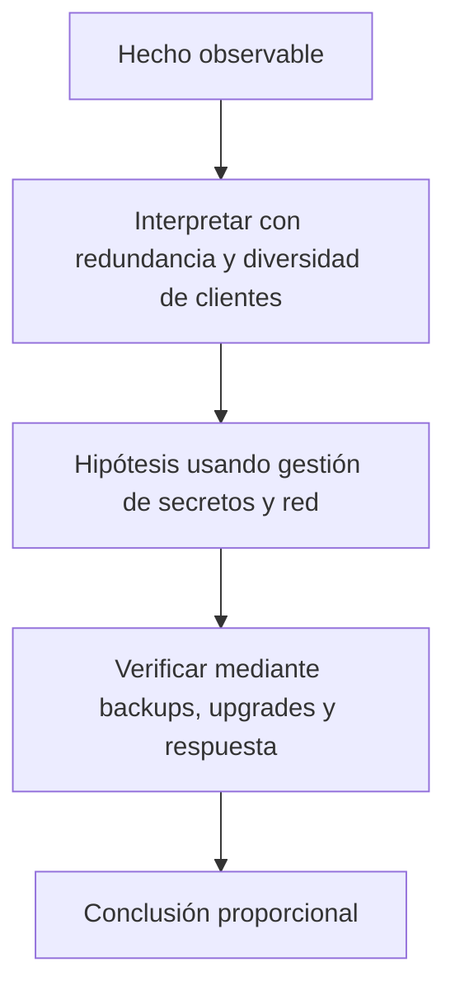

# Clase 34 · Resiliencia, actualización e incidentes

> **Clase independiente 34 de 66** · **Nivel:** Avanzado-Producción · **Fuente base:** documentación de clientes de nodo (ethereum.org, Geth, Lighthouse) y guías de operación de EthStaker
>
> [⬅️ Clase anterior](../16-infraestructura-nodos/clase-33-operar-nodos-con-objetivos-medibles.md) · [📚 Índice de las 66 clases](../README.md) · [🗂️ Mapa del tema](README.md) · [➡️ Clase siguiente](../17-blockchain-en-la-empresa/clase-35-valor-empresarial-y-limites.md)

## Punto de partida

**Pregunta guía:** ¿Cómo se cambia software crítico sin perder disponibilidad ni evidencia?

**Caso que abre la clase:** Una versión defectuosa divide la red y afecta sólo a un cliente mayoritario.

Una versión se despliega como canary y luego falla. El equipo practica rollback, comunicación y preservación de evidencia con tiempos medidos.

## Trabajo práctico

**Método propio:** game day de actualización.

**Actividad:** Planificar actualización canary y practicar recuperación documentada.

Trabaja en entorno local, regtest, signet o testnet según corresponda. Conserva entradas, comandos, salidas y bloque o instante de corte. Una captura aislada no demuestra reproducibilidad.

## Fundamentos que sostienen la respuesta

1. **redundancia y diversidad de clientes.** En esta clase delimita qué objeto o relación estamos observando antes de sacar conclusiones. Localízalo explícitamente en «Una versión defectuosa divide la red y afecta sólo a un cliente mayoritario.» y anota qué dato faltaría para refutar tu lectura.
2. **gestión de secretos y red.** En esta clase explica el mecanismo que conecta la situación inicial con el cambio observable. Localízalo explícitamente en «Una versión defectuosa divide la red y afecta sólo a un cliente mayoritario.» y anota qué dato faltaría para refutar tu lectura.
3. **backups, upgrades y respuesta.** En esta clase permite contrastar el resultado y formular el límite de la evidencia. Localízalo explícitamente en «Una versión defectuosa divide la red y afecta sólo a un cliente mayoritario.» y anota qué dato faltaría para refutar tu lectura.

### Diversidad de clientes: por qué importa

Si un solo cliente de ejecución concentra la supermayoría y tiene un bug, la red entera
puede finalizar un estado inválido. Elegir cliente minoritario (Nethermind, Besu, Reth;
Lighthouse, Teku, Nimbus) es una decisión de ingeniería **y** de salud de la red —
métricas vivas en <https://clientdiversity.org/>.

### Qué pasa, minuto a minuto, cuando un validador se cae

La lista de comprobación dice "ten un SAI". Esta sección explica **qué te cuesta no tenerlo**, que es lo que hace que la gente lo compre.

Un validador de Ethereum tiene un trabajo continuo: **atestiguar** en cada época (unos 6,4 minutos) que ve la cadena correcta. Si está apagado, no atestigua.

| Tiempo caído | Qué ocurre | Coste aproximado |
|---|---|---|
| Un corte de segundos entre épocas | Nada: no había atestación en juego | 0 |
| Minutos | Se pierden atestaciones. La penalización por *no* atestiguar es **similar en magnitud** a la recompensa que habrías ganado | Dejas de ganar y pierdes algo parecido: el doble de daño que "solo no cobrar" |
| Horas o días | Sigue el goteo, pero la cadena finaliza igual porque la mayoría está en línea | Pérdida lineal y lenta; recuperable |
| Caída masiva (>1/3 de la red a la vez) | Se activa la **fuga de inactividad**: la penalización crece de forma cuadrática hasta que los ausentes pierden peso suficiente para que la cadena vuelva a finalizar | Aquí sí se destruye capital rápido |

La lección que cambia decisiones: **para un validador doméstico, estar caído no es una emergencia**. Pierdes poco a poco y lo recuperas al volver. Lo que sí destruye capital es el **doble voto** — dos máquinas firmando con la misma clave a la vez — porque eso es *slashing*, se penaliza deliberadamente y no se recupera.

De ahí la regla que parece contraintuitiva y es la correcta:

> Ante la duda, **apaga**. Nunca arranques un segundo validador "por si acaso el primero está caído". Un validador apagado pierde céntimos; dos validadores encendidos con la misma clave pierden el depósito.

Esto reordena la lista de prioridades: la contingencia no es "tener otra máquina lista para arrancar", es "tener la certeza de que solo una está firmando".

## Gráfico pedagógico

Recorre el gráfico en voz alta: identifica supuestos, transformaciones y el punto exacto donde aparece evidencia.

## Errores que esta clase corrige

- Tratar **redundancia y diversidad de clientes** como una etiqueta suficiente, sin identificar actores, dato y frontera.
- Usar **gestión de secretos y red** como explicación aunque el caso no aporte la evidencia necesaria.
- Dar por respondido «¿Cómo se cambia software crítico sin perder disponibilidad ni evidencia?» sin contrastar **backups, upgrades y respuesta**.

Vuelve al caso inicial, elige el error más peligroso y describe una comprobación concreta que lo detectaría.

## Demostración de aprendizaje

**Entregable:** Informe de simulacro con tiempos, decisiones y acciones correctivas.

**Comprobación formativa:** ¿Qué condición detiene el despliegue y quién tiene autoridad para declararla?

Para aprobar debes conectar el hecho observado con el concepto correcto, descartar al menos una interpretación alternativa y redactar una conclusión cuyo alcance no exceda la prueba.

## Fuentes para comprobar y ampliar

- ethereum.org — *Run a node* y *Nodes and clients*: <https://ethereum.org/developers/docs/nodes-and-clients/run-a-node/>
- Geth — documentación oficial: <https://geth.ethereum.org/docs>
- Lighthouse Book (Sigma Prime): <https://lighthouse-book.sigmaprime.io/>
- Bitcoin Core — requisitos de full node: <https://bitcoin.org/en/full-node>
- EthStaker — guías de staking y hardware: <https://ethstaker.org/>
- Diversidad de clientes: <https://clientdiversity.org/>
- Calculadoras: AWS <https://calculator.aws/>, GCP <https://cloud.google.com/products/calculator>, Azure <https://azure.microsoft.com/pricing/calculator/>

Consulta además la [bibliografía razonada](../../docs/bibliografia.md), que declara procedencia y uso.

## Cierre de la clase

Responde otra vez la pregunta guía sin mirar notas. Si tu respuesta no menciona evidencia, supuesto y límite, todavía describe el tema pero no lo domina. Continúa solo cuando otra persona pueda reproducir tu entregable.
