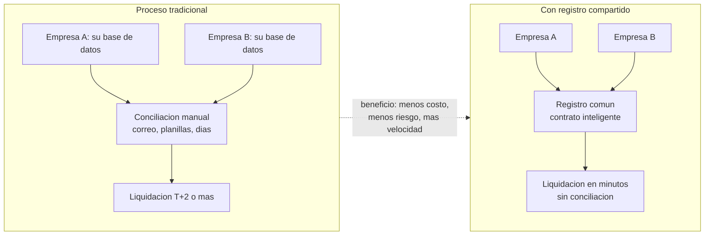
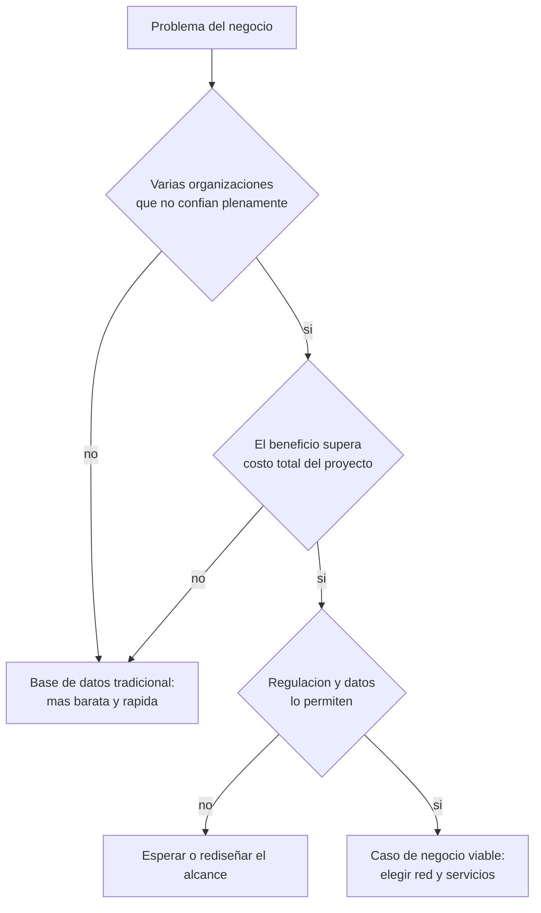

# 17 · Blockchain en la empresa: valor, casos y costos

> **Nivel:** Avanzado-Producción · ⏱️ **Duración estimada:** 150 min · **Fuente:** informes del BIS y el WEF, casos públicos documentados y *The Blockchain and the New Architecture of Trust* (Werbach)
> [⬅️ Currículo](../README.md) · [📚 Bibliografía](../../docs/bibliografia.md)

---

Este módulo responde la pregunta del directorio: **¿qué gana la empresa con esto, en qué
se usa, cuánto cuesta llevarlo a cabo y qué servicios existen para no construir todo?**
Con casos reales verificables — éxitos y fracasos — porque el criterio profesional se
entrena con ambos.

## 🎯 Objetivos

- Identificar los cinco beneficios reales que una blockchain aporta a una empresa y su mecanismo.
- Mapear los usos con tracción por sector y distinguirlos de los sobreprometidos.
- Analizar casos de éxito y fracaso documentados extrayendo la lección de cada uno.
- Presupuestar a orden de magnitud un proyecto empresarial (equipo, auditoría, infraestructura, servicios).
- Evaluar los servicios del mercado (custodia, nodo gestionado, KYT, auditoría) y cuándo contratarlos.

## 📚 Resultados de aprendizaje

Al finalizar, el estudiante podrá:

1. **Explicar** ante un directorio, sin jerga, qué gana la empresa y qué mecanismo produce ese beneficio.
2. **Clasificar** un caso de uso como de tracción real, emergente o humo, con evidencia.
3. **Extraer** la lección de un caso fallido y aplicarla a una propuesta nueva.
4. **Construir** un presupuesto de proyecto con partidas completas y precios citados en vivo.
5. **Seleccionar** servicios de terceros con criterios de build vs. buy justificados.
6. **Anticipar** las consideraciones regulatorias, reputacionales y de gobernanza del caso.

## 🗺️ Temas

| # | Tema | Por qué importa |
|---|------|-----------------|
| 1 | Los cinco beneficios reales y su mecanismo | Sin mecanismo identificable, el beneficio es marketing |
| 2 | Usos por sector: tracción vs. promesa | Dónde hay resultados operativos y dónde solo pilotos |
| 3 | Casos de éxito documentados | Liquidación institucional, bonos digitales, fondos tokenizados, remesas |
| 4 | Fracasos instructivos | TradeLens, Libra/Diem, ASX: la tecnología rara vez es la causa |
| 5 | Tokenización de activos reales (RWA) | La tendencia 2024-2026 con adopción institucional medible |
| 6 | El mapa de servicios del mercado | Custodia, RPC, KYT, auditoría: qué se compra y a quién |
| 7 | Costos asociados del proyecto | Partidas completas, no solo el desarrollo |
| 8 | Consideraciones: regulación, reputación, gobernanza | Lo que decide si el proyecto vive tras el piloto |
| 9 | Cómo explicarlo a clientes y no técnicos | El mejor caso de negocio muere si el directorio no lo entiende |

## 🧠 Modelo mental

Piensa en la blockchain empresarial como un **notario compartido y programable entre
organizaciones que no se tienen plena confianza**. Donde hoy dos empresas concilian
planillas por correo durante días, un registro común liquidado en minutos elimina la
conciliación: ese es el mecanismo del beneficio, no la palabra "blockchain".

El límite de la analogía: un notario da fe, pero no ejecuta; los contratos inteligentes
además **ejecutan** (liquidan, reparten, bloquean), y eso convierte errores de negocio
en pérdidas automáticas — por eso los costos de auditoría y límites operativos son
parte del caso de negocio, no un extra.

## 🧩 Esquema visual

Dónde aparece el beneficio: el antes y el después de una liquidación entre empresas.

Flujo de decisión del caso de negocio:

## 📖 Conceptos y definiciones

- **Conciliación**: proceso de cuadrar registros entre organizaciones; su eliminación es el beneficio empresarial más medible.
- **Liquidación atómica (DvP)**: entrega contra pago en una sola transacción; elimina el riesgo de contraparte del intervalo.
- **Tokenización / RWA**: representar activos del mundo real (fondos, bonos, facturas) como tokens con reglas programadas.
- **Stablecoin**: token anclado a moneda fiat; el vehículo de pagos y remesas con más tracción del ecosistema.
- **Custodio regulado**: empresa licenciada que guarda claves por terceros (Fireblocks, BitGo, bancos custodios).
- **KYT (Know Your Transaction)**: análisis de transacciones contra listas y patrones ilícitos; obligación según jurisdicción.
- **Red permisionada**: participantes autorizados (Fabric, Besu, Corda); privacidad a cambio de gobernanza de consorcio.
- **Piloto vs. producción**: el piloto prueba tecnología; producción exige modelo de negocio, gobernanza y cumplimiento — la mayoría de los fracasos ocurre en ese salto.
- **Costo total (TCO)**: equipo + auditoría + infraestructura + servicios + cumplimiento + operación, no solo el desarrollo.

## 🔬 Profundización

### Qué ganan las empresas: beneficio → mecanismo → evidencia

| Beneficio | Mecanismo | Caso que lo evidencia |
|---|---|---|
| Liquidación más rápida y barata | Registro común elimina conciliación; DvP atómico | Pagos institucionales tipo JPMorgan Kinexys; liquidación de stablecoins de Visa |
| Nuevos productos financieros | Activos programables 24/7 con distribución global | Fondo tokenizado BUIDL de BlackRock; bonos digitales del BEI y Siemens |
| Menos riesgo de contraparte | El contrato ejecuta; nadie custodia unilateralmente el intervalo | DvP en bonos digitales |
| Auditabilidad compartida | Historial verificable por todas las partes y el regulador | Reportes sobre registros comunes |
| Acceso a rieles globales de pago | Stablecoins como liquidación transfronteriza en minutos | Corredores de remesas en LatAm; verifica volúmenes en vivo |

### Casos de estudio: éxito y fracaso, con lección

| Caso | Resultado | Lección |
|---|---|---|
| **Kinexys (JPMorgan)** — pagos y repo intradía | En producción con volumen institucional | Empezó por un problema interno medible: liquidez intradía |
| **BEI / Siemens** — bonos digitales | Emisiones reales liquidadas on-chain | El regulador participó desde el diseño, no al final |
| **BlackRock BUIDL** — fondo tokenizado | Adopción institucional verificable | RWA gana cuando el activo ya es financiero y el beneficio es distribución/liquidez |
| **Remesas con stablecoins (LatAm)** | Tracción real en corredores caros | El beneficio (costo y velocidad) es visible para el usuario final |
| **TradeLens (IBM/Maersk)** — supply chain | Cerrado en 2023 | La tecnología funcionó; falló la gobernanza: los competidores no querían la plataforma del rival |
| **Libra/Diem (Meta)** | Cancelado por presión regulatoria | Sin viabilidad regulatoria no hay proyecto, por grande que sea el patrocinador |
| **ASX CHESS (Australia)** — post-trade | Reemplazo abandonado en 2022 tras años | Migrar un sistema crítico nacional exige gestión de proyecto impecable, no solo DLT |

### El mapa de servicios: qué se contrata y a quién

| Servicio | Qué resuelve | Ejemplos | Cuándo contratarlo |
|---|---|---|---|
| Nodo/RPC gestionado | Acceso a la red sin operar nodos | Alchemy, Infura, QuickNode | Siempre al inicio; nodo propio al crecer (módulo 16) |
| Custodia / MPC | Claves institucionales con póliza y licencia | Fireblocks, BitGo, custodios bancarios | Cuando hay fondos de terceros o tesorería relevante |
| KYT / analítica | Cumplimiento y monitoreo de fondos | Chainalysis, TRM, Elliptic | Obligatorio según actividad y jurisdicción |
| Auditoría de contratos | Revisión externa pre-lanzamiento | Firmas especializadas + contests | Siempre antes de mainnet; se agenda con meses |
| Tokenización como servicio | Emisión regulada de RWA | Securitize y equivalentes locales | Cuando el activo exige registro regulado |
| Rollup/red como servicio | Cadena propia sin equipo de protocolo | Conduit, Caldera y similares | Casos que justifican appchain (revisa el módulo 12) |

### Costos asociados: el presupuesto completo

Partidas para un proyecto mediano de 6 meses (órdenes de magnitud del mercado —
**consulta precios en vivo**): el **equipo** (6-8 personas) domina el costo; **auditoría
externa** 30.000-150.000+ USD según alcance; **infraestructura** 500-5.000+ USD/mes
(módulo 16); **custodia** fijo mensual + variable; **KYT/cumplimiento** suscripción
anual; **gas** marginal en L2 post-EIP-4844, relevante en L1. El error clásico:
presupuestar solo el desarrollo y descubrir auditoría y cumplimiento a mitad de camino.

## 🗣️ Cómo explicarlo a clientes y personas que no conocen el tema

El mejor caso de negocio muere si la contraparte no lo entiende. Reglas de comunicación
probadas en el sector:

### El discurso de 30 segundos

> "Hoy, cuando su empresa y sus socios mueven [dinero/activos/registros], cada uno lleva
> su propia planilla y cuadrarlas toma días y errores. Esto es un **registro único
> compartido que nadie puede alterar por su cuenta** y que ejecuta las reglas que todos
> acordaron, automáticamente. Resultado: lo que hoy tarda días, tarda minutos, y nadie
> discute los números."

Ni una sola vez dice "blockchain", "cripto", "token" ni "descentralización". Primero el
problema y el resultado; la tecnología después, y solo si la preguntan.

### Traducción de jerga: qué decir en lugar de qué

| No digas | Di | Por qué funciona |
|---|---|---|
| "Blockchain / DLT" | "un registro compartido que nadie puede alterar solo" | Describe la propiedad, no la tecnología |
| "Smart contract" | "reglas acordadas que se ejecutan solas" | El valor es la automatización sin árbitro |
| "Token / tokenizar" | "una representación digital del activo, transferible en minutos" | Ancla al activo que ya conocen |
| "Wallet / llaves privadas" | "su firma digital; la custodia se gestiona como en un banco" | Evita el pánico de la seed phrase |
| "Gas / L2 / rollup" | "costo por operación, hoy de centavos" | El detalle técnico no aporta a la decisión |
| "Descentralizado" | "sin depender de un intermediario único" | Beneficio concreto en vez de ideología |

### Analogías que funcionan (y su límite)

- **Libro de contabilidad notariado entre empresas**: útil para conciliación; aclara que además *ejecuta* (el notario no ejecuta).
- **El contenedor marítimo**: un estándar común que abarata mover valor entre organizaciones, como el contenedor abarató mover carga.
- **Correo electrónico del dinero**: transferir valor como se transfiere un correo, sin oficinas de por medio; aclara que aquí no hay "deshacer envío" — por eso los límites y controles.

### Manejo de objeciones frecuentes

| Objeción del cliente | Respuesta honesta |
|---|---|
| "¿Esto no es lo de las criptos que se desplomaron?" | "Eso fue especulación con activos volátiles. Esto usa la misma infraestructura para un problema operativo suyo: conciliación y liquidación. No compramos criptomonedas." |
| "¿Es legal?" | "Regulado y en uso por bancos centrales y gestoras como BlackRock. En Chile lo cubre la Ley Fintech; el diseño incluye cumplimiento desde el día uno." |
| "¿Y si se cae o nos hackean?" | "Los riesgos existen y se gestionan con límites, custodia profesional y auditorías; aquí está el plan y su costo — está dentro del presupuesto que le presento." |
| "¿Por qué no una base de datos?" | "Si una sola organización controlara los datos, una base de datos sería mejor y más barata. Aquí participan varias que no comparten dueño: ese es exactamente el caso donde esto gana." |

Regla final: **nunca prometas rentabilidad ni uses el precio de las criptomonedas como
argumento** — destruye la credibilidad del caso operativo y puede tener implicancias
legales.

## 🧪 Laboratorio guiado

Análisis de caso con plantilla, sobre fuentes primarias:

1. Elige un caso de la tabla (éxito o fracaso) y localiza dos fuentes primarias (anuncio oficial, informe del regulador, documentación del producto).
2. Completa la ficha: problema de negocio → mecanismo del beneficio → evidencia medible → costos visibles → riesgos y consideraciones → estado actual (verifícalo en vivo).
3. Aplica el flujo de decisión del esquema visual: ¿habrías aprobado el proyecto con la información de su época?
4. Contrasta con la matriz del módulo 00: ¿este caso necesitaba blockchain o una base de datos?
5. Presenta la ficha en una página, como si fuera para un comité de inversión.

## 📝 Reto verificable

Elabora el **caso de negocio** de una empresa real o ficticia de tu sector que evalúa
blockchain: beneficio con mecanismo y cifra estimada, caso comparable citado, presupuesto
completo por partidas (con fuentes y fecha de consulta), servicios a contratar vs.
construir, tres riesgos con mitigación y la alternativa sin blockchain evaluada
honestamente.

Acompáñalo del **discurso de 30 segundos** adaptado a ese cliente, sin jerga.

**Criterio de aceptación:** el documento cabe en dos páginas; cada cifra tiene fuente y
fecha; incluye al menos un caso comparable de éxito y uno de fracaso con su lección; la
alternativa "base de datos tradicional" tiene análisis real, no de paja; el discurso no
usa ninguno de los términos de la columna "No digas".

## ⚠️ Errores frecuentes

| Síntoma | Causa y cómo comprobarlo |
|---------|--------------------------|
| "El beneficio es que es blockchain" | No hay mecanismo identificado; exige la cadena beneficio→mecanismo→evidencia |
| El piloto muere al pasar a producción | Faltó modelo de negocio y gobernanza (lección TradeLens); revisa quién paga y quién manda |
| Presupuesto sin auditoría ni cumplimiento | Solo se costeó desarrollo; contrasta contra la tabla de partidas completa |
| "Los usuarios manejarán sus wallets" | En retail/banca la custodia suele ser de la empresa; valida con usuarios reales |
| Caso construido sobre cifras de marketing | TVL o TPS sin fuente; exige métricas verificables y fecha |
| Ignorar al regulador hasta el final | Lección Libra/Diem; incorpóralo desde el diseño (en Chile: Ley Fintech 21.521 y CMF) |

## 🛡️ Seguridad y ética

- No presentes proyecciones de retorno como garantías: este programa no da asesoría financiera y un caso de negocio honesto declara sus supuestos.
- Cita las fuentes de cada caso; los números de casos reales cambian — verifica el estado actual antes de usarlos en una decisión.
- Considera el impacto en usuarios finales: custodia, privacidad de datos transaccionales y reversibilidad de errores son decisiones éticas, no solo técnicas.
- El cumplimiento (KYT, reportes) protege a la empresa y al ecosistema; diseñarlo desde el inicio es más barato que remediarlo.

## 🔗 Referencias

- Werbach, *The Blockchain and the New Architecture of Trust* (MIT Press).
- BIS — informes sobre tokenización y dinero digital: <https://www.bis.org/>
- World Economic Forum — informes de adopción blockchain: <https://www.weforum.org/>
- MiCA — Reglamento (UE) 2023/1114: <https://eur-lex.europa.eu/eli/reg/2023/1114/oj>
- Chile — regulación y tributación en el programa: [documento local](../../docs/chile-regulacion-tributacion.md)
- Lectura extendida del programa: [Industria · Blockchain para empresas](../../industria/04-blockchain-para-empresas.md) y [Modelos de negocio](../../industria/05-modelos-de-negocio.md)

## ✅ Criterio de dominio

- Explicas beneficio→mecanismo→evidencia de al menos tres casos reales sin recurrir a marketing.
- Presupuestas un proyecto con todas las partidas y fuentes citadas.
- Extraes y aplicas la lección de al menos dos fracasos documentados.

---

## 🧭 Navegación

⬅️ [Módulo 16 · Infraestructura y operación de nodos](../16-infraestructura-nodos/README.md) · [📚 Índice del currículo](../README.md) · ➡️ [Módulo 18 · Implementación empresarial](../18-implementacion-empresarial/README.md)
