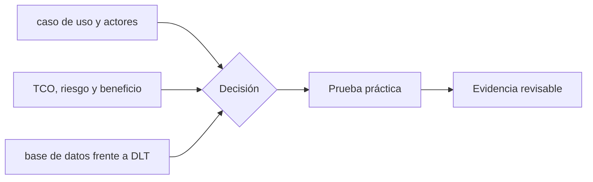

# Clase 35 · Valor empresarial y límites

> **Clase independiente 35 de 66** · **Nivel:** Avanzado-Producción · **Fuente base:** informes del BIS y el WEF, casos públicos documentados y *The Blockchain and the New Architecture of Trust* (Werbach)
>
> [⬅️ Clase anterior](../16-infraestructura-nodos/clase-34-resiliencia-actualizacion-e-incidentes.md) · [📚 Índice de las 66 clases](../README.md) · [🗂️ Mapa del tema](README.md) · [➡️ Clase siguiente](../17-blockchain-en-la-empresa/clase-36-comunicacion-piloto-y-medicion.md)

## Punto de partida

**Pregunta guía:** ¿Qué coordinación mejora y qué costo nuevo introduce una red compartida?

**Caso que abre la clase:** Varias empresas quieren compartir trazabilidad sin compartir control total.

El proceso actual se cuantifica antes de diseñar el futuro. Beneficios, costos y riesgos comparten unidades comparables para evitar promesas imposibles de medir.

## Gráfico pedagógico

Recorre el gráfico en voz alta: identifica supuestos, transformaciones y el punto exacto donde aparece evidencia.

## Trabajo práctico

**Método propio:** clínica de caso de negocio.

**Actividad:** Cuantificar proceso actual, fricciones y alternativas tecnológicas.

Trabaja en entorno local, regtest, signet o testnet según corresponda. Conserva entradas, comandos, salidas y bloque o instante de corte. Una captura aislada no demuestra reproducibilidad.

## Fundamentos que sostienen la respuesta

1. **caso de uso y actores.** En esta clase delimita qué objeto o relación estamos observando antes de sacar conclusiones. Localízalo explícitamente en «Varias empresas quieren compartir trazabilidad sin compartir control total.» y anota qué dato faltaría para refutar tu lectura.
2. **TCO, riesgo y beneficio.** En esta clase explica el mecanismo que conecta la situación inicial con el cambio observable. Localízalo explícitamente en «Varias empresas quieren compartir trazabilidad sin compartir control total.» y anota qué dato faltaría para refutar tu lectura.
3. **base de datos frente a DLT.** En esta clase permite contrastar el resultado y formular el límite de la evidencia. Localízalo explícitamente en «Varias empresas quieren compartir trazabilidad sin compartir control total.» y anota qué dato faltaría para refutar tu lectura.

### Qué ganan las empresas: beneficio → mecanismo → evidencia

| Beneficio | Mecanismo | Caso que lo evidencia |
|---|---|---|
| Liquidación más rápida y barata | Registro común elimina conciliación; DvP atómico | Pagos institucionales tipo JPMorgan Kinexys; liquidación de stablecoins de Visa |
| Nuevos productos financieros | Activos programables 24/7 con distribución global | Fondo tokenizado BUIDL de BlackRock; bonos digitales del BEI y Siemens |
| Menos riesgo de contraparte | El contrato ejecuta; nadie custodia unilateralmente el intervalo | DvP en bonos digitales |
| Auditabilidad compartida | Historial verificable por todas las partes y el regulador | Reportes sobre registros comunes |
| Acceso a rieles globales de pago | Stablecoins como liquidación transfronteriza en minutos | Corredores de remesas en LatAm; verifica volúmenes en vivo |

### Casos de estudio: éxito y fracaso, con lección

| Caso | Resultado | Lección |
|---|---|---|
| **Kinexys (JPMorgan)** — pagos y repo intradía | En producción con volumen institucional | Empezó por un problema interno medible: liquidez intradía |
| **BEI / Siemens** — bonos digitales | Emisiones reales liquidadas on-chain | El regulador participó desde el diseño, no al final |
| **BlackRock BUIDL** — fondo tokenizado | Adopción institucional verificable | RWA gana cuando el activo ya es financiero y el beneficio es distribución/liquidez |
| **Remesas con stablecoins (LatAm)** | Tracción real en corredores caros | El beneficio (costo y velocidad) es visible para el usuario final |
| **TradeLens (IBM/Maersk)** — supply chain | Cerrado en 2023 | La tecnología funcionó; falló la gobernanza: los competidores no querían la plataforma del rival |
| **Libra/Diem (Meta)** | Cancelado por presión regulatoria | Sin viabilidad regulatoria no hay proyecto, por grande que sea el patrocinador |
| **ASX CHESS (Australia)** — post-trade | Reemplazo abandonado en 2022 tras años | Migrar un sistema crítico nacional exige gestión de proyecto impecable, no solo DLT |

### El mapa de servicios: qué se contrata y a quién

| Servicio | Qué resuelve | Ejemplos | Cuándo contratarlo |
|---|---|---|---|
| Nodo/RPC gestionado | Acceso a la red sin operar nodos | Alchemy, Infura, QuickNode | Siempre al inicio; nodo propio al crecer (clases 33–34) |
| Custodia / MPC | Claves institucionales con póliza y licencia | Fireblocks, BitGo, custodios bancarios | Cuando hay fondos de terceros o tesorería relevante |
| KYT / analítica | Cumplimiento y monitoreo de fondos | Chainalysis, TRM, Elliptic | Obligatorio según actividad y jurisdicción |
| Auditoría de contratos | Revisión externa pre-lanzamiento | Firmas especializadas + contests | Siempre antes de mainnet; se agenda con meses |
| Tokenización como servicio | Emisión regulada de RWA | Securitize y equivalentes locales | Cuando el activo exige registro regulado |
| Rollup/red como servicio | Cadena propia sin equipo de protocolo | Conduit, Caldera y similares | Casos que justifican appchain (revisa las clases 25–26) |

### Costos asociados: el presupuesto completo

Partidas para un proyecto mediano de 6 meses (órdenes de magnitud del mercado —
**consulta precios en vivo**): el **equipo** (6-8 personas) domina el costo; **auditoría
externa** 30.000-150.000+ USD según alcance; **infraestructura** 500-5.000+ USD/mes
(clases 33–34); **custodia** fijo mensual + variable; **KYT/cumplimiento** suscripción
anual; **gas** marginal en L2 post-EIP-4844, relevante en L1. El error clásico:
presupuestar solo el desarrollo y descubrir auditoría y cumplimiento a mitad de camino.

## Demostración de aprendizaje

**Entregable:** Business case con línea base, supuestos, costos y criterio de abandono.

**Comprobación formativa:** ¿Qué indicador demostraría que el problema existe aun sin blockchain?

Para aprobar debes conectar el hecho observado con el concepto correcto, descartar al menos una interpretación alternativa y redactar una conclusión cuyo alcance no exceda la prueba.

## Errores que esta clase corrige

- Tratar **caso de uso y actores** como una etiqueta suficiente, sin identificar actores, dato y frontera.
- Usar **TCO, riesgo y beneficio** como explicación aunque el caso no aporte la evidencia necesaria.
- Dar por respondido «¿Qué coordinación mejora y qué costo nuevo introduce una red compartida?» sin contrastar **base de datos frente a DLT**.

Vuelve al caso inicial, elige el error más peligroso y describe una comprobación concreta que lo detectaría.

## Fuentes para comprobar y ampliar

- BIS — informes sobre tokenización y dinero digital: <https://www.bis.org/>
- World Economic Forum — informes de adopción blockchain: <https://www.weforum.org/>
- MiCA — Reglamento (UE) 2023/1114: <https://eur-lex.europa.eu/eli/reg/2023/1114/oj>

Consulta además la [bibliografía razonada](../../docs/bibliografia.md), que declara procedencia y uso.

## Cierre de la clase

Responde otra vez la pregunta guía sin mirar notas. Si tu respuesta no menciona evidencia, supuesto y límite, todavía describe el tema pero no lo domina. Continúa solo cuando otra persona pueda reproducir tu entregable.
