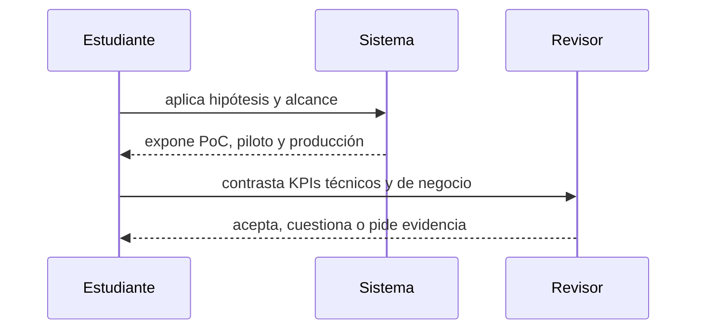

# Clase 36 · Comunicación, piloto y medición

> **Clase independiente 36 de 66** · **Nivel:** Avanzado-Producción · **Fuente base:** informes del BIS y el WEF, casos públicos documentados y *The Blockchain and the New Architecture of Trust* (Werbach)
>
> [⬅️ Clase anterior](../17-blockchain-en-la-empresa/clase-35-valor-empresarial-y-limites.md) · [📚 Índice de las 66 clases](../README.md) · [🗂️ Mapa del tema](README.md) · [➡️ Clase siguiente](../18-implementacion-empresarial/clase-37-integracion-end-to-end.md)

## Punto de partida

**Pregunta guía:** ¿Cómo se prueba valor sin prometer una transformación completa?

**Caso que abre la clase:** Una PoC exitosa no contempla integración, soporte ni responsabilidad legal.

Una PoC técnica enfrenta preguntas de adopción, soporte, legal y operación. El piloto se diseña para invalidar hipótesis, no para confirmar entusiasmo.

## Fundamentos que sostienen la respuesta

1. **hipótesis y alcance.** En esta clase delimita qué objeto o relación estamos observando antes de sacar conclusiones. Localízalo explícitamente en «Una PoC exitosa no contempla integración, soporte ni responsabilidad legal.» y anota qué dato faltaría para refutar tu lectura.
2. **PoC, piloto y producción.** En esta clase explica el mecanismo que conecta la situación inicial con el cambio observable. Localízalo explícitamente en «Una PoC exitosa no contempla integración, soporte ni responsabilidad legal.» y anota qué dato faltaría para refutar tu lectura.
3. **KPIs técnicos y de negocio.** En esta clase permite contrastar el resultado y formular el límite de la evidencia. Localízalo explícitamente en «Una PoC exitosa no contempla integración, soporte ni responsabilidad legal.» y anota qué dato faltaría para refutar tu lectura.

### El caso de negocio, con la cuenta hecha

Un comité no aprueba "innovación": aprueba un número. Hagamos la cuenta de un caso concreto —**conciliación de facturas entre una empresa y sus 40 proveedores**— porque el método sirve para cualquier otro.

**Paso 1 — cuantificar el dolor actual.** Sin esto, no hay conversación:

```text
40 proveedores × 300 facturas/mes    = 12 000 facturas
Discrepancias que exigen intervención humana (3 %)  =    360 casos/mes
Tiempo medio por caso                =     25 min
                                       ─────────────
                                        150 h/mes  ≈  1 persona a tiempo completo
Coste cargado (~35 €/h)              ≈  5 250 €/mes  ≈  63 000 €/año
```

**Paso 2 — el coste total, no el del desarrollo.** Aquí es donde mueren los casos mal hechos:

| Partida | Año 1 | Recurrente |
|---|---:|---:|
| Desarrollo (contratos + integración) | 120 000 € | — |
| Auditoría de seguridad | 40 000 € | 15 000 €/año |
| Infraestructura (nodos, RPC, monitorización) | 12 000 € | 12 000 €/año |
| Cumplimiento y asesoría legal | 25 000 € | 10 000 €/año |
| Operación (parte de una persona) | 30 000 € | 30 000 €/año |
| **Total** | **227 000 €** | **67 000 €/año** |

**Paso 3 — la comparación honesta.** El ahorro son 63 000 €/año y el coste recurrente 67 000 €/año. **El caso no se sostiene**: nunca se amortizan los 227 000 € iniciales, porque ni siquiera cubre su propia operación.

Y esa es la conclusión correcta. Un análisis que siempre dice que sí no es un análisis.

**Qué habría cambiado el resultado:**

- **Más volumen.** Con 400 proveedores en vez de 40, el ahorro sube a ~630 000 €/año y el coste apenas se mueve. Los proyectos de conciliación se justifican por escala.
- **Un beneficio adicional cuantificable**, como reducir el plazo de pago y con ello el capital circulante inmovilizado.
- **Una alternativa más barata que funcione igual.** Y aquí la pregunta incómoda: una API compartida con registros firmados y un tercero neutral resolvería buena parte del problema por una fracción del coste. Si la respuesta es que sí, el caso honesto es *no usar blockchain*.

> 💡 **En una frase:** el caso de negocio no lo decide la tecnología, lo decide la escala. Y un análisis serio tiene que poder terminar en "no".

<details>
<summary><strong>🎓 Si ya dominas esto</strong> — lo que decide en un comité real</summary>

- **La cadena beneficio → mecanismo → evidencia no admite saltos.** "Ahorra costes" (beneficio) *porque* elimina la conciliación (mecanismo) *y lo sabemos porque* medimos 150 h/mes (evidencia). Si falta el eslabón del medio, es una aspiración con presupuesto.
- **El coste de coordinación no aparece en ninguna hoja de cálculo y es el que mata.** Acordar gobernanza, reparto de costes y responsabilidad legal entre competidores lleva meses. Es la lección de TradeLens: funcionaba técnicamente y murió porque los rivales no querían depender de una red gobernada por Maersk e IBM.
- **Custodia propia frente a custodio regulado no es una decisión técnica.** En banca o retail, la empresa suele asumir la custodia porque el usuario final no gestionará claves. Eso cambia el perfil regulatorio entero del proyecto, no solo la arquitectura.
- **El regulador entra en el diseño, no en la revisión final.** Es la lección de Libra/Diem: un proyecto técnicamente sólido detenido por no haber incorporado la dimensión regulatoria desde el principio. En Chile eso significa contrastar contra la Ley Fintech 21.521 y el criterio de la CMF antes de escribir el primer contrato.
- **Piloto y producción tienen presupuestos de naturaleza distinta.** El piloto lo paga innovación una vez; producción necesita una línea permanente que alguien tiene que defender cada año. La pregunta "¿quién paga esto dentro de tres años?" hunde más proyectos que cualquier problema técnico.

</details>

## Gráfico pedagógico

Recorre el gráfico en voz alta: identifica supuestos, transformaciones y el punto exacto donde aparece evidencia.



## Demostración de aprendizaje

**Entregable:** Pitch y tablero de decisión go/no-go con riesgos explícitos.

**Comprobación formativa:** Define una condición concreta que obligaría a detener el piloto.

Para aprobar debes conectar el hecho observado con el concepto correcto, descartar al menos una interpretación alternativa y redactar una conclusión cuyo alcance no exceda la prueba.

## Trabajo práctico

**Método propio:** audiencia de inversión simulada.

**Actividad:** Convertir una demo en plan de piloto con usuarios y métricas reales.

Trabaja en entorno local, regtest, signet o testnet según corresponda. Conserva entradas, comandos, salidas y bloque o instante de corte. Una captura aislada no demuestra reproducibilidad.

## Errores que esta clase corrige

- Tratar **hipótesis y alcance** como una etiqueta suficiente, sin identificar actores, dato y frontera.
- Usar **PoC, piloto y producción** como explicación aunque el caso no aporte la evidencia necesaria.
- Dar por respondido «¿Cómo se prueba valor sin prometer una transformación completa?» sin contrastar **KPIs técnicos y de negocio**.

Vuelve al caso inicial, elige el error más peligroso y describe una comprobación concreta que lo detectaría.

## Fuentes para comprobar y ampliar

- BIS — informes sobre tokenización y dinero digital: <https://www.bis.org/>
- World Economic Forum — informes de adopción blockchain: <https://www.weforum.org/>
- MiCA — Reglamento (UE) 2023/1114: <https://eur-lex.europa.eu/eli/reg/2023/1114/oj>

Consulta además la [bibliografía razonada](../../docs/bibliografia.md), que declara procedencia y uso.

## Cierre de la clase

Responde otra vez la pregunta guía sin mirar notas. Si tu respuesta no menciona evidencia, supuesto y límite, todavía describe el tema pero no lo domina. Continúa solo cuando otra persona pueda reproducir tu entregable.
