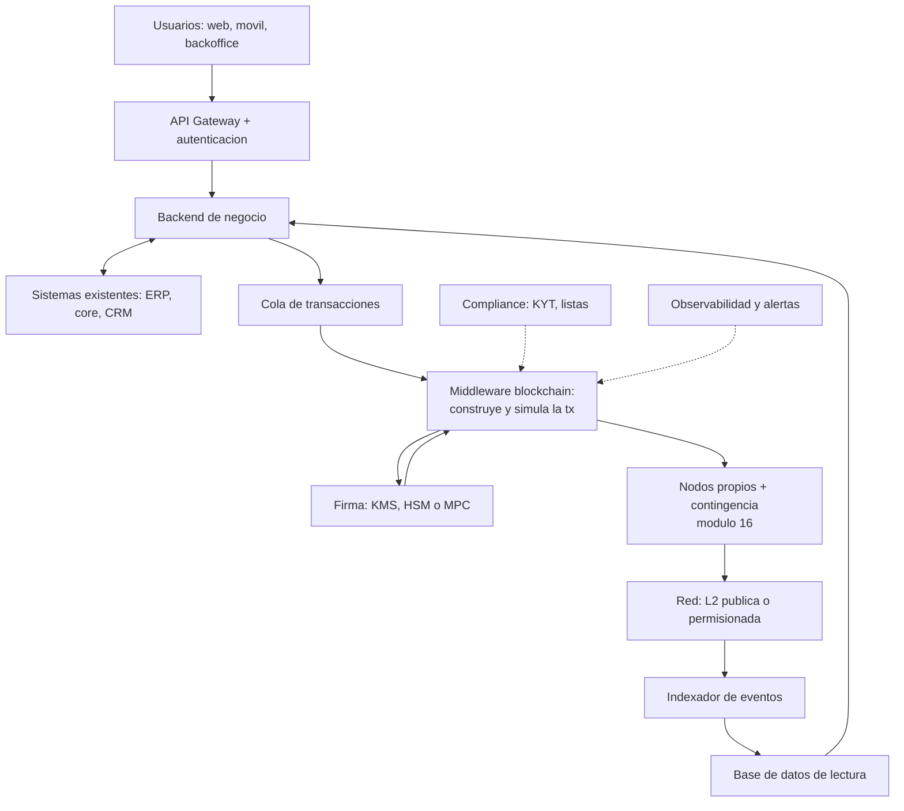
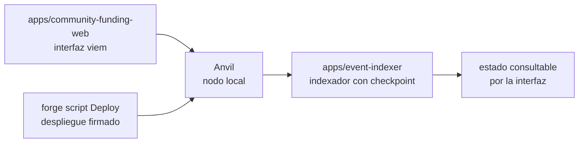
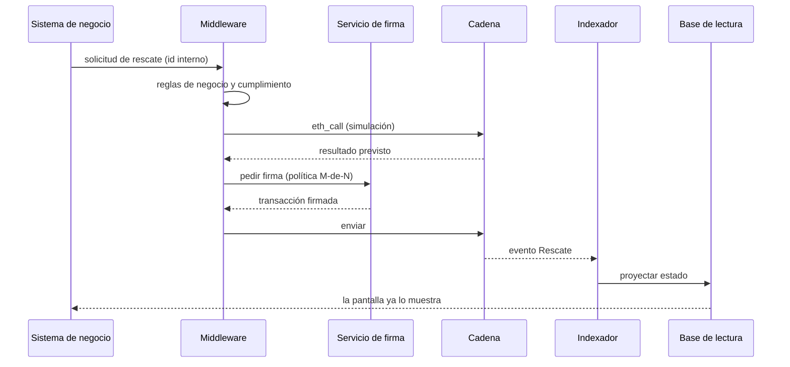

# 18 · Implementación empresarial end-to-end

> **Nivel:** Avanzado-Producción · ⏱️ **Duración estimada:** 180 min · **Fuente:** prácticas públicas de integración del sector financiero y documentación de los componentes citados
> [⬅️ Currículo](../README.md) · [📚 Bibliografía](../../docs/bibliografia.md)
> 🧭 ⬅️ **Anterior:** [17 · Blockchain en la empresa: valor, casos y costos](../17-blockchain-en-la-empresa/README.md) · [📚 Índice](../README.md) · ➡️ **Siguiente:** [🎓 Proyecto final](../../capstone/README.md)
> 📖 [Glosario de términos](../../docs/glosario.md) · 🌱 [¿Nuevo en esto? Empieza aquí](../../docs/empieza-aqui.md)

---

El módulo final antes del capstone responde la pregunta que los diagramas conceptuales
esquivan: **¿cómo se conecta esto con el ERP, el core bancario y los sistemas que la
empresa ya tiene?** Con qué piezas, en qué ambientes, con qué equipo, en cuántos meses
— y lo ensamblas en miniatura, ejecutable, con las piezas reales de este repositorio.

## 🎯 Objetivos

- Diseñar la arquitectura de siete capas de una solución empresarial sobre blockchain.
- Decidir componente a componente entre construir y comprar, con criterios explícitos.
- Planificar los cuatro ambientes (desarrollo, QA, pre-producción, producción) y qué valida cada uno.
- Estructurar un proyecto realista de seis meses con entregables verificables por fase.
- Ensamblar el patrón completo en local: contrato, firma, indexador e interfaz.

## 📚 Resultados de aprendizaje

Al finalizar, el estudiante podrá:

1. **Dibujar** la arquitectura completa, del usuario al bloque, ubicando cada componente y su rol.
2. **Justificar** cada decisión build vs. buy con volumen, riesgo y costo.
3. **Explicar** por qué la blockchain nunca es la base de datos de lectura de las pantallas.
4. **Planificar** ambientes y ceremonias para que el día del lanzamiento no haya "primeras veces".
5. **Ejecutar** el pipeline local completo del repositorio como maqueta de la arquitectura.
6. **Operar** con separación de deberes: quién despliega, quién firma, quién monitorea.

## 🗺️ Temas

| # | Tema | Por qué importa |
|---|------|-----------------|
| 1 | Las siete capas de la solución | Solo una es la blockchain; el resto es ingeniería de sistemas |
| 2 | El middleware: construir, simular, firmar | El corazón que aplica negocio y compliance antes de tocar la red |
| 3 | Firma y custodia: KMS, MPC, multisig | Dónde viven las claves y quién puede usarlas |
| 4 | Indexador y base de lectura | Las pantallas no leen de la cadena |
| 5 | Build vs. buy por componente | Se construye lo que diferencia, se compra el commodity |
| 6 | Ambientes y ceremonias | La primera firma multisig no puede ser el día del lanzamiento |
| 7 | El plan de seis meses | Fases con entregables verificables y equipo realista |
| 8 | Operación segura: límites, runbooks, post-mortems | Un bug con límites es un incidente; sin límites, una catástrofe |

## 🧠 Modelo mental

La solución empresarial es un **aeropuerto**: la pista (la blockchain) es indispensable
pero pequeña comparada con todo lo demás — torre de control (middleware), aduana
(compliance), mangas y cintas (integraciones con el ERP), seguridad (firma y custodia) y
paneles de vuelos (indexador y pantallas). Los pasajeros nunca pisan la pista: usan la
terminal. Tus usuarios quizá nunca vean una wallet: usan la aplicación de siempre.

Límite de la analogía: en el aeropuerto un vuelo se puede cancelar; en la cadena, lo
despegado despegó — por eso simulación previa, límites y timelocks son parte del diseño,
no mejoras posteriores.

## 🧩 Esquema visual

La arquitectura completa, de la pantalla al bloque:



El mismo patrón, en miniatura ejecutable, con las piezas de este repositorio:



## 📖 Conceptos y definiciones

- **Middleware blockchain**: servicio interno que construye transacciones, las **simula** (`eth_call`), aplica reglas de negocio/compliance y solo entonces solicita la firma.
- **Cola de transacciones**: desacopla el negocio de la red; si el gas se dispara o la red se congestiona, las operaciones esperan con política de reintento.
- **Servicio de firma**: KMS/HSM (clave en hardware con política y auditoría), MPC (clave repartida entre máquinas) o multisig on-chain (política en el contrato).
- **Base de datos de lectura**: réplica consultable del estado, alimentada por el indexador; las pantallas leen de aquí, jamás de un `eth_call` por clic.
- **Guarded launch**: lanzamiento con límites (caps por transacción, por día, por contrato) que se amplían con evidencia de operación.
- **Ceremonia**: procedimiento presencial documentado (generación de claves, alta de firmante) con actas, testigos y respaldo físico.
- **Separación de deberes**: quien despliega no firma; ninguna persona sola mueve fondos (política M-de-N).
- **Runbook**: guion paso a paso de un incidente (pausar, contactar custodio, comunicar), ensayado antes de producción.

## 🔬 Profundización

### Build vs. buy, componente a componente

| Componente | Construir | Comprar | Criterio |
|---|---|---|---|
| Nodos / RPC | Flota propia (módulo 16) | Alchemy, Infura, QuickNode | Volumen, privacidad, SLA |
| Firma / custodia | HSM propio + política | Fireblocks, BitGo, custodio regulado | Licencias, monto, seguro |
| Indexación | Indexador propio (como el del repo) | The Graph, proveedores de datos | Complejidad y latencia |
| Contratos | Equipo propio + auditoría | Plantillas auditadas (OpenZeppelin) | Cuán estándar es el caso |
| Compliance / KYT | Integración propia | Chainalysis, TRM, Elliptic | Obligación regulatoria |
| Monitoreo on-chain | Alertas propias | Tenderly, Defender, Forta | Minutos de reacción requeridos |

### Ambientes: qué valida cada uno

| Ambiente | Red | Claves | Qué se valida |
|---|---|---|---|
| Desarrollo | Anvil local | de prueba, conocidas | Lógica y flujo end-to-end |
| Integración / QA | Testnet (Sepolia) | de prueba gestionadas | Integración con ERP, indexador, colas |
| Pre-producción | Testnet + fork de mainnet | estructura real, sin fondos | Ceremonias, runbooks, límites |
| Producción | Mainnet / L2 / permisionada | KMS/MPC/multisig reales | Lanzamiento acotado con monitoreo |

### El plan de seis meses (equipo: arquitecto, 2 de contratos, 2 backend, DevOps, PM)

| Fase | Semanas | Entregable verificable |
|---|---|---|
| 1 · Descubrimiento | 1-4 | Matriz del módulo 00 respondida con evidencia; elección de red; ADRs |
| 2 · Diseño | 5-8 | Spec con invariantes, threat model, plan de custodia e integración |
| 3 · Construcción | 9-16 | Contratos probados y fuzzeados; middleware + firma; todo en testnet |
| 4 · Endurecimiento | 17-20 | Auditoría externa, correcciones verificadas, pre-producción completa |
| 5 · Lanzamiento acotado | 21-24 | Mainnet con caps, monitoreo y runbook ensayado |
| 6 · Operación | 25+ | Ampliación gradual de límites, post-mortems, métricas de negocio |

Las fases 1-2 son las más baratas y las más determinantes: los fracasos del módulo 17
(TradeLens, ASX) se gestaron ahí, no en el código.

### Una operación real, paso a paso, y dónde se rompe cada una

La lista de comprobación dice "usa un middleware". Aquí se ve **qué pasa exactamente si no lo usas**, siguiendo una operación de negocio corriente: *un cliente solicita el rescate de 10 000 unidades de un fondo tokenizado*.



Y ahora el mismo recorrido, con lo que falla al saltarse cada paso:

| Paso | Qué aporta | Si te lo saltas |
|---|---|---|
| **Reglas antes de firmar** | Aplica límites, listas y horarios en un solo sitio | La regla acaba duplicada en cada pantalla que puede iniciar la operación, y basta olvidarla en una para que se escape |
| **Simulación (`eth_call`)** | Predice el resultado sin gastar | Se firman transacciones que revierten: se paga el gas, no hay efecto, y el usuario ve un cobro sin resultado |
| **Cola de transacciones** | Desacopla el negocio de la red | Si el gas se dispara o el RPC cae, la petición del cliente falla en su cara en vez de esperar y reintentar |
| **Servicio de firma con política** | Ninguna persona sola mueve fondos | La clave acaba en una variable de entorno de un servidor, y quien acceda a ese servidor es dueño del fondo |
| **Indexador + base de lectura** | Las pantallas leen a velocidad de base de datos | Cada clic dispara un `eth_call`; la interfaz va lenta y se cae entera cuando cae el proveedor RPC |
| **Idempotencia por id interno** | La misma solicitud no se ejecuta dos veces | Un reintento tras un timeout ejecuta el rescate **dos veces**. La cadena no tiene forma de saber que era el mismo |

El último es el más caro y el menos citado. En un sistema clásico, un doble apunte se corrige con un asiento inverso. Aquí, la segunda transferencia es tan válida y tan definitiva como la primera: **la corrección exige que la contraparte colabore**.

> 💡 **En una frase:** el middleware no es una capa de arquitectura por elegancia — es el sitio donde se decide, se simula y se registra *una sola vez* lo que en la cadena no se puede deshacer.

### Los números de un lanzamiento con límites

"Guarded launch" suena a consigna hasta que se le ponen cifras. La idea es simple: **acotar cuánto puedes perder mientras el sistema todavía no tiene historial**, y ampliar los límites con evidencia, no con optimismo.

| Fase | Duración típica | Tope por operación | Tope diario | Qué la cierra |
|---|---|---:|---:|---|
| Piloto interno | 2–4 semanas | 1 000 | 5 000 | Cero incidentes y el runbook ensayado de verdad |
| Clientes seleccionados | 4–8 semanas | 10 000 | 100 000 | Volumen real sostenido sin intervención manual |
| Apertura | — | según negocio | según negocio | Auditoría cerrada y monitorización con alertas probadas |

Dos reglas que hacen que esto funcione y sin las cuales es teatro:

1. **Los topes viven en el contrato, no en la interfaz.** Un límite en la pantalla lo esquiva cualquiera que llame al contrato directamente. Si el tope no está en el código, no es un tope: es una sugerencia.
2. **Ampliar exige evidencia escrita**, no la sensación de que va bien. Fija de antemano qué métrica autoriza el siguiente escalón (operaciones sin incidente, tiempo desde el último fallo, cobertura de la auditoría) para que la decisión no dependa de la presión comercial del momento.

El cálculo que convence a un comité: si el tope diario es 100 000 y el peor caso es un fallo que drena el máximo antes de que alguien reaccione, **la pérdida máxima está acotada a esa cifra**. Sin topes, la respuesta a "¿cuánto podemos perder?" es "todo lo que haya en el contrato", y esa respuesta no se puede llevar a un consejo.

<details>
<summary><strong>🎓 Si ya dominas esto</strong> — lo que se descubre en el primer incidente</summary>

- **La pausa de emergencia también es un riesgo.** Quien puede pausar puede congelar los fondos de los usuarios. Un `pause` sin límite temporal ni gobernanza es un punto único de confianza tan grave como el que intenta mitigar; acótalo con caducidad automática.
- **El nonce es un recurso compartido y un cuello de botella.** Si dos procesos firman con la misma cuenta, se pisan el nonce y una transacción reemplaza a la otra. La cola debe ser la única dueña del nonce, con asignación estrictamente secuencial y reconciliación tras cada reinicio.
- **Ensaya la ceremonia antes de necesitarla.** La primera firma multisig en producción con un directivo de viaje y un firmante que perdió su dispositivo es el escenario real. La pre-producción con la misma política M-de-N y las mismas personas es lo que evita descubrirlo el día del lanzamiento.
- **La reorganización rompe la idempotencia ingenua.** Marcar "hecho" al ver el evento y no al alcanzar finalidad significa que una reorg deja el sistema afirmando algo que la cadena ya no dice. Espera confirmaciones y guarda el número de bloque para poder revisar.
- **El coste de cumplimiento crece con el volumen, no con el código.** KYT, informes y conservación de registros escalan con las operaciones. Un piloto barato puede volverse caro en producción sin que cambie una línea del contrato — y ese es el salto donde mueren la mayoría de los proyectos.

</details>

## 🧪 Laboratorio guiado

> 🧪 Estas prácticas están catalogadas y **resueltas paso a paso** en el [catálogo de laboratorios](../../labs/CATALOG.md).

Ensambla la arquitectura de referencia **en miniatura y ejecutable**, con las piezas
reales del repositorio (guía detallada en [despliegue local](../../docs/despliegue-local.md)):

1. Levanta el "nodo de la empresa" (capa de acceso a red):

```bash
anvil --chain-id 31337
```

2. Despliega el contrato con un script firmado (capa de contratos + firma):

```bash
cd projects/community-funding
forge script script/Deploy.s.sol:DeployCommunityFunding \
  --rpc-url "$RPC_URL" --broadcast
```

3. Arranca el indexador y verifica su checkpoint (capa de datos de lectura):

```bash
pnpm test:indexer
```

4. Construye la interfaz y conéctala al contrato (capa de canal):

```bash
pnpm build:web
```

5. Recorre el diagrama de siete capas y marca qué pieza del repo cumple cada rol — y cuáles faltan para producción real (cola, KYT, HSM): esa brecha es exactamente lo que separa la maqueta de un despliegue empresarial.

## 📝 Reto verificable

Escribe el **documento de arquitectura** de una implementación empresarial para el caso
de negocio que construiste en el módulo 17: diagrama de siete capas adaptado, tabla
build vs. buy con justificación por componente, plan de ambientes con qué valida cada
uno, plan de fases con entregables, y la operación segura (límites iniciales, política
de firma M-de-N, tres runbooks nombrados).

**Criterio de aceptación:** el diagrama ubica firma e indexador correctamente (la firma
antes del RPC; las pantallas leen de la base de lectura); cada "comprar" cita al menos
dos proveedores; el plan no tiene "primeras veces" en producción; los límites del
lanzamiento tienen números concretos.

## ⚠️ Errores frecuentes

| Síntoma | Causa y cómo comprobarlo |
|---------|--------------------------|
| "La blockchain reemplazará nuestra base de datos" | Conviven: estado compartido on-chain, lectura y negocio en sistemas clásicos; revisa el diagrama |
| Pantallas lentas que "leen de la cadena" | Falta indexador + base de lectura; ningún `eth_call` por clic de usuario |
| El lanzamiento se retrasa por la auditoría | Se agendó tarde; las firmas serias se reservan desde la fase de diseño |
| La primera firma multisig falla en producción | No hubo pre-producción con ceremonia ensayada |
| Un bug drena más de lo tolerable | Sin caps de guarded launch; los límites se definen antes de mainnet |
| "Multi-región lo vemos después" | La contingencia RPC y la réplica se diseñan el día uno (módulo 16) |

## 🛡️ Seguridad y ética

- Separación de deberes real: quien despliega no es quien firma; documenta la política M-de-N y pruébala.
- Los firmadores nunca son accesibles desde internet; red privada, mTLS y bastion con MFA.
- Límites como airbag: caps por transacción y por día desde el día uno, ampliados solo con evidencia.
- Comunicación honesta de incidentes: pausar, informar y publicar post-mortem — el [runbook del programa](../../docs/operacion-incidentes.md) es el punto de partida.
- En el laboratorio, todo es local y con claves de prueba; ninguna clave real sale jamás de su HSM/MPC.

## 🔗 Referencias

- OpenZeppelin — Contracts y Defender: <https://docs.openzeppelin.com/>
- Safe — multisig para tesorerías: <https://docs.safe.global/>
- AWS KMS — firma con secp256k1: <https://docs.aws.amazon.com/kms/>
- Fireblocks — arquitectura MPC: <https://www.fireblocks.com/platforms/mpc-wallet/>
- Trail of Bits — *Building Secure Contracts*: <https://secure-contracts.com/>
- BIS — tokenización y liquidación institucional: <https://www.bis.org/>
- Lectura extendida del programa: [Industria · Ciclo de vida de un proyecto](../../industria/06-ciclo-de-vida-de-un-proyecto.md)

## ✅ Criterio de dominio

- Dibujas y defiendes la arquitectura de siete capas ubicando firma, indexador y contingencia.
- Ejecutas la maqueta local completa y nombras qué le falta para producción real.
- Tu plan de proyecto no contiene "primeras veces" en producción.

---

## 🧭 Navegación

⬅️ [Módulo 17 · Blockchain en la empresa](../17-blockchain-en-la-empresa/README.md) · [📚 Índice del currículo](../README.md) · ➡️ [🎓 Proyecto final](../../capstone/README.md)
