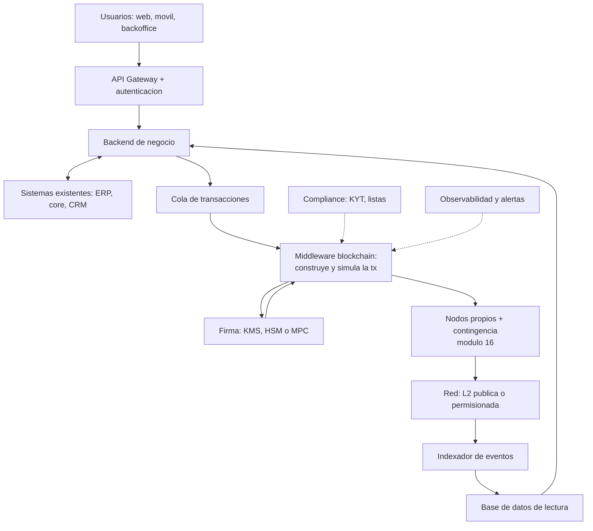
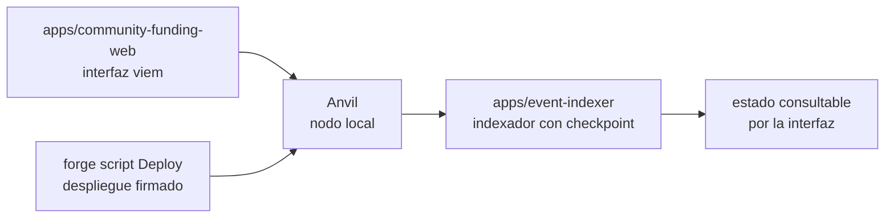

# 18 · Implementación empresarial end-to-end

> **Nivel:** Avanzado-Producción · ⏱️ **Duración estimada:** 180 min · **Fuente:** prácticas públicas de integración del sector financiero y documentación de los componentes citados
> [⬅️ Currículo](../README.md) · [📚 Bibliografía](../../docs/bibliografia.md)

---

El módulo final antes del capstone responde la pregunta que los diagramas conceptuales
esquivan: **¿cómo se conecta esto con el ERP, el core bancario y los sistemas que la
empresa ya tiene?** Con qué piezas, en qué ambientes, con qué equipo, en cuántos meses
— y lo ensamblas en miniatura, ejecutable, con las piezas reales de este repositorio.

## 🎯 Objetivos

- Diseñar la arquitectura de siete capas de una solución empresarial sobre blockchain.
- Decidir componente a componente entre construir y comprar, con criterios explícitos.
- Planificar los cuatro ambientes (desarrollo, QA, pre-producción, producción) y qué valida cada uno.
- Estructurar un proyecto realista de seis meses con entregables verificables por fase.
- Ensamblar el patrón completo en local: contrato, firma, indexador e interfaz.

## 📚 Resultados de aprendizaje

Al finalizar, el estudiante podrá:

1. **Dibujar** la arquitectura completa, del usuario al bloque, ubicando cada componente y su rol.
2. **Justificar** cada decisión build vs. buy con volumen, riesgo y costo.
3. **Explicar** por qué la blockchain nunca es la base de datos de lectura de las pantallas.
4. **Planificar** ambientes y ceremonias para que el día del lanzamiento no haya "primeras veces".
5. **Ejecutar** el pipeline local completo del repositorio como maqueta de la arquitectura.
6. **Operar** con separación de deberes: quién despliega, quién firma, quién monitorea.

## 🗺️ Temas

| # | Tema | Por qué importa |
|---|------|-----------------|
| 1 | Las siete capas de la solución | Solo una es la blockchain; el resto es ingeniería de sistemas |
| 2 | El middleware: construir, simular, firmar | El corazón que aplica negocio y compliance antes de tocar la red |
| 3 | Firma y custodia: KMS, MPC, multisig | Dónde viven las claves y quién puede usarlas |
| 4 | Indexador y base de lectura | Las pantallas no leen de la cadena |
| 5 | Build vs. buy por componente | Se construye lo que diferencia, se compra el commodity |
| 6 | Ambientes y ceremonias | La primera firma multisig no puede ser el día del lanzamiento |
| 7 | El plan de seis meses | Fases con entregables verificables y equipo realista |
| 8 | Operación segura: límites, runbooks, post-mortems | Un bug con límites es un incidente; sin límites, una catástrofe |

## 🧠 Modelo mental

La solución empresarial es un **aeropuerto**: la pista (la blockchain) es indispensable
pero pequeña comparada con todo lo demás — torre de control (middleware), aduana
(compliance), mangas y cintas (integraciones con el ERP), seguridad (firma y custodia) y
paneles de vuelos (indexador y pantallas). Los pasajeros nunca pisan la pista: usan la
terminal. Tus usuarios quizá nunca vean una wallet: usan la aplicación de siempre.

Límite de la analogía: en el aeropuerto un vuelo se puede cancelar; en la cadena, lo
despegado despegó — por eso simulación previa, límites y timelocks son parte del diseño,
no mejoras posteriores.

## 🧩 Esquema visual

La arquitectura completa, de la pantalla al bloque:



El mismo patrón, en miniatura ejecutable, con las piezas de este repositorio:



## 📖 Conceptos y definiciones

- **Middleware blockchain**: servicio interno que construye transacciones, las **simula** (`eth_call`), aplica reglas de negocio/compliance y solo entonces solicita la firma.
- **Cola de transacciones**: desacopla el negocio de la red; si el gas se dispara o la red se congestiona, las operaciones esperan con política de reintento.
- **Servicio de firma**: KMS/HSM (clave en hardware con política y auditoría), MPC (clave repartida entre máquinas) o multisig on-chain (política en el contrato).
- **Base de datos de lectura**: réplica consultable del estado, alimentada por el indexador; las pantallas leen de aquí, jamás de un `eth_call` por clic.
- **Guarded launch**: lanzamiento con límites (caps por transacción, por día, por contrato) que se amplían con evidencia de operación.
- **Ceremonia**: procedimiento presencial documentado (generación de claves, alta de firmante) con actas, testigos y respaldo físico.
- **Separación de deberes**: quien despliega no firma; ninguna persona sola mueve fondos (política M-de-N).
- **Runbook**: guion paso a paso de un incidente (pausar, contactar custodio, comunicar), ensayado antes de producción.

## 🔬 Profundización

### Build vs. buy, componente a componente

| Componente | Construir | Comprar | Criterio |
|---|---|---|---|
| Nodos / RPC | Flota propia (módulo 16) | Alchemy, Infura, QuickNode | Volumen, privacidad, SLA |
| Firma / custodia | HSM propio + política | Fireblocks, BitGo, custodio regulado | Licencias, monto, seguro |
| Indexación | Indexador propio (como el del repo) | The Graph, proveedores de datos | Complejidad y latencia |
| Contratos | Equipo propio + auditoría | Plantillas auditadas (OpenZeppelin) | Cuán estándar es el caso |
| Compliance / KYT | Integración propia | Chainalysis, TRM, Elliptic | Obligación regulatoria |
| Monitoreo on-chain | Alertas propias | Tenderly, Defender, Forta | Minutos de reacción requeridos |

### Ambientes: qué valida cada uno

| Ambiente | Red | Claves | Qué se valida |
|---|---|---|---|
| Desarrollo | Anvil local | de prueba, conocidas | Lógica y flujo end-to-end |
| Integración / QA | Testnet (Sepolia) | de prueba gestionadas | Integración con ERP, indexador, colas |
| Pre-producción | Testnet + fork de mainnet | estructura real, sin fondos | Ceremonias, runbooks, límites |
| Producción | Mainnet / L2 / permisionada | KMS/MPC/multisig reales | Lanzamiento acotado con monitoreo |

### El plan de seis meses (equipo: arquitecto, 2 de contratos, 2 backend, DevOps, PM)

| Fase | Semanas | Entregable verificable |
|---|---|---|
| 1 · Descubrimiento | 1-4 | Matriz del módulo 00 respondida con evidencia; elección de red; ADRs |
| 2 · Diseño | 5-8 | Spec con invariantes, threat model, plan de custodia e integración |
| 3 · Construcción | 9-16 | Contratos probados y fuzzeados; middleware + firma; todo en testnet |
| 4 · Endurecimiento | 17-20 | Auditoría externa, correcciones verificadas, pre-producción completa |
| 5 · Lanzamiento acotado | 21-24 | Mainnet con caps, monitoreo y runbook ensayado |
| 6 · Operación | 25+ | Ampliación gradual de límites, post-mortems, métricas de negocio |

Las fases 1-2 son las más baratas y las más determinantes: los fracasos del módulo 17
(TradeLens, ASX) se gestaron ahí, no en el código.

## 🧪 Laboratorio guiado

> 🧪 Estas prácticas están catalogadas y **resueltas paso a paso** en el [catálogo de laboratorios](../../labs/CATALOG.md).

Ensambla la arquitectura de referencia **en miniatura y ejecutable**, con las piezas
reales del repositorio (guía detallada en [despliegue local](../../docs/despliegue-local.md)):

1. Levanta el "nodo de la empresa" (capa de acceso a red):

```bash
anvil --chain-id 31337
```

2. Despliega el contrato con un script firmado (capa de contratos + firma):

```bash
cd projects/community-funding
forge script script/Deploy.s.sol:DeployCommunityFunding \
  --rpc-url "$RPC_URL" --broadcast
```

3. Arranca el indexador y verifica su checkpoint (capa de datos de lectura):

```bash
pnpm test:indexer
```

4. Construye la interfaz y conéctala al contrato (capa de canal):

```bash
pnpm build:web
```

5. Recorre el diagrama de siete capas y marca qué pieza del repo cumple cada rol — y cuáles faltan para producción real (cola, KYT, HSM): esa brecha es exactamente lo que separa la maqueta de un despliegue empresarial.

## 📝 Reto verificable

Escribe el **documento de arquitectura** de una implementación empresarial para el caso
de negocio que construiste en el módulo 17: diagrama de siete capas adaptado, tabla
build vs. buy con justificación por componente, plan de ambientes con qué valida cada
uno, plan de fases con entregables, y la operación segura (límites iniciales, política
de firma M-de-N, tres runbooks nombrados).

**Criterio de aceptación:** el diagrama ubica firma e indexador correctamente (la firma
antes del RPC; las pantallas leen de la base de lectura); cada "comprar" cita al menos
dos proveedores; el plan no tiene "primeras veces" en producción; los límites del
lanzamiento tienen números concretos.

## ⚠️ Errores frecuentes

| Síntoma | Causa y cómo comprobarlo |
|---------|--------------------------|
| "La blockchain reemplazará nuestra base de datos" | Conviven: estado compartido on-chain, lectura y negocio en sistemas clásicos; revisa el diagrama |
| Pantallas lentas que "leen de la cadena" | Falta indexador + base de lectura; ningún `eth_call` por clic de usuario |
| El lanzamiento se retrasa por la auditoría | Se agendó tarde; las firmas serias se reservan desde la fase de diseño |
| La primera firma multisig falla en producción | No hubo pre-producción con ceremonia ensayada |
| Un bug drena más de lo tolerable | Sin caps de guarded launch; los límites se definen antes de mainnet |
| "Multi-región lo vemos después" | La contingencia RPC y la réplica se diseñan el día uno (módulo 16) |

## 🛡️ Seguridad y ética

- Separación de deberes real: quien despliega no es quien firma; documenta la política M-de-N y pruébala.
- Los firmadores nunca son accesibles desde internet; red privada, mTLS y bastion con MFA.
- Límites como airbag: caps por transacción y por día desde el día uno, ampliados solo con evidencia.
- Comunicación honesta de incidentes: pausar, informar y publicar post-mortem — el [runbook del programa](../../docs/operacion-incidentes.md) es el punto de partida.
- En el laboratorio, todo es local y con claves de prueba; ninguna clave real sale jamás de su HSM/MPC.

## 🔗 Referencias

- OpenZeppelin — Contracts y Defender: <https://docs.openzeppelin.com/>
- Safe — multisig para tesorerías: <https://docs.safe.global/>
- AWS KMS — firma con secp256k1: <https://docs.aws.amazon.com/kms/>
- Fireblocks — arquitectura MPC: <https://www.fireblocks.com/platforms/mpc-wallet/>
- Trail of Bits — *Building Secure Contracts*: <https://secure-contracts.com/>
- BIS — tokenización y liquidación institucional: <https://www.bis.org/>
- Lectura extendida del programa: [Industria · Ciclo de vida de un proyecto](../../industria/06-ciclo-de-vida-de-un-proyecto.md)

## ✅ Criterio de dominio

- Dibujas y defiendes la arquitectura de siete capas ubicando firma, indexador y contingencia.
- Ejecutas la maqueta local completa y nombras qué le falta para producción real.
- Tu plan de proyecto no contiene "primeras veces" en producción.

---

## 🧭 Navegación

⬅️ [Módulo 17 · Blockchain en la empresa](../17-blockchain-en-la-empresa/README.md) · [📚 Índice del currículo](../README.md) · ➡️ [🎓 Proyecto final](../../capstone/README.md)
