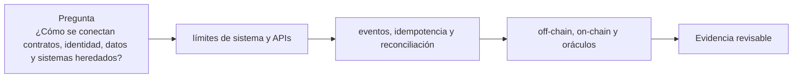

# Clase 37 · Integración end-to-end

> **Clase independiente 37 de 66** · **Nivel:** Avanzado-Producción · **Fuente base:** prácticas públicas de integración del sector financiero y documentación de los componentes citados
>
> [⬅️ Clase anterior](../17-blockchain-en-la-empresa/clase-36-comunicacion-piloto-y-medicion.md) · [📚 Índice de las 66 clases](../README.md) · [🗂️ Mapa del tema](README.md) · [➡️ Clase siguiente](../18-implementacion-empresarial/clase-38-paso-a-produccion-y-operacion.md)

## Punto de partida

**Pregunta guía:** ¿Cómo se conectan contratos, identidad, datos y sistemas heredados?

**Caso que abre la clase:** El ERP registra una orden dos veces al reintentar tras un timeout RPC.

Un timeout provoca reintentos y dobles registros entre ERP, API y cadena. Los identificadores y estados compensatorios se descubren siguiendo el evento extremo a extremo.

## Fundamentos que sostienen la respuesta

1. **límites de sistema y APIs.** En esta clase delimita qué objeto o relación estamos observando antes de sacar conclusiones. Localízalo explícitamente en «El ERP registra una orden dos veces al reintentar tras un timeout RPC.» y anota qué dato faltaría para refutar tu lectura.
2. **eventos, idempotencia y reconciliación.** En esta clase explica el mecanismo que conecta la situación inicial con el cambio observable. Localízalo explícitamente en «El ERP registra una orden dos veces al reintentar tras un timeout RPC.» y anota qué dato faltaría para refutar tu lectura.
3. **off-chain, on-chain y oráculos.** En esta clase permite contrastar el resultado y formular el límite de la evidencia. Localízalo explícitamente en «El ERP registra una orden dos veces al reintentar tras un timeout RPC.» y anota qué dato faltaría para refutar tu lectura.

### Build vs. buy, componente a componente

| Componente | Construir | Comprar | Criterio |
|---|---|---|---|
| Nodos / RPC | Flota propia (clases 33–34) | Alchemy, Infura, QuickNode | Volumen, privacidad, SLA |
| Firma / custodia | HSM propio + política | Fireblocks, BitGo, custodio regulado | Licencias, monto, seguro |
| Indexación | Indexador propio (como el del repo) | The Graph, proveedores de datos | Complejidad y latencia |
| Contratos | Equipo propio + auditoría | Plantillas auditadas (OpenZeppelin) | Cuán estándar es el caso |
| Compliance / KYT | Integración propia | Chainalysis, TRM, Elliptic | Obligación regulatoria |
| Monitoreo on-chain | Alertas propias | Tenderly, Defender, Forta | Minutos de reacción requeridos |

### Ambientes: qué valida cada uno

| Ambiente | Red | Claves | Qué se valida |
|---|---|---|---|
| Desarrollo | Anvil local | de prueba, conocidas | Lógica y flujo end-to-end |
| Integración / QA | Testnet (Sepolia) | de prueba gestionadas | Integración con ERP, indexador, colas |
| Pre-producción | Testnet + fork de mainnet | estructura real, sin fondos | Ceremonias, runbooks, límites |
| Producción | Mainnet / L2 / permisionada | KMS/MPC/multisig reales | Lanzamiento acotado con monitoreo |

### El plan de seis meses (equipo: arquitecto, 2 de contratos, 2 backend, DevOps, PM)

| Fase | Semanas | Entregable verificable |
|---|---|---|
| 1 · Descubrimiento | 1-4 | Matriz de las clases 1–2 respondida con evidencia; elección de red; ADRs |
| 2 · Diseño | 5-8 | Spec con invariantes, threat model, plan de custodia e integración |
| 3 · Construcción | 9-16 | Contratos probados y fuzzeados; middleware + firma; todo en testnet |
| 4 · Endurecimiento | 17-20 | Auditoría externa, correcciones verificadas, pre-producción completa |
| 5 · Lanzamiento acotado | 21-24 | Mainnet con caps, monitoreo y runbook ensayado |
| 6 · Operación | 25+ | Ampliación gradual de límites, post-mortems, métricas de negocio |

Las fases 1-2 son las más baratas y las más determinantes: los fracasos de las clases 35–36
(TradeLens, ASX) se gestaron ahí, no en el código.

### Los números de un lanzamiento con límites

"Guarded launch" suena a consigna hasta que se le ponen cifras. La idea es simple: **acotar cuánto puedes perder mientras el sistema todavía no tiene historial**, y ampliar los límites con evidencia, no con optimismo.

| Fase | Duración típica | Tope por operación | Tope diario | Qué la cierra |
|---|---|---:|---:|---|
| Piloto interno | 2–4 semanas | 1 000 | 5 000 | Cero incidentes y el runbook ensayado de verdad |
| Clientes seleccionados | 4–8 semanas | 10 000 | 100 000 | Volumen real sostenido sin intervención manual |
| Apertura | — | según negocio | según negocio | Auditoría cerrada y monitorización con alertas probadas |

Dos reglas que hacen que esto funcione y sin las cuales es teatro:

1. **Los topes viven en el contrato, no en la interfaz.** Un límite en la pantalla lo esquiva cualquiera que llame al contrato directamente. Si el tope no está en el código, no es un tope: es una sugerencia.
2. **Ampliar exige evidencia escrita**, no la sensación de que va bien. Fija de antemano qué métrica autoriza el siguiente escalón (operaciones sin incidente, tiempo desde el último fallo, cobertura de la auditoría) para que la decisión no dependa de la presión comercial del momento.

El cálculo que convence a un comité: si el tope diario es 100 000 y el peor caso es un fallo que drena el máximo antes de que alguien reaccione, **la pérdida máxima está acotada a esa cifra**. Sin topes, la respuesta a "¿cuánto podemos perder?" es "todo lo que haya en el contrato", y esa respuesta no se puede llevar a un consejo.

<strong>🎓 Si ya dominas esto</strong> — lo que se descubre en el primer incidente

- **La pausa de emergencia también es un riesgo.** Quien puede pausar puede congelar los fondos de los usuarios. Un `pause` sin límite temporal ni gobernanza es un punto único de confianza tan grave como el que intenta mitigar; acótalo con caducidad automática.
- **El nonce es un recurso compartido y un cuello de botella.** Si dos procesos firman con la misma cuenta, se pisan el nonce y una transacción reemplaza a la otra. La cola debe ser la única dueña del nonce, con asignación estrictamente secuencial y reconciliación tras cada reinicio.
- **Ensaya la ceremonia antes de necesitarla.** La primera firma multisig en producción con un directivo de viaje y un firmante que perdió su dispositivo es el escenario real. La pre-producción con la misma política M-de-N y las mismas personas es lo que evita descubrirlo el día del lanzamiento.
- **La reorganización rompe la idempotencia ingenua.** Marcar "hecho" al ver el evento y no al alcanzar finalidad significa que una reorg deja el sistema afirmando algo que la cadena ya no dice. Espera confirmaciones y guarda el número de bloque para poder revisar.
- **El coste de cumplimiento crece con el volumen, no con el código.** KYT, informes y conservación de registros escalan con las operaciones. Un piloto barato puede volverse caro en producción sin que cambie una línea del contrato — y ese es el salto donde mueren la mayoría de los proyectos.

## Gráfico pedagógico

Recorre el gráfico en voz alta: identifica supuestos, transformaciones y el punto exacto donde aparece evidencia.

## Trabajo práctico

**Método propio:** taller de secuencia e idempotencia.

**Actividad:** Diseñar flujo con identificadores, reintentos y compensaciones.

Trabaja en entorno local, regtest, signet o testnet según corresponda. Conserva entradas, comandos, salidas y bloque o instante de corte. Una captura aislada no demuestra reproducibilidad.

## Demostración de aprendizaje

**Entregable:** Diagrama de secuencia con fuente de verdad y control por transición.

**Comprobación formativa:** ¿Qué componente decide si un reintento es duplicado y con qué clave?

Para aprobar debes conectar el hecho observado con el concepto correcto, descartar al menos una interpretación alternativa y redactar una conclusión cuyo alcance no exceda la prueba.

## Errores que esta clase corrige

- Tratar **límites de sistema y APIs** como una etiqueta suficiente, sin identificar actores, dato y frontera.
- Usar **eventos, idempotencia y reconciliación** como explicación aunque el caso no aporte la evidencia necesaria.
- Dar por respondido «¿Cómo se conectan contratos, identidad, datos y sistemas heredados?» sin contrastar **off-chain, on-chain y oráculos**.

Vuelve al caso inicial, elige el error más peligroso y describe una comprobación concreta que lo detectaría.

## Fuentes para comprobar y ampliar

- OpenZeppelin — Contracts y Defender: <https://docs.openzeppelin.com/>
- Safe — multisig para tesorerías: <https://docs.safe.global/>
- AWS KMS — firma con secp256k1: <https://docs.aws.amazon.com/kms/>
- Fireblocks — arquitectura MPC: <https://www.fireblocks.com/platforms/mpc-wallet/>
- Trail of Bits — *Building Secure Contracts*: <https://secure-contracts.com/>
- BIS — tokenización y liquidación institucional: <https://www.bis.org/>

Consulta además la [bibliografía razonada](../../docs/bibliografia.md), que declara procedencia y uso.

## Cierre de la clase

Responde otra vez la pregunta guía sin mirar notas. Si tu respuesta no menciona evidencia, supuesto y límite, todavía describe el tema pero no lo domina. Continúa solo cuando otra persona pueda reproducir tu entregable.
