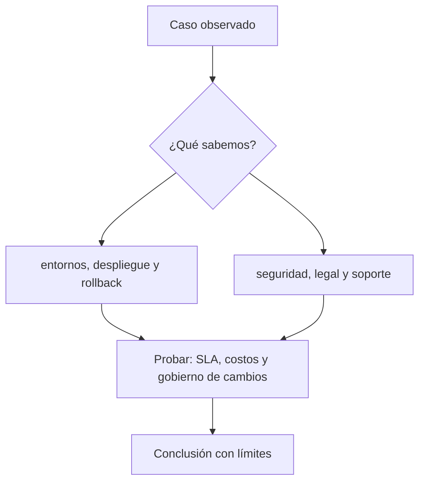
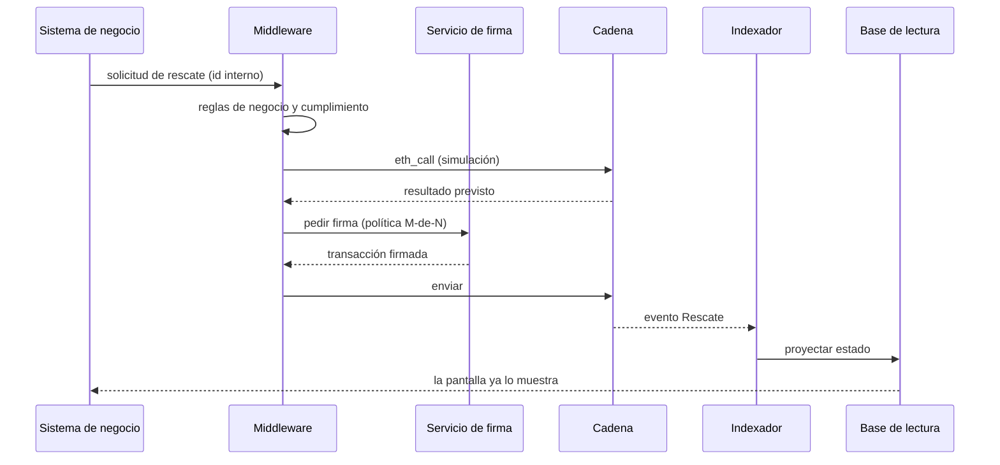

# Clase 38 · Paso a producción y operación

> **Clase independiente 38 de 66** · **Nivel:** Avanzado-Producción · **Fuente base:** prácticas públicas de integración del sector financiero y documentación de los componentes citados
>
> [⬅️ Clase anterior](../18-implementacion-empresarial/clase-37-integracion-end-to-end.md) · [📚 Índice de las 66 clases](../README.md) · [🗂️ Mapa del tema](README.md) · [➡️ Clase siguiente](../19-defi/clase-39-amm-liquidez-y-formacion-de-precio.md)

## Punto de partida

**Pregunta guía:** ¿Qué debe estar listo antes de que una transacción tenga consecuencias reales?

**Caso que abre la clase:** Un contrato probado se despliega sin propietario operativo del incidente.

Tecnología, operaciones, seguridad, legal y soporte deben presentar evidencia antes del go-live. Un contrato correcto no compensa la ausencia de propietario del servicio.

## Gráfico pedagógico

Recorre el gráfico en voz alta: identifica supuestos, transformaciones y el punto exacto donde aparece evidencia.

## Fundamentos que sostienen la respuesta

1. **entornos, despliegue y rollback.** En esta clase delimita qué objeto o relación estamos observando antes de sacar conclusiones. Localízalo explícitamente en «Un contrato probado se despliega sin propietario operativo del incidente.» y anota qué dato faltaría para refutar tu lectura.
2. **seguridad, legal y soporte.** En esta clase explica el mecanismo que conecta la situación inicial con el cambio observable. Localízalo explícitamente en «Un contrato probado se despliega sin propietario operativo del incidente.» y anota qué dato faltaría para refutar tu lectura.
3. **SLA, costos y gobierno de cambios.** En esta clase permite contrastar el resultado y formular el límite de la evidencia. Localízalo explícitamente en «Un contrato probado se despliega sin propietario operativo del incidente.» y anota qué dato faltaría para refutar tu lectura.

### Una operación real, paso a paso, y dónde se rompe cada una

La lista de comprobación dice "usa un middleware". Aquí se ve **qué pasa exactamente si no lo usas**, siguiendo una operación de negocio corriente: *un cliente solicita el rescate de 10 000 unidades de un fondo tokenizado*.

Y ahora el mismo recorrido, con lo que falla al saltarse cada paso:

| Paso | Qué aporta | Si te lo saltas |
|---|---|---|
| **Reglas antes de firmar** | Aplica límites, listas y horarios en un solo sitio | La regla acaba duplicada en cada pantalla que puede iniciar la operación, y basta olvidarla en una para que se escape |
| **Simulación (`eth_call`)** | Predice el resultado sin gastar | Se firman transacciones que revierten: se paga el gas, no hay efecto, y el usuario ve un cobro sin resultado |
| **Cola de transacciones** | Desacopla el negocio de la red | Si el gas se dispara o el RPC cae, la petición del cliente falla en su cara en vez de esperar y reintentar |
| **Servicio de firma con política** | Ninguna persona sola mueve fondos | La clave acaba en una variable de entorno de un servidor, y quien acceda a ese servidor es dueño del fondo |
| **Indexador + base de lectura** | Las pantallas leen a velocidad de base de datos | Cada clic dispara un `eth_call`; la interfaz va lenta y se cae entera cuando cae el proveedor RPC |
| **Idempotencia por id interno** | La misma solicitud no se ejecuta dos veces | Un reintento tras un timeout ejecuta el rescate **dos veces**. La cadena no tiene forma de saber que era el mismo |

El último es el más caro y el menos citado. En un sistema clásico, un doble apunte se corrige con un asiento inverso. Aquí, la segunda transferencia es tan válida y tan definitiva como la primera: **la corrección exige que la contraparte colabore**.

> 💡 **En una frase:** el middleware no es una capa de arquitectura por elegancia — es el sitio donde se decide, se simula y se registra *una sola vez* lo que en la cadena no se puede deshacer.

## Trabajo práctico

**Método propio:** readiness review multidisciplinario.

**Actividad:** Ejecutar un readiness review multidisciplinario.

Trabaja en entorno local, regtest, signet o testnet según corresponda. Conserva entradas, comandos, salidas y bloque o instante de corte. Una captura aislada no demuestra reproducibilidad.

## Errores que esta clase corrige

- Tratar **entornos, despliegue y rollback** como una etiqueta suficiente, sin identificar actores, dato y frontera.
- Usar **seguridad, legal y soporte** como explicación aunque el caso no aporte la evidencia necesaria.
- Dar por respondido «¿Qué debe estar listo antes de que una transacción tenga consecuencias reales?» sin contrastar **SLA, costos y gobierno de cambios**.

Vuelve al caso inicial, elige el error más peligroso y describe una comprobación concreta que lo detectaría.

## Demostración de aprendizaje

**Entregable:** Checklist firmable con responsables, evidencias y riesgos aceptados.

**Comprobación formativa:** Nombra un bloqueo de producción que no pueda resolver el equipo de desarrollo solo.

Para aprobar debes conectar el hecho observado con el concepto correcto, descartar al menos una interpretación alternativa y redactar una conclusión cuyo alcance no exceda la prueba.

## Fuentes para comprobar y ampliar

- OpenZeppelin — Contracts y Defender: <https://docs.openzeppelin.com/>
- Safe — multisig para tesorerías: <https://docs.safe.global/>
- AWS KMS — firma con secp256k1: <https://docs.aws.amazon.com/kms/>
- Fireblocks — arquitectura MPC: <https://www.fireblocks.com/platforms/mpc-wallet/>
- Trail of Bits — *Building Secure Contracts*: <https://secure-contracts.com/>
- BIS — tokenización y liquidación institucional: <https://www.bis.org/>

Consulta además la [bibliografía razonada](../../docs/bibliografia.md), que declara procedencia y uso.

## Cierre de la clase

Responde otra vez la pregunta guía sin mirar notas. Si tu respuesta no menciona evidencia, supuesto y límite, todavía describe el tema pero no lo domina. Continúa solo cuando otra persona pueda reproducir tu entregable.
