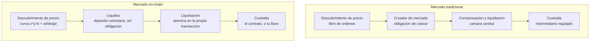
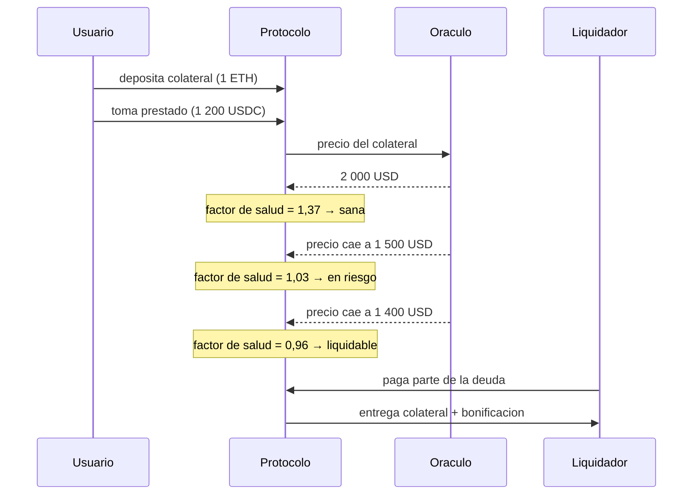

# 19 · DeFi: mercados, préstamo y riesgo on-chain

> **Nivel:** Profesional · ⏱️ **Duración estimada:** 180 min · **Fuente:** documentación de los protocolos citados, investigación del BIS sobre finanzas descentralizadas y literatura académica de microestructura de mercados
> [⬅️ Currículo](../README.md) · [📚 Bibliografía](../../docs/bibliografia.md)
> 🧭 ⬅️ **Anterior:** [18 · Implementación empresarial end-to-end](../18-implementacion-empresarial/README.md) · [📚 Índice](../README.md) · ➡️ **Siguiente:** [20 · Dinero, banca y liquidación](../20-dinero-banca-liquidacion/README.md)
> 📖 [Glosario de términos](../../docs/glosario.md) · 🌱 [¿Nuevo en esto? Empieza aquí](../../docs/empieza-aqui.md)

---

Hasta aquí has construido contratos, tokens y una dApp. Este módulo abre la etapa de
**finanzas on-chain** con la pregunta que sostiene todas las demás: **¿cómo funciona un
mercado cuando nadie lleva el libro de órdenes?** Verás por dentro un creador de mercado
automático, un mercado de préstamo con liquidaciones, y las métricas con las que se mide
el riesgo — calculándolas tú, no leyéndolas en un panel.

Y con la misma insistencia: **qué se pierde**. Un mercado sin intermediario también es un
mercado sin nadie a quien reclamar, sin horario de cierre y sin interruptor.

## 🎯 Objetivos

- Calcular precios, deslizamiento e impacto en un creador de mercado de producto constante.
- Cuantificar la pérdida impermanente de un proveedor de liquidez frente a mantener los activos.
- Determinar el factor de salud de una posición y el precio exacto que la liquida.
- Comparar libro de órdenes, AMM y mercado híbrido con criterios de microestructura.
- Identificar los seis riesgos estructurales de un protocolo DeFi y su control asociado.

## 📚 Resultados de aprendizaje

Al finalizar, el estudiante podrá:

1. **Calcular** el precio de ejecución de una operación en un AMM y separar deslizamiento de comisión.
2. **Demostrar** con números por qué proveer liquidez puede rendir menos que no hacer nada.
3. **Derivar** el precio de liquidación de un préstamo colateralizado a partir de LTV y umbral.
4. **Explicar** qué aporta y qué destruye la ausencia de intermediario en cada función de mercado.
5. **Auditar** un protocolo con la lista de riesgos estructurales, no con su rentabilidad anunciada.
6. **Rechazar** con argumento cualquier presentación de rendimiento DeFi como rendimiento garantizado.

## 🗺️ Temas

| # | Tema | Por qué importa |
|---|------|-----------------|
| 1 | Qué funciones cumple un intermediario financiero | Sin saber qué hace, no se puede evaluar qué pasa al quitarlo |
| 2 | Microestructura: precio, profundidad, diferencial | El vocabulario común a cualquier mercado, con o sin cadena |
| 3 | Libro de órdenes vs. AMM | Dos formas de descubrir precio con costes muy distintos |
| 4 | Producto constante `x · y = k` | El mecanismo completo cabe en una ecuación; sus consecuencias no |
| 5 | Deslizamiento, impacto y pérdida impermanente | Los tres costes que el panel de rendimiento no muestra |
| 6 | Préstamo sobrecolateralizado y liquidación | Por qué DeFi presta sin conocer al deudor |
| 7 | Derivados, perpetuos y apalancamiento | Dónde el riesgo deja de ser lineal |
| 8 | Préstamos relámpago | Atomicidad como herramienta y como arma |
| 9 | Riesgos estructurales y métricas honestas | TVL, APY y por qué ninguna de las dos mide seguridad |

## 🧠 Modelo mental

Un AMM es una **máquina expendedora con precio automático**: no negocia, no tiene
opinión y no sabe quién eres. Su regla es fija —mantener constante el producto de sus dos
reservas— y de esa regla sale un precio para cualquier tamaño de operación. Cuanto más
compras, más caro te sale cada unidad, porque vacías el compartimento.

Límites de la analogía, y son grandes: la máquina **no se queda sin producto** (el precio
tiende a infinito antes), **no tiene dueño que reponga** sino depositantes que ganan
comisiones y pierden por reequilibrio, y **no conoce el precio real del mundo** — solo el
que resulta de su propio inventario. Que ese precio coincida con el del mercado global
depende enteramente de que a alguien le resulte rentable corregirlo.

## 🧩 Esquema visual

Las tres piezas de un mercado y quién las cumple en cada modelo:



El ciclo de una posición de préstamo, de la apertura a la liquidación:



## 📖 Conceptos y definiciones

- **Creador de mercado automático (AMM)**: contrato que cotiza precios a partir de una fórmula sobre sus reservas. Ejemplo: producto constante. Contraejemplo: un libro de órdenes, donde el precio lo ponen personas.
- **Pool de liquidez**: reservas depositadas por terceros contra las que se opera. Quien deposita recibe comisiones y **asume** el reequilibrio automático de su cartera.
- **Deslizamiento (*slippage*)**: diferencia entre el precio esperado y el obtenido. Crece con el tamaño de la operación relativo a la reserva.
- **Impacto en precio**: cuánto mueve tu propia operación el precio del pool. No es lo mismo que el deslizamiento por latencia, aunque el panel los sume.
- **Pérdida impermanente**: diferencia entre el valor de tu posición como proveedor de liquidez y el valor de simplemente haber mantenido los dos activos. Se vuelve permanente al retirar.
- **Sobrecolateralización**: depositar más valor del que se toma prestado. Es lo que permite prestar sin identidad ni historial crediticio.
- **LTV (*loan to value*)**: deuda dividida por valor del colateral. **Umbral de liquidación**: el LTV a partir del cual la posición puede liquidarse.
- **Factor de salud**: `(colateral × umbral) / deuda`. Por debajo de 1, liquidable. Es la única cifra que importa mirar a diario.
- **Préstamo relámpago (*flash loan*)**: préstamo sin colateral que debe devolverse **en la misma transacción**. Si no se devuelve, la transacción entera revierte y es como si nunca hubiera ocurrido.
- **TVL (*total value locked*)**: valor depositado en un protocolo. Mide tamaño, **no** solvencia ni seguridad.
- **APY / APR**: rendimiento anualizado con y sin capitalización. Ambos son **históricos o proyectados**, nunca prometidos.

## 🔬 Profundización

### La ecuación completa, con números

Un pool de producto constante mantiene `x · y = k`. Supongamos reservas de **100 ETH** y
**200 000 USDC**. El producto es `k = 20 000 000`. El precio marginal es el cociente de
reservas: `200 000 / 100 = 2 000 USDC por ETH`.

Compras 1 ETH. La reserva de ETH baja a 99, así que la de USDC debe subir hasta mantener
`k`:

```text
y' = k / x' = 20 000 000 / 99 = 202 020,20 USDC
pagas = 202 020,20 − 200 000 = 2 020,20 USDC
```

Has pagado **2 020,20** por un ETH cuyo precio marcado era 2 000. Ese **1,01 % de
sobrecoste es impacto en precio**, y no es una comisión: es la curva. La comisión del
protocolo (típicamente 0,3 % en pools clásicos, menos en pools estables) se suma encima.

Ahora compra 10 ETH en el mismo pool:

```text
y' = 20 000 000 / 90 = 222 222,22
pagas = 22 222,22 USDC → 2 222,22 por ETH → 11,1 % de sobrecoste
```

**Diez veces el tamaño, once veces el sobrecoste.** El impacto no es lineal, y esa es la
propiedad que define para qué sirve un AMM y para qué no: excelente para operaciones
pequeñas frente a la reserva, pésimo para una operación institucional. La respuesta del
sector —pools concentrados, agregadores que trocean la orden entre varios mercados— no
elimina la curva, la administra.

### Pérdida impermanente: el coste que no aparece en el panel

Depositas 10 ETH y 20 000 USDC (valor total 40 000 USD con ETH a 2 000). El precio de ETH
**se duplica** a 4 000. El pool se reequilibra solo: los arbitrajistas compran ETH barato
del pool hasta que el precio interno iguala al externo.

```text
k = 10 × 20 000 = 200 000
precio nuevo = 4 000 → x' = √(k / 4 000) = √50 = 7,071 ETH
y' = k / x' = 200 000 / 7,071 = 28 284,3 USDC
valor en el pool = 7,071 × 4 000 + 28 284,3 = 56 568,5 USD
valor si no hubieras hecho nada = 10 × 4 000 + 20 000 = 60 000 USD
pérdida impermanente = 3 431,5 USD, un 5,7 %
```

Has ganado dinero **y aun así has perdido** frente a no hacer nada. Las comisiones
cobradas durante el periodo pueden compensarlo o no; esa es exactamente la apuesta que
hace un proveedor de liquidez, y casi nunca se le presenta así. Un panel que anuncia
"APY 24 %" sin restar esto está informando de una pata de la operación.

> 💡 **En una frase:** proveer liquidez no es depositar, es **vender volatilidad**: cobras
> comisiones a cambio de acabar con más del activo que baja y menos del que sube.

### Por qué DeFi presta sin saber quién eres

La banca presta contra **capacidad de pago**: analiza ingresos, historial y garantías, y
si el deudor no paga, ejecuta con el sistema judicial detrás. Un contrato no tiene acceso
a nada de eso. Su única palanca es el **colateral que ya tiene en su poder**, y de ahí
salen las tres reglas del préstamo on-chain:

1. **Sobrecolateralizar**: depositas 1 ETH (2 000 USD) para tomar 1 200 USDC. LTV 60 %.
2. **Vigilar continuamente**: el oráculo actualiza el precio del colateral.
3. **Liquidar antes de quedar bajo agua**: con umbral 80 %, el factor de salud es
   `(2 000 × 0,80) / 1 200 = 1,33`. El precio que lo lleva a 1 es
   `1 200 / 0,80 = 1 500 USD`. **Ese número es la única alarma que hay que mirar.**

La bonificación al liquidador (5–10 % del colateral tomado) no es un abuso: es lo que
paga por vigilar el sistema y por asumir el riesgo de precio de deshacer la posición.
Sin ella, nadie liquidaría y el protocolo acumularía deuda incobrable.

**Lo que esto compra y lo que cuesta.** Compra acceso sin permiso ni identidad, y una
ejecución que no depende de que un tribunal funcione. Cuesta **eficiencia de capital**
—hay que inmovilizar más de lo que se toma— y traslada el riesgo a un lugar nuevo: la
**calidad del oráculo**. Un precio manipulado durante un bloque puede liquidar posiciones
sanas o permitir tomar prestado contra colateral inflado. Es el mismo mecanismo que
estudiaste en el [módulo 10](../10-oraculos-indexacion/README.md), aquí con dinero encima.

<details>
<summary><strong>🎓 Si ya dominas esto</strong> — los bordes que solo aparecen en producción</summary>

- **La liquidación en cascada es un riesgo sistémico, no individual.** Liquidar vende
  colateral, vender baja el precio, y un precio más bajo hace liquidable a la siguiente
  posición. La densidad de posiciones alrededor de un mismo precio importa tanto como la
  salud media del protocolo.
- **El préstamo relámpago no crea vulnerabilidades: las hace baratas.** Cualquier ataque
  que requiriera capital ahora solo requiere que sea rentable dentro de una transacción.
  La defensa no es prohibirlos, es no depender de precios de un solo bloque ni de saldos
  puntuales para decisiones críticas.
- **La liquidez concentrada convierte al proveedor en creador de mercado activo.** Elegir
  un rango es tomar una posición direccional; fuera del rango dejas de cobrar comisiones y
  quedas íntegramente en el activo perdedor. La pérdida impermanente se amplifica con la
  concentración.
- **Los perpetuos financian su convergencia con la tasa de financiación.** No hay
  vencimiento que fuerce el precio al del subyacente, así que se paga entre largos y
  cortos periódicamente. Esa tasa es un coste de mantener, y en mercados sesgados puede
  superar cualquier rendimiento esperado.
- **El TVL es reflexivo.** Sube cuando sube el precio de los activos depositados, sin que
  entre un dólar nuevo. Usarlo como medida de adopción o de seguridad confunde tamaño con
  solidez: un protocolo con mucho TVL y un `owner` sin timelock es grande y frágil a la vez.

</details>

## 🧪 Laboratorio guiado

> 🧪 Estas prácticas están catalogadas y **resueltas paso a paso** en el [catálogo de laboratorios](../../labs/CATALOG.md).

1. **Curva, deslizamiento y pérdida impermanente** — el AMM completo, sin red ni claves:

```bash
pnpm lab:amm
```

Compara la salida con los cálculos de la profundización: el pool de 100 ETH / 200 000 USDC
debe darte 2 020,20 USDC por 1 ETH y una pérdida impermanente del 5,7 % al duplicarse el precio.

2. **Factor de salud y precio de liquidación** — abre una posición, muévele el precio y
   observa exactamente dónde se vuelve liquidable:

```bash
pnpm lab:prestamo
```

3. Verifica ambos laboratorios con sus pruebas:

```bash
pnpm test
```

4. Cambia la comisión del pool de 0,3 % a 0,05 % en el laboratorio y calcula cuántos días
   de comisiones harían falta para compensar la pérdida impermanente del ejemplo. Ese
   número es la respuesta honesta a "¿me conviene proveer liquidez?".

## 📝 Reto verificable

Escribe la **ficha de riesgo de un protocolo DeFi** (elige uno real y documentado) con:
la función de mercado que sustituye, la fórmula o mecanismo exacto que usa, los seis
riesgos estructurales (contrato, oráculo, gobernanza, liquidez, mercado, dependencias) con
su control observable, y el cálculo del precio de liquidación de una posición de ejemplo.

**Criterio de aceptación:** cada riesgo cita **dónde se comprueba** (dirección del
contrato, timelock, fuente del oráculo, documentación); el cálculo de liquidación es
reproducible con los parámetros publicados del protocolo; y la ficha no contiene ninguna
cifra de rendimiento presentada como esperable.

## ⚠️ Errores frecuentes

| Síntoma | Causa y cómo comprobarlo |
|---------|--------------------------|
| "Perdí dinero proveyendo liquidez y el APY era positivo" | Pérdida impermanente no restada; recalcula contra mantener los activos |
| La operación grande ejecuta a un precio pésimo | Impacto de la curva, no un fallo; mide tamaño frente a reserva antes de enviar |
| "El TVL es alto, es seguro" | TVL mide tamaño; revisa auditoría, timelock y quién controla la actualización |
| Posición liquidada "sin aviso" | El aviso era el factor de salud; se calcula, no se recibe |
| Se culpa al liquidador de la pérdida | La bonificación paga el servicio de vigilancia; sin ella habría deuda incobrable |
| "Un préstamo relámpago hackeó el protocolo" | El préstamo fue el capital; la vulnerabilidad era depender de un precio de un bloque |
| APY compuesto presentado como rentabilidad | Es una proyección de una tasa variable; puede cambiar en el bloque siguiente |

## 🛡️ Seguridad y ética

- **Ningún laboratorio de este módulo toca una red.** Son simulaciones deterministas en
  Node: sin claves, sin fondos, sin RPC. Estudiar mercados no requiere operar en ellos.
- Nada de este módulo es recomendación de inversión. Los rendimientos DeFi **no están
  garantizados** y el capital puede perderse íntegro por fallo de contrato, de oráculo o
  de gobernanza, además de por precio.
- Al analizar un protocolo, revisa siempre **quién puede cambiarlo**: una función de
  actualización sin timelock convierte cualquier análisis de riesgo en provisional.
- Los ataques con préstamo relámpago se estudian aquí para **defender**; ejecutarlos
  contra un sistema en producción ajeno es un delito en prácticamente cualquier
  jurisdicción, con independencia de que el contrato lo permita.
- Si construyes un protocolo, publica el precio de liquidación y la pérdida impermanente
  esperada junto al rendimiento. Omitirlos no es una decisión de diseño de interfaz.

## 🔗 Referencias

- BIS — investigación sobre finanzas descentralizadas y su estructura: <https://www.bis.org/>
- Uniswap — documentación del creador de mercado de producto constante: <https://docs.uniswap.org/>
- Aave — documentación de riesgo, LTV, umbrales y liquidaciones: <https://aave.com/docs>
- MakerDAO / Sky — parámetros de colateral y liquidación: <https://docs.makerdao.com/>
- Chainlink — datos de precio y buenas prácticas de consumo: <https://docs.chain.link/>
- OpenZeppelin — contratos base y patrones de seguridad: <https://docs.openzeppelin.com/>
- Módulos relacionados: [10 · Oráculos](../10-oraculos-indexacion/README.md) · [09 · Seguridad](../09-seguridad/README.md) · [15 · Arquitectura avanzada](../15-arquitectura-avanzada/README.md)

## ✅ Criterio de dominio

- Calculas a mano el precio de ejecución y el impacto de una operación en un AMM.
- Explicas la pérdida impermanente con un ejemplo numérico propio y sabes cuándo compensa.
- Derivas el precio de liquidación de una posición a partir de sus parámetros.
- Evalúas un protocolo por sus riesgos estructurales y no por su rendimiento anunciado.

---

## 🧭 Navegación

⬅️ [Módulo 18 · Implementación empresarial](../18-implementacion-empresarial/README.md) · [📚 Índice del currículo](../README.md) · ➡️ [Módulo 20 · Dinero, banca y liquidación](../20-dinero-banca-liquidacion/README.md)
