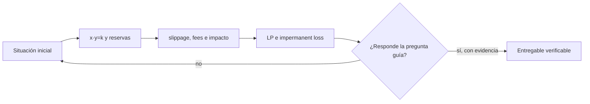

# Clase 39 · AMM, liquidez y formación de precio

> **Clase independiente 39 de 66** · **Nivel:** Profesional · **Fuente base:** documentación de los protocolos citados, investigación del BIS sobre finanzas descentralizadas y literatura académica de microestructura de mercados
>
> [⬅️ Clase anterior](../18-implementacion-empresarial/clase-38-paso-a-produccion-y-operacion.md) · [📚 Índice de las 66 clases](../README.md) · [🗂️ Mapa del tema](README.md) · [➡️ Clase siguiente](../19-defi/clase-40-prestamo-colateral-y-riesgo-defi.md)

## Punto de partida

**Pregunta guía:** ¿Cómo fija precio un pool sin libro de órdenes?

**Caso que abre la clase:** Una orden grande mueve el precio y atrae arbitraje.

Cada swap modifica reservas y precio; el arbitraje se calcula después. Las fórmulas se conectan con quién entrega valor y quién recibe comisiones.

## Fundamentos que sostienen la respuesta

1. **x·y=k y reservas.** En esta clase delimita qué objeto o relación estamos observando antes de sacar conclusiones. Localízalo explícitamente en «Una orden grande mueve el precio y atrae arbitraje.» y anota qué dato faltaría para refutar tu lectura.
2. **slippage, fees e impacto.** En esta clase explica el mecanismo que conecta la situación inicial con el cambio observable. Localízalo explícitamente en «Una orden grande mueve el precio y atrae arbitraje.» y anota qué dato faltaría para refutar tu lectura.
3. **LP e impermanent loss.** En esta clase permite contrastar el resultado y formular el límite de la evidencia. Localízalo explícitamente en «Una orden grande mueve el precio y atrae arbitraje.» y anota qué dato faltaría para refutar tu lectura.

### La ecuación completa, con números

Un pool de producto constante mantiene `x · y = k`. Supongamos reservas de **100 ETH** y
**200 000 USDC**. El producto es `k = 20 000 000`. El precio marginal es el cociente de
reservas: `200 000 / 100 = 2 000 USDC por ETH`.

Compras 1 ETH. La reserva de ETH baja a 99, así que la de USDC debe subir hasta mantener
`k`:

```text
y' = k / x' = 20 000 000 / 99 = 202 020,20 USDC
pagas = 202 020,20 − 200 000 = 2 020,20 USDC
```

Has pagado **2 020,20** por un ETH cuyo precio marcado era 2 000. Ese **1,01 % de
sobrecoste es impacto en precio**, y no es una comisión: es la curva. La comisión del
protocolo (típicamente 0,3 % en pools clásicos, menos en pools estables) se suma encima.

Ahora compra 10 ETH en el mismo pool:

```text
y' = 20 000 000 / 90 = 222 222,22
pagas = 22 222,22 USDC → 2 222,22 por ETH → 11,1 % de sobrecoste
```

**Diez veces el tamaño, once veces el sobrecoste.** El impacto no es lineal, y esa es la
propiedad que define para qué sirve un AMM y para qué no: excelente para operaciones
pequeñas frente a la reserva, pésimo para una operación institucional. La respuesta del
sector —pools concentrados, agregadores que trocean la orden entre varios mercados— no
elimina la curva, la administra.

### Pérdida impermanente: el coste que no aparece en el panel

Depositas 10 ETH y 20 000 USDC (valor total 40 000 USD con ETH a 2 000). El precio de ETH
**se duplica** a 4 000. El pool se reequilibra solo: los arbitrajistas compran ETH barato
del pool hasta que el precio interno iguala al externo.

```text
k = 10 × 20 000 = 200 000
precio nuevo = 4 000 → x' = √(k / 4 000) = √50 = 7,071 ETH
y' = k / x' = 200 000 / 7,071 = 28 284,3 USDC
valor en el pool = 7,071 × 4 000 + 28 284,3 = 56 568,5 USD
valor si no hubieras hecho nada = 10 × 4 000 + 20 000 = 60 000 USD
pérdida impermanente = 3 431,5 USD, un 5,7 %
```

Has ganado dinero **y aun así has perdido** frente a no hacer nada. Las comisiones
cobradas durante el periodo pueden compensarlo o no; esa es exactamente la apuesta que
hace un proveedor de liquidez, y casi nunca se le presenta así. Un panel que anuncia
"APY 24 %" sin restar esto está informando de una pata de la operación.

> 💡 **En una frase:** proveer liquidez no es depositar, es **vender volatilidad**: cobras
> comisiones a cambio de acabar con más del activo que baja y menos del que sube.

## Trabajo práctico

**Método propio:** laboratorio numérico de AMM.

**Actividad:** Calcular swaps, comisiones y pérdida impermanente con escenarios.

Trabaja en entorno local, regtest, signet o testnet según corresponda. Conserva entradas, comandos, salidas y bloque o instante de corte. Una captura aislada no demuestra reproducibilidad.

## Gráfico pedagógico

Recorre el gráfico en voz alta: identifica supuestos, transformaciones y el punto exacto donde aparece evidencia.



## Demostración de aprendizaje

**Entregable:** Hoja reproducible que explique quién gana, quién pierde y por qué.

**Comprobación formativa:** Predice cómo cambia el impacto de precio al duplicar el tamaño de la orden.

Para aprobar debes conectar el hecho observado con el concepto correcto, descartar al menos una interpretación alternativa y redactar una conclusión cuyo alcance no exceda la prueba.

## Errores que esta clase corrige

- Tratar **x·y=k y reservas** como una etiqueta suficiente, sin identificar actores, dato y frontera.
- Usar **slippage, fees e impacto** como explicación aunque el caso no aporte la evidencia necesaria.
- Dar por respondido «¿Cómo fija precio un pool sin libro de órdenes?» sin contrastar **LP e impermanent loss**.

Vuelve al caso inicial, elige el error más peligroso y describe una comprobación concreta que lo detectaría.

## Fuentes para comprobar y ampliar

- BIS — investigación sobre finanzas descentralizadas y su estructura: <https://www.bis.org/>
- Uniswap — documentación del creador de mercado de producto constante: <https://docs.uniswap.org/>
- Aave — documentación de riesgo, LTV, umbrales y liquidaciones: <https://aave.com/docs>
- MakerDAO / Sky — parámetros de colateral y liquidación: <https://docs.makerdao.com/>
- Chainlink — datos de precio y buenas prácticas de consumo: <https://docs.chain.link/>
- OpenZeppelin — contratos base y patrones de seguridad: <https://docs.openzeppelin.com/>

Consulta además la [bibliografía razonada](../../docs/bibliografia.md), que declara procedencia y uso.

## Cierre de la clase

Responde otra vez la pregunta guía sin mirar notas. Si tu respuesta no menciona evidencia, supuesto y límite, todavía describe el tema pero no lo domina. Continúa solo cuando otra persona pueda reproducir tu entregable.
