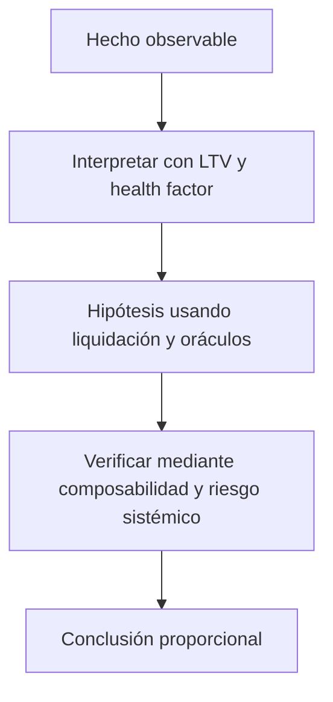

# Clase 40 · Préstamo, colateral y riesgo DeFi

> **Clase independiente 40 de 66** · **Nivel:** Profesional · **Fuente base:** documentación de los protocolos citados, investigación del BIS sobre finanzas descentralizadas y literatura académica de microestructura de mercados
>
> [⬅️ Clase anterior](../19-defi/clase-39-amm-liquidez-y-formacion-de-precio.md) · [📚 Índice de las 66 clases](../README.md) · [🗂️ Mapa del tema](README.md) · [➡️ Clase siguiente](../20-dinero-banca-liquidacion/clase-41-que-es-dinero-bancario.md)

## Punto de partida

**Pregunta guía:** ¿Cómo permanece solvente un mercado sin evaluar personalmente al deudor?

**Caso que abre la clase:** Una caída rápida de precio vuelve insuficiente el colateral antes de liquidar.

Precio, latencia y liquidez cambian durante una caída. El health factor deja de ser un número de tablero y pasa a ser una carrera operacional.

## Trabajo práctico

**Método propio:** simulación de shock y liquidación.

**Actividad:** Simular préstamo, shock y liquidación bajo distintas latencias.

Trabaja en entorno local, regtest, signet o testnet según corresponda. Conserva entradas, comandos, salidas y bloque o instante de corte. Una captura aislada no demuestra reproducibilidad.

## Fundamentos que sostienen la respuesta

1. **LTV y health factor.** En esta clase delimita qué objeto o relación estamos observando antes de sacar conclusiones. Localízalo explícitamente en «Una caída rápida de precio vuelve insuficiente el colateral antes de liquidar.» y anota qué dato faltaría para refutar tu lectura.
2. **liquidación y oráculos.** En esta clase explica el mecanismo que conecta la situación inicial con el cambio observable. Localízalo explícitamente en «Una caída rápida de precio vuelve insuficiente el colateral antes de liquidar.» y anota qué dato faltaría para refutar tu lectura.
3. **composabilidad y riesgo sistémico.** En esta clase permite contrastar el resultado y formular el límite de la evidencia. Localízalo explícitamente en «Una caída rápida de precio vuelve insuficiente el colateral antes de liquidar.» y anota qué dato faltaría para refutar tu lectura.

### Por qué DeFi presta sin saber quién eres

La banca presta contra **capacidad de pago**: analiza ingresos, historial y garantías, y
si el deudor no paga, ejecuta con el sistema judicial detrás. Un contrato no tiene acceso
a nada de eso. Su única palanca es el **colateral que ya tiene en su poder**, y de ahí
salen las tres reglas del préstamo on-chain:

1. **Sobrecolateralizar**: depositas 1 ETH (2 000 USD) para tomar 1 200 USDC. LTV 60 %.
2. **Vigilar continuamente**: el oráculo actualiza el precio del colateral.
3. **Liquidar antes de quedar bajo agua**: con umbral 80 %, el factor de salud es
   `(2 000 × 0,80) / 1 200 = 1,33`. El precio que lo lleva a 1 es
   `1 200 / 0,80 = 1 500 USD`. **Ese número es la única alarma que hay que mirar.**

La bonificación al liquidador (5–10 % del colateral tomado) no es un abuso: es lo que
paga por vigilar el sistema y por asumir el riesgo de precio de deshacer la posición.
Sin ella, nadie liquidaría y el protocolo acumularía deuda incobrable.

**Lo que esto compra y lo que cuesta.** Compra acceso sin permiso ni identidad, y una
ejecución que no depende de que un tribunal funcione. Cuesta **eficiencia de capital**
—hay que inmovilizar más de lo que se toma— y traslada el riesgo a un lugar nuevo: la
**calidad del oráculo**. Un precio manipulado durante un bloque puede liquidar posiciones
sanas o permitir tomar prestado contra colateral inflado. Es el mismo mecanismo que
estudiaste en las [clases 21–22](../10-oraculos-indexacion/README.md), aquí con dinero encima.

<strong>🎓 Si ya dominas esto</strong> — los bordes que solo aparecen en producción

- **La liquidación en cascada es un riesgo sistémico, no individual.** Liquidar vende
  colateral, vender baja el precio, y un precio más bajo hace liquidable a la siguiente
  posición. La densidad de posiciones alrededor de un mismo precio importa tanto como la
  salud media del protocolo.
- **El préstamo relámpago no crea vulnerabilidades: las hace baratas.** Cualquier ataque
  que requiriera capital ahora solo requiere que sea rentable dentro de una transacción.
  La defensa no es prohibirlos, es no depender de precios de un solo bloque ni de saldos
  puntuales para decisiones críticas.
- **La liquidez concentrada convierte al proveedor en creador de mercado activo.** Elegir
  un rango es tomar una posición direccional; fuera del rango dejas de cobrar comisiones y
  quedas íntegramente en el activo perdedor. La pérdida impermanente se amplifica con la
  concentración.
- **Los perpetuos financian su convergencia con la tasa de financiación.** No hay
  vencimiento que fuerce el precio al del subyacente, así que se paga entre largos y
  cortos periódicamente. Esa tasa es un coste de mantener, y en mercados sesgados puede
  superar cualquier rendimiento esperado.
- **El TVL es reflexivo.** Sube cuando sube el precio de los activos depositados, sin que
  entre un dólar nuevo. Usarlo como medida de adopción o de seguridad confunde tamaño con
  solidez: un protocolo con mucho TVL y un `owner` sin timelock es grande y frágil a la vez.

## Gráfico pedagógico

Recorre el gráfico en voz alta: identifica supuestos, transformaciones y el punto exacto donde aparece evidencia.

## Errores que esta clase corrige

- Tratar **LTV y health factor** como una etiqueta suficiente, sin identificar actores, dato y frontera.
- Usar **liquidación y oráculos** como explicación aunque el caso no aporte la evidencia necesaria.
- Dar por respondido «¿Cómo permanece solvente un mercado sin evaluar personalmente al deudor?» sin contrastar **composabilidad y riesgo sistémico**.

Vuelve al caso inicial, elige el error más peligroso y describe una comprobación concreta que lo detectaría.

## Demostración de aprendizaje

**Entregable:** Análisis de riesgo con umbrales, dependencia de oráculo y déficit potencial.

**Comprobación formativa:** ¿En qué escenario una liquidación correcta todavía deja deuda incobrable?

Para aprobar debes conectar el hecho observado con el concepto correcto, descartar al menos una interpretación alternativa y redactar una conclusión cuyo alcance no exceda la prueba.

## Fuentes para comprobar y ampliar

- BIS — investigación sobre finanzas descentralizadas y su estructura: <https://www.bis.org/>
- Uniswap — documentación del creador de mercado de producto constante: <https://docs.uniswap.org/>
- Aave — documentación de riesgo, LTV, umbrales y liquidaciones: <https://aave.com/docs>
- MakerDAO / Sky — parámetros de colateral y liquidación: <https://docs.makerdao.com/>
- Chainlink — datos de precio y buenas prácticas de consumo: <https://docs.chain.link/>
- OpenZeppelin — contratos base y patrones de seguridad: <https://docs.openzeppelin.com/>

Consulta además la [bibliografía razonada](../../docs/bibliografia.md), que declara procedencia y uso.

## Cierre de la clase

Responde otra vez la pregunta guía sin mirar notas. Si tu respuesta no menciona evidencia, supuesto y límite, todavía describe el tema pero no lo domina. Continúa solo cuando otra persona pueda reproducir tu entregable.
