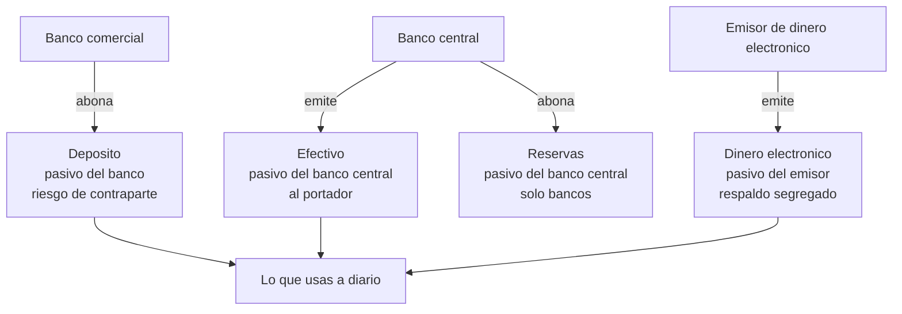
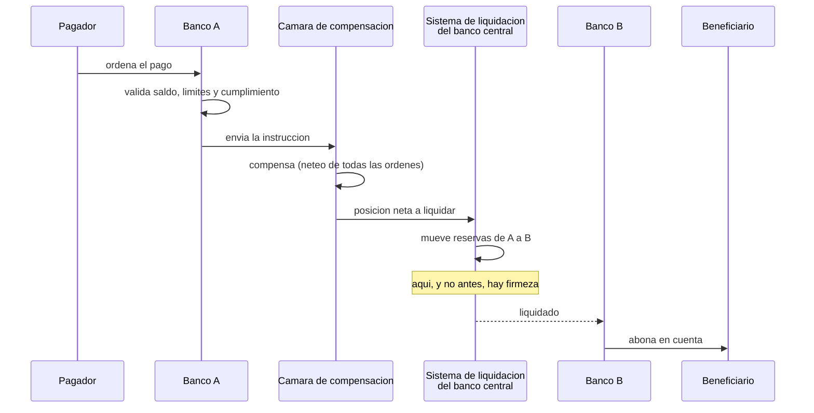

# 20 · Dinero, banca y liquidación

> **Nivel:** Profesional · ⏱️ **Duración estimada:** 180 min · **Fuente:** publicaciones del BIS y del Comité de Pagos e Infraestructuras del Mercado (CPMI), documentación del Banco Central de Chile y del Banco Central Europeo
> [⬅️ Currículo](../README.md) · [📚 Bibliografía](../../docs/bibliografia.md)
> 🧭 ⬅️ **Anterior:** [19 · DeFi: mercados, préstamo y riesgo on-chain](../19-defi/README.md) · [📚 Índice](../README.md) · ➡️ **Siguiente:** [21 · Stablecoins](../21-stablecoins/README.md)
> 📖 [Glosario de términos](../../docs/glosario.md) · 🌱 [¿Nuevo en esto? Empieza aquí](../../docs/empieza-aqui.md)

---

Este es el módulo **bisagra** del programa. Todo lo que viene después —stablecoins,
depósitos tokenizados, MDBC, pagos, tokenización, mercados de capitales— es una respuesta
a problemas que solo se ven si primero entiendes **qué es el dinero que ya usas y cómo se
mueve realmente**.

La pregunta que ordena el módulo no es "¿qué mejora blockchain?" sino la anterior:
**cuando transfieres 50 000 pesos desde tu app del banco, ¿qué se mueve exactamente,
quién te debe qué en cada instante, y en qué momento es irreversible?** Casi nadie que
trabaja en el sector sabe responderla, y sin esa respuesta las comparaciones con
blockchain son eslóganes.

> **Alcance deliberado.** Este módulo enseña banca **solo hasta donde hace falta** para
> entender qué cambia al llevarla a una cadena. No es un curso de finanzas: no cubre
> crédito, contabilidad, riesgo de tasa ni tesorería. Para eso existe literatura
> específica, citada en las referencias.

## 🎯 Objetivos

- Distinguir las cuatro formas de dinero que conviven hoy y quién responde por cada una.
- Describir el circuito completo de un pago: iniciación, compensación, liquidación y firmeza.
- Explicar la creación de dinero bancario y por qué un depósito es un pasivo, no un objeto.
- Diferenciar finalidad técnica, económica y **jurídica**, y por qué la banca solo acepta la tercera.
- Situar el riesgo de contraparte y el riesgo Herstatt en el momento exacto en que aparecen.

## 📚 Resultados de aprendizaje

Al finalizar, el estudiante podrá:

1. **Dibujar** el circuito de un pago nacional identificando quién debe a quién en cada tramo.
2. **Justificar** por qué un depósito bancario y un billete no son la misma cosa aunque valgan lo mismo.
3. **Distinguir** compensación de liquidación y decir en qué momento una transferencia es irrevocable.
4. **Aplicar** las tres acepciones de finalidad a un caso on-chain sin confundirlas.
5. **Explicar** por qué el sector construye sistemas de liquidación bruta en tiempo real pese a su coste en liquidez.
6. **Evaluar** una propuesta de "dinero programable" preguntando primero de quién es el pasivo.

## 🗺️ Temas

| # | Tema | Por qué importa |
|---|------|-----------------|
| 1 | Funciones del dinero y por qué se cumplen mal por separado | Ordena todas las comparaciones posteriores |
| 2 | Las cuatro formas de dinero actuales | Un peso en efectivo y un peso en el banco no son el mismo activo |
| 3 | El depósito como pasivo bancario | Explica el riesgo de contraparte y el pánico bancario |
| 4 | Creación de dinero por el crédito | Desmonta la intuición de que el banco presta lo que guarda |
| 5 | Reservas y dinero de banco central | La única forma de dinero sin riesgo de crédito |
| 6 | Compensación (*clearing*) y liquidación (*settlement*) | Dos cosas distintas que casi todo el mundo mezcla |
| 7 | Neto diferido vs. bruto en tiempo real | El intercambio entre liquidez y riesgo, en su forma pura |
| 8 | Finalidad: técnica, económica y jurídica | La confusión más cara del sector |
| 9 | Riesgo de contraparte, riesgo de liquidación y Herstatt | El problema que DvP y PvP existen para resolver |
| 10 | Dinero programable: qué es y qué no | Prepara los módulos 21 y 22 |

## 🧠 Modelo mental

El dinero no es una cosa: es un **registro de quién debe qué a quién**. Un billete es una
deuda del banco central contigo. Un saldo en tu app es una deuda de tu banco contigo. Una
transferencia no "mueve" nada: **cancela una deuda y crea otra**, en varios libros a la vez.

La analogía útil es un **sistema de pagarés encadenados**. Tu banco te reconoce un pagaré
(tu saldo). Cuando pagas a alguien de otro banco, tu banco debe cancelar contigo y quedar
debiendo al banco del receptor, que a su vez reconoce un pagaré nuevo a su cliente. Y como
los bancos no se fían indefinidamente entre sí, esa deuda intermedia acaba saldándose con
**el único pagaré que nadie discute**: reservas en el banco central.

Límites de la analogía: los pagarés reales tienen vencimiento y estos no; y sobre todo, el
sistema añade una capa que ningún pagaré tiene — **la firmeza jurídica**, el momento
definido por ley a partir del cual el pago no se puede deshacer ni siquiera si el banco
quiebra al minuto siguiente. Esa capa no es tecnológica y ninguna cadena la produce por sí
sola.

## 🧩 Esquema visual

Las cuatro formas de dinero y de quién es el pasivo en cada una:



El circuito real de una transferencia entre dos bancos:



## 📖 Conceptos y definiciones

- **Dinero de banco central**: pasivo del banco central. Efectivo (para todos) y reservas (solo entidades con cuenta). Es el único activo de liquidación **sin riesgo de crédito**.
- **Dinero bancario**: saldo en cuenta. Es un **pasivo del banco comercial** contigo, no un objeto que el banco guarda en una caja. De ahí que su seguridad dependa de la solvencia del banco y de los seguros de depósito.
- **Dinero electrónico**: pasivo de un emisor no bancario, con obligación de respaldo y segregación de fondos. Redimible a la par, pero **no es un depósito** ni suele tener seguro de depósito.
- **Base monetaria**: efectivo en circulación más reservas. **Agregados monetarios**: incluyen además el dinero bancario, que es la mayor parte.
- **Compensación (*clearing*)**: cálculo de cuánto debe cada participante a cada uno, normalmente neteando. **No mueve dinero.**
- **Liquidación (*settlement*)**: la transferencia efectiva del activo de liquidación. **Aquí sí se mueve.**
- **LBTR (liquidación bruta en tiempo real)**: cada orden se liquida individualmente y al instante, en dinero de banco central. Máxima seguridad, máxima necesidad de liquidez.
- **SNLD (neto diferido)**: se netea durante el día y se liquida el saldo al cierre. Mínima liquidez, pero expone a que un participante falle antes de liquidar.
- **Firmeza / finalidad jurídica**: momento definido por norma a partir del cual la orden es irrevocable y oponible a terceros, incluso en concurso del participante.
- **Riesgo de contraparte**: que la otra parte no cumpla. **Riesgo de liquidación**: que entregues tu pata y no recibas la suya.
- **Riesgo Herstatt**: el caso concreto del riesgo de liquidación en divisas por desfase horario. Debe su nombre al banco alemán Herstatt, cerrado en 1974 tras haber recibido marcos sin haber pagado los dólares correspondientes.
- **Dinero programable**: dinero cuya transferencia puede condicionarse a reglas ejecutables. Ojo: **la programabilidad es del vehículo, no del dinero** — condicionar un pago no cambia de quién es el pasivo.

## 🔬 Profundización

### Un depósito no es dinero guardado

La intuición común es que el banco custodia tus billetes. No es así: cuando depositas,
**dejas de ser dueño del efectivo y pasas a ser acreedor del banco**. Tu saldo es una
anotación de una deuda. Por eso puede haber más saldos que billetes, por eso existe el
seguro de depósito y por eso un pánico bancario es posible incluso en un banco solvente:
todos los acreedores reclaman a la vez un pasivo exigible a la vista respaldado por activos
que no lo son.

La otra consecuencia, la que importa aquí: **el dinero bancario se crea prestando**. Cuando
un banco concede un crédito de 10 millones, no busca 10 millones de otro cliente; abona 10
millones en la cuenta del deudor y anota un préstamo por el mismo importe. Aparecen a la
vez un activo y un pasivo nuevos. Lo que limita esa creación no es el efectivo disponible,
sino el capital regulatorio, la liquidez, la demanda de crédito solvente y la política
monetaria. Los bancos centrales de referencia lo han explicado así explícitamente en su
material divulgativo, y entenderlo es indispensable antes de discutir si una stablecoin
"crea dinero".

### Compensar no es liquidar, y la diferencia cuesta dinero

Tres bancos se envían pagos durante el día:

| Par | Importe |
|---|---:|
| A → B | 100 |
| B → A | 80 |
| B → C | 50 |
| C → A | 30 |

**Compensado (neto):** A debe recibir 10 (`−100 + 80 + 30`), B debe pagar 70
(`+100 − 80 − 50`), C debe recibir 60 (`+50 − 30`)… ajustando signos, el sistema mueve **70
unidades** en vez de 260. Una reducción del 73 % en liquidez necesaria.

**Ese ahorro tiene un precio exacto:** entre que se compensa y se liquida, cada
participante está **expuesto** a que otro falle. Si B quiebra a media tarde, los pagos que
A y C dieron por buenos no se liquidarán, y ambos tendrán que deshacer operaciones que ya
habían dado por definitivas frente a sus clientes.

De ahí la existencia de los sistemas **LBTR**: liquidan una a una, al instante, en dinero
de banco central, eliminando ese intervalo. El coste es que cada banco necesita tener
reservas suficientes en todo momento — liquidez inmovilizada que no rinde. **Liquidez
contra riesgo: ese es el intercambio, y no tiene solución óptima, solo elecciones.**
Cuando en el módulo 22 se hable de MDBC mayorista, la pregunta será exactamente esta,
formulada de nuevo.

### Las tres finalidades, y por qué confundirlas es caro

| Acepción | Qué significa | Quién la determina | Ejemplo |
|---|---|---|---|
| **Técnica** | La probabilidad de reversión es despreciable | El protocolo | 12 confirmaciones en PoW |
| **Económica** | Revertir costaría más de lo que se gana | La economía del consenso | Coste de reorganizar contra recompensa |
| **Jurídica** | La ley declara la orden irrevocable y oponible a terceros | El ordenamiento y la norma del sistema de pagos | Firmeza en un sistema designado |

Una transacción con 100 confirmaciones tiene finalidad técnica sobresaliente y, por sí
sola, **ninguna finalidad jurídica**. Si un juez ordena revertir el efecto económico, la
cadena no obedecerá pero el tenedor sí tendrá que responder. A la inversa, una transferencia
bancaria puede ser jurídicamente firme en un sistema cuyo registro técnico es una base de
datos corriente con respaldo en cinta.

Por eso las infraestructuras financieras que exploran DLT **no sustituyen** la norma de
firmeza: la mantienen y la atan al momento en que la cadena registra el asiento. La
tecnología aporta el evento observable; la ley aporta que ese evento signifique algo
frente a un tercero. Confundirlas produce las dos afirmaciones más frecuentes y más falsas
del sector: "en blockchain la liquidación es instantánea y final" y "los sistemas
tradicionales son lentos porque su tecnología es antigua". Lo primero omite la capa
jurídica; lo segundo confunde latencia técnica con ventanas de firmeza, cumplimiento,
horarios de banco central y gestión de liquidez.

### Riesgo Herstatt: el problema que ordena los módulos 23 y 25

Un banco de Fráncfort vende dólares contra marcos a un banco de Nueva York. Paga los marcos
por la mañana, hora europea. Los dólares deben llegar por la tarde, hora de Nueva York.
En 1974, el Bankhaus Herstatt fue cerrado por el supervisor entre ambos momentos: las
contrapartes habían entregado su pata y no recibieron la otra.

Es riesgo de **principal**: no se pierde el margen, se pierde el importe íntegro. La
respuesta del sector fue estructural —mecanismos de **pago contra pago (PvP)** para
divisas y de **entrega contra pago (DvP)** para valores— y es exactamente el problema que
la atomicidad de un contrato inteligente resuelve de forma natural. Ese es, sin
exageración, **el argumento técnico más sólido a favor de la tokenización**, y por eso los
módulos 23 y 25 lo desarrollan con laboratorios ejecutables.

> 💡 **En una frase:** compensar es ponerse de acuerdo en cuánto; liquidar es moverlo; y
> ser firme es que la ley diga que ya no se puede deshacer — tres cosas distintas que solo
> juntas hacen un pago.

<details>
<summary><strong>🎓 Si ya dominas esto</strong> — precisiones que cambian el análisis</summary>

- **La liquidez intradía es un producto, no un detalle.** En un LBTR, los bancos gestionan
  colas, límites bilaterales y facilidades del banco central. Un sistema tokenizado que
  liquida al instante en 24×7 traslada ese problema a las tesorerías, que hoy dependen de
  ventanas horarias para financiarse. "Siempre abierto" no es gratis.
- **El neteo no desaparece con la tokenización, se desplaza.** Liquidar bruto cada
  operación de un mercado activo consume enormes cantidades de activo de liquidación. Los
  diseños serios de mercados tokenizados vuelven a introducir neteo o financiación
  intradía; el debate es dónde ponerlo, no si hace falta.
- **Dinero de banco central tokenizado ≠ stablecoin.** Cambia el emisor y, con él, el
  riesgo de crédito. Toda comparación que empiece por la tecnología y no por el emisor
  está mal planteada desde la primera línea.
- **La irrevocabilidad no es siempre deseable.** El sistema de tarjetas tiene contracargos
  porque el consumidor los necesita. Un pago irreversible traslada el riesgo de fraude
  íntegro al pagador; en pagos minoristas eso es un defecto, no una virtud, y explica por
  qué la irreversibilidad encaja mejor en el mercado mayorista.
- **Los agregados monetarios se ven afectados por dónde viva el respaldo.** Si un emisor
  mantiene sus reservas en depósitos bancarios, el dinero sigue en el sistema bancario; si
  las mantiene en deuda pública a corto o en cuenta del banco central, no. Es una decisión
  con efectos macroeconómicos, no una preferencia operativa.

</details>

## 🧪 Laboratorio guiado

> 🧪 Estas prácticas están catalogadas y **resueltas paso a paso** en el [catálogo de laboratorios](../../labs/CATALOG.md).

1. **Compensación contra liquidación bruta.** Con los cuatro pagos de la profundización,
   calcula a mano: importe total bruto, posiciones netas y liquidez que ahorra el neteo.
   Después responde por escrito: si el participante B falla justo antes de liquidar, ¿qué
   operaciones hay que deshacer y quién asume la pérdida?

2. **El circuito de tu propio pago.** Toma una transferencia real que hayas hecho (sin
   datos personales) y sitúa cada momento: iniciación, validación, envío, compensación,
   liquidación, abono. Marca en qué punto **tú** creíste que el pago era definitivo y en
   qué punto lo fue de verdad. La distancia entre ambos es el aprendizaje del módulo.

3. **Ficha de las cuatro formas de dinero.** Para efectivo, depósito, dinero electrónico y
   reservas, completa: emisor, de quién es el pasivo, quién puede tenerlo, qué pasa si el
   emisor quiebra, y si es programable. Guárdala: los módulos 21 y 22 le añaden tres
   columnas más.

4. Anticipo ejecutable del problema Herstatt, que resolverás en el módulo 23:

```bash
pnpm lab:pvp
```

## 📝 Reto verificable

Redacta un **informe de dos páginas** titulado *"Qué se mueve cuando pago"*, dirigido a un
equipo de ingeniería que va a diseñar un sistema de pagos. Debe contener: el diagrama del
circuito con los pasivos identificados en cada tramo; la distinción compensación /
liquidación / firmeza con el momento exacto de cada una; el cálculo de neteo del
laboratorio 1 con la liquidez ahorrada y el riesgo asumido a cambio; y una sección final
de **una página** que responda, para un caso concreto a elegir, si el problema real es
tecnológico o de firmeza, liquidez o cumplimiento.

**Criterio de aceptación:** ninguna afirmación sobre irreversibilidad mezcla las tres
finalidades; el cálculo de neteo cuadra; y la sección final identifica al menos un
problema que **no** se resuelve cambiando la tecnología de registro.

## ⚠️ Errores frecuentes

| Síntoma | Causa y cómo comprobarlo |
|---------|--------------------------|
| "El banco guarda mi dinero" | Un depósito es un pasivo del banco; revisa el balance de cualquier entidad |
| "Los bancos prestan el dinero de los depositantes" | El crédito crea el depósito; contrasta con material divulgativo de bancos centrales |
| Usar *clearing* y *settlement* como sinónimos | Compensar calcula, liquidar mueve; sitúalos en el diagrama |
| "En blockchain la liquidación es final e instantánea" | Confunde finalidad técnica con jurídica; pregunta qué norma la declara firme |
| "Las transferencias tardan por tecnología antigua" | Confunde latencia con ventanas de firmeza, liquidez y cumplimiento |
| Tratar efectivo, depósito y dinero electrónico como equivalentes | Valen lo mismo, pero el emisor y el riesgo son distintos |
| "Liquidar en tiempo real es siempre mejor" | Elimina riesgo a cambio de inmovilizar liquidez; es un intercambio, no una mejora |
| "El dinero programable es un dinero nuevo" | La programabilidad es del vehículo; el pasivo sigue siendo de alguien |

## 🛡️ Seguridad y ética

- **El riesgo de contraparte no desaparece, se traslada.** Cualquier diseño que afirme
  eliminarlo debe responder a dónde lo movió: a un emisor, a un custodio, a un contrato o
  a un oráculo.
- Al describir sistemas de pago reales, no publiques identificadores, cuentas ni importes
  de terceros. El laboratorio 2 se hace con datos propios y anonimizados.
- Este módulo **no es asesoría financiera ni legal**. Las reglas de firmeza, seguro de
  depósito y supervisión dependen de cada jurisdicción y cambian; consulta siempre la
  norma vigente de la tuya (para Chile, [regulación chilena](../../regulation/chile/README.md)).
- Sé preciso al comunicar: afirmar que una stablecoin "es como tener el dinero en el banco"
  es incorrecto y puede inducir a error a alguien que decide con ese dato.
- La inclusión financiera es un criterio de diseño, no un adorno: un sistema irreversible y
  sin soporte traslada todo el riesgo de error al usuario menos preparado.

## 🔗 Referencias

- BIS — Comité de Pagos e Infraestructuras del Mercado (CPMI), publicaciones sobre sistemas de pago y liquidación: <https://www.bis.org/cpmi/>
- BIS — *Principles for Financial Market Infrastructures* (PFMI), CPMI-IOSCO: <https://www.bis.org/cpmi/publ/d101.htm>
- Banco Central Europeo — explicación del dinero y de TARGET: <https://www.ecb.europa.eu/paym/target/html/index.en.html>
- Banco Central de Chile — sistemas de pago y LBTR: <https://www.bcentral.cl/>
- Banco de Inglaterra — *Money creation in the modern economy* (boletín trimestral): <https://www.bankofengland.co.uk/quarterly-bulletin/2014/q1/money-creation-in-the-modern-economy>
- Módulos relacionados: [19 · DeFi](../19-defi/README.md) · [21 · Stablecoins](../21-stablecoins/README.md) · [23 · Pagos y FX on-chain](../23-pagos-fx-onchain/README.md)

## ✅ Criterio de dominio

- Explicas de quién es el pasivo en cada una de las cuatro formas de dinero.
- Sitúas compensación, liquidación y firmeza en el circuito de un pago concreto.
- Distingues las tres finalidades y detectas cuándo un texto las mezcla.
- Describes el riesgo Herstatt y anticipas por qué DvP y PvP existen.

---

## 🧭 Navegación

⬅️ [Módulo 19 · DeFi](../19-defi/README.md) · [📚 Índice del currículo](../README.md) · ➡️ [Módulo 21 · Stablecoins](../21-stablecoins/README.md)
