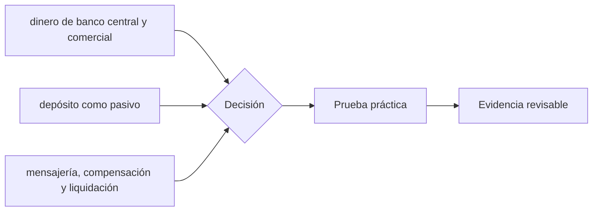

# Clase 41 · Qué es dinero bancario

> **Clase independiente 41 de 66** · **Nivel:** Profesional · **Fuente base:** publicaciones del BIS y del Comité de Pagos e Infraestructuras del Mercado (CPMI), documentación del Banco Central de Chile y del Banco Central Europeo
>
> [⬅️ Clase anterior](../19-defi/clase-40-prestamo-colateral-y-riesgo-defi.md) · [📚 Índice de las 66 clases](../README.md) · [🗂️ Mapa del tema](README.md) · [➡️ Clase siguiente](../20-dinero-banca-liquidacion/clase-42-finalidad-liquidez-y-riesgo-de-liquidacion.md)

## Punto de partida

**Pregunta guía:** Cuando pagas, ¿qué activo se mueve y qué institución te debe?

**Caso que abre la clase:** Una transferencia aparece abonada antes de liquidarse entre bancos.

Cada pago se registra simultáneamente en libros de cliente, bancos y sistema de liquidación. Esto separa el mensaje visible del activo que finalmente cancela obligaciones.

## Gráfico pedagógico

Recorre el gráfico en voz alta: identifica supuestos, transformaciones y el punto exacto donde aparece evidencia.

## Trabajo práctico

**Método propio:** contabilidad con balances enlazados.

**Actividad:** Registrar asientos de pagador, bancos, cámara y receptor.

Trabaja en entorno local, regtest, signet o testnet según corresponda. Conserva entradas, comandos, salidas y bloque o instante de corte. Una captura aislada no demuestra reproducibilidad.

## Fundamentos que sostienen la respuesta

1. **dinero de banco central y comercial.** En esta clase delimita qué objeto o relación estamos observando antes de sacar conclusiones. Localízalo explícitamente en «Una transferencia aparece abonada antes de liquidarse entre bancos.» y anota qué dato faltaría para refutar tu lectura.
2. **depósito como pasivo.** En esta clase explica el mecanismo que conecta la situación inicial con el cambio observable. Localízalo explícitamente en «Una transferencia aparece abonada antes de liquidarse entre bancos.» y anota qué dato faltaría para refutar tu lectura.
3. **mensajería, compensación y liquidación.** En esta clase permite contrastar el resultado y formular el límite de la evidencia. Localízalo explícitamente en «Una transferencia aparece abonada antes de liquidarse entre bancos.» y anota qué dato faltaría para refutar tu lectura.

### Un depósito no es dinero guardado

La intuición común es que el banco custodia tus billetes. No es así: cuando depositas,
**dejas de ser dueño del efectivo y pasas a ser acreedor del banco**. Tu saldo es una
anotación de una deuda. Por eso puede haber más saldos que billetes, por eso existe el
seguro de depósito y por eso un pánico bancario es posible incluso en un banco solvente:
todos los acreedores reclaman a la vez un pasivo exigible a la vista respaldado por activos
que no lo son.

La otra consecuencia, la que importa aquí: **el dinero bancario se crea prestando**. Cuando
un banco concede un crédito de 10 millones, no busca 10 millones de otro cliente; abona 10
millones en la cuenta del deudor y anota un préstamo por el mismo importe. Aparecen a la
vez un activo y un pasivo nuevos. Lo que limita esa creación no es el efectivo disponible,
sino el capital regulatorio, la liquidez, la demanda de crédito solvente y la política
monetaria. Los bancos centrales de referencia lo han explicado así explícitamente en su
material divulgativo, y entenderlo es indispensable antes de discutir si una stablecoin
"crea dinero".

### Compensar no es liquidar, y la diferencia cuesta dinero

Tres bancos se envían pagos durante el día:

| Par | Importe |
|---|---:|
| A → B | 100 |
| B → A | 80 |
| B → C | 50 |
| C → A | 30 |

**Compensado (neto):** A debe recibir 10 (`−100 + 80 + 30`), B debe pagar 70
(`+100 − 80 − 50`), C debe recibir 60 (`+50 − 30`)… ajustando signos, el sistema mueve **70
unidades** en vez de 260. Una reducción del 73 % en liquidez necesaria.

**Ese ahorro tiene un precio exacto:** entre que se compensa y se liquida, cada
participante está **expuesto** a que otro falle. Si B quiebra a media tarde, los pagos que
A y C dieron por buenos no se liquidarán, y ambos tendrán que deshacer operaciones que ya
habían dado por definitivas frente a sus clientes.

De ahí la existencia de los sistemas **LBTR**: liquidan una a una, al instante, en dinero
de banco central, eliminando ese intervalo. El coste es que cada banco necesita tener
reservas suficientes en todo momento — liquidez inmovilizada que no rinde. **Liquidez
contra riesgo: ese es el intercambio, y no tiene solución óptima, solo elecciones.**
Cuando en las clases 45–46 se hable de MDBC mayorista, la pregunta será exactamente esta,
formulada de nuevo.

## Demostración de aprendizaje

**Entregable:** Mapa de balances que distinga mensaje, obligación y activo de liquidación.

**Comprobación formativa:** ¿Qué pasivo disminuye y qué activo se transfiere en cada institución?

Para aprobar debes conectar el hecho observado con el concepto correcto, descartar al menos una interpretación alternativa y redactar una conclusión cuyo alcance no exceda la prueba.

## Errores que esta clase corrige

- Tratar **dinero de banco central y comercial** como una etiqueta suficiente, sin identificar actores, dato y frontera.
- Usar **depósito como pasivo** como explicación aunque el caso no aporte la evidencia necesaria.
- Dar por respondido «Cuando pagas, ¿qué activo se mueve y qué institución te debe?» sin contrastar **mensajería, compensación y liquidación**.

Vuelve al caso inicial, elige el error más peligroso y describe una comprobación concreta que lo detectaría.

## Fuentes para comprobar y ampliar

- BIS — Comité de Pagos e Infraestructuras del Mercado (CPMI), publicaciones sobre sistemas de pago y liquidación: <https://www.bis.org/committees/cpmi/overview>
- BIS — *Principles for Financial Market Infrastructures* (PFMI), CPMI-IOSCO: <https://www.bis.org/cpmi/publ/d101.htm>
- Banco Central Europeo — explicación del dinero y de TARGET: <https://www.ecb.europa.eu/paym/target/html/index.en.html>
- Banco Central de Chile — sistemas de pago y LBTR: <https://www.bcentral.cl/>
- Banco de Inglaterra — *Money creation in the modern economy* (boletín trimestral): <https://www.bankofengland.co.uk/quarterly-bulletin/2014/q1/money-creation-in-the-modern-economy>

Consulta además la [bibliografía razonada](../../docs/bibliografia.md), que declara procedencia y uso.

## Cierre de la clase

Responde otra vez la pregunta guía sin mirar notas. Si tu respuesta no menciona evidencia, supuesto y límite, todavía describe el tema pero no lo domina. Continúa solo cuando otra persona pueda reproducir tu entregable.
