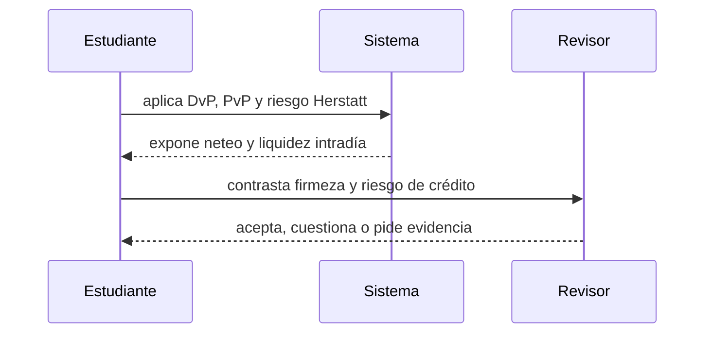

# Clase 42 · Finalidad, liquidez y riesgo de liquidación

> **Clase independiente 42 de 66** · **Nivel:** Profesional · **Fuente base:** publicaciones del BIS y del Comité de Pagos e Infraestructuras del Mercado (CPMI), documentación del Banco Central de Chile y del Banco Central Europeo
>
> [⬅️ Clase anterior](../20-dinero-banca-liquidacion/clase-41-que-es-dinero-bancario.md) · [📚 Índice de las 66 clases](../README.md) · [🗂️ Mapa del tema](README.md) · [➡️ Clase siguiente](../21-stablecoins/clase-43-modelos-de-stablecoin-y-paridad.md)

## Punto de partida

**Pregunta guía:** ¿Cuándo un pago es técnico, económico y jurídicamente final?

**Caso que abre la clase:** Una pata de una operación FX se liquida y la contraparte falla.

La misma operación se procesa de forma bruta, neta y atómica. El grupo calcula exposición y liquidez para entender por qué velocidad y seguridad no son sinónimos.

## Fundamentos que sostienen la respuesta

1. **DvP, PvP y riesgo Herstatt.** En esta clase delimita qué objeto o relación estamos observando antes de sacar conclusiones. Localízalo explícitamente en «Una pata de una operación FX se liquida y la contraparte falla.» y anota qué dato faltaría para refutar tu lectura.
2. **neteo y liquidez intradía.** En esta clase explica el mecanismo que conecta la situación inicial con el cambio observable. Localízalo explícitamente en «Una pata de una operación FX se liquida y la contraparte falla.» y anota qué dato faltaría para refutar tu lectura.
3. **firmeza y riesgo de crédito.** En esta clase permite contrastar el resultado y formular el límite de la evidencia. Localízalo explícitamente en «Una pata de una operación FX se liquida y la contraparte falla.» y anota qué dato faltaría para refutar tu lectura.

### Las tres finalidades, y por qué confundirlas es caro

| Acepción | Qué significa | Quién la determina | Ejemplo |
|---|---|---|---|
| **Técnica** | La probabilidad de reversión es despreciable | El protocolo | 12 confirmaciones en PoW |
| **Económica** | Revertir costaría más de lo que se gana | La economía del consenso | Coste de reorganizar contra recompensa |
| **Jurídica** | La ley declara la orden irrevocable y oponible a terceros | El ordenamiento y la norma del sistema de pagos | Firmeza en un sistema designado |

Una transacción con 100 confirmaciones tiene finalidad técnica sobresaliente y, por sí
sola, **ninguna finalidad jurídica**. Si un juez ordena revertir el efecto económico, la
cadena no obedecerá pero el tenedor sí tendrá que responder. A la inversa, una transferencia
bancaria puede ser jurídicamente firme en un sistema cuyo registro técnico es una base de
datos corriente con respaldo en cinta.

Por eso las infraestructuras financieras que exploran DLT **no sustituyen** la norma de
firmeza: la mantienen y la atan al momento en que la cadena registra el asiento. La
tecnología aporta el evento observable; la ley aporta que ese evento signifique algo
frente a un tercero. Confundirlas produce las dos afirmaciones más frecuentes y más falsas
del sector: "en blockchain la liquidación es instantánea y final" y "los sistemas
tradicionales son lentos porque su tecnología es antigua". Lo primero omite la capa
jurídica; lo segundo confunde latencia técnica con ventanas de firmeza, cumplimiento,
horarios de banco central y gestión de liquidez.

### Riesgo Herstatt: el problema que ordena las clases 47–48 y 51–52

Un banco de Fráncfort vende dólares contra marcos a un banco de Nueva York. Paga los marcos
por la mañana, hora europea. Los dólares deben llegar por la tarde, hora de Nueva York.
En 1974, el Bankhaus Herstatt fue cerrado por el supervisor entre ambos momentos: las
contrapartes habían entregado su pata y no recibieron la otra.

Es riesgo de **principal**: no se pierde el margen, se pierde el importe íntegro. La
respuesta del sector fue estructural —mecanismos de **pago contra pago (PvP)** para
divisas y de **entrega contra pago (DvP)** para valores— y es exactamente el problema que
la atomicidad de un contrato inteligente resuelve de forma natural. Ese es, sin
exageración, **el argumento técnico más sólido a favor de la tokenización**, y por eso los
clases 47–48 y 51–52 lo desarrollan con laboratorios ejecutables.

> 💡 **En una frase:** compensar es ponerse de acuerdo en cuánto; liquidar es moverlo; y
> ser firme es que la ley diga que ya no se puede deshacer — tres cosas distintas que solo
> juntas hacen un pago.

<strong>🎓 Si ya dominas esto</strong> — precisiones que cambian el análisis

- **La liquidez intradía es un producto, no un detalle.** En un LBTR, los bancos gestionan
  colas, límites bilaterales y facilidades del banco central. Un sistema tokenizado que
  liquida al instante en 24×7 traslada ese problema a las tesorerías, que hoy dependen de
  ventanas horarias para financiarse. "Siempre abierto" no es gratis.
- **El neteo no desaparece con la tokenización, se desplaza.** Liquidar bruto cada
  operación de un mercado activo consume enormes cantidades de activo de liquidación. Los
  diseños serios de mercados tokenizados vuelven a introducir neteo o financiación
  intradía; el debate es dónde ponerlo, no si hace falta.
- **Dinero de banco central tokenizado ≠ stablecoin.** Cambia el emisor y, con él, el
  riesgo de crédito. Toda comparación que empiece por la tecnología y no por el emisor
  está mal planteada desde la primera línea.
- **La irrevocabilidad no es siempre deseable.** El sistema de tarjetas tiene contracargos
  porque el consumidor los necesita. Un pago irreversible traslada el riesgo de fraude
  íntegro al pagador; en pagos minoristas eso es un defecto, no una virtud, y explica por
  qué la irreversibilidad encaja mejor en el mercado mayorista.
- **Los agregados monetarios se ven afectados por dónde viva el respaldo.** Si un emisor
  mantiene sus reservas en depósitos bancarios, el dinero sigue en el sistema bancario; si
  las mantiene en deuda pública a corto o en cuenta del banco central, no. Es una decisión
  con efectos macroeconómicos, no una preferencia operativa.

## Gráfico pedagógico

Recorre el gráfico en voz alta: identifica supuestos, transformaciones y el punto exacto donde aparece evidencia.

## Demostración de aprendizaje

**Entregable:** Recomendación que cuantifique exposición y necesidad de liquidez.

**Comprobación formativa:** ¿Qué riesgo elimina PvP y cuál permanece si una contraparte es insolvente antes del intercambio?

Para aprobar debes conectar el hecho observado con el concepto correcto, descartar al menos una interpretación alternativa y redactar una conclusión cuyo alcance no exceda la prueba.

## Trabajo práctico

**Método propio:** comparación cuantitativa de liquidación.

**Actividad:** Comparar liquidación bruta, neta y atómica con cifras.

Trabaja en entorno local, regtest, signet o testnet según corresponda. Conserva entradas, comandos, salidas y bloque o instante de corte. Una captura aislada no demuestra reproducibilidad.

## Errores que esta clase corrige

- Tratar **DvP, PvP y riesgo Herstatt** como una etiqueta suficiente, sin identificar actores, dato y frontera.
- Usar **neteo y liquidez intradía** como explicación aunque el caso no aporte la evidencia necesaria.
- Dar por respondido «¿Cuándo un pago es técnico, económico y jurídicamente final?» sin contrastar **firmeza y riesgo de crédito**.

Vuelve al caso inicial, elige el error más peligroso y describe una comprobación concreta que lo detectaría.

## Fuentes para comprobar y ampliar

- BIS — Comité de Pagos e Infraestructuras del Mercado (CPMI), publicaciones sobre sistemas de pago y liquidación: <https://www.bis.org/cpmi/index.htm>
- BIS — *Principles for Financial Market Infrastructures* (PFMI), CPMI-IOSCO: <https://www.bis.org/cpmi/publ/d101.htm>
- Banco Central Europeo — explicación del dinero y de TARGET: <https://www.ecb.europa.eu/paym/target/html/index.en.html>
- Banco Central de Chile — sistemas de pago y LBTR: <https://www.bcentral.cl/>
- Banco de Inglaterra — *Money creation in the modern economy* (boletín trimestral): <https://www.bankofengland.co.uk/quarterly-bulletin/2014/q1/money-creation-in-the-modern-economy>

Consulta además la [bibliografía razonada](../../docs/bibliografia.md), que declara procedencia y uso.

## Cierre de la clase

Responde otra vez la pregunta guía sin mirar notas. Si tu respuesta no menciona evidencia, supuesto y límite, todavía describe el tema pero no lo domina. Continúa solo cuando otra persona pueda reproducir tu entregable.
