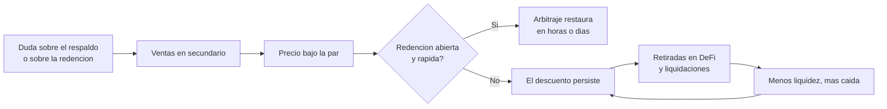

# 21 · Stablecoins

> **Nivel:** Profesional · ⏱️ **Duración estimada:** 180 min · **Fuente:** informes del BIS y del Consejo de Estabilidad Financiera (FSB), Reglamento MiCA de la Unión Europea y documentación pública de los emisores citados
> [⬅️ Currículo](../README.md) · [📚 Bibliografía](../../docs/bibliografia.md)
> 🧭 ⬅️ **Anterior:** [20 · Dinero, banca y liquidación](../20-dinero-banca-liquidacion/README.md) · [📚 Índice](../README.md) · ➡️ **Siguiente:** [22 · Depósitos tokenizados y CBDC/MDBC](../22-deposito-tokenizado-cbdc/README.md)
> 📖 [Glosario de términos](../../docs/glosario.md) · 🌱 [¿Nuevo en esto? Empieza aquí](../../docs/empieza-aqui.md)

---

Una stablecoin es un token que **promete** valer siempre lo mismo. Todo el módulo consiste
en desmontar esa frase: quién promete, con qué respaldo, a quién se le puede exigir, en qué
plazo, y qué pasa exactamente el día en que no puede cumplir.

Con el módulo 20 en la mano ya tienes la pregunta correcta, y no es "¿está respaldada?"
sino **¿de quién es el pasivo y qué derecho tengo yo?** Un token con paridad nominal puede
ser la deuda de una empresa, una posición sobrecolateralizada de un protocolo o un esquema
que se sostiene solo mientras crece. El riesgo de los tres no se parece en nada, aunque
en tu wallet los tres se vean igual.

## 🎯 Objetivos

- Clasificar una stablecoin por respaldo, emisor y mecanismo de estabilización.
- Seguir el ciclo completo de emisión y redención, y decir quién puede ejercerlo.
- Calcular el ratio de colateralización de una posición y el precio que la liquida.
- Explicar la mecánica de un arbitraje que restaura la paridad y las condiciones en que deja de funcionar.
- Analizar un episodio de pérdida de paridad identificando qué control falló y en qué orden.

## 📚 Resultados de aprendizaje

Al finalizar, el estudiante podrá:

1. **Clasificar** cualquier stablecoin en la taxonomía completa justificando cada eje.
2. **Distinguir** redención directa de canje en mercado secundario, y por qué es la diferencia decisiva.
3. **Calcular** colateralización, deuda máxima y precio de liquidación de una posición sobrecolateralizada.
4. **Evaluar** un informe de reservas preguntando por composición, custodio, plazo y tipo de aseguramiento.
5. **Explicar** por qué un diseño puramente algorítmico es reflexivo y qué le ocurre en un mercado a la baja.
6. **Comparar** stablecoin, depósito tokenizado, MDBC y dinero bancario en una tabla de riesgo defendible.

## 🗺️ Temas

| # | Tema | Por qué importa |
|---|------|-----------------|
| 1 | Qué promete una stablecoin y quién promete | La pregunta que ordena todas las demás |
| 2 | Taxonomía por respaldo | Fiat, cripto, materia prima, algorítmica, sintética |
| 3 | Emisión, redención y el privilegio del participante autorizado | Casi nadie puede redimir directamente |
| 4 | Reservas: composición, custodia y plazo | Dónde vive el respaldo determina el riesgo |
| 5 | Atestación vs. auditoría | No son lo mismo y la diferencia es material |
| 6 | Sobrecolateralización y liquidación | El modelo sin emisor centralizado |
| 7 | Paridad, arbitraje y las condiciones que lo sostienen | Por qué el precio vuelve… hasta que no vuelve |
| 8 | Pérdida de paridad: mecánica de un desanclaje | Anatomía de un fallo, paso a paso |
| 9 | Los diez riesgos de una stablecoin | Lista de comprobación, no opinión |
| 10 | Casos de uso reales y sus alternativas | Pagos, remesas, tesorería, liquidación, DeFi |

## 🧠 Modelo mental

Una stablecoin fiat-respaldada es un **vale de guardarropa**. Entregas 100 dólares, te dan
un vale que dice "100 dólares". El vale circula, se endosa, se parte en trozos y se usa
para pagar — y vale 100 mientras todo el mundo crea dos cosas: que el guardarropa **tiene**
los 100 y que **te los devolverá** si vas a pedirlos.

La analogía enseña justo lo que hay que aprender, incluidos sus límites: el vale **no es**
el dinero, es un derecho contra alguien; su valor de mercado puede separarse del nominal
aunque el respaldo esté intacto, si la gente duda de la segunda parte; y si el guardarropa
invirtió los 100 en algo que hoy vale 95 o que no puede vender hoy, la promesa era buena y
aun así no se cumple.

Y un matiz que la analogía no captura: en la mayoría de emisores **tú no puedes ir al
guardarropa**. Solo unos pocos participantes autorizados redimen directamente. El resto
vende su vale a otro en el mercado, a lo que el mercado pague ese día.

## 🧩 Esquema visual

Los tres modelos, con el mecanismo que sostiene la paridad en cada uno:

```mermaid
flowchart TD
    subgraph FIAT["Respaldada por fiat"]
        F1["Usuario entrega 100 USD"] --> F2["Emisor custodia reservas"]
        F2 --> F3["Emite 100 tokens"]
        F3 --> F4["Redencion a la par<br>participantes autorizados"]
        F4 -.->|si el precio baja| F5["Arbitraje: comprar barato<br>y redimir a la par"]
    end
    subgraph CRIPTO["Sobrecolateralizada con cripto"]
        C1["Usuario bloquea 150 USD en ETH"] --> C2["Genera 100 tokens de deuda"]
        C2 --> C3["Oraculo vigila el colateral"]
        C3 --> C4["Liquidacion si cae el ratio"]
        C4 -.->|si el precio baja| C5["Arbitraje: comprar barato<br>y cancelar deuda"]
    end
    subgraph ALGO["Algoritmica"]
        A1["Sin respaldo externo"] --> A2["Emision/quema contra<br>un token volatil propio"]
        A2 --> A3["Depende de demanda creciente"]
        A3 --> A4["En caida: mas emision<br>del token volatil"]
        A4 -.-> A5["Espiral reflexiva"]
    end
```



Anatomía de un desanclaje, en el orden real en que ocurre:



## 📖 Conceptos y definiciones

- **Paridad (*peg*)**: el valor al que la stablecoin pretende mantenerse. **Desanclaje (*depeg*)**: separación sostenida entre el precio de mercado y esa paridad.
- **Respaldada por fiat**: el emisor mantiene reservas en dinero fiduciario o activos líquidos equivalentes. El token es un **pasivo del emisor**.
- **Sobrecolateralizada con cripto**: el usuario bloquea colateral volátil por más valor del que emite. No hay emisor con pasivo: hay posiciones de deuda individuales.
- **Respaldada por materia prima**: derecho sobre un activo físico custodiado (oro, típicamente). Añade riesgo de custodia física y de valoración.
- **Algorítmica**: la estabilidad depende de reglas de emisión/quema contra otro token del mismo sistema, sin respaldo externo. **Reflexiva por diseño.**
- **Sintética**: la paridad se mantiene con una posición cubierta (por ejemplo, activo al contado más corto en derivados). No es "sin riesgo": es riesgo de base, de financiación y de contraparte del mercado de derivados.
- **Emisión (*mint*) / quema (*burn*)**: creación y destrucción de unidades contra entrega o devolución del respaldo.
- **Participante autorizado**: entidad con derecho contractual a emitir y redimir directamente con el emisor. **Es la pieza de la que depende el arbitraje.**
- **Atestación (*attestation*)**: informe de un tercero sobre el saldo de las reservas en una fecha. **Auditoría**: examen con opinión sobre los estados financieros. Una atestación mensual **no** es una auditoría anual.
- **Ratio de colateralización**: valor del colateral dividido por la deuda emitida. **Ratio mínimo**: el umbral bajo el cual la posición se liquida.
- **Módulo de estabilidad de paridad**: mecanismo que permite canjear 1:1 contra otra stablecoin, trasladando el riesgo de la primera a la segunda.

## 🔬 Profundización

### La única pregunta que importa: ¿quién te debe qué?

| Modelo | ¿Hay emisor con pasivo? | ¿Puedes redimir tú? | Riesgo dominante |
|---|---|---|---|
| Fiat-respaldada | Sí, una empresa | Normalmente **no** directamente | Crédito y operativo del emisor; calidad y liquidez de las reservas |
| Sobrecolateralizada | No; hay deudores individuales | Sí, cancelando tu propia deuda | Volatilidad del colateral, oráculo, congestión al liquidar |
| Materia prima | Sí | Con condiciones y a menudo mínimos altos | Custodia física, valoración, entrega |
| Algorítmica | No | No hay a qué | Reflexividad: el respaldo es la propia demanda |
| Sintética | Parcial (protocolo) | Vía el mecanismo del protocolo | Riesgo de base, financiación, contraparte de derivados |

La consecuencia práctica más subestimada está en la segunda columna: **el arbitraje que
sostiene la paridad de una stablecoin fiat no lo puede hacer un usuario normal**. Si el
token cotiza a 0,98 y tú no puedes redimir a 1,00, tu única salida es venderlo a 0,98. El
mecanismo estabilizador depende enteramente de que los participantes autorizados **quieran
y puedan** redimir ese día: si el emisor suspende redenciones, o si el banco del emisor no
opera, el arbitraje se detiene y el descuento se queda.

### Las reservas por dentro: composición, plazo y liquidez

"Respaldada 1:1" no dice casi nada. Dos emisores con el mismo ratio pueden tener riesgos
opuestos según **qué** tengan y **dónde**:

| Composición de la reserva | Riesgo de crédito | Riesgo de liquidez | Riesgo de tipo de interés |
|---|---|---|---|
| Depósitos a la vista en bancos | Del banco (y su seguro de depósito) | Bajo | Nulo |
| Letras del Tesoro a muy corto | Muy bajo | Bajo si hay mercado | Bajo, pero no nulo |
| Pactos de recompra | De la contraparte y del colateral | Depende del plazo | Bajo |
| Papel comercial corporativo | Del emisor del papel | **Alto en tensión** | Medio |
| Otros criptoactivos | Alto | Alto | — |

El caso que hay que entender es el de **marzo de 2023**: un emisor de stablecoin
respaldada por fiat mantenía parte de sus reservas en un banco estadounidense que entró en
resolución. Las reservas existían y estaban íntegras contablemente, pero durante un fin de
semana **no eran accesibles**, y el token cotizó por debajo de la par hasta que se aclaró
el acceso a esos fondos. Lección exacta: la calidad del respaldo incluye **dónde está
depositado y con qué disponibilidad**, no solo cuánto suma. Un riesgo bancario clásico
—exactamente el que estudiaste en el módulo 20— apareció intacto dentro de un instrumento
que se presentaba como ajeno a la banca.

### La cuenta de una posición sobrecolateralizada

Bloqueas **2 ETH** a 2 000 USD (colateral 4 000). El ratio mínimo del sistema es **150 %**.

```text
deuda máxima = 4 000 / 1,50 = 2 666,67 unidades
si emites 2 000:      ratio = 4 000 / 2 000 = 200 %  → holgado
precio de liquidación = (deuda × ratio mínimo) / cantidad de colateral
                      = (2 000 × 1,50) / 2 = 1 500 USD por ETH
```

Con ETH a 1 500 tu posición es liquidable. Si emites el máximo (2 666,67), el precio de
liquidación sube a **2 000**, es decir, el precio actual: la posición nace liquidable ante
el primer movimiento adverso. **Emitir el máximo posible no es agresivo, es inviable**, y
esa es la intuición que el laboratorio fija con números.

La penalización por liquidación (habitualmente 8–13 %) no es un castigo arbitrario: paga al
liquidador por vigilar y por asumir el riesgo de precio mientras deshace el colateral. Y
por eso las liquidaciones se concentran justo cuando el mercado ya está cayendo: es
**procíclico por construcción**, y en un episodio de congestión de red las liquidaciones
pueden ejecutarse tarde y a peor precio del previsto, dejando deuda incobrable en el
sistema. El diseño lo prevé con subastas de deuda y colchones de capital; conviene saber
si el protocolo que analizas los tiene y si se han probado alguna vez.

### Por qué un diseño puramente algorítmico es reflexivo

Un esquema sin respaldo externo estabiliza permitiendo canjear siempre 1 unidad de la
stablecoin por 1 dólar **en su propio token volátil**. Cuando la stablecoin cae por debajo
de la par, el arbitrajista la compra barata, la canjea por token volátil y lo vende. Eso
retira stablecoins del mercado — y **emite token volátil**, presionando su precio a la baja.

Mientras la demanda crece, funciona y parece elegante. En una caída sostenida, cada canje
emite más token volátil, cuyo precio cae, lo que obliga a emitir aún más por cada unidad
canjeada. **El respaldo es la propia confianza en el sistema**, y la retroalimentación es
positiva en la dirección equivocada. El colapso de mayo de 2022 de un esquema de este tipo
—descrito con detalle en su [caso real](../../docs/casos-reales/terra-ust.md)— no fue un
fallo de implementación: fue el mecanismo comportándose exactamente como estaba definido,
en un escenario que el diseño no podía sobrevivir.

> 💡 **En una frase:** la paridad no la sostiene el respaldo, la sostiene **la posibilidad
> real de redimir**; el respaldo solo determina si esa redención puede cumplirse.

<details>
<summary><strong>🎓 Si ya dominas esto</strong> — matices que cambian la conclusión</summary>

- **El módulo de estabilidad de paridad importa riesgo ajeno.** Permitir canje 1:1 contra
  otra stablecoin traslada su riesgo al tuyo: si la otra se desancla, tu sistema absorbe la
  diferencia. Es liquidez comprada con exposición a un tercero.
- **Congelación de saldos: control necesario y punto único de confianza.** Los emisores
  centralizados pueden bloquear direcciones. Es imprescindible para cumplir sanciones y a
  la vez significa que el token **no es resistente a censura**. Ambas cosas son ciertas y
  hay que decirlas juntas.
- **Rendimiento de las reservas y régimen jurídico.** Quién se queda el interés que generan
  las reservas es una decisión de modelo de negocio con implicaciones regulatorias: pagar
  interés al tenedor puede reclasificar el instrumento como depósito o como valor según la
  jurisdicción.
- **Regímenes multi-cadena y respaldo aparente.** El mismo token en varias cadenas puede
  estar respaldado de forma nativa en cada una o depender de un puente. En el segundo caso,
  el riesgo del puente ([módulo 13](../13-interoperabilidad/README.md)) es riesgo del token,
  aunque el emisor sea impecable.
- **La liquidez en cadena no es el respaldo.** Un pool profundo mejora la ejecución pero no
  sustituye a la redención: en tensión, la liquidez es lo primero que se retira, justo
  cuando más se necesita.
- **Bajo MiCA, la mayoría de estos instrumentos son "fichas de dinero electrónico" (EMT) o
  "fichas referenciadas a activos" (ART)**, con obligaciones de reserva, redención a la par
  y autorización. La categoría determina el régimen; ver [módulo 27](../27-regulacion-cumplimiento/README.md).

</details>

## 🧪 Laboratorio guiado

> 🧪 Estas prácticas están catalogadas y **resueltas paso a paso** en el [catálogo de laboratorios](../../labs/CATALOG.md).

1. **Colateral, deuda y precio de liquidación**, con la simulación determinista del repo:

```bash
pnpm lab:peg
```

Debe reproducir el cálculo de la profundización: 2 ETH a 2 000, ratio mínimo 150 %, deuda
2 000 → precio de liquidación exactamente 1 500.

2. **Arbitraje de paridad con y sin redención.** El mismo laboratorio simula un descuento
   del 2 % en dos escenarios: redención abierta y redención suspendida. Compara cuánto
   tarda el precio en volver a la par en cada uno — y comprueba que en el segundo no vuelve.

3. Ejecuta las pruebas del bloque:

```bash
pnpm test
```

4. **Ficha comparativa.** Amplía la tabla de las cuatro formas de dinero del
   [módulo 20](../20-dinero-banca-liquidacion/README.md) con tres columnas: *emisor*,
   *derecho de redención* y *qué pasa si el emisor falla*. Rellénala para: un depósito
   bancario, una stablecoin fiat, una sobrecolateralizada y una algorítmica.

## 📝 Reto verificable

Elige **dos stablecoins reales de modelos distintos** y escribe su **ficha de riesgo
comparada** usando exclusivamente documentación pública del emisor o del protocolo:
clasificación en los tres ejes, mecanismo de emisión y redención con **quién** puede
ejercerla, composición y custodia de reservas (o parámetros de colateral), tipo y frecuencia
del informe de respaldo, los diez riesgos con evidencia observable de cada control, y un
escenario de tensión descrito paso a paso.

**Criterio de aceptación:** cada afirmación cita el documento del emisor o del protocolo,
con fecha de consulta; se distingue explícitamente atestación de auditoría; se identifica
si el usuario final puede redimir o no; y ninguna de las dos se presenta como libre de
riesgo — incluida la que te parezca mejor.

## ⚠️ Errores frecuentes

| Síntoma | Causa y cómo comprobarlo |
|---------|--------------------------|
| "Está respaldada 1:1, no tiene riesgo" | El ratio no dice composición, custodio ni plazo; lee el informe de reservas |
| "Es como tener dólares en el banco" | Es un pasivo de una empresa, sin seguro de depósito; compara emisores |
| Confundir atestación con auditoría | Alcance y opinión distintos; mira quién firma y qué afirma exactamente |
| "El precio volverá a la par solo" | Solo si alguien puede redimir; comprueba si la redención está abierta |
| Emitir la deuda máxima posible | El precio de liquidación queda en el precio actual; recalcula con el laboratorio |
| "Las algorítmicas fallaron por mala implementación" | Falló el mecanismo, no el código; sigue la espiral en el caso real |
| Tratar la liquidez del pool como respaldo | Liquidez ≠ redención; en tensión la liquidez se retira primero |
| "Si es descentralizada nadie puede congelarla" | Depende del token; muchos incorporan lista de bloqueo por obligación legal |

## 🛡️ Seguridad y ética

- **Ninguna stablecoin es libre de riesgo, y el material que lo insinúe es defectuoso.**
  Si construyes producto, publica el modelo de respaldo y el derecho de redención con la
  misma visibilidad que la paridad.
- Los laboratorios son **simulaciones locales**: sin claves, sin fondos, sin red. No hace
  falta comprar una stablecoin para entender su mecánica.
- Cuidado con el material promocional de emisores: es fuente legítima para saber **qué
  afirman**, no para verificar que sea cierto. Contrasta con informes de reservas, normas
  aplicables y análisis de organismos.
- Al comunicar a usuarios no técnicos, explica siempre las tres cosas juntas: qué pasa si
  el emisor quiebra, si puedes redimir tú, y si tus saldos pueden congelarse.
- Nada de este módulo es asesoría financiera. La clasificación jurídica de estos
  instrumentos varía por jurisdicción y cambia; consulta el
  [módulo 27](../27-regulacion-cumplimiento/README.md) y las fuentes oficiales vigentes.

## 🔗 Referencias

- BIS — investigación sobre stablecoins, dinero digital y estabilidad: <https://www.bis.org/>
- FSB — recomendaciones sobre acuerdos globales de stablecoins: <https://www.fsb.org/>
- Reglamento (UE) 2023/1114 (MiCA) — texto consolidado en EUR-Lex: <https://eur-lex.europa.eu/legal-content/ES/TXT/?uri=CELEX%3A32023R1114>
- Circle — informes de reserva de USDC: <https://www.circle.com/transparency>
- Tether — informes de atestación: <https://tether.to/en/transparency/>
- Sky (antes MakerDAO) — documentación de colateral y liquidaciones: <https://docs.makerdao.com/>
- Caso real desarrollado: [Terra/UST · colapso de una stablecoin algorítmica](../../docs/casos-reales/terra-ust.md)

## ✅ Criterio de dominio

- Clasificas cualquier stablecoin en los tres ejes y dices de quién es el pasivo.
- Calculas ratio y precio de liquidación de una posición sobrecolateralizada.
- Explicas por qué el arbitraje sostiene la paridad y en qué condiciones deja de hacerlo.
- Analizas un desanclaje real señalando el control que falló y el orden de los efectos.

---

## 🧭 Navegación

⬅️ [Módulo 20 · Dinero, banca y liquidación](../20-dinero-banca-liquidacion/README.md) · [📚 Índice del currículo](../README.md) · ➡️ [Módulo 22 · Depósitos tokenizados y CBDC/MDBC](../22-deposito-tokenizado-cbdc/README.md)
