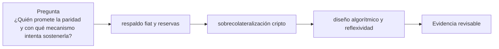

# Clase 43 · Modelos de stablecoin y paridad

> **Clase independiente 43 de 66** · **Nivel:** Profesional · **Fuente base:** informes del BIS y del Consejo de Estabilidad Financiera (FSB), Reglamento MiCA de la Unión Europea y documentación pública de los emisores citados
>
> [⬅️ Clase anterior](../20-dinero-banca-liquidacion/clase-42-finalidad-liquidez-y-riesgo-de-liquidacion.md) · [📚 Índice de las 66 clases](../README.md) · [🗂️ Mapa del tema](README.md) · [➡️ Clase siguiente](../21-stablecoins/clase-44-reservas-redencion-y-riesgo-operacional.md)

## Punto de partida

**Pregunta guía:** ¿Quién promete la paridad y con qué mecanismo intenta sostenerla?

**Caso que abre la clase:** Un activo de reserva pierde liquidez durante una ola de redenciones.

Las stablecoins se clasifican desde el emisor, el derecho y el respaldo, no desde su ticker. Casos con igual precio nominal revelan riesgos radicalmente distintos.

## Fundamentos que sostienen la respuesta

1. **respaldo fiat y reservas.** En esta clase delimita qué objeto o relación estamos observando antes de sacar conclusiones. Localízalo explícitamente en «Un activo de reserva pierde liquidez durante una ola de redenciones.» y anota qué dato faltaría para refutar tu lectura.
2. **sobrecolateralización cripto.** En esta clase explica el mecanismo que conecta la situación inicial con el cambio observable. Localízalo explícitamente en «Un activo de reserva pierde liquidez durante una ola de redenciones.» y anota qué dato faltaría para refutar tu lectura.
3. **diseño algorítmico y reflexividad.** En esta clase permite contrastar el resultado y formular el límite de la evidencia. Localízalo explícitamente en «Un activo de reserva pierde liquidez durante una ola de redenciones.» y anota qué dato faltaría para refutar tu lectura.

### La única pregunta que importa: ¿quién te debe qué?

| Modelo | ¿Hay emisor con pasivo? | ¿Puedes redimir tú? | Riesgo dominante |
|---|---|---|---|
| Fiat-respaldada | Sí, una empresa | Normalmente **no** directamente | Crédito y operativo del emisor; calidad y liquidez de las reservas |
| Sobrecolateralizada | No; hay deudores individuales | Sí, cancelando tu propia deuda | Volatilidad del colateral, oráculo, congestión al liquidar |
| Materia prima | Sí | Con condiciones y a menudo mínimos altos | Custodia física, valoración, entrega |
| Algorítmica | No | No hay a qué | Reflexividad: el respaldo es la propia demanda |
| Sintética | Parcial (protocolo) | Vía el mecanismo del protocolo | Riesgo de base, financiación, contraparte de derivados |

La consecuencia práctica más subestimada está en la segunda columna: **el arbitraje que
sostiene la paridad de una stablecoin fiat no lo puede hacer un usuario normal**. Si el
token cotiza a 0,98 y tú no puedes redimir a 1,00, tu única salida es venderlo a 0,98. El
mecanismo estabilizador depende enteramente de que los participantes autorizados **quieran
y puedan** redimir ese día: si el emisor suspende redenciones, o si el banco del emisor no
opera, el arbitraje se detiene y el descuento se queda.

### Por qué un diseño puramente algorítmico es reflexivo

Un esquema sin respaldo externo estabiliza permitiendo canjear siempre 1 unidad de la
stablecoin por 1 dólar **en su propio token volátil**. Cuando la stablecoin cae por debajo
de la par, el arbitrajista la compra barata, la canjea por token volátil y lo vende. Eso
retira stablecoins del mercado — y **emite token volátil**, presionando su precio a la baja.

Mientras la demanda crece, funciona y parece elegante. En una caída sostenida, cada canje
emite más token volátil, cuyo precio cae, lo que obliga a emitir aún más por cada unidad
canjeada. **El respaldo es la propia confianza en el sistema**, y la retroalimentación es
positiva en la dirección equivocada. El colapso de mayo de 2022 de un esquema de este tipo
—descrito con detalle en su [caso real](../../docs/casos-reales/terra-ust.md)— no fue un
fallo de implementación: fue el mecanismo comportándose exactamente como estaba definido,
en un escenario que el diseño no podía sobrevivir.

> 💡 **En una frase:** la paridad no la sostiene el respaldo, la sostiene **la posibilidad
> real de redimir**; el respaldo solo determina si esa redención puede cumplirse.

<strong>🎓 Si ya dominas esto</strong> — matices que cambian la conclusión

- **El mecanismo de estabilidad de paridad importa riesgo ajeno.** Permitir canje 1:1 contra
  otra stablecoin traslada su riesgo al tuyo: si la otra se desancla, tu sistema absorbe la
  diferencia. Es liquidez comprada con exposición a un tercero.
- **Congelación de saldos: control necesario y punto único de confianza.** Los emisores
  centralizados pueden bloquear direcciones. Es imprescindible para cumplir sanciones y a
  la vez significa que el token **no es resistente a censura**. Ambas cosas son ciertas y
  hay que decirlas juntas.
- **Rendimiento de las reservas y régimen jurídico.** Quién se queda el interés que generan
  las reservas es una decisión de modelo de negocio con implicaciones regulatorias: pagar
  interés al tenedor puede reclasificar el instrumento como depósito o como valor según la
  jurisdicción.
- **Regímenes multi-cadena y respaldo aparente.** El mismo token en varias cadenas puede
  estar respaldado de forma nativa en cada una o depender de un puente. En el segundo caso,
  el riesgo del puente ([clases 27–28](../13-interoperabilidad/README.md)) es riesgo del token,
  aunque el emisor sea impecable.
- **La liquidez en cadena no es el respaldo.** Un pool profundo mejora la ejecución pero no
  sustituye a la redención: en tensión, la liquidez es lo primero que se retira, justo
  cuando más se necesita.
- **Bajo MiCA, la mayoría de estos instrumentos son "fichas de dinero electrónico" (EMT) o
  "fichas referenciadas a activos" (ART)**, con obligaciones de reserva, redención a la par
  y autorización. La categoría determina el régimen; ver [clases 55–56](../27-regulacion-cumplimiento/README.md).

## Gráfico pedagógico

Recorre el gráfico en voz alta: identifica supuestos, transformaciones y el punto exacto donde aparece evidencia.

## Trabajo práctico

**Método propio:** taxonomía por promesa y mecanismo.

**Actividad:** Clasificar stablecoins por emisor, activo, derecho y estabilización.

Trabaja en entorno local, regtest, signet o testnet según corresponda. Conserva entradas, comandos, salidas y bloque o instante de corte. Una captura aislada no demuestra reproducibilidad.

## Demostración de aprendizaje

**Entregable:** Ficha comparativa que separe precio observado de capacidad de redención.

**Comprobación formativa:** Explica quién absorbe la pérdida si el activo de reserva vale menos que el pasivo.

Para aprobar debes conectar el hecho observado con el concepto correcto, descartar al menos una interpretación alternativa y redactar una conclusión cuyo alcance no exceda la prueba.

## Errores que esta clase corrige

- Tratar **respaldo fiat y reservas** como una etiqueta suficiente, sin identificar actores, dato y frontera.
- Usar **sobrecolateralización cripto** como explicación aunque el caso no aporte la evidencia necesaria.
- Dar por respondido «¿Quién promete la paridad y con qué mecanismo intenta sostenerla?» sin contrastar **diseño algorítmico y reflexividad**.

Vuelve al caso inicial, elige el error más peligroso y describe una comprobación concreta que lo detectaría.

## Fuentes para comprobar y ampliar

- Comité de Basilea — enmiendas al estándar de exposiciones a criptoactivos, reservas y redención: <https://www.bis.org/bcbs/publ/d567.pdf>
- BIS Working Paper 1164 — información pública y corridas de stablecoins: <https://www.bis.org/publ/work1164.htm>
- FSB — recomendaciones sobre acuerdos globales de stablecoins: <https://www.fsb.org/>
- Reglamento (UE) 2023/1114 (MiCA) — texto consolidado en EUR-Lex: <https://eur-lex.europa.eu/legal-content/ES/TXT/?uri=CELEX%3A32023R1114>
- Circle — informes de reserva de USDC: <https://www.circle.com/transparency>
- Tether — informes de atestación: <https://tether.to/en/transparency/>
- Sky (antes MakerDAO) — documentación de colateral y liquidaciones: <https://docs.makerdao.com/>

Consulta además la [bibliografía razonada](../../docs/bibliografia.md), que declara procedencia y uso.

## Cierre de la clase

Responde otra vez la pregunta guía sin mirar notas. Si tu respuesta no menciona evidencia, supuesto y límite, todavía describe el tema pero no lo domina. Continúa solo cuando otra persona pueda reproducir tu entregable.
