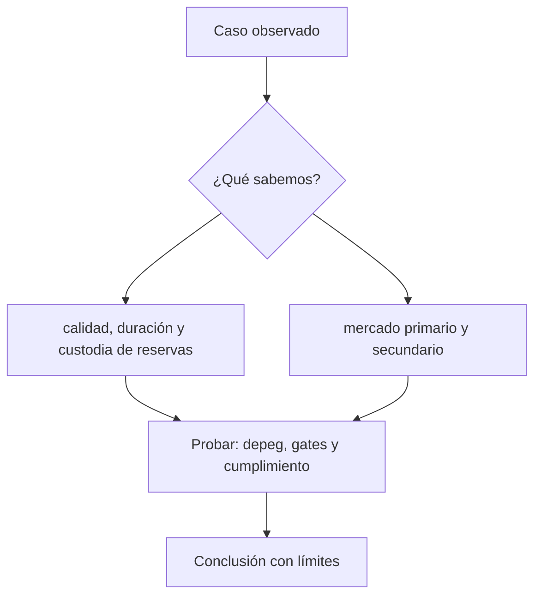

# Clase 44 · Reservas, redención y riesgo operacional

> **Clase independiente 44 de 66** · **Nivel:** Profesional · **Fuente base:** informes del BIS y del Consejo de Estabilidad Financiera (FSB), Reglamento MiCA de la Unión Europea y documentación pública de los emisores citados
>
> [⬅️ Clase anterior](../21-stablecoins/clase-43-modelos-de-stablecoin-y-paridad.md) · [📚 Índice de las 66 clases](../README.md) · [🗂️ Mapa del tema](README.md) · [➡️ Clase siguiente](../22-deposito-tokenizado-cbdc/clase-45-depositos-tokenizados.md)

## Punto de partida

**Pregunta guía:** ¿Puede el tenedor convertir el token en dinero y bajo qué condiciones?

**Caso que abre la clase:** El precio vuelve a uno mientras la redención directa sigue cerrada.

Mercado primario, secundario, bancos y blockchain reaccionan a retiros crecientes. El precio se interpreta junto con acceso real a la redención.

## Gráfico pedagógico

Recorre el gráfico en voz alta: identifica supuestos, transformaciones y el punto exacto donde aparece evidencia.



## Fundamentos que sostienen la respuesta

1. **calidad, duración y custodia de reservas.** En esta clase delimita qué objeto o relación estamos observando antes de sacar conclusiones. Localízalo explícitamente en «El precio vuelve a uno mientras la redención directa sigue cerrada.» y anota qué dato faltaría para refutar tu lectura.
2. **mercado primario y secundario.** En esta clase explica el mecanismo que conecta la situación inicial con el cambio observable. Localízalo explícitamente en «El precio vuelve a uno mientras la redención directa sigue cerrada.» y anota qué dato faltaría para refutar tu lectura.
3. **depeg, gates y cumplimiento.** En esta clase permite contrastar el resultado y formular el límite de la evidencia. Localízalo explícitamente en «El precio vuelve a uno mientras la redención directa sigue cerrada.» y anota qué dato faltaría para refutar tu lectura.

### Las reservas por dentro: composición, plazo y liquidez

"Respaldada 1:1" no dice casi nada. Dos emisores con el mismo ratio pueden tener riesgos
opuestos según **qué** tengan y **dónde**:

| Composición de la reserva | Riesgo de crédito | Riesgo de liquidez | Riesgo de tipo de interés |
|---|---|---|---|
| Depósitos a la vista en bancos | Del banco (y su seguro de depósito) | Bajo | Nulo |
| Letras del Tesoro a muy corto | Muy bajo | Bajo si hay mercado | Bajo, pero no nulo |
| Pactos de recompra | De la contraparte y del colateral | Depende del plazo | Bajo |
| Papel comercial corporativo | Del emisor del papel | **Alto en tensión** | Medio |
| Otros criptoactivos | Alto | Alto | — |

El caso que hay que entender es el de **marzo de 2023**: un emisor de stablecoin
respaldada por fiat mantenía parte de sus reservas en un banco estadounidense que entró en
resolución. Las reservas existían y estaban íntegras contablemente, pero durante un fin de
semana **no eran accesibles**, y el token cotizó por debajo de la par hasta que se aclaró
el acceso a esos fondos. Lección exacta: la calidad del respaldo incluye **dónde está
depositado y con qué disponibilidad**, no solo cuánto suma. Un riesgo bancario clásico
—exactamente el que estudiaste en las clases 41–42— apareció intacto dentro de un instrumento
que se presentaba como ajeno a la banca.

### La cuenta de una posición sobrecolateralizada

Bloqueas **2 ETH** a 2 000 USD (colateral 4 000). El ratio mínimo del sistema es **150 %**.

```text
deuda máxima = 4 000 / 1,50 = 2 666,67 unidades
si emites 2 000:      ratio = 4 000 / 2 000 = 200 %  → holgado
precio de liquidación = (deuda × ratio mínimo) / cantidad de colateral
                      = (2 000 × 1,50) / 2 = 1 500 USD por ETH
```

Con ETH a 1 500 tu posición es liquidable. Si emites el máximo (2 666,67), el precio de
liquidación sube a **2 000**, es decir, el precio actual: la posición nace liquidable ante
el primer movimiento adverso. **Emitir el máximo posible no es agresivo, es inviable**, y
esa es la intuición que el laboratorio fija con números.

La penalización por liquidación (habitualmente 8–13 %) no es un castigo arbitrario: paga al
liquidador por vigilar y por asumir el riesgo de precio mientras deshace el colateral. Y
por eso las liquidaciones se concentran justo cuando el mercado ya está cayendo: es
**procíclico por construcción**, y en un episodio de congestión de red las liquidaciones
pueden ejecutarse tarde y a peor precio del previsto, dejando deuda incobrable en el
sistema. El diseño lo prevé con subastas de deuda y colchones de capital; conviene saber
si el protocolo que analizas los tiene y si se han probado alguna vez.

## Trabajo práctico

**Método propio:** simulacro de corrida y redención.

**Actividad:** Trazar emisión y redención incluyendo bancos, custodios y blockchains.

Trabaja en entorno local, regtest, signet o testnet según corresponda. Conserva entradas, comandos, salidas y bloque o instante de corte. Una captura aislada no demuestra reproducibilidad.

## Errores que esta clase corrige

- Tratar **calidad, duración y custodia de reservas** como una etiqueta suficiente, sin identificar actores, dato y frontera.
- Usar **mercado primario y secundario** como explicación aunque el caso no aporte la evidencia necesaria.
- Dar por respondido «¿Puede el tenedor convertir el token en dinero y bajo qué condiciones?» sin contrastar **depeg, gates y cumplimiento**.

Vuelve al caso inicial, elige el error más peligroso y describe una comprobación concreta que lo detectaría.

## Demostración de aprendizaje

**Entregable:** Mapa de riesgos con evidencia pública y preguntas no resueltas.

**Comprobación formativa:** ¿Puede existir paridad de mercado sin redención directa y qué la sostiene?

Para aprobar debes conectar el hecho observado con el concepto correcto, descartar al menos una interpretación alternativa y redactar una conclusión cuyo alcance no exceda la prueba.

## Fuentes para comprobar y ampliar

- Comité de Basilea — enmiendas al estándar de exposiciones a criptoactivos, reservas y redención: <https://www.bis.org/bcbs/publ/d567.pdf>
- BIS Working Paper 1164 — información pública y corridas de stablecoins: <https://www.bis.org/publ/work1164.htm>
- FSB — recomendaciones sobre acuerdos globales de stablecoins: <https://www.fsb.org/>
- Reglamento (UE) 2023/1114 (MiCA) — texto consolidado en EUR-Lex: <https://eur-lex.europa.eu/legal-content/ES/TXT/?uri=CELEX%3A32023R1114>
- Circle — informes de reserva de USDC: <https://www.circle.com/transparency>
- Tether — informes de atestación: <https://tether.to/en/transparency/>
- Sky (antes MakerDAO) — documentación de colateral y liquidaciones: <https://docs.makerdao.com/>

Consulta además la [bibliografía razonada](../../docs/bibliografia.md), que declara procedencia y uso.

## Cierre de la clase

Responde otra vez la pregunta guía sin mirar notas. Si tu respuesta no menciona evidencia, supuesto y límite, todavía describe el tema pero no lo domina. Continúa solo cuando otra persona pueda reproducir tu entregable.
