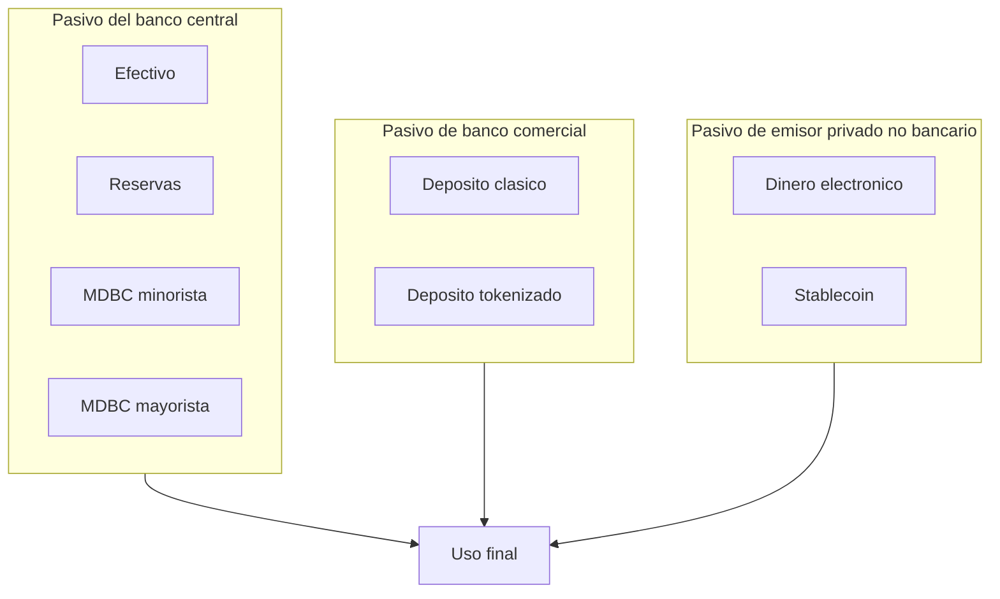
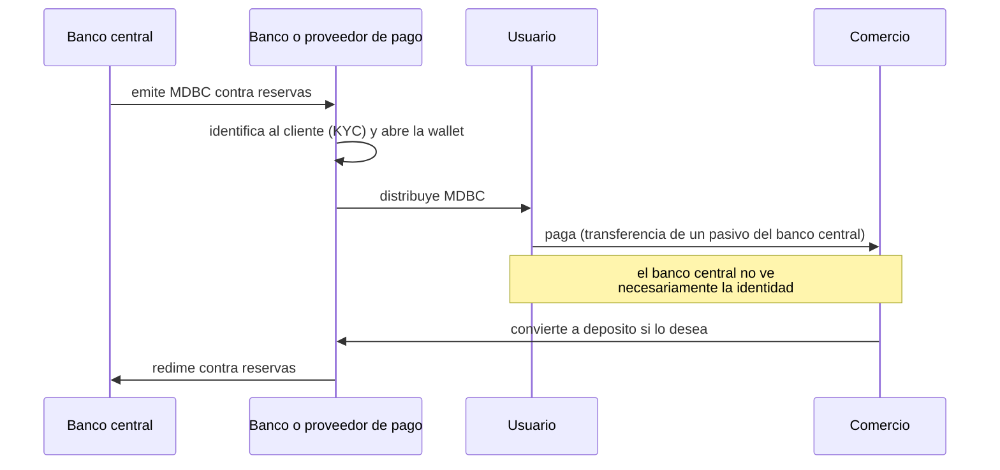

# 22 · Depósitos tokenizados y CBDC/MDBC

> **Nivel:** Profesional · ⏱️ **Duración estimada:** 180 min · **Fuente:** BIS Innovation Hub y CPMI, informes del Banco Central de Chile, Banco Central Europeo y demás bancos centrales citados
> [⬅️ Currículo](../README.md) · [📚 Bibliografía](../../docs/bibliografia.md)
> 🧭 ⬅️ **Anterior:** [21 · Stablecoins](../21-stablecoins/README.md) · [📚 Índice](../README.md) · ➡️ **Siguiente:** [23 · Pagos, cross-border y FX on-chain](../23-pagos-fx-onchain/README.md)
> 📖 [Glosario de términos](../../docs/glosario.md) · 🌱 [¿Nuevo en esto? Empieza aquí](../../docs/empieza-aqui.md)

---

Si una stablecoin es el pasivo de una empresa, quedan dos posibilidades que el módulo 20
ya te preparó: que el pasivo sea **de un banco comercial** (depósito tokenizado) o **del
banco central** (moneda digital de banco central: CBDC, o **MDBC** en la terminología que
usa Chile).

No son variantes de lo mismo. Cambian el emisor, el riesgo de crédito, quién puede
tenerlas, qué privacidad ofrecen y qué le hacen al sistema bancario. Este módulo las separa
con precisión y termina con el caso chileno, que está documentado y en análisis abierto —
no cerrado, y así hay que estudiarlo.

## 🎯 Objetivos

- Definir depósito tokenizado y distinguirlo de una stablecoin y de una MDBC por emisor y riesgo.
- Diferenciar MDBC minorista de mayorista, y modelos basados en cuenta de los basados en token.
- Explicar el modelo de intermediación de dos niveles y por qué casi todos los diseños lo adoptan.
- Analizar las tres tensiones estructurales de una MDBC: privacidad, desintermediación y resiliencia.
- Situar el estado del análisis de la MDBC en Chile con fuentes oficiales y sin darlo por decidido.

## 📚 Resultados de aprendizaje

Al finalizar, el estudiante podrá:

1. **Completar** la tabla comparativa de las siete formas de dinero digital sin confundir emisores.
2. **Explicar** por qué un depósito tokenizado mantiene la singularidad del dinero y una stablecoin no necesariamente.
3. **Justificar** por qué el diseño de dos niveles reduce el riesgo de desintermediación bancaria.
4. **Describir** los mecanismos técnicos de pago sin conexión y sus límites de seguridad.
5. **Evaluar** un diseño de MDBC preguntando por privacidad, límites de tenencia y resiliencia.
6. **Citar** correctamente el estado del trabajo del Banco Central de Chile sin presentar análisis como decisión.

## 🗺️ Temas

| # | Tema | Por qué importa |
|---|------|-----------------|
| 1 | Depósito tokenizado: qué es y qué no cambia | El pasivo bancario sigue siendo el mismo |
| 2 | Singularidad del dinero | Por qué un peso debe valer un peso en cualquier banco |
| 3 | Depósitos programables y mayoristas | Dónde aporta valor real hoy |
| 4 | MDBC minorista vs. mayorista | Dos productos distintos con el mismo nombre |
| 5 | Cuenta vs. token, y modelo de dos niveles | Cómo se distribuye sin desbancarizar |
| 6 | Privacidad y trazabilidad | La tensión más política del diseño |
| 7 | Desintermediación y límites de tenencia | El riesgo macro que ordena el resto |
| 8 | Resiliencia y pagos sin conexión | El argumento menos discutido y más sólido |
| 9 | Interoperabilidad y liquidación mayorista | Dónde se cruza con los módulos 23 y 25 |
| 10 | El caso de Chile: MDBC en análisis | Estado documentado, no conclusión |

## 🧠 Modelo mental

Piensa en **tres capas de un mismo edificio**. En la planta baja está el dinero del banco
central: nadie discute su valor porque no depende de la solvencia de nadie. En la primera
planta, los bancos comerciales emiten sus propios pasivos —tus depósitos— y los mantienen
canjeables a la par entre sí porque en la planta baja se saldan entre ellos. En la segunda
planta viven emisores privados de dinero electrónico y stablecoins.

Tokenizar **no cambia de planta a nadie**. Un depósito tokenizado sigue siendo un pasivo
del banco de la primera planta; una MDBC sigue siendo un pasivo del banco central de la
planta baja. Lo que cambia es **la fontanería**: cómo se transfiere, con qué reglas
ejecutables y con qué horario.

Límite de la analogía, y es el que más se olvida: la fontanería nueva puede alterar cuánta
gente quiere vivir en cada planta. Si la MDBC minorista fuese demasiado atractiva, los
depósitos se irían a la planta baja y los bancos perderían su fuente de financiación. Por
eso casi todos los diseños incorporan **frenos deliberados** —límites de tenencia,
remuneración nula— que no son limitaciones técnicas sino decisiones de política.

## 🧩 Esquema visual

Las siete formas de dinero, ordenadas por emisor:



Modelo de dos niveles: el banco central emite, el sector privado distribuye:



## 📖 Conceptos y definiciones

- **Depósito tokenizado**: representación en un registro distribuido de un depósito bancario existente. Sigue siendo un **pasivo del banco emisor**, con el mismo régimen, seguro de depósito y supervisión que el depósito clásico.
- **Singularidad del dinero**: propiedad por la que un peso vale un peso con independencia de en qué banco esté. La sostienen la convertibilidad a la par y la liquidación en dinero de banco central.
- **MDBC / CBDC**: moneda digital de banco central. Pasivo del banco central en formato digital, distinta de las reservas por su alcance o su tecnología.
- **MDBC minorista**: accesible al público general. Sustituto digital del efectivo.
- **MDBC mayorista**: accesible solo a entidades con cuenta en el banco central. Su uso natural es liquidar operaciones grandes, incluida la pata de dinero de una entrega contra pago.
- **Basado en cuenta**: la titularidad se verifica identificando al titular. **Basado en token**: se verifica validando el objeto que se transfiere. La distinción determina el modelo de privacidad y el de recuperación ante pérdida.
- **Modelo de dos niveles**: el banco central emite y liquida; los intermediarios privados distribuyen, identifican clientes y dan servicio.
- **Límite de tenencia**: tope de MDBC que una persona puede mantener. Freno explícito a la fuga de depósitos.
- **Pago sin conexión**: transferencia entre dispositivos sin red, con saldo en elemento seguro y límites de importe y de número de operaciones consecutivas.
- **Programabilidad**: capacidad de condicionar transferencias a reglas. Conviene distinguir **dinero programable** (la regla vive en el dinero, con riesgo de restringir su uso) de **pagos programables** (la regla vive en la aplicación, y el dinero sigue siendo fungible).

## 🔬 Profundización

### Depósito tokenizado: lo que cambia y lo que expresamente no

Lo que **no** cambia: quién debe (tu banco), el régimen jurídico del depósito, el seguro de
depósito donde exista, la supervisión prudencial y las obligaciones de prevención de
lavado. Un depósito tokenizado no es un instrumento nuevo: es el mismo instrumento con otro
mecanismo de transferencia.

Lo que **sí** cambia, y es sustancial:

1. **Liquidación programable y atómica.** El depósito puede entregarse dentro de la misma
   transacción que entrega un valor tokenizado, resolviendo el problema de entrega contra
   pago del [módulo 20](../20-dinero-banca-liquidacion/README.md) sin cámara intermedia.
2. **Horario.** Puede operar 24×7, frente a las ventanas de los sistemas de liquidación.
   Con la contrapartida que ya conoces: la tesorería también tiene que estar disponible 24×7.
3. **Composabilidad con lógica de negocio.** Pagos condicionados a la entrega, a un hito o
   a una verificación, ejecutados sin conciliación posterior.

Y una diferencia decisiva frente a la stablecoin: **la singularidad del dinero**. Los
depósitos tokenizados de dos bancos distintos se mantienen canjeables a la par porque los
bancos se liquidan entre sí en dinero de banco central, exactamente como hoy. Dos
stablecoins de dos emisores distintos **no tienen nada que garantice esa paridad entre
ellas**; cotizan una contra otra en el mercado. Ese es el argumento técnico central por el
que los bancos centrales miran con mejores ojos el depósito tokenizado que la stablecoin
para pagos mayoristas — y conviene entenderlo como argumento, no como preferencia
corporativa.

### Las tres tensiones de una MDBC minorista

**Privacidad.** El efectivo es anónimo en el sentido de que la transacción no deja rastro
en un sistema. Una MDBC deja rastro por construcción. Los diseños serios buscan
*privacidad graduada*: anonimato práctico en importes pequeños, identificación creciente en
importes altos, y que el banco central **no** vea la identidad porque quien identifica es el
intermediario. Sigue siendo una decisión política, no técnica: la tecnología puede
implementar casi cualquier punto del espectro, y la pregunta de dónde ponerlo no la
responde la criptografía.

**Desintermediación.** Si mañana pudieras mover todo tu depósito a un pasivo del banco
central sin riesgo de crédito, ¿por qué dejarías dinero en el banco? Y sobre todo: en una
crisis de confianza, ¿qué evita que todo el mundo lo haga a la vez, convirtiendo un pánico
bancario en un clic? Respuestas de diseño: **límites de tenencia**, **remuneración cero o
negativa** por encima de un umbral, y **conversión automática** del exceso a depósito. Son
frenos deliberados; un diseño de MDBC sin ellos es un diseño incompleto.

**Resiliencia y sin conexión.** Este es el argumento más sólido y el menos discutido. El
efectivo funciona en un apagón; una tarjeta no. Una MDBC con pagos sin conexión —saldo en
un elemento seguro del dispositivo, transferencia por proximidad, límite de importe y de
operaciones consecutivas antes de exigir reconexión— reintroduce esa propiedad en el mundo
digital. El coste es aceptar una ventana de riesgo de doble gasto acotada por diseño: se
limita **cuánto** se puede perder, no se elimina la posibilidad. La mayoría de proyectos
piloto que han publicado resultados lo plantean exactamente así.

### Mayorista: donde el consenso es mayor y el impacto también

La MDBC **mayorista** genera mucho menos debate público y bastante más consenso técnico,
porque no toca la relación del ciudadano con su banco. Su uso natural es lo que ya viste en
el módulo 20: liquidar la pata de dinero de una operación en el activo más seguro que
existe, ahora dentro de la misma transacción que entrega el activo.

El BIS Innovation Hub y varios bancos centrales han desarrollado experimentos públicos en
esta línea —liquidación mayorista con DLT, pagos transfronterizos multi-MDBC y unificación
de dinero de banco central, depósitos tokenizados y valores tokenizados en una misma
infraestructura—. Son **experimentos y pruebas de concepto documentadas**, no
infraestructuras en producción generalizada, y así deben citarse. Sus informes son la mejor
fuente disponible sobre qué funciona y qué no, y están publicados en abierto.

### Chile: MDBC en análisis

El **Banco Central de Chile** ha trabajado públicamente sobre la emisión de una **Moneda
Digital de Banco Central (MDBC)**, publicando un informe preliminar y manteniendo el asunto
en estudio, con consulta al público y análisis de opciones de diseño. La forma correcta de
citarlo —y la que este programa exige— es:

> El Banco Central de Chile **ha analizado** la eventual emisión de una MDBC y ha publicado
> documentos sobre ello. **No** se ha adoptado una decisión de emitir, ni existe una MDBC
> chilena en circulación. Consulta el estado vigente en <https://www.bcentral.cl/>.

Presentar ese análisis como una decisión tomada, o describir características de "la MDBC
chilena" como si existiera, es exactamente el tipo de afirmación que este programa prohíbe.
El [laboratorio de mercado tokenizado](../../labs/22-cbdc-mercado-tokenizado/README.md) que
acompaña al módulo es, por la misma razón, una **simulación educativa** que no reproduce ni
pretende reproducir ningún sistema real del Banco Central.

> 💡 **En una frase:** tokenizar no cambia de quién es el pasivo — cambia cómo se mueve, y
> el debate entero está en qué efectos tiene ese cambio sobre quién financia a los bancos.

<details>
<summary><strong>🎓 Si ya dominas esto</strong> — lo que decide un diseño real</summary>

- **La MDBC compite con lo que ya funciona.** En países con pagos instantáneos minoristas
  baratos y ubicuos, el caso de uso minorista es débil: la mejora marginal es pequeña. El
  argumento fuerte allí es la resiliencia y la soberanía del medio de pago, no la eficiencia.
- **Dinero programable vs. pagos programables.** Poner la regla dentro del dinero permite
  condicionar su uso (destinar una ayuda a ciertos comercios) y por eso mismo es donde se
  concentran las objeciones legítimas. Poner la regla en la aplicación logra casi lo mismo
  sin romper la fungibilidad. La distinción es la clave de casi todo el debate público.
- **Los límites de tenencia son difíciles en la práctica.** Con varias wallets por persona,
  aplicar el límite exige una identidad unificada, lo que a su vez tensiona la privacidad.
  Las tensiones no son independientes: aflojar una aprieta otra.
- **La interoperabilidad multi-MDBC es un problema de gobernanza, no de protocolo.** Quién
  opera la plataforma común, con qué ley, qué pasa en un incidente y quién puede excluir a
  un participante son preguntas más duras que el diseño técnico del puente.
- **Cuidado con el corredor de un solo sentido.** Una MDBC de un país usada masivamente en
  otro es sustitución de moneda de facto. Los diseños transfronterizos incorporan límites
  de uso no residente por esa razón, y es un requisito de política, no un capricho.

</details>

## 🧪 Laboratorio guiado

> 🧪 Estas prácticas están catalogadas y **resueltas paso a paso** en el [catálogo de laboratorios](../../labs/CATALOG.md).

1. **Simulación de mercado tokenizado con dinero mayorista.** El laboratorio integrado del
   módulo implementa, en Solidity y sobre Anvil, un token de efectivo mayorista simulado,
   un bono tokenizado y la liquidación atómica entre ambos:

```bash
cd labs/22-cbdc-mercado-tokenizado
forge test -vv
```

Lee primero su [README](../../labs/22-cbdc-mercado-tokenizado/README.md): explica qué
representa cada contrato, qué **no** representa y por qué es una simulación educativa.

2. **Tabla de las siete formas de dinero.** Completa, para efectivo, reservas, depósito,
   depósito tokenizado, dinero electrónico, stablecoin y MDBC: emisor, riesgo de crédito,
   quién puede tenerlo, disponibilidad horaria, programabilidad y qué ocurre si el emisor
   quiebra. Es la ampliación final de la ficha que empezaste en el módulo 20.

3. **Diseño de límites.** Para una MDBC minorista hipotética, propón un límite de tenencia
   y justifícalo con una cuenta: qué porcentaje de los depósitos del sistema podría migrar
   en el peor caso con ese límite. La cifra que obtengas es el argumento, no la intuición.

4. **Lectura crítica de fuentes.** Toma un informe de banco central sobre MDBC y clasifica
   cada afirmación en: hecho, resultado de experimento, opción de diseño en estudio, o
   decisión adoptada. La mayoría estará en las categorías intermedias.

## 📝 Reto verificable

Redacta el **documento de opciones de diseño** de una MDBC minorista para un país
hipotético con las características que elijas (grado de bancarización, calidad de los pagos
instantáneos actuales, cobertura de red). Debe incluir: elección entre modelo de cuenta y de
token con justificación; arquitectura de distribución; propuesta de privacidad graduada con
umbrales concretos; límite de tenencia con el cálculo de fuga de depósitos que lo sustenta;
diseño de pagos sin conexión con sus límites; y una sección de **riesgos y objeciones**
donde argumentes en contra de tu propia propuesta.

**Criterio de aceptación:** cada decisión de diseño nombra la tensión que resuelve y la que
empeora; el límite de tenencia va acompañado de su cuenta; la sección de objeciones incluye
al menos una a la que tu diseño **no** da respuesta satisfactoria; y ninguna afirmación
sobre un país real se presenta sin fuente oficial.

## ⚠️ Errores frecuentes

| Síntoma | Causa y cómo comprobarlo |
|---------|--------------------------|
| "Un depósito tokenizado es una stablecoin del banco" | Cambia el emisor y el régimen; el depósito conserva seguro y supervisión |
| Tratar MDBC minorista y mayorista como lo mismo | Son productos distintos con debates distintos; sepáralos siempre |
| "La MDBC eliminará a los bancos" | Casi todos los diseños son de dos niveles con límites explícitos para evitarlo |
| "La MDBC es anónima como el efectivo" | Deja rastro por construcción; el debate es cuánta privacidad se concede |
| Presentar pilotos como sistemas en producción | Revisa si el informe habla de prueba de concepto, piloto o lanzamiento |
| "Chile va a emitir una MDBC" | Hay análisis publicado, no decisión de emisión; cita la fuente vigente |
| Prometer offline sin límites | Sin conexión hay ventana de doble gasto; se acota con topes, no se elimina |
| "Programable" usado sin distinguir dinero y pago | Determina si la regla vive en el dinero o en la aplicación |

## 🛡️ Seguridad y ética

- **El laboratorio no reproduce ningún sistema real.** Es una simulación educativa sobre
  Anvil, con contratos propios, sin relación con infraestructuras del Banco Central de Chile
  ni de ningún otro emisor. Así está etiquetado en el propio laboratorio.
- Cita siempre el **estado** de una iniciativa: análisis, consulta pública, prueba de
  concepto, piloto o producción. Convertir una en otra al citarla es desinformar, aunque sea
  por descuido.
- La privacidad de un medio de pago es un derecho con efectos sobre personas vulnerables.
  Un diseño que la trate como parámetro técnico sin discusión pública está incompleto.
- La programabilidad del dinero puede usarse para restringir en qué se gasta. Si diseñas o
  evalúas un sistema así, documenta explícitamente quién puede fijar esas reglas y con qué
  control.
- Este módulo no es asesoría legal ni de política pública. Las decisiones de emisión
  corresponden a autoridades y su estado cambia; verifica siempre en la fuente oficial.

## 🔗 Referencias

- BIS Innovation Hub — proyectos sobre MDBC, liquidación y tokenización: <https://www.bis.org/about/bisih/>
- BIS/CPMI — trabajos sobre monedas digitales de banco central: <https://www.bis.org/cpmi/>
- Banco Central de Chile — publicaciones e información institucional (MDBC): <https://www.bcentral.cl/>
- Banco Central Europeo — proyecto del euro digital: <https://www.ecb.europa.eu/euro/digital_euro/html/index.es.html>
- Banco de Inglaterra — trabajo sobre la libra digital: <https://www.bankofengland.co.uk/central-bank-digital-currency>
- FMI — trabajo sobre dinero digital de banco central: <https://www.imf.org/en/Topics/fintech>
- Laboratorio del módulo: [Mercado tokenizado con dinero mayorista simulado](../../labs/22-cbdc-mercado-tokenizado/README.md)

## ✅ Criterio de dominio

- Completas la tabla de las siete formas de dinero sin errores de emisor ni de riesgo.
- Explicas la singularidad del dinero y por qué distingue depósito tokenizado de stablecoin.
- Argumentas las tres tensiones de una MDBC minorista y cómo se frena la desintermediación.
- Citas el estado del trabajo chileno sobre MDBC con precisión y fuente.

---

## 🧭 Navegación

⬅️ [Módulo 21 · Stablecoins](../21-stablecoins/README.md) · [📚 Índice del currículo](../README.md) · ➡️ [Módulo 23 · Pagos, cross-border y FX on-chain](../23-pagos-fx-onchain/README.md)
