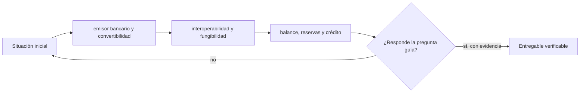

# Clase 45 · Depósitos tokenizados

> **Clase independiente 45 de 66** · **Nivel:** Profesional · **Fuente base:** BIS Innovation Hub y CPMI, informes del Banco Central de Chile, Banco Central Europeo y demás bancos centrales citados
>
> [⬅️ Clase anterior](../21-stablecoins/clase-44-reservas-redencion-y-riesgo-operacional.md) · [📚 Índice de las 66 clases](../README.md) · [🗂️ Mapa del tema](README.md) · [➡️ Clase siguiente](../22-deposito-tokenizado-cbdc/clase-46-cbdc-mdbc-y-diseno-de-politica-publica.md)

## Punto de partida

**Pregunta guía:** ¿Qué cambia cuando el pasivo bancario se representa en un registro programable?

**Caso que abre la clase:** Tokens de dos bancos valen uno nominalmente pero tienen distinto riesgo.

El depósito tradicional y su representación tokenizada se colocan en el mismo balance. Así se distingue innovación de interfaz de un cambio de emisor o riesgo.

## Fundamentos que sostienen la respuesta

1. **emisor bancario y convertibilidad.** En esta clase delimita qué objeto o relación estamos observando antes de sacar conclusiones. Localízalo explícitamente en «Tokens de dos bancos valen uno nominalmente pero tienen distinto riesgo.» y anota qué dato faltaría para refutar tu lectura.
2. **interoperabilidad y fungibilidad.** En esta clase explica el mecanismo que conecta la situación inicial con el cambio observable. Localízalo explícitamente en «Tokens de dos bancos valen uno nominalmente pero tienen distinto riesgo.» y anota qué dato faltaría para refutar tu lectura.
3. **balance, reservas y crédito.** En esta clase permite contrastar el resultado y formular el límite de la evidencia. Localízalo explícitamente en «Tokens de dos bancos valen uno nominalmente pero tienen distinto riesgo.» y anota qué dato faltaría para refutar tu lectura.

### Depósito tokenizado: lo que cambia y lo que expresamente no

Lo que **no** cambia: quién debe (tu banco), el régimen jurídico del depósito, el seguro de
depósito donde exista, la supervisión prudencial y las obligaciones de prevención de
lavado. Un depósito tokenizado no es un instrumento nuevo: es el mismo instrumento con otro
mecanismo de transferencia.

Lo que **sí** cambia, y es sustancial:

1. **Liquidación programable y atómica.** El depósito puede entregarse dentro de la misma
   transacción que entrega un valor tokenizado, resolviendo el problema de entrega contra
   pago de las [clases 41–42](../20-dinero-banca-liquidacion/README.md) sin cámara intermedia.
2. **Horario.** Puede operar 24×7, frente a las ventanas de los sistemas de liquidación.
   Con la contrapartida que ya conoces: la tesorería también tiene que estar disponible 24×7.
3. **Composabilidad con lógica de negocio.** Pagos condicionados a la entrega, a un hito o
   a una verificación, ejecutados sin conciliación posterior.

Y una diferencia decisiva frente a la stablecoin: **la singularidad del dinero**. Los
depósitos tokenizados de dos bancos distintos se mantienen canjeables a la par porque los
bancos se liquidan entre sí en dinero de banco central, exactamente como hoy. Dos
stablecoins de dos emisores distintos **no tienen nada que garantice esa paridad entre
ellas**; cotizan una contra otra en el mercado. Ese es el argumento técnico central por el
que los bancos centrales miran con mejores ojos el depósito tokenizado que la stablecoin
para pagos mayoristas — y conviene entenderlo como argumento, no como preferencia
corporativa.

### Mayorista: donde el consenso es mayor y el impacto también

La MDBC **mayorista** genera mucho menos debate público y bastante más consenso técnico,
porque no toca la relación del ciudadano con su banco. Su uso natural es lo que ya viste en
las clases 41–42: liquidar la pata de dinero de una operación en el activo más seguro que
existe, ahora dentro de la misma transacción que entrega el activo.

El BIS Innovation Hub y varios bancos centrales han desarrollado experimentos públicos en
esta línea —liquidación mayorista con DLT, pagos transfronterizos multi-MDBC y unificación
de dinero de banco central, depósitos tokenizados y valores tokenizados en una misma
infraestructura—. Son **experimentos y pruebas de concepto documentadas**, no
infraestructuras en producción generalizada, y así deben citarse. Sus informes son la mejor
fuente disponible sobre qué funciona y qué no, y están publicados en abierto.

## Trabajo práctico

**Método propio:** comparación de balances bancarios.

**Actividad:** Comparar depósito tradicional, tokenizado y stablecoin bancaria.

Trabaja en entorno local, regtest, signet o testnet según corresponda. Conserva entradas, comandos, salidas y bloque o instante de corte. Una captura aislada no demuestra reproducibilidad.

## Gráfico pedagógico

Recorre el gráfico en voz alta: identifica supuestos, transformaciones y el punto exacto donde aparece evidencia.

## Demostración de aprendizaje

**Entregable:** Tabla de derechos, pasivos, liquidación y mecanismos de conversión.

**Comprobación formativa:** ¿Qué permanece igual para el cliente cuando sólo cambia el registro tecnológico?

Para aprobar debes conectar el hecho observado con el concepto correcto, descartar al menos una interpretación alternativa y redactar una conclusión cuyo alcance no exceda la prueba.

## Errores que esta clase corrige

- Tratar **emisor bancario y convertibilidad** como una etiqueta suficiente, sin identificar actores, dato y frontera.
- Usar **interoperabilidad y fungibilidad** como explicación aunque el caso no aporte la evidencia necesaria.
- Dar por respondido «¿Qué cambia cuando el pasivo bancario se representa en un registro programable?» sin contrastar **balance, reservas y crédito**.

Vuelve al caso inicial, elige el error más peligroso y describe una comprobación concreta que lo detectaría.

## Fuentes para comprobar y ampliar

- BIS Innovation Hub — proyectos sobre MDBC, liquidación y tokenización: <https://www.bis.org/about/bisih/about.htm>
- BIS/CPMI — trabajos sobre monedas digitales de banco central: <https://www.bis.org/cpmi/index.htm>
- Banco Central de Chile — publicaciones e información institucional (MDBC): <https://www.bcentral.cl/>
- Banco Central Europeo — proyecto del euro digital: <https://www.ecb.europa.eu/euro/digital_euro/html/index.es.html>
- Banco de Inglaterra — trabajo sobre la libra digital: <https://www.bankofengland.co.uk/the-digital-pound>
- FMI — trabajo sobre dinero digital de banco central: <https://www.imf.org/en/Topics/fintech>

Consulta además la [bibliografía razonada](../../docs/bibliografia.md), que declara procedencia y uso.

## Cierre de la clase

Responde otra vez la pregunta guía sin mirar notas. Si tu respuesta no menciona evidencia, supuesto y límite, todavía describe el tema pero no lo domina. Continúa solo cuando otra persona pueda reproducir tu entregable.
