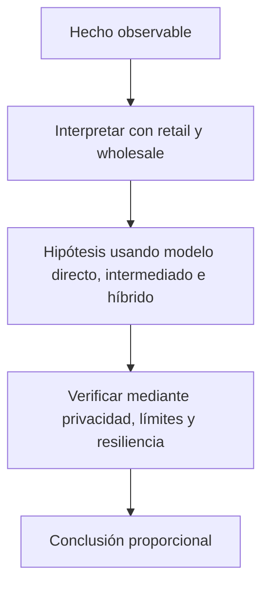

# Clase 46 · CBDC/MDBC y diseño de política pública

> **Clase independiente 46 de 66** · **Nivel:** Profesional · **Fuente base:** BIS Innovation Hub y CPMI, informes del Banco Central de Chile, Banco Central Europeo y demás bancos centrales citados
>
> [⬅️ Clase anterior](../22-deposito-tokenizado-cbdc/clase-45-depositos-tokenizados.md) · [📚 Índice de las 66 clases](../README.md) · [🗂️ Mapa del tema](README.md) · [➡️ Clase siguiente](../23-pagos-fx-onchain/clase-47-anatomia-de-un-pago-transfronterizo.md)

## Punto de partida

**Pregunta guía:** ¿Qué decisiones técnicas cambian privacidad, acceso y estabilidad financiera?

**Caso que abre la clase:** Una MDBC minorista compite con depósitos durante una crisis bancaria.

Cada equipo diseña una MDBC con objetivo distinto y debe defender privacidad, acceso, intermediación y resiliencia. No existe una arquitectura neutral.

## Trabajo práctico

**Método propio:** laboratorio de política pública.

**Actividad:** Diseñar opciones para Chile declarando objetivos y trade-offs.

Trabaja en entorno local, regtest, signet o testnet según corresponda. Conserva entradas, comandos, salidas y bloque o instante de corte. Una captura aislada no demuestra reproducibilidad.

## Fundamentos que sostienen la respuesta

1. **retail y wholesale.** En esta clase delimita qué objeto o relación estamos observando antes de sacar conclusiones. Localízalo explícitamente en «Una MDBC minorista compite con depósitos durante una crisis bancaria.» y anota qué dato faltaría para refutar tu lectura.
2. **modelo directo, intermediado e híbrido.** En esta clase explica el mecanismo que conecta la situación inicial con el cambio observable. Localízalo explícitamente en «Una MDBC minorista compite con depósitos durante una crisis bancaria.» y anota qué dato faltaría para refutar tu lectura.
3. **privacidad, límites y resiliencia.** En esta clase permite contrastar el resultado y formular el límite de la evidencia. Localízalo explícitamente en «Una MDBC minorista compite con depósitos durante una crisis bancaria.» y anota qué dato faltaría para refutar tu lectura.

### Las tres tensiones de una MDBC minorista

**Privacidad.** El efectivo es anónimo en el sentido de que la transacción no deja rastro
en un sistema. Una MDBC deja rastro por construcción. Los diseños serios buscan
*privacidad graduada*: anonimato práctico en importes pequeños, identificación creciente en
importes altos, y que el banco central **no** vea la identidad porque quien identifica es el
intermediario. Sigue siendo una decisión política, no técnica: la tecnología puede
implementar casi cualquier punto del espectro, y la pregunta de dónde ponerlo no la
responde la criptografía.

**Desintermediación.** Si mañana pudieras mover todo tu depósito a un pasivo del banco
central sin riesgo de crédito, ¿por qué dejarías dinero en el banco? Y sobre todo: en una
crisis de confianza, ¿qué evita que todo el mundo lo haga a la vez, convirtiendo un pánico
bancario en un clic? Respuestas de diseño: **límites de tenencia**, **remuneración cero o
negativa** por encima de un umbral, y **conversión automática** del exceso a depósito. Son
frenos deliberados; un diseño de MDBC sin ellos es un diseño incompleto.

**Resiliencia y sin conexión.** Este es el argumento más sólido y el menos discutido. El
efectivo funciona en un apagón; una tarjeta no. Una MDBC con pagos sin conexión —saldo en
un elemento seguro del dispositivo, transferencia por proximidad, límite de importe y de
operaciones consecutivas antes de exigir reconexión— reintroduce esa propiedad en el mundo
digital. El coste es aceptar una ventana de riesgo de doble gasto acotada por diseño: se
limita **cuánto** se puede perder, no se elimina la posibilidad. La mayoría de proyectos
piloto que han publicado resultados lo plantean exactamente así.

### Chile: MDBC en análisis

El **Banco Central de Chile** ha trabajado públicamente sobre la emisión de una **Moneda
Digital de Banco Central (MDBC)**, publicando un informe preliminar y manteniendo el asunto
en estudio, con consulta al público y análisis de opciones de diseño. La forma correcta de
citarlo —y la que este programa exige— es:

> El Banco Central de Chile **ha analizado** la eventual emisión de una MDBC y ha publicado
> documentos sobre ello. **No** se ha adoptado una decisión de emitir, ni existe una MDBC
> chilena en circulación. Consulta el estado vigente en <https://www.bcentral.cl/>.

Presentar ese análisis como una decisión tomada, o describir características de "la MDBC
chilena" como si existiera, es exactamente el tipo de afirmación que este programa prohíbe.
El [laboratorio de mercado tokenizado](../../labs/22-cbdc-mercado-tokenizado/README.md) que
acompaña a la unidad es, por la misma razón, una **simulación educativa** que no reproduce ni
pretende reproducir ningún sistema real del Banco Central.

> 💡 **En una frase:** tokenizar no cambia de quién es el pasivo — cambia cómo se mueve, y
> el debate entero está en qué efectos tiene ese cambio sobre quién financia a los bancos.

<strong>🎓 Si ya dominas esto</strong> — lo que decide un diseño real

- **La MDBC compite con lo que ya funciona.** En países con pagos instantáneos minoristas
  baratos y ubicuos, el caso de uso minorista es débil: la mejora marginal es pequeña. El
  argumento fuerte allí es la resiliencia y la soberanía del medio de pago, no la eficiencia.
- **Dinero programable vs. pagos programables.** Poner la regla dentro del dinero permite
  condicionar su uso (destinar una ayuda a ciertos comercios) y por eso mismo es donde se
  concentran las objeciones legítimas. Poner la regla en la aplicación logra casi lo mismo
  sin romper la fungibilidad. La distinción es la clave de casi todo el debate público.
- **Los límites de tenencia son difíciles en la práctica.** Con varias wallets por persona,
  aplicar el límite exige una identidad unificada, lo que a su vez tensiona la privacidad.
  Las tensiones no son independientes: aflojar una aprieta otra.
- **La interoperabilidad multi-MDBC es un problema de gobernanza, no de protocolo.** Quién
  opera la plataforma común, con qué ley, qué pasa en un incidente y quién puede excluir a
  un participante son preguntas más duras que el diseño técnico del puente.
- **Cuidado con el corredor de un solo sentido.** Una MDBC de un país usada masivamente en
  otro es sustitución de moneda de facto. Los diseños transfronterizos incorporan límites
  de uso no residente por esa razón, y es un requisito de política, no un capricho.

## Gráfico pedagógico

Recorre el gráfico en voz alta: identifica supuestos, transformaciones y el punto exacto donde aparece evidencia.

## Errores que esta clase corrige

- Tratar **retail y wholesale** como una etiqueta suficiente, sin identificar actores, dato y frontera.
- Usar **modelo directo, intermediado e híbrido** como explicación aunque el caso no aporte la evidencia necesaria.
- Dar por respondido «¿Qué decisiones técnicas cambian privacidad, acceso y estabilidad financiera?» sin contrastar **privacidad, límites y resiliencia**.

Vuelve al caso inicial, elige el error más peligroso y describe una comprobación concreta que lo detectaría.

## Demostración de aprendizaje

**Entregable:** Memo de política con alternativas, riesgos y fuente oficial vigente.

**Comprobación formativa:** ¿Qué decisión de diseño podría acelerar una corrida desde depósitos bancarios?

Para aprobar debes conectar el hecho observado con el concepto correcto, descartar al menos una interpretación alternativa y redactar una conclusión cuyo alcance no exceda la prueba.

## Fuentes para comprobar y ampliar

- BIS Innovation Hub — proyectos sobre MDBC, liquidación y tokenización: <https://www.bis.org/about/bisih/about.htm>
- BIS/CPMI — trabajos sobre monedas digitales de banco central: <https://www.bis.org/committees/cpmi/overview>
- Banco Central de Chile — publicaciones e información institucional (MDBC): <https://www.bcentral.cl/>
- Banco Central Europeo — proyecto del euro digital: <https://www.ecb.europa.eu/euro/digital_euro/html/index.es.html>
- Banco de Inglaterra — trabajo sobre la libra digital: <https://www.bankofengland.co.uk/the-digital-pound>
- FMI — trabajo sobre dinero digital de banco central: <https://www.imf.org/en/Topics/fintech>

Consulta además la [bibliografía razonada](../../docs/bibliografia.md), que declara procedencia y uso.

## Cierre de la clase

Responde otra vez la pregunta guía sin mirar notas. Si tu respuesta no menciona evidencia, supuesto y límite, todavía describe el tema pero no lo domina. Continúa solo cuando otra persona pueda reproducir tu entregable.
