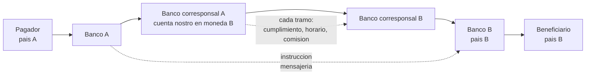
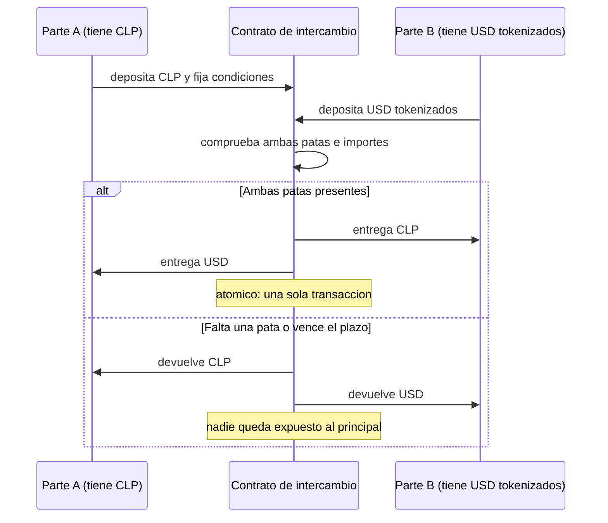

# 23 · Pagos, cross-border y FX on-chain

> **Nivel:** Profesional · ⏱️ **Duración estimada:** 180 min · **Fuente:** hoja de ruta del G20 sobre pagos transfronterizos (FSB), publicaciones del CPMI-BIS, Banco Mundial (*Remittance Prices Worldwide*) y documentación de los sistemas citados
> [⬅️ Currículo](../README.md) · [📚 Bibliografía](../../docs/bibliografia.md)
> 🧭 ⬅️ **Anterior:** [22 · Depósitos tokenizados y CBDC/MDBC](../22-deposito-tokenizado-cbdc/README.md) · [📚 Índice](../README.md) · ➡️ **Siguiente:** [24 · Tokenización y activos del mundo real](../24-tokenizacion-rwa/README.md)
> 📖 [Glosario de términos](../../docs/glosario.md) · 🌱 [¿Nuevo en esto? Empieza aquí](../../docs/empieza-aqui.md)

---

Una transferencia dentro de tu país llega en segundos y cuesta casi nada. La misma
transferencia cruzando una frontera puede tardar dos días y costar el 6 % del importe. **La
diferencia no es la tecnología de mensajería**, y entender por qué es el objetivo de este
módulo.

Después verás qué parte de ese problema resuelve realmente una liquidación on-chain, cuál
no toca en absoluto, y dónde aparece el argumento más limpio de todo el programa: el pago
contra pago atómico, que elimina por construcción el riesgo Herstatt del módulo 20.

## 🎯 Objetivos

- Describir el circuito de un pago minorista tradicional y ubicar cada coste y cada demora.
- Explicar la banca corresponsal con cuentas nostro/vostro y el coste del prefondeo.
- Descomponer el precio de una remesa en sus cuatro componentes reales.
- Explicar PvP y demostrar por qué un intercambio atómico elimina el riesgo de principal.
- Comparar corredores de pago transfronterizo con criterios completos, no solo velocidad.

## 📚 Resultados de aprendizaje

Al finalizar, el estudiante podrá:

1. **Dibujar** el circuito de un pago transfronterizo con todos los intermediarios y su función.
2. **Calcular** el coste total de una remesa separando comisión explícita del margen de cambio.
3. **Justificar** por qué el prefondeo de cuentas nostro es el mayor coste oculto del sistema.
4. **Implementar** conceptualmente un intercambio atómico y explicar qué garantiza y qué no.
5. **Evaluar** un corredor on-chain incluyendo entrada y salida de efectivo, cumplimiento y liquidez.
6. **Rechazar** con argumentos la afirmación de que blockchain hace los pagos internacionales gratis.

## 🗺️ Temas

| # | Tema | Por qué importa |
|---|------|-----------------|
| 1 | Anatomía de un pago minorista | Emisor, adquirente, esquema, PSP: quién cobra qué |
| 2 | Reversibilidad y contracargo | Por qué la irreversibilidad no siempre es una mejora |
| 3 | Banca corresponsal, nostro y vostro | El mecanismo real de un pago internacional |
| 4 | Prefondeo y coste de liquidez | El coste que no aparece en ninguna comisión |
| 5 | Mensajería vs. liquidación | SWIFT mueve instrucciones, no dinero |
| 6 | Las cuatro fricciones del G20 | El diagnóstico oficial del problema |
| 7 | Remesas: descomponer el precio | Dónde está de verdad el coste |
| 8 | Corredores on-chain | Stablecoin, depósito tokenizado, MDBC: qué cambia cada uno |
| 9 | FX: pares, cotización y liquidez | Vocabulario mínimo del mercado de divisas |
| 10 | PvP y swaps atómicos | El argumento más sólido a favor de la liquidación programable |
| 11 | MEV y microestructura en FX on-chain | Los problemas nuevos que aparecen |

## 🧠 Modelo mental

Un pago internacional no viaja. **Nada cruza la frontera.** Lo que ocurre es que dos bancos
que ya tienen cuentas el uno con el otro —o con un tercero común— **ajustan sus anotaciones**:
uno carga, el otro abona, y el saldo entre ambos cambia. El dinero se queda quieto en cada
país; lo que se mueve es la posición deudora entre entidades.

La analogía útil es la de **dos tenderos de pueblos distintos que se fían mutuamente**.
Cuando un vecino del pueblo A quiere pagar a uno del pueblo B, no viaja: el tendero A anota
que ahora le debe más al tendero B, y el tendero B paga al vecino de su pueblo. Funciona
mientras se fíen. Si no se fían, el tendero A tiene que **dejar dinero depositado por
adelantado** en el pueblo B — y ese dinero inmovilizado, que no rinde y que hay que
dimensionar para el peor día, es exactamente el coste que hace caro el sistema.

Límite de la analogía: entre bancos reales hay además cumplimiento, sanciones, horarios de
banco central, requisitos de capital sobre la exposición y auditoría. Cambiar el mecanismo
de anotación no elimina nada de eso, y esa es la parte que las comparaciones optimistas
omiten.

## 🧩 Esquema visual

Pago transfronterizo por corresponsalía, con todos los actores:



Pago contra pago (PvP): las dos patas, o ninguna:



## 📖 Conceptos y definiciones

- **PSP (proveedor de servicios de pago)**: entidad que inicia o recibe pagos por cuenta de un cliente. **Adquirente**: el del comercio. **Emisor**: el del pagador.
- **Esquema de pago**: reglas comunes que hacen interoperar a emisores y adquirentes (tarjetas, transferencias inmediatas). No mueve dinero: define cómo se mueve.
- **Contracargo (*chargeback*)**: reversión de un pago a instancia del pagador. Es una función de protección al consumidor, no un defecto técnico.
- **Banca corresponsal**: acuerdo por el que un banco mantiene cuentas y presta servicios a otro en su jurisdicción o moneda.
- **Cuenta nostro**: "nuestra cuenta en su banco". **Cuenta vostro**: "su cuenta en nuestro banco". Son la misma cuenta vista desde cada lado.
- **Prefondeo**: mantener saldo por adelantado en la cuenta nostro para poder pagar. Es capital inmovilizado, dimensionado para el pico, no para la media.
- **Mensajería financiera**: transporte de instrucciones entre entidades. **No es liquidación**: la liquidación ocurre en los libros de las entidades y en el banco central.
- **Las cuatro fricciones (G20/FSB)**: costes elevados, lentitud, acceso limitado y transparencia insuficiente. Es el diagnóstico oficial y sirve como rúbrica.
- **Par de divisas**: `USD/CLP` expresa cuántos CLP cuesta 1 USD. **Contado**: liquidación inmediata. **Forward**: a plazo pactado. **Swap**: contado más operación inversa a plazo.
- **Margen de cambio (*FX spread*)**: diferencia entre el tipo aplicado al cliente y el tipo medio de mercado. En remesas suele ser **el mayor componente del coste** y el menos visible.
- **PvP (*payment versus payment*)**: mecanismo que asegura que la entrega de una moneda ocurre **si y solo si** ocurre la de la otra.
- **Intercambio atómico**: operación en la que todas las patas se ejecutan o ninguna, garantizado por el propio mecanismo de ejecución.

## 🔬 Profundización

### Por qué una remesa cuesta el 6 % y dónde está ese dinero

Envías **200 USD** a otro país. El receptor recibe el equivalente a **188 USD**. La
descomposición real casi nunca es la que se anuncia:

| Componente | Importe típico | Visible para el cliente |
|---|---:|---|
| Comisión explícita de envío | 5,00 USD | Sí, destacada |
| **Margen de cambio** sobre el tipo medio (≈ 2,5 %) | 5,00 USD | **No**: se presenta como "sin comisiones" |
| Comisiones de bancos intermedios | 1,50 USD | Rara vez |
| Coste de retirada en destino | 0,50 USD | A veces |
| **Total** | **12,00 USD = 6,0 %** | |

**El margen de cambio es la partida que más se ignora y la segunda más grande.** Cualquier
comparación entre corredores que solo mire la comisión explícita está mal hecha; el Banco
Mundial publica precios de remesas precisamente descomponiendo ambos conceptos, y esa es la
metodología que debes aplicar. El laboratorio del módulo la implementa.

Ahora el coste que **ningún cliente ve nunca**: el prefondeo. Para poder pagar en destino,
el banco emisor mantiene saldo en su cuenta nostro. Si necesita 10 millones inmovilizados y
su coste de capital es del 6 % anual, **son 600 000 al año** que alguien paga — repartidos
entre todas las operaciones de ese corredor. Un corredor con poco volumen tiene el mismo
coste fijo repartido entre menos operaciones, y por eso los corredores pequeños son
desproporcionadamente caros. Esa es la explicación económica de por qué las remesas a
países con menos flujo cuestan más, y no tiene nada que ver con la tecnología de mensajería.

### Qué cambia realmente un corredor on-chain

| Fricción | ¿La resuelve la liquidación on-chain? | Matiz honesto |
|---|---|---|
| Prefondeo en nostro | **Sí, en gran medida** | Se sustituye por liquidez en el activo tokenizado, que también hay que financiar |
| Horario y días hábiles | **Sí** | La tesorería debe operar 24×7; el problema se traslada |
| Tramos intermedios | **Sí** | Aparece un tramo nuevo: entrada y salida a moneda local |
| Riesgo de liquidación (Herstatt) | **Sí, si hay PvP atómico** | Solo si ambas patas están en el mismo entorno de ejecución |
| Cumplimiento, sanciones, KYC | **No** | Idéntico o mayor; ver [módulo 27](../27-regulacion-cumplimiento/README.md) |
| Conversión a moneda local | **No** | La última milla sigue siendo un negocio local con su margen |
| Protección al consumidor | **No, y empeora** | La irreversibilidad elimina el contracargo |
| Transparencia del precio | **Parcialmente** | Solo si se publica el tipo aplicado, no únicamente la comisión |

La conclusión es más interesante que un veredicto: **el corredor on-chain mueve el
problema de sitio**. Elimina el capital inmovilizado en corresponsalía y lo sustituye por la
necesidad de liquidez en el activo tokenizado y por el coste de las rampas de entrada y
salida. Para corredores de alto volumen entre plazas con buena liquidez, la cuenta suele
salir favorable. Para corredores pequeños con mala liquidez local, **el coste dominante
sigue siendo la última milla**, que es exactamente donde blockchain no interviene. Un
análisis serio compara **el total**, no el tramo que mejora.

### PvP: el argumento limpio

El módulo 20 dejó planteado el riesgo Herstatt: entregas tu moneda, no recibes la otra,
pierdes el **principal** completo. La respuesta tradicional son mecanismos de liquidación
que retienen ambas patas y solo las liberan cuando las dos están presentes — un tercero de
confianza especializado, que funciona muy bien y cuya cobertura no es universal: quedan
fuera muchas divisas y muchos participantes.

Un contrato que retiene ambas patas hace lo mismo **sin tercero de confianza y con
cobertura arbitraria**: si al final de la ejecución no están las dos, la transacción entera
revierte y el estado vuelve al punto de partida. No hay ventana en la que una parte esté
expuesta. Esto no es una mejora incremental: **elimina una categoría entera de riesgo por
construcción**, y es el argumento técnico más sólido de todo este bloque del programa.

Sus condiciones, que hay que decir con la misma claridad:

1. **Ambas patas deben estar en el mismo entorno de ejecución.** Si una moneda está
   tokenizada y la otra sigue en un sistema bancario clásico, no hay atomicidad: hay un
   puente, y con él vuelve el riesgo ([módulo 13](../13-interoperabilidad/README.md)).
2. **La atomicidad es técnica, la firmeza es jurídica.** Que la transacción sea atómica no
   la hace oponible a un tercero; eso depende de la norma aplicable, como viste en el 20.
3. **Alguien debe aportar la liquidez de las dos monedas.** La atomicidad elimina el riesgo
   de principal, no el coste de tener ambos activos disponibles.

> 💡 **En una frase:** los pagos internacionales no son lentos por la tecnología de
> mensajería, sino por **capital inmovilizado, cumplimiento y ventanas de liquidación** — y
> de esos tres, la liquidación programable ataca de verdad al primero y al tercero.

<details>
<summary><strong>🎓 Si ya dominas esto</strong> — lo que decide la viabilidad de un corredor</summary>

- **La reducción de corresponsalía es un problema regulatorio, no de coste.** Muchos bancos
  cerraron relaciones de corresponsalía por el coste de cumplimiento y el riesgo de sanción,
  no por márgenes. Un corredor alternativo que no resuelva el cumplimiento no resuelve la
  causa: le llegará el mismo problema en cuanto tenga volumen.
- **La última milla domina el precio en corredores pequeños.** Efectivo en destino, red de
  agentes, competencia local. Optimizar la liquidación mientras la retirada cuesta un 3 % es
  optimizar el tramo equivocado.
- **MEV en FX on-chain es real.** Una operación grande contra un pool es visible antes de
  ejecutarse y puede ser sandwicheada. Las mitigaciones —subastas por lotes, envío privado,
  liquidación por intención— son las del [módulo 15](../15-arquitectura-avanzada/README.md)
  aplicadas al mercado de divisas.
- **El tipo del oráculo no es el tipo al que puedes operar.** Un precio de referencia no
  garantiza ejecución a ese precio con tu tamaño. Confundir referencia con ejecutable es el
  error clásico de quien viene de mirar gráficos.
- **La liquidación 24×7 crea riesgo de fin de semana.** Puedes liquidar el sábado, pero el
  mercado de divisas mayorista para cubrirte no está abierto. La posición queda descubierta
  hasta el lunes, y eso se financia o se limita.
- **La irreversibilidad y la protección al consumidor son un intercambio explícito.** Si
  construyes un producto minorista sin contracargo, el mecanismo de resolución de disputas
  tiene que estar en otra capa, y hay que diseñarlo, no darlo por supuesto.

</details>

## 🧪 Laboratorio guiado

> 🧪 Estas prácticas están catalogadas y **resueltas paso a paso** en el [catálogo de laboratorios](../../labs/CATALOG.md).

1. **Descomposición del coste de una remesa**, corresponsalía frente a corredor on-chain:

```bash
pnpm lab:remesa
```

Reproduce el ejemplo de la profundización (200 USD, comisión 5, margen 2,5 %) y observa que
el corredor on-chain **no gana** cuando la rampa de salida es cara: cambia los parámetros de
última milla y encuentra el punto en que se invierte el resultado.

2. **Pago contra pago atómico**, con las dos patas y los tres finales posibles:

```bash
pnpm lab:pvp
```

Comprueba los tres escenarios: ambas patas presentes (liquida), una pata ausente (revierte
íntegro) y vencimiento del plazo (devolución). En ninguno queda una parte expuesta.

3. Ejecuta las pruebas del bloque:

```bash
pnpm test
```

4. **Cálculo de prefondeo.** Para un corredor que mueve 50 millones al mes con un pico
   diario de 4 millones, estima el saldo nostro necesario y su coste anual al 6 %. Divide
   entre el número de operaciones: ese es el coste por operación que nadie ve en la factura.

## 📝 Reto verificable

Escribe el **análisis de un corredor de pagos** entre dos países concretos, comparando la
vía tradicional y una vía on-chain a tu elección (stablecoin, depósito tokenizado o MDBC
mayorista). Debe incluir: diagrama de ambos flujos con todos los intermediarios; tabla de
costes con las cuatro componentes y el prefondeo estimado; tiempos por tramo con el cuello
de botella señalado; **evaluación contra las cuatro fricciones del G20**; y una sección de
riesgos que cubra cumplimiento, liquidez local, rampas y protección al consumidor.

**Criterio de aceptación:** el coste incluye el margen de cambio y la última milla, no solo
la comisión de envío; el análisis identifica al menos **una fricción que la vía on-chain no
mejora**; y la recomendación final está condicionada a volumen y liquidez, no formulada como
verdad general.

## ⚠️ Errores frecuentes

| Síntoma | Causa y cómo comprobarlo |
|---------|--------------------------|
| "Blockchain hace las remesas gratis" | Omite rampas, liquidez y cumplimiento; calcula el total puerta a puerta |
| "SWIFT es lento" | SWIFT transporta instrucciones; la demora está en liquidación, horarios y cumplimiento |
| Comparar solo la comisión explícita | El margen de cambio suele ser mayor; aplica la metodología del Banco Mundial |
| Ignorar el prefondeo | Es el mayor coste oculto; estímalo con el cálculo del laboratorio 4 |
| "Atómico = final" | Atomicidad es técnica; la firmeza la da la norma aplicable |
| Prometer PvP con una pata fuera de la cadena | Sin ambas patas en el mismo entorno hay puente y hay riesgo |
| Diseñar pagos minoristas sin resolución de disputas | Sin contracargo hace falta otro mecanismo, y hay que diseñarlo |
| Usar el precio del oráculo como precio ejecutable | Referencia ≠ ejecución con tu tamaño; mide impacto |

## 🛡️ Seguridad y ética

- **Los laboratorios son simulaciones locales**, sin red, sin claves y sin fondos. Ningún
  ejercicio de este módulo mueve dinero real ni se conecta a mainnet.
- Las remesas afectan a población con márgenes estrechos. Publicar comparaciones incompletas
  —o presentar un corredor como más barato omitiendo la última milla— tiene consecuencias
  reales sobre personas concretas.
- Los pagos transfronterizos están sujetos a sanciones y prevención de lavado. Diseñar un
  corredor que las evite no es innovación: es un delito. El cumplimiento se diseña desde el
  primer día ([módulo 27](../27-regulacion-cumplimiento/README.md)).
- La irreversibilidad traslada el riesgo de fraude al pagador. En productos minoristas eso
  exige un mecanismo de disputa explícito y comunicado antes de la primera operación.
- Nada aquí es asesoría financiera ni recomendación de operar con divisas.

## 🔗 Referencias

- FSB — hoja de ruta del G20 para pagos transfronterizos: <https://www.fsb.org/work-of-the-fsb/financial-innovation-and-structural-change/cross-border-payments/>
- BIS/CPMI — pagos transfronterizos e infraestructuras: <https://www.bis.org/cpmi/>
- Banco Mundial — *Remittance Prices Worldwide* (metodología y datos): <https://remittanceprices.worldbank.org/>
- CLS — liquidación PvP en divisas: <https://www.cls-group.com/>
- SWIFT — qué es y qué hace la mensajería financiera: <https://www.swift.com/>
- Banco Central de Chile — sistemas de pago: <https://www.bcentral.cl/>
- Módulos relacionados: [20 · Dinero y liquidación](../20-dinero-banca-liquidacion/README.md) · [22 · MDBC](../22-deposito-tokenizado-cbdc/README.md) · [25 · Mercados de capitales](../25-mercados-capitales-onchain/README.md)

## ✅ Criterio de dominio

- Dibujas un pago transfronterizo completo y sitúas cada coste y cada demora.
- Descompones el precio de una remesa incluyendo el margen de cambio.
- Explicas el prefondeo y calculas su coste anual para un corredor dado.
- Demuestras con el laboratorio por qué un intercambio atómico elimina el riesgo de principal.

---

## 🧭 Navegación

⬅️ [Módulo 22 · Depósitos tokenizados y CBDC/MDBC](../22-deposito-tokenizado-cbdc/README.md) · [📚 Índice del currículo](../README.md) · ➡️ [Módulo 24 · Tokenización y activos del mundo real](../24-tokenizacion-rwa/README.md)
