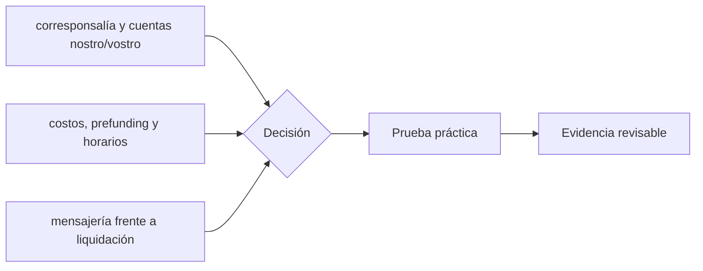

# Clase 47 · Anatomía de un pago transfronterizo

> **Clase independiente 47 de 66** · **Nivel:** Profesional · **Fuente base:** hoja de ruta del G20 sobre pagos transfronterizos (FSB), publicaciones del CPMI-BIS, Banco Mundial (*Remittance Prices Worldwide*) y documentación de los sistemas citados
>
> [⬅️ Clase anterior](../22-deposito-tokenizado-cbdc/clase-46-cbdc-mdbc-y-diseno-de-politica-publica.md) · [📚 Índice de las 66 clases](../README.md) · [🗂️ Mapa del tema](README.md) · [➡️ Clase siguiente](../23-pagos-fx-onchain/clase-48-fx-on-chain-y-pago-contra-pago.md)

## Punto de partida

**Pregunta guía:** ¿Por qué un mensaje rápido no elimina corresponsales, FX ni cumplimiento?

**Caso que abre la clase:** Una remesa atraviesa dos corresponsales y tres conversiones de moneda.

Importe, spread, tarifa, prefunding y tiempo se asignan a cada actor de la ruta. La clase identifica qué costos son tecnológicos, regulatorios o de liquidez.

## Gráfico pedagógico

Recorre el gráfico en voz alta: identifica supuestos, transformaciones y el punto exacto donde aparece evidencia.

## Trabajo práctico

**Método propio:** autopsia de una remesa.

**Actividad:** Descomponer tiempo, tarifa y spread de una ruta realista.

Trabaja en entorno local, regtest, signet o testnet según corresponda. Conserva entradas, comandos, salidas y bloque o instante de corte. Una captura aislada no demuestra reproducibilidad.

## Fundamentos que sostienen la respuesta

1. **corresponsalía y cuentas nostro/vostro.** En esta clase delimita qué objeto o relación estamos observando antes de sacar conclusiones. Localízalo explícitamente en «Una remesa atraviesa dos corresponsales y tres conversiones de moneda.» y anota qué dato faltaría para refutar tu lectura.
2. **costos, prefunding y horarios.** En esta clase explica el mecanismo que conecta la situación inicial con el cambio observable. Localízalo explícitamente en «Una remesa atraviesa dos corresponsales y tres conversiones de moneda.» y anota qué dato faltaría para refutar tu lectura.
3. **mensajería frente a liquidación.** En esta clase permite contrastar el resultado y formular el límite de la evidencia. Localízalo explícitamente en «Una remesa atraviesa dos corresponsales y tres conversiones de moneda.» y anota qué dato faltaría para refutar tu lectura.

### Por qué una remesa cuesta el 6 % y dónde está ese dinero

Envías **200 USD** a otro país. El receptor recibe el equivalente a **188 USD**. La
descomposición real casi nunca es la que se anuncia:

| Componente | Importe típico | Visible para el cliente |
|---|---:|---|
| Comisión explícita de envío | 5,00 USD | Sí, destacada |
| **Margen de cambio** sobre el tipo medio (≈ 2,5 %) | 5,00 USD | **No**: se presenta como "sin comisiones" |
| Comisiones de bancos intermedios | 1,50 USD | Rara vez |
| Coste de retirada en destino | 0,50 USD | A veces |
| **Total** | **12,00 USD = 6,0 %** | |

**El margen de cambio es la partida que más se ignora y la segunda más grande.** Cualquier
comparación entre corredores que solo mire la comisión explícita está mal hecha; el Banco
Mundial publica precios de remesas precisamente descomponiendo ambos conceptos, y esa es la
metodología que debes aplicar. El laboratorio de la unidad la implementa.

Ahora el coste que **ningún cliente ve nunca**: el prefondeo. Para poder pagar en destino,
el banco emisor mantiene saldo en su cuenta nostro. Si necesita 10 millones inmovilizados y
su coste de capital es del 6 % anual, **son 600 000 al año** que alguien paga — repartidos
entre todas las operaciones de ese corredor. Un corredor con poco volumen tiene el mismo
coste fijo repartido entre menos operaciones, y por eso los corredores pequeños son
desproporcionadamente caros. Esa es la explicación económica de por qué las remesas a
países con menos flujo cuestan más, y no tiene nada que ver con la tecnología de mensajería.

## Demostración de aprendizaje

**Entregable:** Mapa de costos que identifique qué fricción puede reducir blockchain.

**Comprobación formativa:** ¿Qué costo seguiría existiendo aunque la liquidación fuera instantánea?

Para aprobar debes conectar el hecho observado con el concepto correcto, descartar al menos una interpretación alternativa y redactar una conclusión cuyo alcance no exceda la prueba.

## Errores que esta clase corrige

- Tratar **corresponsalía y cuentas nostro/vostro** como una etiqueta suficiente, sin identificar actores, dato y frontera.
- Usar **costos, prefunding y horarios** como explicación aunque el caso no aporte la evidencia necesaria.
- Dar por respondido «¿Por qué un mensaje rápido no elimina corresponsales, FX ni cumplimiento?» sin contrastar **mensajería frente a liquidación**.

Vuelve al caso inicial, elige el error más peligroso y describe una comprobación concreta que lo detectaría.

## Fuentes para comprobar y ampliar

- FSB — hoja de ruta del G20 para pagos transfronterizos: <https://www.fsb.org/work-of-the-fsb/financial-innovation-and-structural-change/cross-border-payments/>
- BIS/CPMI — pagos transfronterizos e infraestructuras: <https://www.bis.org/committees/cpmi/overview>
- Banco Mundial — *Remittance Prices Worldwide* (metodología y datos): <https://remittanceprices.worldbank.org/>
- CLS — liquidación PvP en divisas: <https://www.cls-group.com/>
- SWIFT — qué es y qué hace la mensajería financiera: <https://www.swift.com/>
- Banco Central de Chile — sistemas de pago: <https://www.bcentral.cl/>

Consulta además la [bibliografía razonada](../../docs/bibliografia.md), que declara procedencia y uso.

## Cierre de la clase

Responde otra vez la pregunta guía sin mirar notas. Si tu respuesta no menciona evidencia, supuesto y límite, todavía describe el tema pero no lo domina. Continúa solo cuando otra persona pueda reproducir tu entregable.
