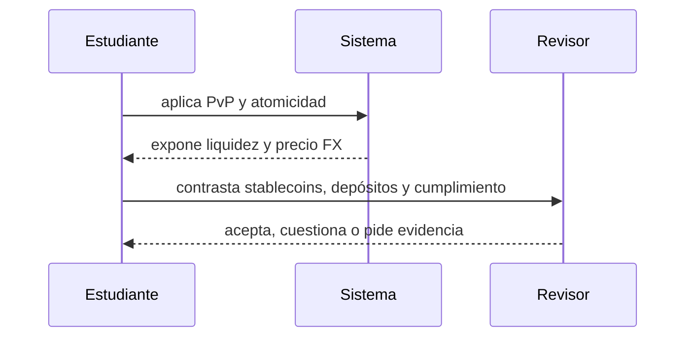

# Clase 48 · FX on-chain y pago contra pago

> **Clase independiente 48 de 66** · **Nivel:** Profesional · **Fuente base:** hoja de ruta del G20 sobre pagos transfronterizos (FSB), publicaciones del CPMI-BIS, Banco Mundial (*Remittance Prices Worldwide*) y documentación de los sistemas citados
>
> [⬅️ Clase anterior](../23-pagos-fx-onchain/clase-47-anatomia-de-un-pago-transfronterizo.md) · [📚 Índice de las 66 clases](../README.md) · [🗂️ Mapa del tema](README.md) · [➡️ Clase siguiente](../24-tokenizacion-rwa/clase-49-del-activo-al-derecho-tokenizado.md)

## Punto de partida

**Pregunta guía:** ¿Cómo se eliminan principal risk y patas descoordinadas?

**Caso que abre la clase:** Dos contrapartes intercambian monedas sin confiar en entrega posterior.

Dos equipos controlan patas distintas y enfrentan horarios y variación de precio. Un swap atómico elimina una exposición pero exige liquidez y activos compatibles.

## Fundamentos que sostienen la respuesta

1. **PvP y atomicidad.** En esta clase delimita qué objeto o relación estamos observando antes de sacar conclusiones. Localízalo explícitamente en «Dos contrapartes intercambian monedas sin confiar en entrega posterior.» y anota qué dato faltaría para refutar tu lectura.
2. **liquidez y precio FX.** En esta clase explica el mecanismo que conecta la situación inicial con el cambio observable. Localízalo explícitamente en «Dos contrapartes intercambian monedas sin confiar en entrega posterior.» y anota qué dato faltaría para refutar tu lectura.
3. **stablecoins, depósitos y cumplimiento.** En esta clase permite contrastar el resultado y formular el límite de la evidencia. Localízalo explícitamente en «Dos contrapartes intercambian monedas sin confiar en entrega posterior.» y anota qué dato faltaría para refutar tu lectura.

### Qué cambia realmente un corredor on-chain

| Fricción | ¿La resuelve la liquidación on-chain? | Matiz honesto |
|---|---|---|
| Prefondeo en nostro | **Sí, en gran medida** | Se sustituye por liquidez en el activo tokenizado, que también hay que financiar |
| Horario y días hábiles | **Sí** | La tesorería debe operar 24×7; el problema se traslada |
| Tramos intermedios | **Sí** | Aparece un tramo nuevo: entrada y salida a moneda local |
| Riesgo de liquidación (Herstatt) | **Sí, si hay PvP atómico** | Solo si ambas patas están en el mismo entorno de ejecución |
| Cumplimiento, sanciones, KYC | **No** | Idéntico o mayor; ver [clases 55–56](../27-regulacion-cumplimiento/README.md) |
| Conversión a moneda local | **No** | La última milla sigue siendo un negocio local con su margen |
| Protección al consumidor | **No, y empeora** | La irreversibilidad elimina el contracargo |
| Transparencia del precio | **Parcialmente** | Solo si se publica el tipo aplicado, no únicamente la comisión |

La conclusión es más interesante que un veredicto: **el corredor on-chain mueve el
problema de sitio**. Elimina el capital inmovilizado en corresponsalía y lo sustituye por la
necesidad de liquidez en el activo tokenizado y por el coste de las rampas de entrada y
salida. Para corredores de alto volumen entre plazas con buena liquidez, la cuenta suele
salir favorable. Para corredores pequeños con mala liquidez local, **el coste dominante
sigue siendo la última milla**, que es exactamente donde blockchain no interviene. Un
análisis serio compara **el total**, no el tramo que mejora.

### PvP: el argumento limpio

Las clases 41–42 dejaron planteado el riesgo Herstatt: entregas tu moneda, no recibes la otra,
pierdes el **principal** completo. La respuesta tradicional son mecanismos de liquidación
que retienen ambas patas y solo las liberan cuando las dos están presentes — un tercero de
confianza especializado, que funciona muy bien y cuya cobertura no es universal: quedan
fuera muchas divisas y muchos participantes.

Un contrato que retiene ambas patas hace lo mismo **sin tercero de confianza y con
cobertura arbitraria**: si al final de la ejecución no están las dos, la transacción entera
revierte y el estado vuelve al punto de partida. No hay ventana en la que una parte esté
expuesta. Esto no es una mejora incremental: **elimina una categoría entera de riesgo por
construcción**, y es el argumento técnico más sólido de todo este bloque del programa.

Sus condiciones, que hay que decir con la misma claridad:

1. **Ambas patas deben estar en el mismo entorno de ejecución.** Si una moneda está
   tokenizada y la otra sigue en un sistema bancario clásico, no hay atomicidad: hay un
   puente, y con él vuelve el riesgo ([clases 27–28](../13-interoperabilidad/README.md)).
2. **La atomicidad es técnica, la firmeza es jurídica.** Que la transacción sea atómica no
   la hace oponible a un tercero; eso depende de la norma aplicable, como viste en el 20.
3. **Alguien debe aportar la liquidez de las dos monedas.** La atomicidad elimina el riesgo
   de principal, no el coste de tener ambos activos disponibles.

> 💡 **En una frase:** los pagos internacionales no son lentos por la tecnología de
> mensajería, sino por **capital inmovilizado, cumplimiento y ventanas de liquidación** — y
> de esos tres, la liquidación programable ataca de verdad al primero y al tercero.

<strong>🎓 Si ya dominas esto</strong> — lo que decide la viabilidad de un corredor

- **La reducción de corresponsalía es un problema regulatorio, no de coste.** Muchos bancos
  cerraron relaciones de corresponsalía por el coste de cumplimiento y el riesgo de sanción,
  no por márgenes. Un corredor alternativo que no resuelva el cumplimiento no resuelve la
  causa: le llegará el mismo problema en cuanto tenga volumen.
- **La última milla domina el precio en corredores pequeños.** Efectivo en destino, red de
  agentes, competencia local. Optimizar la liquidación mientras la retirada cuesta un 3 % es
  optimizar el tramo equivocado.
- **MEV en FX on-chain es real.** Una operación grande contra un pool es visible antes de
  ejecutarse y puede ser sandwicheada. Las mitigaciones —subastas por lotes, envío privado,
  liquidación por intención— son las de las [clases 31–32](../15-arquitectura-avanzada/README.md)
  aplicadas al mercado de divisas.
- **El tipo del oráculo no es el tipo al que puedes operar.** Un precio de referencia no
  garantiza ejecución a ese precio con tu tamaño. Confundir referencia con ejecutable es el
  error clásico de quien viene de mirar gráficos.
- **La liquidación 24×7 crea riesgo de fin de semana.** Puedes liquidar el sábado, pero el
  mercado de divisas mayorista para cubrirte no está abierto. La posición queda descubierta
  hasta el lunes, y eso se financia o se limita.
- **La irreversibilidad y la protección al consumidor son un intercambio explícito.** Si
  construyes un producto minorista sin contracargo, el mecanismo de resolución de disputas
  tiene que estar en otra capa, y hay que diseñarlo, no darlo por supuesto.

## Gráfico pedagógico

Recorre el gráfico en voz alta: identifica supuestos, transformaciones y el punto exacto donde aparece evidencia.

## Demostración de aprendizaje

**Entregable:** Cálculo de exposición antes y después, con riesgos que permanecen.

**Comprobación formativa:** Describe el estado imposible que PvP evita por construcción.

Para aprobar debes conectar el hecho observado con el concepto correcto, descartar al menos una interpretación alternativa y redactar una conclusión cuyo alcance no exceda la prueba.

## Trabajo práctico

**Método propio:** mesa de tesorería con dos monedas.

**Actividad:** Simular swap atómico y comparar con liquidación secuencial.

Trabaja en entorno local, regtest, signet o testnet según corresponda. Conserva entradas, comandos, salidas y bloque o instante de corte. Una captura aislada no demuestra reproducibilidad.

## Errores que esta clase corrige

- Tratar **PvP y atomicidad** como una etiqueta suficiente, sin identificar actores, dato y frontera.
- Usar **liquidez y precio FX** como explicación aunque el caso no aporte la evidencia necesaria.
- Dar por respondido «¿Cómo se eliminan principal risk y patas descoordinadas?» sin contrastar **stablecoins, depósitos y cumplimiento**.

Vuelve al caso inicial, elige el error más peligroso y describe una comprobación concreta que lo detectaría.

## Fuentes para comprobar y ampliar

- FSB — hoja de ruta del G20 para pagos transfronterizos: <https://www.fsb.org/work-of-the-fsb/financial-innovation-and-structural-change/cross-border-payments/>
- BIS/CPMI — pagos transfronterizos e infraestructuras: <https://www.bis.org/committees/cpmi/overview>
- Banco Mundial — *Remittance Prices Worldwide* (metodología y datos): <https://remittanceprices.worldbank.org/>
- CLS — liquidación PvP en divisas: <https://www.cls-group.com/>
- SWIFT — qué es y qué hace la mensajería financiera: <https://www.swift.com/>
- Banco Central de Chile — sistemas de pago: <https://www.bcentral.cl/>

Consulta además la [bibliografía razonada](../../docs/bibliografia.md), que declara procedencia y uso.

## Cierre de la clase

Responde otra vez la pregunta guía sin mirar notas. Si tu respuesta no menciona evidencia, supuesto y límite, todavía describe el tema pero no lo domina. Continúa solo cuando otra persona pueda reproducir tu entregable.
