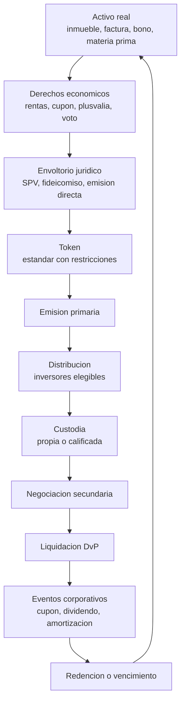
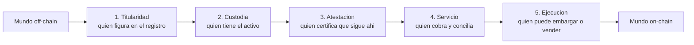

# 24 · Tokenización y activos del mundo real (RWA)

> **Nivel:** Avanzado · ⏱️ **Duración estimada:** 180 min · **Fuente:** informes del BIS y de IOSCO sobre tokenización, documentación de estándares (ERC-20, ERC-1400, ERC-3643) y prácticas públicas de emisión de valores digitales
> [⬅️ Currículo](../README.md) · [📚 Bibliografía](../../docs/bibliografia.md)
> 🧭 ⬅️ **Anterior:** [23 · Pagos, cross-border y FX on-chain](../23-pagos-fx-onchain/README.md) · [📚 Índice](../README.md) · ➡️ **Siguiente:** [25 · Mercados de capitales on-chain](../25-mercados-capitales-onchain/README.md)
> 📖 [Glosario de términos](../../docs/glosario.md) · 🌱 [¿Nuevo en esto? Empieza aquí](../../docs/empieza-aqui.md)

---

Tokenizar no es desplegar un ERC-20 con el nombre de un activo. Es responder a una pregunta
incómoda: **si tienes el token y alguien más tiene el activo, ¿quién manda?**

El módulo recorre el ciclo completo —del activo al derecho, del derecho al envoltorio
jurídico, del envoltorio al token, y del token de vuelta al activo en la redención— y se
detiene donde está el riesgo de verdad: en la **junta** entre el mundo físico y la cadena.
Un contrato inteligente ejecuta lo que dice su código con certeza absoluta; lo que no puede
hacer es obligar a un registro de la propiedad, a un depositario o a un tribunal.

## 🎯 Objetivos

- Recorrer el ciclo de vida completo de un activo tokenizado, de la originación a la redención.
- Distinguir titularidad jurídica de titularidad económica y ubicar dónde vive cada una.
- Analizar el papel del vehículo de propósito especial (SPV) y qué riesgos añade.
- Evaluar la calidad de la conexión off-chain → on-chain: oráculo, atestación y servicio del activo.
- Comparar estándares de token con restricciones de transferencia y decidir cuál corresponde.

## 📚 Resultados de aprendizaje

Al finalizar, el estudiante podrá:

1. **Descomponer** un activo en sus derechos económicos y decir cuáles pueden viajar al token.
2. **Diseñar** la estructura jurídica mínima que hace que el token signifique algo.
3. **Identificar** los cinco puntos de fallo de la junta entre activo y token.
4. **Elegir** un estándar de token justificando las restricciones de transferencia necesarias.
5. **Valorar** una posición tokenizada distinguiendo precio de mercado, valor liquidativo y valoración del subyacente.
6. **Explicar** qué ocurre en un incumplimiento del activo subyacente y quién ejecuta qué.

## 🗺️ Temas

| # | Tema | Por qué importa |
|---|------|-----------------|
| 1 | Qué es tokenizar y qué no | La confusión inicial que arruina proyectos enteros |
| 2 | Del activo al derecho económico | Solo se tokenizan derechos, nunca cosas |
| 3 | El envoltorio jurídico y el SPV | La pieza que hace que el token signifique algo |
| 4 | Titularidad jurídica vs. económica | Quién aparece en el registro y quién cobra |
| 5 | La junta off-chain / on-chain | Donde está el riesgo real, siempre |
| 6 | Estándares y transferencia restringida | ERC-20, ERC-1400, ERC-3643 y por qué no basta el primero |
| 7 | Servicio del activo (*servicing*) | Cobrar, conciliar, informar: el trabajo que no desaparece |
| 8 | Valoración, NAV y liquidez | Tres cosas distintas que se confunden a diario |
| 9 | Incumplimiento, ejecución y redención | El final del ciclo, que casi nadie diseña |
| 10 | Qué activos tiene sentido tokenizar | Criterio, no entusiasmo |

## 🧠 Modelo mental

Un token de activo real es un **resguardo de depósito**. El resguardo no es la mercancía:
es un documento que dice que alguien tiene la mercancía y te la entregará. Circula con
facilidad, se divide, se pignora — y **su valor depende íntegramente de que el depositario
exista, tenga la mercancía y la entregue**.

Esa es la propiedad central: la cadena garantiza que el resguardo es auténtico, único y que
tú lo tienes. **No garantiza nada sobre la mercancía.** Todo el trabajo serio de un proyecto
de tokenización consiste en fortalecer la parte que la cadena no cubre: contratos, custodia,
auditoría, atestaciones, y qué juzgado decide si hay disputa.

Límite de la analogía: un resguardo clásico tiene detrás siglos de derecho mercantil que
definen qué pasa en cada supuesto. Un token nuevo, no — y por eso la estructura jurídica se
diseña **antes** que el contrato inteligente, no después.

## 🧩 Esquema visual

El ciclo completo, del activo al inversor y de vuelta:



Los cinco puntos de fallo de la junta entre mundos:



## 📖 Conceptos y definiciones

- **Tokenizar**: representar en un registro distribuido un derecho sobre un activo, de forma que su transferencia en el registro produzca efectos sobre ese derecho.
- **Derecho económico**: el flujo o la facultad que realmente se transfiere (cobrar un cupón, participar en el resultado, usar). **No se tokeniza una cosa: se tokeniza un derecho sobre ella.**
- **Envoltorio jurídico (*legal wrapper*)**: estructura que vincula el token con el derecho. Sin ella el token es un cromo con buena criptografía.
- **SPV (vehículo de propósito especial)**: sociedad creada para aislar un activo y sus riesgos del resto del patrimonio del originador. Aporta separación patrimonial y **añade** riesgo de gestión y de gobierno del propio vehículo.
- **Titularidad jurídica**: quien consta como propietario ante el ordenamiento. **Titularidad económica**: quien tiene derecho a los frutos. En muchos diseños la primera está en el SPV y la segunda en el tenedor del token.
- **Originación**: proceso de crear o adquirir el activo que se va a tokenizar, con sus estándares de admisión.
- **Servicio del activo**: cobrar, conciliar, gestionar impagos, informar. Es trabajo humano continuo y **no desaparece al tokenizar**.
- **Atestación / prueba de reservas**: certificación periódica de que el activo existe y está donde se dice. Su valor depende de quién la firma, con qué alcance y con qué frecuencia.
- **NAV (valor liquidativo)**: valor de los activos menos pasivos, dividido por participaciones. **No es el precio de mercado** del token ni el precio al que puedes vender hoy.
- **Transferencia restringida**: capacidad del token de rechazar transferencias a direcciones no autorizadas. Requisito habitual cuando el instrumento es un valor.
- **Redención**: conversión del token de vuelta en el activo o en su equivalente en dinero. Si no está diseñada, el ciclo está incompleto.

## 🔬 Profundización

### La pregunta que decide todo: ¿qué pasa si divergen?

Existe un token que dice que eres dueño del 1 % de un edificio. En el registro de la
propiedad figura una sociedad. Un día el registro y la cadena dicen cosas distintas —porque
hubo un embargo, una venta fuera del sistema, un error o un fraude. **¿Cuál gana?**

En prácticamente todas las jurisdicciones actuales, gana el registro oficial. La cadena no
es fuente de titularidad de un inmueble. Por eso los diseños que funcionan **no intentan
sustituir el registro**: crean una capa donde la cadena **sí** es autoritativa —las
participaciones de un SPV cuyo único activo es el inmueble— y hacen que el token sea la
representación de esas participaciones. La divergencia no se elimina; se acota a un ámbito
en el que el token sí manda.

De ahí la regla práctica que ordena el módulo: **cuanto más lejos esté el activo de poder
existir nativamente en la cadena, más pesada tiene que ser la estructura jurídica y más
riesgo residual queda**. Un bono emitido directamente en la cadena por un emisor que
reconoce el token como el valor tiene una junta mínima. Un inmueble tiene una junta enorme.

| Activo | Peso de la estructura | Riesgo residual dominante |
|---|---|---|
| Deuda emitida nativamente | Bajo | Solvencia del emisor |
| Fondo del mercado monetario | Medio | Gestión, custodia, valoración |
| Factura comercial | Medio-alto | Originación, doble cesión, impago |
| Materia prima custodiada | Alto | Custodia física, seguro, entrega |
| Inmueble | **Muy alto** | Registro, gestión del SPV, liquidez |

### Los cinco puntos de fallo, con su control

1. **Titularidad.** ¿Qué documento acredita que el SPV es dueño? ¿Está inscrito? ¿Hay
   cargas? *Control: informe registral periódico y publicación de las cargas.*
2. **Custodia.** ¿Quién tiene físicamente el activo o sus documentos? ¿Está segregado del
   patrimonio del custodio? *Control: custodio regulado, segregación acreditada, seguro.*
3. **Atestación.** ¿Quién certifica que sigue ahí, con qué frecuencia y con qué alcance?
   *Control: firma de un tercero independiente y publicación del alcance exacto — recuerda
   la distinción atestación/auditoría del [módulo 21](../21-stablecoins/README.md).*
4. **Servicio.** ¿Quién cobra las rentas y las reparte? ¿Qué pasa si ese gestor desaparece?
   *Control: gestor sustituto designado por contrato y probado, no nombrado sobre el papel.*
5. **Ejecución.** Si el deudor no paga, ¿quién demanda y con qué legitimación? *Control:
   legitimación clara en la documentación y jurisdicción elegida expresamente.*

**Ninguno de los cinco lo resuelve un contrato inteligente.** El contrato hace muy bien
otra cosa: garantizar que el reparto proporcional del dinero que llegue sea exacto,
automático y auditable. Es un valor real —conciliar pagos a cientos de tenedores es caro y
propenso a error— pero es la parte fácil del problema.

### Estándares: por qué un ERC-20 no basta

Un ERC-20 permite transferir a cualquiera. Si el instrumento es un valor con inversores
elegibles, restricciones de reventa o límites por jurisdicción, esa libertad es
**incumplimiento normativo por diseño**. Los estándares de valor incorporan la comprobación
en la propia transferencia:

| Estándar | Aporta | Cuándo corresponde |
|---|---|---|
| ERC-20 | Fungibilidad y compatibilidad universal | Solo si el instrumento no tiene restricciones |
| ERC-1400 / ERC-1404 | Transferencia condicionada con motivo de rechazo legible | Valores con restricciones de titularidad |
| ERC-3643 | Identidad on-chain y elegibilidad verificada por reglas | Valores regulados con requisitos de inversor |
| ERC-721 / ERC-1155 | Unicidad o series | Activos no fungibles o tramos diferenciados |

La consecuencia técnica que sorprende a quien viene de DeFi: **un token con transferencia
restringida no es libremente componible**. No puedes depositarlo en cualquier pool ni
usarlo como colateral en cualquier protocolo, porque el destino sería una dirección no
autorizada. Buena parte de la promesa de "liquidez infinita" de los activos tokenizados
choca justamente aquí, y hay que decirlo antes de prometerla.

### Valoración: precio, NAV y valoración del subyacente

Tres números distintos que se confunden a diario:

- **Precio de mercado del token**: lo que alguien paga hoy. Puede estar por debajo del NAV
  si hay poca liquidez o dudas sobre la estructura.
- **NAV**: valor de los activos menos pasivos, por participación. Lo calcula el gestor con
  una metodología que hay que leer.
- **Valoración del subyacente**: la tasación del activo. Para un inmueble es una opinión
  técnica periódica; para una factura, su valor nominal ajustado por probabilidad de impago.

**Tokenizar no crea liquidez.** Fraccionar reduce el ticket mínimo y amplía el universo de
compradores potenciales, lo cual ayuda; pero si nadie quiere el activo, tampoco querrá una
milésima parte de él. La liquidez la dan compradores dispuestos, y esos no aparecen por el
estándar del token. El descuento sobre NAV en mercados secundarios de activos ilíquidos
tokenizados es la evidencia práctica de esto.

> 💡 **En una frase:** el token es tan bueno como el derecho que representa y como la
> estructura que hace que ese derecho se cumpla — la cadena solo garantiza que el token es
> auténtico y tuyo.

<details>
<summary><strong>🎓 Si ya dominas esto</strong> — donde se rompen los proyectos</summary>

- **La doble cesión es el fraude clásico de las facturas.** La misma factura vendida a dos
  financiadores. Un registro on-chain solo lo evita si **todos** los financiadores usan ese
  registro; si no, es un registro más entre varios. El control es la conexión con el
  registro autoritativo del país, si existe.
- **La cascada de pagos (*waterfall*) es donde el contrato aporta más.** Aplicar
  automáticamente el orden de prelación entre tramos ante cada cobro elimina discrecionalidad
  y error de conciliación. Es el mejor caso de uso real de la tokenización de crédito.
- **Multi-cadena multiplica la junta.** Si el token vive en varias cadenas mediante puente,
  el riesgo del puente se suma al del activo. El emisor puede ser impecable y el tenedor
  perderlo todo por el tramo intermedio ([módulo 13](../13-interoperabilidad/README.md)).
- **La recuperación de tokens perdidos es un requisito, no una concesión.** Con valores
  nominativos, el emisor debe poder reasignar la titularidad si un inversor pierde su llave.
  Eso obliga a una función de intervención — y a gobernarla con timelock y auditoría, porque
  es también la función más peligrosa del sistema.
- **La retención fiscal ocurre off-chain.** Repartir un cupón bruto en la cadena y liquidar
  impuestos fuera es la fuente más común de fricción operativa en emisiones reales.
- **Fraccionar puede cambiar la calificación del instrumento.** Vender participaciones de un
  activo a inversores para obtener un rendimiento del esfuerzo de un tercero es, en muchas
  jurisdicciones, emitir un valor, con todo lo que eso implica ([módulo 27](../27-regulacion-cumplimiento/README.md)).

</details>

## 🧪 Laboratorio guiado

> 🧪 Estas prácticas están catalogadas y **resueltas paso a paso** en el [catálogo de laboratorios](../../labs/CATALOG.md).

1. **Mapa de la junta.** Elige un activo (factura comercial, plaza de aparcamiento, fondo
   monetario) y completa los cinco puntos de fallo con: quién lo cubre, con qué documento se
   acredita y qué pasa si esa parte desaparece. Es el entregable más valioso del módulo.

2. **Ciclo de vida ejecutable.** El laboratorio del bloque simula un instrumento tokenizado
   desde la emisión hasta el vencimiento, con cupones y amortización:

```bash
pnpm lab:bono
```

3. **Estructura jurídica mínima.** Dibuja la estructura para tu activo: quién es el
   propietario registral, qué vehículo se interpone, qué documento vincula el token con la
   participación, y qué juzgado resolvería una disputa. Media página, sin adornos.

4. **Elección de estándar.** Para el mismo activo, decide entre ERC-20, ERC-1400 y ERC-3643
   listando las restricciones de transferencia que necesitas y cuál las soporta nativamente.

## 📝 Reto verificable

Redacta el **memorando de tokenización** de un activo real que elijas: descomposición en
derechos económicos, estructura jurídica propuesta con el vehículo elegido, los cinco puntos
de fallo con su control y su evidencia, estándar de token con las restricciones necesarias,
diseño del servicio del activo (quién cobra, quién concilia, quién sustituye al gestor),
política de valoración distinguiendo NAV de precio, y el procedimiento de **redención y de
incumplimiento** paso a paso.

**Criterio de aceptación:** el memorando responde explícitamente "¿qué pasa si el registro
oficial y la cadena divergen?"; identifica quién ejecuta en caso de impago y con qué
legitimación; incluye el mecanismo de sustitución del gestor; y **no** afirma en ningún
punto que la tokenización cree liquidez por sí sola.

## ⚠️ Errores frecuentes

| Síntoma | Causa y cómo comprobarlo |
|---------|--------------------------|
| "Tokenizamos el inmueble" | Se tokeniza un derecho, no una cosa; identifica cuál |
| Desplegar un ERC-20 para un valor | Sin transferencia restringida hay incumplimiento por diseño |
| "La blockchain prueba la propiedad" | El registro oficial es el autoritativo; la cadena prueba el token |
| "Al tokenizar habrá liquidez" | Fraccionar amplía compradores potenciales, no crea demanda |
| Confundir NAV con precio | Son cifras distintas; compáralas en el laboratorio |
| No diseñar la redención | El ciclo queda abierto y el token deja de valer al vencimiento |
| Atestación tratada como auditoría | Distinto alcance y distinta opinión; lee quién firma |
| Sin gestor sustituto | Si el gestor desaparece, nadie cobra y el contrato no puede hacerlo por él |
| Función de recuperación sin control | Necesaria para valores nominativos, peligrosa sin timelock |

## 🛡️ Seguridad y ética

- Los laboratorios **simulan** instrumentos: sin activos reales, sin fondos, sin ofertas.
  Nada en este módulo constituye una oferta de valores ni una invitación a invertir.
- Ofrecer participaciones tokenizadas de un activo al público puede constituir **emisión de
  valores** sujeta a autorización. Comprobarlo **antes** de construir no es prudencia
  excesiva: es la diferencia entre un proyecto y una infracción.
- Publica siempre la estructura jurídica junto a la técnica. Un proyecto que enseña el
  contrato y esconde el SPV está ocultando dónde vive el riesgo.
- La función de recuperación/reasignación es imprescindible y peligrosa a la vez:
  gobiérnala con multifirma, timelock y registro auditable, y publícalo.
- Nada aquí es asesoría legal, fiscal ni de inversión. Las estructuras y su tratamiento
  varían por jurisdicción; ver [módulo 27](../27-regulacion-cumplimiento/README.md) y
  [regulación](../../regulation/README.md).

## 🔗 Referencias

- BIS — trabajos sobre tokenización de activos y su infraestructura: <https://www.bis.org/>
- IOSCO — trabajo sobre mercados de criptoactivos y activos digitales: <https://www.iosco.org/>
- ERC-1400 / ERC-1404 — estándares de token de valor: <https://eips.ethereum.org/>
- ERC-3643 — estándar de activos permisionados con identidad: <https://www.erc3643.org/>
- OpenZeppelin — contratos base y control de acceso: <https://docs.openzeppelin.com/>
- Módulos relacionados: [08 · Tokens](../08-tokens/README.md) · [10 · Oráculos](../10-oraculos-indexacion/README.md) · [25 · Mercados de capitales](../25-mercados-capitales-onchain/README.md)

## ✅ Criterio de dominio

- Descompones un activo en derechos económicos y dices cuáles viajan al token.
- Explicas qué ocurre si el registro oficial y la cadena divergen, y cómo lo acota el SPV.
- Enumeras los cinco puntos de fallo de la junta con su control y su evidencia.
- Eliges estándar de token justificando las restricciones de transferencia necesarias.

---

## 🧭 Navegación

⬅️ [Módulo 23 · Pagos, cross-border y FX on-chain](../23-pagos-fx-onchain/README.md) · [📚 Índice del currículo](../README.md) · ➡️ [Módulo 25 · Mercados de capitales on-chain](../25-mercados-capitales-onchain/README.md)
