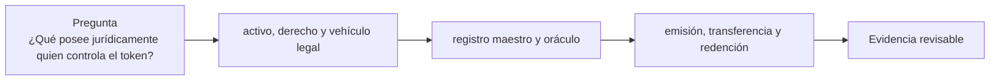

# Clase 49 · Del activo al derecho tokenizado

> **Clase independiente 49 de 66** · **Nivel:** Avanzado · **Fuente base:** informes del BIS y de IOSCO sobre tokenización, documentación de estándares (ERC-20, ERC-1400, ERC-3643) y prácticas públicas de emisión de valores digitales
>
> [⬅️ Clase anterior](../23-pagos-fx-onchain/clase-48-fx-on-chain-y-pago-contra-pago.md) · [📚 Índice de las 66 clases](../README.md) · [🗂️ Mapa del tema](README.md) · [➡️ Clase siguiente](../24-tokenizacion-rwa/clase-50-ciclo-de-vida-y-controles-de-rwa.md)

## Punto de partida

**Pregunta guía:** ¿Qué posee jurídicamente quien controla el token?

**Caso que abre la clase:** Un token apunta a un inmueble, pero el registro legal no reconoce al tenedor.

El grupo sigue un derecho desde el activo físico hasta la wallet y vuelve durante la redención. Cada salto debe tener autoridad y remedio identificables.

## Fundamentos que sostienen la respuesta

1. **activo, derecho y vehículo legal.** En esta clase delimita qué objeto o relación estamos observando antes de sacar conclusiones. Localízalo explícitamente en «Un token apunta a un inmueble, pero el registro legal no reconoce al tenedor.» y anota qué dato faltaría para refutar tu lectura.
2. **registro maestro y oráculo.** En esta clase explica el mecanismo que conecta la situación inicial con el cambio observable. Localízalo explícitamente en «Un token apunta a un inmueble, pero el registro legal no reconoce al tenedor.» y anota qué dato faltaría para refutar tu lectura.
3. **emisión, transferencia y redención.** En esta clase permite contrastar el resultado y formular el límite de la evidencia. Localízalo explícitamente en «Un token apunta a un inmueble, pero el registro legal no reconoce al tenedor.» y anota qué dato faltaría para refutar tu lectura.

### La pregunta que decide todo: ¿qué pasa si divergen?

Existe un token que dice que eres dueño del 1 % de un edificio. En el registro de la
propiedad figura una sociedad. Un día el registro y la cadena dicen cosas distintas —porque
hubo un embargo, una venta fuera del sistema, un error o un fraude. **¿Cuál gana?**

En prácticamente todas las jurisdicciones actuales, gana el registro oficial. La cadena no
es fuente de titularidad de un inmueble. Por eso los diseños que funcionan **no intentan
sustituir el registro**: crean una capa donde la cadena **sí** es autoritativa —las
participaciones de un SPV cuyo único activo es el inmueble— y hacen que el token sea la
representación de esas participaciones. La divergencia no se elimina; se acota a un ámbito
en el que el token sí manda.

De ahí la regla práctica que ordena ambas clases: **cuanto más lejos esté el activo de poder
existir nativamente en la cadena, más pesada tiene que ser la estructura jurídica y más
riesgo residual queda**. Un bono emitido directamente en la cadena por un emisor que
reconoce el token como el valor tiene una junta mínima. Un inmueble tiene una junta enorme.

| Activo | Peso de la estructura | Riesgo residual dominante |
|---|---|---|
| Deuda emitida nativamente | Bajo | Solvencia del emisor |
| Fondo del mercado monetario | Medio | Gestión, custodia, valoración |
| Factura comercial | Medio-alto | Originación, doble cesión, impago |
| Materia prima custodiada | Alto | Custodia física, seguro, entrega |
| Inmueble | **Muy alto** | Registro, gestión del SPV, liquidez |

### Los cinco puntos de fallo, con su control

1. **Titularidad.** ¿Qué documento acredita que el SPV es dueño? ¿Está inscrito? ¿Hay
   cargas? *Control: informe registral periódico y publicación de las cargas.*
2. **Custodia.** ¿Quién tiene físicamente el activo o sus documentos? ¿Está segregado del
   patrimonio del custodio? *Control: custodio regulado, segregación acreditada, seguro.*
3. **Atestación.** ¿Quién certifica que sigue ahí, con qué frecuencia y con qué alcance?
   *Control: firma de un tercero independiente y publicación del alcance exacto — recuerda
   la distinción atestación/auditoría de las [clases 43–44](../21-stablecoins/README.md).*
4. **Servicio.** ¿Quién cobra las rentas y las reparte? ¿Qué pasa si ese gestor desaparece?
   *Control: gestor sustituto designado por contrato y probado, no nombrado sobre el papel.*
5. **Ejecución.** Si el deudor no paga, ¿quién demanda y con qué legitimación? *Control:
   legitimación clara en la documentación y jurisdicción elegida expresamente.*

**Ninguno de los cinco lo resuelve un contrato inteligente.** El contrato hace muy bien
otra cosa: garantizar que el reparto proporcional del dinero que llegue sea exacto,
automático y auditable. Es un valor real —conciliar pagos a cientos de tenedores es caro y
propenso a error— pero es la parte fácil del problema.

### Estándares: por qué un ERC-20 no basta

Un ERC-20 permite transferir a cualquiera. Si el instrumento es un valor con inversores
elegibles, restricciones de reventa o límites por jurisdicción, esa libertad es
**incumplimiento normativo por diseño**. Los estándares de valor incorporan la comprobación
en la propia transferencia:

| Estándar | Aporta | Cuándo corresponde |
|---|---|---|
| ERC-20 | Fungibilidad y compatibilidad universal | Solo si el instrumento no tiene restricciones |
| ERC-1400 / ERC-1404 | Transferencia condicionada con motivo de rechazo legible | Valores con restricciones de titularidad |
| ERC-3643 | Identidad on-chain y elegibilidad verificada por reglas | Valores regulados con requisitos de inversor |
| ERC-721 / ERC-1155 | Unicidad o series | Activos no fungibles o tramos diferenciados |

La consecuencia técnica que sorprende a quien viene de DeFi: **un token con transferencia
restringida no es libremente componible**. No puedes depositarlo en cualquier pool ni
usarlo como colateral en cualquier protocolo, porque el destino sería una dirección no
autorizada. Buena parte de la promesa de "liquidez infinita" de los activos tokenizados
choca justamente aquí, y hay que decirlo antes de prometerla.

## Gráfico pedagógico

Recorre el gráfico en voz alta: identifica supuestos, transformaciones y el punto exacto donde aparece evidencia.

## Trabajo práctico

**Método propio:** cadena de titularidad documental.

**Actividad:** Dibujar cadena de derechos desde activo físico hasta wallet.

Trabaja en entorno local, regtest, signet o testnet según corresponda. Conserva entradas, comandos, salidas y bloque o instante de corte. Una captura aislada no demuestra reproducibilidad.

## Demostración de aprendizaje

**Entregable:** Mapa de exigibilidad con jurisdicción, responsables y fallas posibles.

**Comprobación formativa:** ¿Qué ocurre si el token y el registro legal asignan el activo a personas distintas?

Para aprobar debes conectar el hecho observado con el concepto correcto, descartar al menos una interpretación alternativa y redactar una conclusión cuyo alcance no exceda la prueba.

## Errores que esta clase corrige

- Tratar **activo, derecho y vehículo legal** como una etiqueta suficiente, sin identificar actores, dato y frontera.
- Usar **registro maestro y oráculo** como explicación aunque el caso no aporte la evidencia necesaria.
- Dar por respondido «¿Qué posee jurídicamente quien controla el token?» sin contrastar **emisión, transferencia y redención**.

Vuelve al caso inicial, elige el error más peligroso y describe una comprobación concreta que lo detectaría.

## Fuentes para comprobar y ampliar

- BIS — trabajos sobre tokenización de activos y su infraestructura: <https://www.bis.org/>
- IOSCO — trabajo sobre mercados de criptoactivos y activos digitales: <https://www.iosco.org/>
- ERC-1400 / ERC-1404 — estándares de token de valor: <https://eips.ethereum.org/>
- ERC-3643 — estándar de activos permisionados con identidad: <https://www.erc3643.org/>
- OpenZeppelin — contratos base y control de acceso: <https://docs.openzeppelin.com/>

Consulta además la [bibliografía razonada](../../docs/bibliografia.md), que declara procedencia y uso.

## Cierre de la clase

Responde otra vez la pregunta guía sin mirar notas. Si tu respuesta no menciona evidencia, supuesto y límite, todavía describe el tema pero no lo domina. Continúa solo cuando otra persona pueda reproducir tu entregable.
