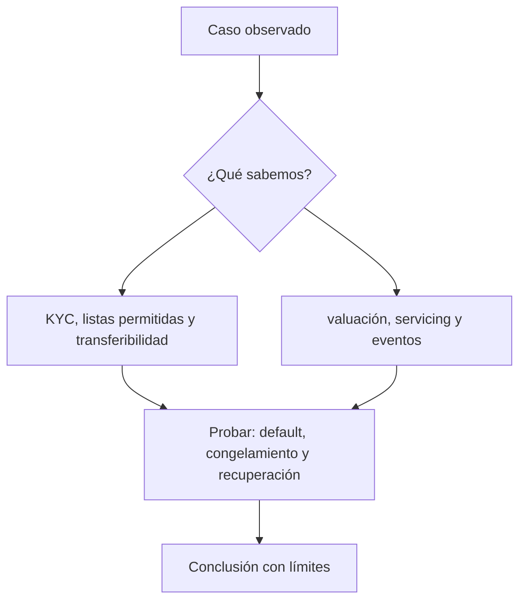

# Clase 50 · Ciclo de vida y controles de RWA

> **Clase independiente 50 de 66** · **Nivel:** Avanzado · **Fuente base:** informes del BIS y de IOSCO sobre tokenización, documentación de estándares (ERC-20, ERC-1400, ERC-3643) y prácticas públicas de emisión de valores digitales
>
> [⬅️ Clase anterior](../24-tokenizacion-rwa/clase-49-del-activo-al-derecho-tokenizado.md) · [📚 Índice de las 66 clases](../README.md) · [🗂️ Mapa del tema](README.md) · [➡️ Clase siguiente](../25-mercados-capitales-onchain/clase-51-infraestructura-del-mercado-de-capitales.md)

## Punto de partida

**Pregunta guía:** ¿Cómo se mantienen sincronizados token, activo y restricciones?

**Caso que abre la clase:** El activo paga un cupón, pero el registro de tenedores está desactualizado.

Cupón, transferencia, congelamiento y default actualizan varios registros. La clase diseña conciliaciones para que el token no se separe del derecho.

## Gráfico pedagógico

Recorre el gráfico en voz alta: identifica supuestos, transformaciones y el punto exacto donde aparece evidencia.

## Fundamentos que sostienen la respuesta

1. **KYC, listas permitidas y transferibilidad.** En esta clase delimita qué objeto o relación estamos observando antes de sacar conclusiones. Localízalo explícitamente en «El activo paga un cupón, pero el registro de tenedores está desactualizado.» y anota qué dato faltaría para refutar tu lectura.
2. **valuación, servicing y eventos.** En esta clase explica el mecanismo que conecta la situación inicial con el cambio observable. Localízalo explícitamente en «El activo paga un cupón, pero el registro de tenedores está desactualizado.» y anota qué dato faltaría para refutar tu lectura.
3. **default, congelamiento y recuperación.** En esta clase permite contrastar el resultado y formular el límite de la evidencia. Localízalo explícitamente en «El activo paga un cupón, pero el registro de tenedores está desactualizado.» y anota qué dato faltaría para refutar tu lectura.

### Valoración: precio, NAV y valoración del subyacente

Tres números distintos que se confunden a diario:

- **Precio de mercado del token**: lo que alguien paga hoy. Puede estar por debajo del NAV
  si hay poca liquidez o dudas sobre la estructura.
- **NAV**: valor de los activos menos pasivos, por participación. Lo calcula el gestor con
  una metodología que hay que leer.
- **Valoración del subyacente**: la tasación del activo. Para un inmueble es una opinión
  técnica periódica; para una factura, su valor nominal ajustado por probabilidad de impago.

**Tokenizar no crea liquidez.** Fraccionar reduce el ticket mínimo y amplía el universo de
compradores potenciales, lo cual ayuda; pero si nadie quiere el activo, tampoco querrá una
milésima parte de él. La liquidez la dan compradores dispuestos, y esos no aparecen por el
estándar del token. El descuento sobre NAV en mercados secundarios de activos ilíquidos
tokenizados es la evidencia práctica de esto.

> 💡 **En una frase:** el token es tan bueno como el derecho que representa y como la
> estructura que hace que ese derecho se cumpla — la cadena solo garantiza que el token es
> auténtico y tuyo.

<strong>🎓 Si ya dominas esto</strong> — donde se rompen los proyectos

- **La doble cesión es el fraude clásico de las facturas.** La misma factura vendida a dos
  financiadores. Un registro on-chain solo lo evita si **todos** los financiadores usan ese
  registro; si no, es un registro más entre varios. El control es la conexión con el
  registro autoritativo del país, si existe.
- **La cascada de pagos (*waterfall*) es donde el contrato aporta más.** Aplicar
  automáticamente el orden de prelación entre tramos ante cada cobro elimina discrecionalidad
  y error de conciliación. Es el mejor caso de uso real de la tokenización de crédito.
- **Multi-cadena multiplica la junta.** Si el token vive en varias cadenas mediante puente,
  el riesgo del puente se suma al del activo. El emisor puede ser impecable y el tenedor
  perderlo todo por el tramo intermedio ([clases 27–28](../13-interoperabilidad/README.md)).
- **La recuperación de tokens perdidos es un requisito, no una concesión.** Con valores
  nominativos, el emisor debe poder reasignar la titularidad si un inversor pierde su llave.
  Eso obliga a una función de intervención — y a gobernarla con timelock y auditoría, porque
  es también la función más peligrosa del sistema.
- **La retención fiscal ocurre off-chain.** Repartir un cupón bruto en la cadena y liquidar
  impuestos fuera es la fuente más común de fricción operativa en emisiones reales.
- **Fraccionar puede cambiar la calificación del instrumento.** Vender participaciones de un
  activo a inversores para obtener un rendimiento del esfuerzo de un tercero es, en muchas
  jurisdicciones, emitir un valor, con todo lo que eso implica ([clases 55–56](../27-regulacion-cumplimiento/README.md)).

## Trabajo práctico

**Método propio:** mesa operativa de eventos corporativos.

**Actividad:** Diseñar eventos corporativos y conciliaciones del ciclo completo.

Trabaja en entorno local, regtest, signet o testnet según corresponda. Conserva entradas, comandos, salidas y bloque o instante de corte. Una captura aislada no demuestra reproducibilidad.

## Errores que esta clase corrige

- Tratar **KYC, listas permitidas y transferibilidad** como una etiqueta suficiente, sin identificar actores, dato y frontera.
- Usar **valuación, servicing y eventos** como explicación aunque el caso no aporte la evidencia necesaria.
- Dar por respondido «¿Cómo se mantienen sincronizados token, activo y restricciones?» sin contrastar **default, congelamiento y recuperación**.

Vuelve al caso inicial, elige el error más peligroso y describe una comprobación concreta que lo detectaría.

## Demostración de aprendizaje

**Entregable:** Control matrix con frecuencia, evidencia y dueño de cada control.

**Comprobación formativa:** ¿Quién corrige una divergencia y qué registro prevalece?

Para aprobar debes conectar el hecho observado con el concepto correcto, descartar al menos una interpretación alternativa y redactar una conclusión cuyo alcance no exceda la prueba.

## Fuentes para comprobar y ampliar

- BIS — trabajos sobre tokenización de activos y su infraestructura: <https://www.bis.org/>
- IOSCO — trabajo sobre mercados de criptoactivos y activos digitales: <https://www.iosco.org/>
- ERC-1400 / ERC-1404 — estándares de token de valor: <https://eips.ethereum.org/>
- ERC-3643 — estándar de activos permisionados con identidad: <https://www.erc3643.org/>
- OpenZeppelin — contratos base y control de acceso: <https://docs.openzeppelin.com/>

Consulta además la [bibliografía razonada](../../docs/bibliografia.md), que declara procedencia y uso.

## Cierre de la clase

Responde otra vez la pregunta guía sin mirar notas. Si tu respuesta no menciona evidencia, supuesto y límite, todavía describe el tema pero no lo domina. Continúa solo cuando otra persona pueda reproducir tu entregable.
