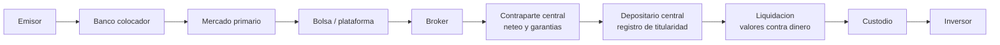
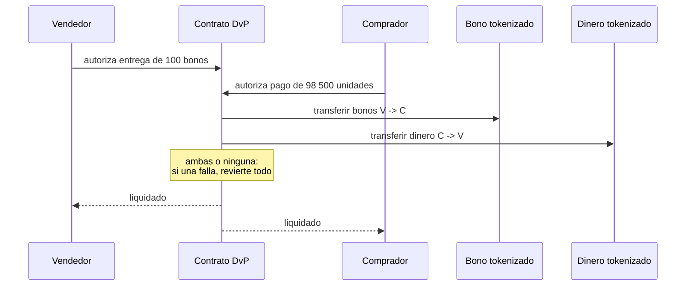

# 25 · Mercados de capitales on-chain

> **Nivel:** Avanzado · ⏱️ **Duración estimada:** 180 min · **Fuente:** *Principles for Financial Market Infrastructures* (CPMI-IOSCO), publicaciones del BIS sobre liquidación y tokenización, y documentación pública de emisiones de valores digitales
> [⬅️ Currículo](../README.md) · [📚 Bibliografía](../../docs/bibliografia.md)
> 🧭 ⬅️ **Anterior:** [24 · Tokenización y activos del mundo real](../24-tokenizacion-rwa/README.md) · [📚 Índice](../README.md) · ➡️ **Siguiente:** [26 · Custodia, wallets institucionales e identidad](../26-custodia-identidad/README.md)
> 📖 [Glosario de términos](../../docs/glosario.md) · 🌱 [¿Nuevo en esto? Empieza aquí](../../docs/empieza-aqui.md)

---

Con el activo ya tokenizado, queda el sistema que lo hace circular: **emisión, negociación,
compensación, liquidación, custodia y eventos corporativos**. Es la parte de las finanzas
con más infraestructura acumulada, y también donde la entrega contra pago atómica ofrece el
beneficio más medible de todo el programa: **eliminar dos días de exposición**.

El módulo hace las dos mitades. Primero, cómo funciona hoy un mercado de valores y por qué
cada intermediario está donde está —ninguno es gratuito y ninguno es accidental—. Después,
qué desaparece, qué permanece y qué **aparece nuevo** al llevarlo a un registro compartido.

## 🎯 Objetivos

- Recorrer la cadena completa emisor → inversor y explicar la función de cada intermediario.
- Explicar el ciclo de liquidación T+n y cuantificar la exposición que genera.
- Describir entrega contra pago (DvP) en sus tres modelos y su equivalente atómico.
- Diseñar el tratamiento de eventos corporativos sobre un valor tokenizado.
- Evaluar qué funciones de un depositario central y de una contraparte central persisten en un diseño tokenizado.

## 📚 Resultados de aprendizaje

Al finalizar, el estudiante podrá:

1. **Dibujar** la cadena de intermediarios de una operación de valores y justificar cada eslabón.
2. **Calcular** la exposición agregada que genera un ciclo T+2 frente a liquidación atómica.
3. **Distinguir** los tres modelos de DvP y decir cuál implementa un contrato de intercambio.
4. **Implementar** conceptualmente el pago de un cupón y una amortización sobre un valor tokenizado.
5. **Argumentar** por qué una contraparte central sigue teniendo sentido incluso con liquidación atómica.
6. **Identificar** las funciones que un mercado tokenizado debe reconstruir y no puede simplemente eliminar.

## 🗺️ Temas

| # | Tema | Por qué importa |
|---|------|-----------------|
| 1 | Mercado primario: emisión y colocación | De dónde sale un valor |
| 2 | Mercado secundario: bolsas, brókeres, creadores de mercado | Cómo circula y quién da precio |
| 3 | Depositario central de valores (CSD) | El registro autoritativo de titularidad |
| 4 | Contraparte central (CCP) y neteo | Por qué existe y qué riesgo concentra |
| 5 | Ciclo de liquidación T+n | El origen de la exposición que se quiere eliminar |
| 6 | DvP: los tres modelos | Bruto, neto de valores, neto de ambos |
| 7 | Entrega contra pago atómica | El caso de uso más limpio de la tokenización |
| 8 | Eventos corporativos | Cupón, dividendo, amortización, canje |
| 9 | Tenencia directa vs. cadena de custodia | Quién aparece como titular y qué implica |
| 10 | Qué desaparece, qué permanece, qué aparece | El balance honesto |

## 🧠 Modelo mental

El mercado de valores actual es un **sistema de mensajería con memoria repartida**. La
titularidad definitiva vive en el depositario central; la negociación ocurre en otro sitio;
el dinero se mueve en el sistema del banco central; y entre todos ellos van instrucciones
que hay que conciliar. Cada intermediario existe porque resuelve un problema concreto —dar
precio, garantizar el cumplimiento, registrar quién tiene qué— y **la conciliación entre
ellos es el coste principal del conjunto**.

Un mercado tokenizado propone algo distinto: **un solo registro que ya es la verdad para
todos**. No hay que conciliar porque no hay copias. Ahí está el ahorro real.

Límite de la analogía, y no es menor: el registro compartido elimina la conciliación, **no
las funciones**. Sigue haciendo falta quien dé precio, quien garantice que el que se
compromete cumple, quien custodie llaves de terceros y quien responda ante un error. Los
diseños que suprimen intermediarios sin reasignar sus funciones descubren tarde que esas
funciones eran necesarias.

## 🧩 Esquema visual

Cadena tradicional, del emisor al inversor:



Entrega contra pago atómica sobre un registro compartido:



## 📖 Conceptos y definiciones

- **Mercado primario**: donde el emisor coloca el valor por primera vez y recibe el dinero. **Secundario**: donde los inversores se lo intercambian entre sí; el emisor no recibe nada.
- **Creador de mercado**: participante que cotiza compra y venta de forma continua, asumiendo inventario. Es quien hace que puedas vender cuando quieres.
- **CSD (depositario central de valores)**: entidad que mantiene el registro autoritativo de titularidad y hace posible la circulación anotada en cuenta.
- **CCP (contraparte central)**: se interpone entre comprador y vendedor y se convierte en contraparte de ambos. Neteando reduce exposiciones y **concentra** el riesgo en sí misma, por eso está fuertemente regulada y capitalizada.
- **Margen inicial / de variación**: garantías que la CCP exige para cubrir el riesgo entre la operación y su liquidación.
- **T+n**: días hábiles entre operación y liquidación. Cada día de retraso es un día de exposición al incumplimiento de la contraparte.
- **DvP (entrega contra pago)**: entrega del valor condicionada al pago. **Modelo 1**: bruto en ambas patas, operación a operación. **Modelo 2**: valores bruto, dinero neto. **Modelo 3**: ambos netos.
- **Eventos corporativos**: hechos del emisor que afectan al valor — cupón, dividendo, amortización, canje, división.
- **Fecha de registro (*record date*)**: momento que determina quién cobra un evento corporativo. En un registro compartido equivale a un bloque concreto.
- **Tenencia directa**: el inversor consta como titular en el registro central. **Cadena de custodia**: consta un custodio y el inversor es titular frente a él, lo que añade eslabones y riesgo de intermediario.
- **Firmeza**: momento en que la transferencia es irrevocable. En infraestructuras reguladas la determina la norma del sistema, no el protocolo.

## 🔬 Profundización

### Cuánto cuesta realmente T+2

Una mesa negocia **500 millones al día**. Con liquidación a dos días hábiles, en cualquier
momento hay **hasta 1 000 millones** en operaciones pactadas y no liquidadas. Eso no es una
cifra teórica: es exposición viva que hay que cubrir con garantías, capital regulatorio y
límites por contraparte.

Con liquidación atómica, la exposición pendiente entre pacto y liquidación es **cero**: la
transferencia de valores y la de dinero ocurren en el mismo instante o no ocurren. El
ahorro no es la comisión de liquidación —es pequeña—: es el **capital que deja de estar
inmovilizado** y las garantías que dejan de exigirse.

Y ahora la parte que casi nunca se cuenta, y que decide si el proyecto es viable:

**El neteo desaparece con la liquidación atómica.** Hoy, mil operaciones entre los mismos
participantes se netean y se liquida el saldo. Liquidar cada una bruta exige tener el
efectivo y los valores completos en cada momento. Si esas mil operaciones suman 500 millones
brutos pero solo 40 millones netos, la liquidación atómica **multiplica por 12,5 la liquidez
necesaria**. Este es el intercambio real —el mismo que viste en el módulo 20 entre LBTR y
neto diferido, ahora en valores— y explica por qué los diseños serios de mercado tokenizado
incorporan financiación intradía, ciclos de neteo o préstamo de valores automatizado. No es
un detalle de implementación: es **la** decisión de arquitectura del sistema.

### Los tres modelos de DvP y cuál implementa un contrato

| Modelo | Valores | Dinero | Ventaja | Coste |
|---|---|---|---|---|
| 1 | Bruto, operación a operación | Bruto | Sin exposición en ningún momento | Máxima liquidez requerida |
| 2 | Bruto | Neto al cierre | Menos liquidez de efectivo | Exposición intradía en la pata de dinero |
| 3 | Neto | Neto | Mínima liquidez | Exposición en ambas patas hasta el cierre |

Un contrato de intercambio atómico implementa **el modelo 1 en su forma más pura**: ambas
patas, operación a operación, simultáneas por construcción. Es la máxima seguridad y la
máxima exigencia de liquidez. Saber esto evita la confusión más común del sector: presentar
la liquidación atómica como "mejor que T+2" sin decir que compra esa mejora con liquidez, y
que por eso el mercado tradicional eligió deliberadamente no hacerlo así.

### Qué desaparece, qué permanece y qué aparece

**Desaparece (o se reduce mucho):**

- La conciliación entre registros: hay uno solo.
- La exposición entre pacto y liquidación, si es atómica.
- El coste operativo de repartir eventos corporativos a miles de titulares.
- La incertidumbre sobre quién era titular en la fecha de registro: es un bloque.

**Permanece, íntegro:**

- **Descubrimiento de precio.** Alguien tiene que estar dispuesto a comprar y vender.
- **Gestión del riesgo de contraparte antes de liquidar.** Si la operación se pacta antes de
  ejecutarse, la exposición existe aunque la liquidación sea atómica.
- **Cumplimiento**: elegibilidad del inversor, sanciones, informes al supervisor.
- **Responsabilidad ante error.** Alguien responde cuando algo sale mal; un contrato no
  indemniza.
- **El servicio del activo** del [módulo 24](../24-tokenizacion-rwa/README.md).

**Aparece, nuevo:**

- **Riesgo de contrato inteligente** sobre la infraestructura misma del mercado. Un fallo
  ya no afecta a un producto: afecta al registro de titularidad.
- **Gestión de llaves a escala institucional** ([módulo 26](../26-custodia-identidad/README.md)).
- **Riesgo de disponibilidad de la red** y su congestión en el peor momento.
- **MEV sobre operaciones de valores**: una orden grande visible antes de ejecutarse.
- **La pregunta de gobernanza**: ¿quién puede actualizar los contratos que **son** el mercado?

### Eventos corporativos: donde el contrato brilla

Pagar un cupón semestral del 4 % anual sobre 100 millones repartidos entre 8 000 titulares
es, hoy, un proceso de conciliación con custodios, retenciones y plazos. En un registro
compartido, el cálculo es trivial y el reparto es una función:

```text
cupón por título = 1 000 × 0,04 / 2 = 20 unidades
titulares al bloque de la fecha de registro = consulta directa
reparto = una transacción que itera o un mecanismo de reclamación
```

La eficiencia es real y medible. Los límites, también: la **retención fiscal** depende de la
residencia del titular, que no está en la cadena; y un reparto que itere sobre miles de
titulares puede no caber en un bloque, lo que obliga al patrón de **reclamación** (el
contrato reserva y cada titular retira) en vez de reparto activo. Son restricciones de
ingeniería conocidas con solución conocida — pero hay que diseñarlas, y el laboratorio del
módulo las hace explícitas.

> 💡 **En una frase:** la liquidación atómica no hace el mercado más barato por sí sola;
> **cambia coste de conciliación y riesgo de contraparte por necesidad de liquidez**, y si
> ese cambio conviene depende del mercado concreto.

<details>
<summary><strong>🎓 Si ya dominas esto</strong> — lo que decide un diseño real</summary>

- **Una CCP sigue teniendo sentido con liquidación atómica.** Su valor no es solo liquidar:
  es garantizar el cumplimiento entre el pacto y la ejecución, netear para reducir liquidez
  y gestionar el incumplimiento de un miembro de forma ordenada. Eliminar la liquidación no
  elimina esas tres funciones.
- **El préstamo de valores es el lubricante invisible.** Sin él, la liquidación bruta falla
  cuando el vendedor no tiene los títulos en el momento exacto. Un mercado tokenizado que no
  diseñe préstamo automatizado tendrá fallos de entrega, exactamente igual que el tradicional.
- **La firmeza jurídica exige designación normativa.** Que la transferencia sea irreversible
  técnicamente no la hace oponible en un concurso. Las infraestructuras reguladas que usan
  DLT mantienen esa designación y la anclan al evento en cadena.
- **Trocear una orden grande es obligatorio, no opcional.** La microestructura del
  [módulo 19](../19-defi/README.md) se aplica igual: una orden que mueve el mercado se
  ejecuta peor, y ser visible antes de ejecutarse la empeora todavía más.
- **La fecha de registro como bloque tiene un borde.** En cadenas con finalidad
  probabilística, una reorganización cambiaría quién cobra. En un valor regulado eso es
  inaceptable, y es una razón técnica seria para elegir redes con finalidad determinista.
- **La interoperabilidad entre mercados tokenizados reproduce el problema del puente.** Dos
  registros compartidos distintos vuelven a necesitar conciliación entre ellos: el problema
  no se elimina, se mueve un nivel arriba.

</details>

## 🧪 Laboratorio guiado

> 🧪 Estas prácticas están catalogadas y **resueltas paso a paso** en el [catálogo de laboratorios](../../labs/CATALOG.md).

1. **Entrega contra pago atómica**, con los tres finales posibles:

```bash
pnpm lab:dvp
```

2. **Ciclo de vida completo de un bono tokenizado** — emisión, cupones, amortización y
   vencimiento, con el cálculo de cada pago:

```bash
pnpm lab:bono
```

3. Pruebas del bloque:

```bash
pnpm test
```

4. **La versión en contratos.** El laboratorio integrado del módulo 22 implementa el mismo
   DvP en Solidity con dinero mayorista simulado y un bono tokenizado:

```bash
cd labs/22-cbdc-mercado-tokenizado
forge test -vv
```

5. **Cuenta de liquidez.** Con 1 000 operaciones diarias entre 10 participantes, importe
   medio 500 000, calcula: exposición bruta pendiente con T+2, liquidez necesaria con
   liquidación atómica bruta, y liquidez necesaria si se netea al 92 %. Las tres cifras
   juntas son el argumento completo.

## 📝 Reto verificable

Diseña la **arquitectura de un mercado de bonos tokenizados**: diagrama de participantes y
de flujo desde la emisión hasta el vencimiento; elección de modelo DvP con justificación
basada en liquidez; tratamiento de eventos corporativos con la solución al problema de la
retención fiscal y al del reparto masivo; política de firmeza (qué evento la determina y
bajo qué norma); y una tabla de **funciones tradicionales** que indique, para cada
intermediario suprimido, **quién asume su función** en tu diseño.

**Criterio de aceptación:** la tabla no deja ninguna función huérfana; la elección de modelo
DvP viene acompañada de la cuenta de liquidez; el diseño responde qué ocurre si un
participante no tiene los títulos en el momento de liquidar; y se identifica quién puede
actualizar los contratos y con qué control.

## ⚠️ Errores frecuentes

| Síntoma | Causa y cómo comprobarlo |
|---------|--------------------------|
| "Tokenizar elimina intermediarios" | Elimina conciliación, no funciones; completa la tabla de funciones |
| "La liquidación atómica es siempre mejor" | Suprime el neteo y multiplica la liquidez necesaria; haz la cuenta |
| Confundir mercado primario y secundario | En el secundario el emisor no recibe dinero |
| "Ya no hace falta CCP" | Sigue garantizando el cumplimiento entre pacto y ejecución |
| Repartir cupones iterando sobre miles de titulares | Puede no caber en un bloque; usa patrón de reclamación |
| Ignorar la retención fiscal | Depende de la residencia, que no está en la cadena |
| Usar una red de finalidad probabilística para la fecha de registro | Una reorganización cambiaría quién cobra |
| "Atómico luego firme" | La firmeza la determina la norma del sistema, no el protocolo |
| No diseñar el fallo de entrega | Sin préstamo de valores habrá fallos, igual que en el mercado tradicional |

## 🛡️ Seguridad y ética

- Los laboratorios son **simulaciones educativas** sobre Anvil o en Node: sin valores
  reales, sin ofertas, sin fondos. Nada aquí constituye oferta ni recomendación de inversión.
- Emitir o negociar valores está sujeto a autorización en prácticamente cualquier
  jurisdicción. Construir la infraestructura no exime de ello:
  ver [módulo 27](../27-regulacion-cumplimiento/README.md).
- El contrato que **es** el mercado concentra el riesgo: auditoría externa, timelock,
  procedimiento de emergencia ensayado y separación de deberes son requisitos, no mejoras.
- Diseña desde el principio el procedimiento de **error humano**: una operación mal
  introducida en un sistema irreversible necesita un mecanismo previsto, gobernado y
  auditable — no una llamada de teléfono.
- Publica cómo se determina la firmeza y quién puede pausar. Un mercado donde eso no está
  escrito no es un mercado, es una plataforma.

## 🔗 Referencias

- CPMI-IOSCO — *Principles for Financial Market Infrastructures*: <https://www.bis.org/cpmi/publ/d101.htm>
- BIS — trabajos sobre tokenización y liquidación de valores: <https://www.bis.org/>
- IOSCO — mercados de valores y activos digitales: <https://www.iosco.org/>
- Banco Central Europeo — TARGET2-Securities y liquidación de valores: <https://www.ecb.europa.eu/paym/target/t2s/html/index.en.html>
- CMF Chile — mercado de valores y regulación aplicable: <https://www.cmfchile.cl/>
- Módulos relacionados: [20 · Dinero y liquidación](../20-dinero-banca-liquidacion/README.md) · [24 · Tokenización y RWA](../24-tokenizacion-rwa/README.md) · [22 · Laboratorio de mercado tokenizado](../../labs/22-cbdc-mercado-tokenizado/README.md)

## ✅ Criterio de dominio

- Dibujas la cadena completa de una operación de valores y justificas cada intermediario.
- Cuantificas la exposición de T+2 y la liquidez que exige la liquidación atómica.
- Distingues los tres modelos de DvP y sabes cuál implementa un contrato de intercambio.
- Asignas cada función tradicional a alguien en tu diseño tokenizado, sin dejar huérfanas.

---

## 🧭 Navegación

⬅️ [Módulo 24 · Tokenización y RWA](../24-tokenizacion-rwa/README.md) · [📚 Índice del currículo](../README.md) · ➡️ [Módulo 26 · Custodia, wallets institucionales e identidad](../26-custodia-identidad/README.md)
