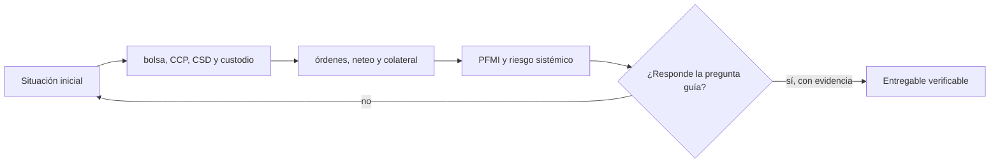

# Clase 51 · Infraestructura del mercado de capitales

> **Clase independiente 51 de 66** · **Nivel:** Avanzado · **Fuente base:** *Principles for Financial Market Infrastructures* (CPMI-IOSCO), publicaciones del BIS sobre liquidación y tokenización, y documentación pública de emisiones de valores digitales
>
> [⬅️ Clase anterior](../24-tokenizacion-rwa/clase-50-ciclo-de-vida-y-controles-de-rwa.md) · [📚 Índice de las 66 clases](../README.md) · [🗂️ Mapa del tema](README.md) · [➡️ Clase siguiente](../25-mercados-capitales-onchain/clase-52-mercado-tokenizado-y-dvp.md)

## Punto de partida

**Pregunta guía:** ¿Qué hacen emisión, negociación, compensación, depósito y liquidación?

**Caso que abre la clase:** Una operación se negocia hoy y liquida después con exposición bilateral.

Cada estudiante representa bolsa, CCP, CSD, custodio o banco de liquidación. Una falla muestra qué riesgo absorbe cada institución y por qué existe.

## Fundamentos que sostienen la respuesta

1. **bolsa, CCP, CSD y custodio.** En esta clase delimita qué objeto o relación estamos observando antes de sacar conclusiones. Localízalo explícitamente en «Una operación se negocia hoy y liquida después con exposición bilateral.» y anota qué dato faltaría para refutar tu lectura.
2. **órdenes, neteo y colateral.** En esta clase explica el mecanismo que conecta la situación inicial con el cambio observable. Localízalo explícitamente en «Una operación se negocia hoy y liquida después con exposición bilateral.» y anota qué dato faltaría para refutar tu lectura.
3. **PFMI y riesgo sistémico.** En esta clase permite contrastar el resultado y formular el límite de la evidencia. Localízalo explícitamente en «Una operación se negocia hoy y liquida después con exposición bilateral.» y anota qué dato faltaría para refutar tu lectura.

### Qué desaparece, qué permanece y qué aparece

**Desaparece (o se reduce mucho):**

- La conciliación entre registros: hay uno solo.
- La exposición entre pacto y liquidación, si es atómica.
- El coste operativo de repartir eventos corporativos a miles de titulares.
- La incertidumbre sobre quién era titular en la fecha de registro: es un bloque.

**Permanece, íntegro:**

- **Descubrimiento de precio.** Alguien tiene que estar dispuesto a comprar y vender.
- **Gestión del riesgo de contraparte antes de liquidar.** Si la operación se pacta antes de
  ejecutarse, la exposición existe aunque la liquidación sea atómica.
- **Cumplimiento**: elegibilidad del inversor, sanciones, informes al supervisor.
- **Responsabilidad ante error.** Alguien responde cuando algo sale mal; un contrato no
  indemniza.
- **El servicio del activo** de las [clases 49–50](../24-tokenizacion-rwa/README.md).

**Aparece, nuevo:**

- **Riesgo de contrato inteligente** sobre la infraestructura misma del mercado. Un fallo
  ya no afecta a un producto: afecta al registro de titularidad.
- **Gestión de llaves a escala institucional** ([clases 53–54](../26-custodia-identidad/README.md)).
- **Riesgo de disponibilidad de la red** y su congestión en el peor momento.
- **MEV sobre operaciones de valores**: una orden grande visible antes de ejecutarse.
- **La pregunta de gobernanza**: ¿quién puede actualizar los contratos que **son** el mercado?

### Funciones antes que instituciones

Emisión crea el valor y sus derechos; negociación encuentra contrapartes y precio; compensación calcula obligaciones; una CCP puede novar y gestionar incumplimiento; el depositario mantiene el registro central o coordina tenencias; liquidación transfiere valor y dinero con finalidad. Tokenizar puede combinar componentes técnicos, pero no elimina automáticamente las funciones de riesgo, gobierno y recurso legal.

Para evaluar una arquitectura, dibuja cada función y asigna responsable, activo, momento y evidencia. Si una bolsa desaparece de la interfaz, todavía debe existir formación de precio. Si se elimina una CCP, alguien conserva el riesgo bilateral. La mejora se mide en capital, liquidez, errores y tiempo, no en cantidad de intermediarios borrados del diagrama.

## Trabajo práctico

**Método propio:** mapa vivo de infraestructura financiera.

**Actividad:** Asignar cada evento y riesgo a la infraestructura responsable.

Trabaja en entorno local, regtest, signet o testnet según corresponda. Conserva entradas, comandos, salidas y bloque o instante de corte. Una captura aislada no demuestra reproducibilidad.

## Gráfico pedagógico

Recorre el gráfico en voz alta: identifica supuestos, transformaciones y el punto exacto donde aparece evidencia.

## Demostración de aprendizaje

**Entregable:** Mapa operativo que explique por qué existe cada intermediario.

**Comprobación formativa:** ¿Qué función no desaparece aunque desaparezca su intermediario actual?

Para aprobar debes conectar el hecho observado con el concepto correcto, descartar al menos una interpretación alternativa y redactar una conclusión cuyo alcance no exceda la prueba.

## Errores que esta clase corrige

- Tratar **bolsa, CCP, CSD y custodio** como una etiqueta suficiente, sin identificar actores, dato y frontera.
- Usar **órdenes, neteo y colateral** como explicación aunque el caso no aporte la evidencia necesaria.
- Dar por respondido «¿Qué hacen emisión, negociación, compensación, depósito y liquidación?» sin contrastar **PFMI y riesgo sistémico**.

Vuelve al caso inicial, elige el error más peligroso y describe una comprobación concreta que lo detectaría.

## Fuentes para comprobar y ampliar

- CPMI-IOSCO — *Principles for Financial Market Infrastructures*: <https://www.bis.org/cpmi/publ/d101.htm>
- BIS — trabajos sobre tokenización y liquidación de valores: <https://www.bis.org/>
- IOSCO — mercados de valores y activos digitales: <https://www.iosco.org/>
- Banco Central Europeo — TARGET2-Securities y liquidación de valores: <https://www.ecb.europa.eu/paym/target/t2s/html/index.en.html>
- CMF Chile — mercado de valores y regulación aplicable: <https://www.cmfchile.cl/>

Consulta además la [bibliografía razonada](../../docs/bibliografia.md), que declara procedencia y uso.

## Cierre de la clase

Responde otra vez la pregunta guía sin mirar notas. Si tu respuesta no menciona evidencia, supuesto y límite, todavía describe el tema pero no lo domina. Continúa solo cuando otra persona pueda reproducir tu entregable.
