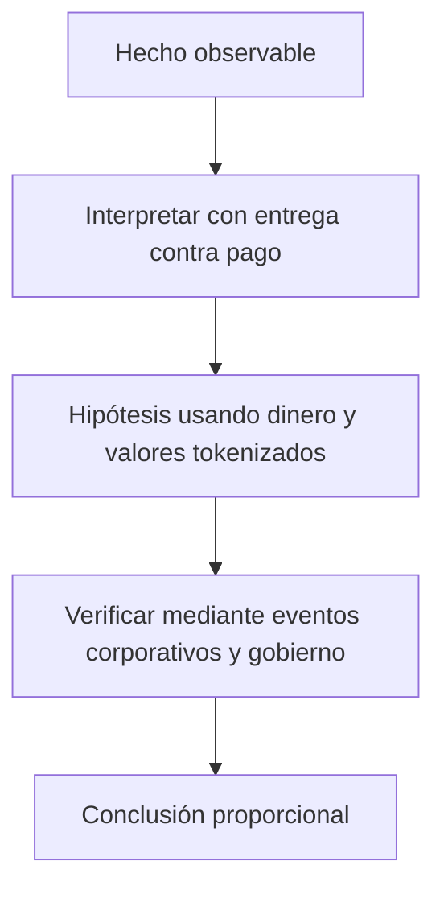

# Clase 52 · Mercado tokenizado y DvP

> **Clase independiente 52 de 66** · **Nivel:** Avanzado · **Fuente base:** *Principles for Financial Market Infrastructures* (CPMI-IOSCO), publicaciones del BIS sobre liquidación y tokenización, y documentación pública de emisiones de valores digitales
>
> [⬅️ Clase anterior](../25-mercados-capitales-onchain/clase-51-infraestructura-del-mercado-de-capitales.md) · [📚 Índice de las 66 clases](../README.md) · [🗂️ Mapa del tema](README.md) · [➡️ Clase siguiente](../26-custodia-identidad/clase-53-custodia-institucional-de-claves.md)

## Punto de partida

**Pregunta guía:** ¿Qué elimina la atomicidad y qué funciones institucionales permanecen?

**Caso que abre la clase:** Un bono se entrega on-chain, pero el efectivo queda en otro sistema.

Cuatro combinaciones de dinero y valor on/off-chain se evalúan con el mismo trade. La atomicidad se separa de custodia, finalidad legal y gobierno.

## Trabajo práctico

**Método propio:** diseño comparado de DvP.

**Actividad:** Comparar cuatro modelos de DvP y sus dependencias.

Trabaja en entorno local, regtest, signet o testnet según corresponda. Conserva entradas, comandos, salidas y bloque o instante de corte. Una captura aislada no demuestra reproducibilidad.

## Fundamentos que sostienen la respuesta

1. **entrega contra pago.** En esta clase delimita qué objeto o relación estamos observando antes de sacar conclusiones. Localízalo explícitamente en «Un bono se entrega on-chain, pero el efectivo queda en otro sistema.» y anota qué dato faltaría para refutar tu lectura.
2. **dinero y valores tokenizados.** En esta clase explica el mecanismo que conecta la situación inicial con el cambio observable. Localízalo explícitamente en «Un bono se entrega on-chain, pero el efectivo queda en otro sistema.» y anota qué dato faltaría para refutar tu lectura.
3. **eventos corporativos y gobierno.** En esta clase permite contrastar el resultado y formular el límite de la evidencia. Localízalo explícitamente en «Un bono se entrega on-chain, pero el efectivo queda en otro sistema.» y anota qué dato faltaría para refutar tu lectura.

### Cuánto cuesta realmente T+2

Una mesa negocia **500 millones al día**. Con liquidación a dos días hábiles, en cualquier
momento hay **hasta 1 000 millones** en operaciones pactadas y no liquidadas. Eso no es una
cifra teórica: es exposición viva que hay que cubrir con garantías, capital regulatorio y
límites por contraparte.

Con liquidación atómica, la exposición pendiente entre pacto y liquidación es **cero**: la
transferencia de valores y la de dinero ocurren en el mismo instante o no ocurren. El
ahorro no es la comisión de liquidación —es pequeña—: es el **capital que deja de estar
inmovilizado** y las garantías que dejan de exigirse.

Y ahora la parte que casi nunca se cuenta, y que decide si el proyecto es viable:

**El neteo desaparece con la liquidación atómica.** Hoy, mil operaciones entre los mismos
participantes se netean y se liquida el saldo. Liquidar cada una bruta exige tener el
efectivo y los valores completos en cada momento. Si esas mil operaciones suman 500 millones
brutos pero solo 40 millones netos, la liquidación atómica **multiplica por 12,5 la liquidez
necesaria**. Este es el intercambio real —el mismo que viste en las clases 41–42 entre LBTR y
neto diferido, ahora en valores— y explica por qué los diseños serios de mercado tokenizado
incorporan financiación intradía, ciclos de neteo o préstamo de valores automatizado. No es
un detalle de implementación: es **la** decisión de arquitectura del sistema.

### Los tres modelos de DvP y cuál implementa un contrato

| Modelo | Valores | Dinero | Ventaja | Coste |
|---|---|---|---|---|
| 1 | Bruto, operación a operación | Bruto | Sin exposición en ningún momento | Máxima liquidez requerida |
| 2 | Bruto | Neto al cierre | Menos liquidez de efectivo | Exposición intradía en la pata de dinero |
| 3 | Neto | Neto | Mínima liquidez | Exposición en ambas patas hasta el cierre |

Un contrato de intercambio atómico implementa **el modelo 1 en su forma más pura**: ambas
patas, operación a operación, simultáneas por construcción. Es la máxima seguridad y la
máxima exigencia de liquidez. Saber esto evita la confusión más común del sector: presentar
la liquidación atómica como "mejor que T+2" sin decir que compra esa mejora con liquidez, y
que por eso el mercado tradicional eligió deliberadamente no hacerlo así.

### Eventos corporativos: donde el contrato brilla

Pagar un cupón semestral del 4 % anual sobre 100 millones repartidos entre 8 000 titulares
es, hoy, un proceso de conciliación con custodios, retenciones y plazos. En un registro
compartido, el cálculo es trivial y el reparto es una función:

```text
cupón por título = 1 000 × 0,04 / 2 = 20 unidades
titulares al bloque de la fecha de registro = consulta directa
reparto = una transacción que itera o un mecanismo de reclamación
```

La eficiencia es real y medible. Los límites, también: la **retención fiscal** depende de la
residencia del titular, que no está en la cadena; y un reparto que itere sobre miles de
titulares puede no caber en un bloque, lo que obliga al patrón de **reclamación** (el
contrato reserva y cada titular retira) en vez de reparto activo. Son restricciones de
ingeniería conocidas con solución conocida — pero hay que diseñarlas, y el laboratorio del
estas clases las hacen explícitas.

> 💡 **En una frase:** la liquidación atómica no hace el mercado más barato por sí sola;
> **cambia coste de conciliación y riesgo de contraparte por necesidad de liquidez**, y si
> ese cambio conviene depende del mercado concreto.

<details>
<summary><strong>🎓 Si ya dominas esto</strong> — lo que decide un diseño real</summary>

- **Una CCP sigue teniendo sentido con liquidación atómica.** Su valor no es solo liquidar:
  es garantizar el cumplimiento entre el pacto y la ejecución, netear para reducir liquidez
  y gestionar el incumplimiento de un miembro de forma ordenada. Eliminar la liquidación no
  elimina esas tres funciones.
- **El préstamo de valores es el lubricante invisible.** Sin él, la liquidación bruta falla
  cuando el vendedor no tiene los títulos en el momento exacto. Un mercado tokenizado que no
  diseñe préstamo automatizado tendrá fallos de entrega, exactamente igual que el tradicional.
- **La firmeza jurídica exige designación normativa.** Que la transferencia sea irreversible
  técnicamente no la hace oponible en un concurso. Las infraestructuras reguladas que usan
  DLT mantienen esa designación y la anclan al evento en cadena.
- **Trocear una orden grande es obligatorio, no opcional.** La microestructura del
  [clases 39–40](../19-defi/README.md) se aplica igual: una orden que mueve el mercado se
  ejecuta peor, y ser visible antes de ejecutarse la empeora todavía más.
- **La fecha de registro como bloque tiene un borde.** En cadenas con finalidad
  probabilística, una reorganización cambiaría quién cobra. En un valor regulado eso es
  inaceptable, y es una razón técnica seria para elegir redes con finalidad determinista.
- **La interoperabilidad entre mercados tokenizados reproduce el problema del puente.** Dos
  registros compartidos distintos vuelven a necesitar conciliación entre ellos: el problema
  no se elimina, se mueve un nivel arriba.

</details>

## Gráfico pedagógico

Recorre el gráfico en voz alta: identifica supuestos, transformaciones y el punto exacto donde aparece evidencia.



## Errores que esta clase corrige

- Tratar **entrega contra pago** como una etiqueta suficiente, sin identificar actores, dato y frontera.
- Usar **dinero y valores tokenizados** como explicación aunque el caso no aporte la evidencia necesaria.
- Dar por respondido «¿Qué elimina la atomicidad y qué funciones institucionales permanecen?» sin contrastar **eventos corporativos y gobierno**.

Vuelve al caso inicial, elige el error más peligroso y describe una comprobación concreta que lo detectaría.

## Demostración de aprendizaje

**Entregable:** Diseño objetivo con riesgos nuevos, heredados y controles.

**Comprobación formativa:** ¿Qué evidencia demuestra entrega y pago bajo el mismo corte?

Para aprobar debes conectar el hecho observado con el concepto correcto, descartar al menos una interpretación alternativa y redactar una conclusión cuyo alcance no exceda la prueba.

## Fuentes para comprobar y ampliar

- CPMI-IOSCO — *Principles for Financial Market Infrastructures*: <https://www.bis.org/cpmi/publ/d101.htm>
- BIS — trabajos sobre tokenización y liquidación de valores: <https://www.bis.org/>
- IOSCO — mercados de valores y activos digitales: <https://www.iosco.org/>
- Banco Central Europeo — TARGET2-Securities y liquidación de valores: <https://www.ecb.europa.eu/paym/target/t2s/html/index.en.html>
- CMF Chile — mercado de valores y regulación aplicable: <https://www.cmfchile.cl/>

Consulta además la [bibliografía razonada](../../docs/bibliografia.md), que declara procedencia y uso.

## Cierre de la clase

Responde otra vez la pregunta guía sin mirar notas. Si tu respuesta no menciona evidencia, supuesto y límite, todavía describe el tema pero no lo domina. Continúa solo cuando otra persona pueda reproducir tu entregable.
