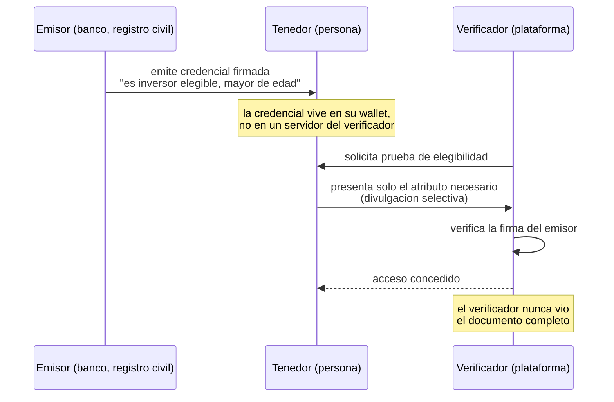

# 26 · Custodia, wallets institucionales e identidad digital

> **Nivel:** Avanzado · ⏱️ **Duración estimada:** 180 min · **Fuente:** BIPs 32/39/44, ERC-4337, estándares W3C de identificadores descentralizados y credenciales verificables, y normativa de custodia y finanzas abiertas citada
> [⬅️ Currículo](../README.md) · [📚 Bibliografía](../../docs/bibliografia.md)
> 🧭 ⬅️ **Anterior:** [25 · Mercados de capitales on-chain](../25-mercados-capitales-onchain/README.md) · [📚 Índice](../README.md) · ➡️ **Siguiente:** [27 · Regulación y cumplimiento](../27-regulacion-cumplimiento/README.md)
> 📖 [Glosario de términos](../../docs/glosario.md) · 🌱 [¿Nuevo en esto? Empieza aquí](../../docs/empieza-aqui.md)
> 👛 La versión para el usuario individual de este tema es la unidad transversal [Wallets desde cero](../../docs/wallets-desde-cero.md).

---

Todo lo que has construido en los siete módulos anteriores —stablecoins, depósitos
tokenizados, bonos, mercados— se reduce, al final, a **quién puede firmar**. La llave es el
activo. Y la pregunta institucional no es "¿cómo la guardo?" sino la mucho más difícil:
**¿cómo consigo que ninguna persona sola pueda mover fondos, que la operación siga siendo
posible si tres personas faltan, y que todo quede auditado?**

La segunda mitad del módulo es la otra cara de la misma moneda: si el token restringe
transferencias a inversores elegibles ([módulo 24](../24-tokenizacion-rwa/README.md)),
alguien tiene que **probar quién es quién** sin convertir cada operación en una fotocopia
del pasaporte. Ahí entran identidad descentralizada, credenciales verificables y las
finanzas abiertas.

## 🎯 Objetivos

- Clasificar los modelos de custodia por quién controla la llave y quién responde ante pérdida.
- Comparar multifirma, MPC y HSM por sus propiedades de seguridad, operación y traza.
- Diseñar una política de firma M-de-N con recuperación y separación de deberes.
- Explicar la derivación jerárquica de claves y su papel en la operación institucional.
- Distinguir identificador descentralizado, credencial verificable y divulgación selectiva.

## 📚 Resultados de aprendizaje

Al finalizar, el estudiante podrá:

1. **Elegir** un modelo de custodia justificándolo con importe, obligación normativa y perfil operativo.
2. **Diseñar** una política de cuórum que sobreviva a la pérdida de firmantes sin crear un punto único.
3. **Explicar** qué protege y qué no protege cada una de las tres tecnologías de firma.
4. **Documentar** una ceremonia de claves con sus controles y su evidencia.
5. **Modelar** un flujo de credencial verificable con emisor, tenedor y verificador.
6. **Situar** el consentimiento de finanzas abiertas frente al control de llaves, sin confundirlos.

## 🗺️ Temas

| # | Tema | Por qué importa |
|---|------|-----------------|
| 1 | Los cuatro modelos de custodia | Autocustodia, terceros, institucional, calificada |
| 2 | Temperatura: caliente, templada, fría | El intercambio entre disponibilidad y exposición |
| 3 | Multifirma on-chain | Política visible y auditable en el contrato |
| 4 | MPC: firma sin reconstruir la clave | Qué mejora y qué oculta |
| 5 | HSM y elemento seguro | La clave que nunca sale del hardware |
| 6 | Derivación jerárquica (BIP-32/39/44) | Una semilla, miles de cuentas, un solo respaldo |
| 7 | Cuentas inteligentes y abstracción de cuenta | Políticas programables sobre la propia cuenta |
| 8 | Ceremonias, rotación y recuperación | Lo que se ensaya antes de necesitarlo |
| 9 | Identidad descentralizada y credenciales verificables | Probar sin revelar de más |
| 10 | Finanzas abiertas y consentimiento | Otro modelo de autorización, no el mismo |

## 🧠 Modelo mental

Una llave privada es **la firma de un notario que no se puede falsificar y no se puede
revocar**. Quien la tiene, es. No hay atención al cliente, no hay "he sido yo, devuélvemelo"
y no hay tribunal que obligue a la cadena a deshacer lo firmado.

La custodia institucional consiste en repartir esa firma para que **nadie la tenga entera**
y en que, aun así, la organización pueda operar todos los días. Es el mismo problema que la
banca resolvió con cajas fuertes de doble llave y separación de funciones, con una diferencia
que lo cambia todo: **si se pierden todas las copias, no hay reemisión**. Un banco puede
reimprimir un cheque; nadie puede reemitir una clave privada.

Límite de la analogía: la doble llave física protege un objeto en un sitio; aquí lo que se
protege es la **capacidad de autorizar**, que puede ejercerse desde cualquier lugar del
mundo en cualquier momento. Por eso la política no es solo criptográfica: incluye quién,
cuándo, cuánto y hacia dónde.

## 🧩 Esquema visual

Los cuatro modelos, por control y por responsabilidad:

```mermaid
flowchart TD
    subgraph AUTO["Autocustodia"]
        A1["El usuario tiene la llave"] --> A2["Nadie mas puede mover"]
        A2 --> A3["Perdida = perdida total<br>sin recurso"]
    end
    subgraph TER["Custodia de tercero"]
        T1["El proveedor tiene la llave"] --> T2["Opera por cuenta del cliente"]
        T2 --> T3["Riesgo de contraparte<br>y de segregacion"]
    end
    subgraph INS["Custodia institucional"]
        I1["Llave repartida M-de-N"] --> I2["Politica, limites y traza"]
        I2 --> I3["Ninguna persona sola<br>puede mover fondos"]
    end
    subgraph CAL["Custodia calificada"]
        C1["Entidad autorizada"] --> C2["Segregacion y auditoria<br>exigidas por norma"]
        C2 --> C3["Supervision y seguro"]
    end
```



Credencial verificable: probar sin entregar el documento:



## 📖 Conceptos y definiciones

- **Autocustodia**: el usuario controla la clave. Máxima soberanía, **cero recurso** ante pérdida o error.
- **Custodia de tercero**: un proveedor controla la clave por cuenta del cliente. Aparece riesgo de contraparte y la pregunta clave: ¿están los activos **segregados** de los del custodio?
- **Custodia calificada**: la que presta una entidad autorizada bajo requisitos normativos de segregación, controles y auditoría. La categoría exacta y su nombre dependen de cada jurisdicción.
- **Caliente / templada / fría**: conectada a internet / conectada con controles / desconectada. Es un intercambio entre disponibilidad operativa y superficie de ataque.
- **Multifirma (multisig)**: la política M-de-N vive **en el contrato**. Es visible, auditable y verificable por cualquiera; cada firma queda registrada en la cadena.
- **MPC (computación multiparte)**: varias partes calculan conjuntamente una firma **sin que la clave completa exista nunca** en ningún sitio. La cadena ve una firma normal: la política no es visible on-chain.
- **HSM**: módulo criptográfico que genera y usa claves sin exponerlas, con control de acceso y registro de uso.
- **Semilla y frase mnemónica (BIP-39)**: entropía de la que derivan todas las claves. **Derivación jerárquica (BIP-32) y rutas (BIP-44)**: una semilla genera árboles de cuentas separadas por propósito.
- **Solo lectura (*watch-only*)**: seguimiento de saldos con la clave pública, sin capacidad de firma. Imprescindible para conciliación y contabilidad.
- **Cuenta inteligente / abstracción de cuenta (ERC-4337)**: la cuenta es un contrato con reglas propias (límites diarios, sesiones, recuperación social, pago de comisiones por un tercero).
- **Ceremonia de claves**: procedimiento presencial documentado para generar o rotar claves, con testigos, acta y respaldo verificado.
- **DID (identificador descentralizado)**: identificador controlado por su titular, resoluble a un documento con sus claves públicas.
- **Credencial verificable**: afirmación firmada por un emisor sobre un sujeto. **Divulgación selectiva**: presentar solo el atributo necesario, no la credencial entera.
- **Consentimiento (finanzas abiertas)**: autorización explícita, informada y revocable para que un tercero acceda a datos o inicie un pago **en tu nombre**. No confiere control de llaves: son mecanismos distintos.

## 🔬 Profundización

### Multifirma, MPC y HSM: qué protege cada uno

| Propiedad | Multifirma on-chain | MPC | HSM |
|---|---|---|---|
| ¿La clave completa existe alguna vez? | Sí (N claves distintas) | **No** | Sí, dentro del hardware |
| ¿La política es auditable públicamente? | **Sí**, en el contrato | No, es interna | No, es interna |
| Coste en comisiones | Mayor (varias firmas on-chain) | Igual que una firma simple | Igual que una firma simple |
| Compatibilidad entre cadenas | Depende del contrato de cada red | Alta: la firma es estándar | Alta |
| Rotación de firmantes | Transacción de gobernanza | Reparto nuevo sin cambiar la dirección | Cambio de política del módulo |
| Riesgo dominante | Bug del contrato | Implementación y proveedor | Acceso físico y operación |

La conclusión práctica no es cuál es mejor, sino **qué preguntas hacer**: con multifirma,
"¿el contrato está auditado y quién puede cambiar los firmantes?". Con MPC, "¿quién
implementó el protocolo, ha sido auditado, y qué pasa si el proveedor desaparece?". Con
HSM, "¿quién tiene acceso físico y cómo se registra cada uso?".

Y una advertencia que la experiencia del sector ha cobrado cara: **la mayoría de los
incidentes graves de custodia no fueron roturas criptográficas**. Fueron llaves con
demasiados permisos, firmantes concentrados en la misma organización o el mismo servidor,
interfaces de firma que mostraban algo distinto de lo que se firmaba, y compromisos de la
estación de trabajo del firmante. La política de cuórum solo protege si los firmantes son
**realmente independientes**: cinco llaves en cinco servidores del mismo administrador son
una llave con cinco copias.

### Diseñar el cuórum: la cuenta que casi nadie hace

Una política M-de-N tiene dos fallos posibles y opuestos:

- **M demasiado bajo** → un atacante que comprometa M firmantes mueve todo.
- **M demasiado alto** (o N demasiado bajo) → perder N−M+1 llaves **congela los fondos para
  siempre**. Este segundo fallo ha causado pérdidas comparables al primero y recibe una
  fracción de la atención.

Con **3 de 5**: soporta el compromiso de hasta 2 firmantes y la pérdida de hasta 2. Con
**2 de 3**: soporta 1 y 1. Con **5 de 7**: soporta 4 comprometidos pero solo 2 perdidos.

Y sobre esa base se construye lo demás, que es lo que convierte una configuración en una
política:

1. **Independencia real**: personas, dispositivos, ubicaciones y organizaciones distintas.
2. **Escalones por importe**: hasta X, 2 de 5; por encima, 4 de 5 y ventana temporal.
3. **Lista de destinos permitidos** para operaciones recurrentes; todo lo demás, cuórum alto.
4. **Retardo temporal** en cambios de política: un atacante con cuórum tiene que esperar, y
   ese tiempo es la única oportunidad de detección.
5. **Recuperación probada**: un firmante de respaldo cuya llave se ha usado **al menos una
   vez** en un ensayo. Un respaldo nunca probado no es un respaldo, es una suposición.

### Una semilla, un árbol, un respaldo

La derivación jerárquica resuelve un problema operativo real: una organización necesita
cientos de direcciones —por producto, por cliente, por finalidad— y respaldar cientos de
claves es inviable. Con BIP-32/39/44, **una sola semilla** genera un árbol determinista:

```text
m / 44' / 60' / 0' / 0 / 0     propósito / moneda / cuenta / cadena / índice
```

Cambiando el índice se obtienen direcciones distintas, sin relación pública entre ellas y
**todas recuperables del mismo respaldo**. La clave pública extendida permite además generar
direcciones de recepción y vigilar saldos **sin capacidad de firma**: contabilidad y
conciliación pueden trabajar sin tocar nunca material sensible.

El precio, y hay que decirlo claro: **la semilla es un punto único**. Quien la obtenga
controla el árbol entero. Por eso en entornos institucionales la semilla no es el sistema de
custodia sino un componente dentro de él, protegido por reparto (Shamir o MPC), hardware y
ceremonia. En los laboratorios de este programa **nunca** se guardan semillas reales: se
usan valores de prueba conocidos y documentados como tales.

### Identidad: probar sin entregar

El módulo 24 dejó un requisito abierto: el token restringe transferencias a inversores
elegibles, y alguien tiene que acreditar la elegibilidad. La solución ingenua —que cada
plataforma recoja y almacene documentos— crea un problema serio: **cada verificador se
convierte en un depósito de datos personales**, con su riesgo de filtración y su coste de
cumplimiento.

El modelo de credenciales verificables invierte la relación. Un **emisor** de confianza (un
banco que ya hizo la debida diligencia, un registro público) firma una afirmación sobre una
persona. El **tenedor** la guarda en su wallet. El **verificador** comprueba la firma del
emisor sin contactar con él y **sin recibir el documento**. Con divulgación selectiva —o con
las pruebas de conocimiento cero del [módulo 14](../14-privacidad-zk/README.md)— se puede
demostrar "soy mayor de edad" o "soy inversor elegible" sin revelar la fecha de nacimiento ni
el patrimonio.

Lo que este modelo **no** resuelve, y conviene no prometer: la revocación (¿sigue siendo
válida la credencial hoy?), la vinculación entre la persona y su llave, la recuperación si
pierde el dispositivo, y quién responde si el emisor certificó mal. Son problemas abiertos
con soluciones parciales, y presentarlos como resueltos es el error más común del sector de
identidad.

**Finanzas abiertas es otra cosa, y conviene no mezclarlas.** El consentimiento de un sistema
de finanzas abiertas —como el que establece en Chile la Ley 21.521, desarrollado en
[regulación chilena](../../regulation/chile/README.md)— autoriza a un tercero a **acceder a
datos o iniciar un pago en tu nombre** dentro del sistema bancario. Es autorización delegada
y revocable sobre una relación existente. Una llave privada es control directo e
irrevocable sobre un activo. Un producto que integre ambos mundos necesita las dos capas,
claramente separadas, y equivocarse al describirlas ante un usuario es un problema serio.

> 💡 **En una frase:** custodiar no es guardar una llave, es diseñar **quién puede
> autorizar qué, en cuánto tiempo y con qué evidencia** — y probar que sigue funcionando
> cuando faltan personas.

<details>
<summary><strong>🎓 Si ya dominas esto</strong> — lo que se descubre en el primer incidente</summary>

- **Firmar a ciegas es la vulnerabilidad más rentable.** Si el firmante no puede verificar
  de forma independiente qué autoriza, la seguridad del cuórum es cosmética: bastan
  interfaces comprometidas para que cinco personas firmen algo distinto de lo que leen.
  La mitigación es verificación fuera de banda del destino y del importe.
- **La rotación sin ensayo no existe.** Rotar firmantes es la operación más peligrosa del
  sistema: se ejecuta pocas veces, casi nunca se practica y un error deja los fondos
  inaccesibles. Debe ensayarse en un entorno idéntico antes de tocar producción.
- **La cuenta inteligente cambia el modelo de amenazas.** Límites diarios, listas de
  destinos y recuperación social son mejoras reales; a cambio, la lógica de la cuenta es
  código que puede tener errores y que alguien puede actualizar. Se gana flexibilidad y se
  añade una superficie que antes no existía.
- **La segregación se comprueba, no se cree.** Ante un custodio, la pregunta es si los
  activos están en cuentas separadas identificables como del cliente, y qué ocurriría en un
  concurso del custodio. La respuesta debe estar en un documento, no en una web comercial.
- **El respaldo es una copia más.** Cada copia de la semilla es una superficie de ataque.
  El reparto (Shamir, MPC) es preferible a la duplicación, y cada fragmento necesita su
  propio control físico y su propia traza.
- **La revocación de credenciales filtra información.** Consultar si una credencial sigue
  vigente puede revelar al emisor dónde se está usando. Las listas de revocación y los
  acumuladores criptográficos existen precisamente para evitarlo, y tienen su propio coste.

</details>

## 🧪 Laboratorio guiado

> 🧪 Estas prácticas están catalogadas y **resueltas paso a paso** en el [catálogo de laboratorios](../../labs/CATALOG.md).

1. **Política de cuórum, resistencia y congelación** — simula compromisos y pérdidas de
   firmantes sobre varias configuraciones M-de-N y escalones por importe:

```bash
pnpm lab:quorum
```

Comprueba lo que la intuición no da: pasar de **3 de 5** a **4 de 5** duplica la resistencia
al ataque y la paga con riesgo de congelación, mientras que pasar de **3 de 5** a **5 de 7**
la duplica **sin perder** tolerancia a la pérdida. Ampliar N es lo que compra las dos cosas.

2. Pruebas del bloque (junto con el resto de la suite):

```bash
pnpm test
```

3. **Ceremonia documentada.** Escribe el acta de una ceremonia de generación de claves:
   participantes y sus roles, sala y controles, hardware, verificación de la integridad del
   software, generación, reparto, verificación de cada fragmento, prueba de firma, custodia
   física y testigos. **Ensáyala con valores de prueba** y anota qué salió distinto del guion.

4. **Flujo de credencial verificable.** Modela sobre papel la elegibilidad de un inversor
   para el token restringido del módulo 24: quién emite, qué atributo se presenta, cómo se
   revoca y qué ve el verificador. Marca explícitamente qué datos **no** llegan a la
   plataforma.

## 📝 Reto verificable

Redacta la **política de custodia** de una tesorería institucional que mantiene activos
tokenizados y opera a diario. Debe incluir: modelo elegido con su justificación (importe,
obligación normativa, perfil operativo); tecnología de firma con las preguntas de auditoría
respondidas; configuración de cuórum con el análisis de resistencia a compromiso **y** a
pérdida; escalones por importe y destinos permitidos; separación de deberes nominal; guion
de ceremonia y de rotación; procedimiento de recuperación **probado**; y el modelo de
identidad para autorizar contrapartes.

**Criterio de aceptación:** la política resiste el compromiso de un firmante **y** la pérdida
de otro sin bloquear la operación; ninguna persona puede iniciar y aprobar la misma
operación; el procedimiento de recuperación indica cuándo se ensayó por última vez; y hay al
menos un control que detecta —no solo previene— una firma indebida.

## ⚠️ Errores frecuentes

| Síntoma | Causa y cómo comprobarlo |
|---------|--------------------------|
| "Tenemos multifirma, estamos seguros" | Si los firmantes no son independientes es una llave con copias |
| Fondos congelados por perder llaves | M demasiado alto o N demasiado bajo; recalcula con el laboratorio |
| Respaldo nunca probado | Un respaldo sin ensayo es una suposición; ensáyalo con valores de prueba |
| Firmar sin verificar el destino | Firma a ciegas; verifica importe y destino fuera de banda |
| "El custodio está regulado, hay segregación" | Compruébalo en documentación contractual, no en la web comercial |
| Confundir MPC con multifirma | MPC no expone política on-chain; multisig sí. Cambian las preguntas de auditoría |
| Guardar la semilla en gestor de contraseñas | Punto único con acceso remoto; usa reparto y hardware |
| Confundir consentimiento de finanzas abiertas con control de llave | Uno es autorización revocable, el otro control irrevocable |
| Emitir credenciales sin plan de revocación | Una credencial que no se puede revocar es válida para siempre |

## 🛡️ Seguridad y ética

- **En este repositorio nunca hay claves privadas ni semillas reales.** Los laboratorios usan
  valores de prueba conocidos y documentados como tales; el escaneo de secretos en CI lo
  comprueba en cada push.
- Nunca introduzcas una semilla real en un ordenador de desarrollo, ni siquiera "para
  probar". Los ensayos se hacen con valores de prueba en redes locales.
- La custodia de activos de terceros suele estar **regulada**. Prestar el servicio sin
  autorización puede constituir una infracción grave; consulta
  [módulo 27](../27-regulacion-cumplimiento/README.md) y la norma de tu jurisdicción.
- La identidad digital es dato personal: aplica minimización (pide solo el atributo
  necesario), limitación de finalidad y plazos de conservación. Recoger documentos "por si
  acaso" es un riesgo, no una precaución.
- Diseña pensando en la persona que pierde el dispositivo. Un sistema sin ruta de
  recuperación excluye a quien más protección necesita, y esa exclusión es una decisión de
  diseño aunque no se haya tomado conscientemente.

## 🔗 Referencias

- BIP-32 (derivación jerárquica), BIP-39 (mnemónicas) y BIP-44 (rutas): <https://github.com/bitcoin/bips>
- ERC-4337 — abstracción de cuenta: <https://eips.ethereum.org/EIPS/eip-4337>
- W3C — *Decentralized Identifiers (DIDs)*: <https://www.w3.org/TR/did-core/>
- W3C — *Verifiable Credentials Data Model*: <https://www.w3.org/TR/vc-data-model-2.0/>
- Safe — multifirma para tesorerías: <https://docs.safe.global/>
- NIST — gestión de claves criptográficas (SP 800-57): <https://csrc.nist.gov/projects/key-management>
- CMF Chile — Ley Fintech y Sistema de Finanzas Abiertas: <https://www.cmfchile.cl/>
- Documento del programa: [regulación chilena](../../regulation/chile/README.md) · [caso real de custodia](../../docs/casos-reales/ftx-custodia.md)

## ✅ Criterio de dominio

- Eliges modelo y tecnología de custodia con criterios explícitos y preguntas de auditoría.
- Diseñas un cuórum resistente a compromiso **y** a pérdida, y lo justificas con números.
- Documentas una ceremonia y un procedimiento de recuperación que has ensayado.
- Modelas un flujo de credencial verificable y dices qué datos no llegan al verificador.

---

## 🧭 Navegación

⬅️ [Módulo 25 · Mercados de capitales on-chain](../25-mercados-capitales-onchain/README.md) · [📚 Índice del currículo](../README.md) · ➡️ [Módulo 27 · Regulación y cumplimiento](../27-regulacion-cumplimiento/README.md)
