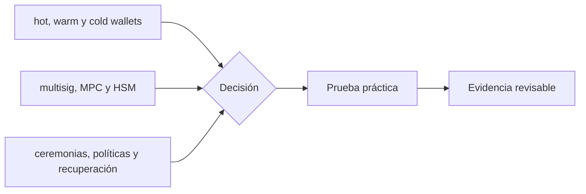

# Clase 53 · Custodia institucional de claves

> **Clase independiente 53 de 66** · **Nivel:** Avanzado · **Fuente base:** BIPs 32/39/44, ERC-4337, estándares W3C de identificadores descentralizados y credenciales verificables, y normativa de custodia y finanzas abiertas citada
>
> [⬅️ Clase anterior](../25-mercados-capitales-onchain/clase-52-mercado-tokenizado-y-dvp.md) · [📚 Índice de las 66 clases](../README.md) · [🗂️ Mapa del tema](README.md) · [➡️ Clase siguiente](../26-custodia-identidad/clase-54-identidad-y-autorizacion-verificable.md)

## Punto de partida

**Pregunta guía:** ¿Cómo se evita que una persona o falla única controle los activos?

**Caso que abre la clase:** Un firmante privilegiado y un proveedor de MPC quedan indisponibles a la vez.

Roles separados preparan, aprueban y firman una operación mientras fallan personas y proveedores. La arquitectura se mide por pérdida máxima y recuperación.

## Gráfico pedagógico

Recorre el gráfico en voz alta: identifica supuestos, transformaciones y el punto exacto donde aparece evidencia.



## Trabajo práctico

**Método propio:** ceremonia institucional de firma.

**Actividad:** Diseñar arquitectura por niveles de riesgo y volumen.

Trabaja en entorno local, regtest, signet o testnet según corresponda. Conserva entradas, comandos, salidas y bloque o instante de corte. Una captura aislada no demuestra reproducibilidad.

## Fundamentos que sostienen la respuesta

1. **hot, warm y cold wallets.** En esta clase delimita qué objeto o relación estamos observando antes de sacar conclusiones. Localízalo explícitamente en «Un firmante privilegiado y un proveedor de MPC quedan indisponibles a la vez.» y anota qué dato faltaría para refutar tu lectura.
2. **multisig, MPC y HSM.** En esta clase explica el mecanismo que conecta la situación inicial con el cambio observable. Localízalo explícitamente en «Un firmante privilegiado y un proveedor de MPC quedan indisponibles a la vez.» y anota qué dato faltaría para refutar tu lectura.
3. **ceremonias, políticas y recuperación.** En esta clase permite contrastar el resultado y formular el límite de la evidencia. Localízalo explícitamente en «Un firmante privilegiado y un proveedor de MPC quedan indisponibles a la vez.» y anota qué dato faltaría para refutar tu lectura.

### Multifirma, MPC y HSM: qué protege cada uno

| Propiedad | Multifirma on-chain | MPC | HSM |
|---|---|---|---|
| ¿La clave completa existe alguna vez? | Sí (N claves distintas) | **No** | Sí, dentro del hardware |
| ¿La política es auditable públicamente? | **Sí**, en el contrato | No, es interna | No, es interna |
| Coste en comisiones | Mayor (varias firmas on-chain) | Igual que una firma simple | Igual que una firma simple |
| Compatibilidad entre cadenas | Depende del contrato de cada red | Alta: la firma es estándar | Alta |
| Rotación de firmantes | Transacción de gobernanza | Reparto nuevo sin cambiar la dirección | Cambio de política del dispositivo |
| Riesgo dominante | Bug del contrato | Implementación y proveedor | Acceso físico y operación |

La conclusión práctica no es cuál es mejor, sino **qué preguntas hacer**: con multifirma,
"¿el contrato está auditado y quién puede cambiar los firmantes?". Con MPC, "¿quién
implementó el protocolo, ha sido auditado, y qué pasa si el proveedor desaparece?". Con
HSM, "¿quién tiene acceso físico y cómo se registra cada uso?".

Y una advertencia que la experiencia del sector ha cobrado cara: **la mayoría de los
incidentes graves de custodia no fueron roturas criptográficas**. Fueron llaves con
demasiados permisos, firmantes concentrados en la misma organización o el mismo servidor,
interfaces de firma que mostraban algo distinto de lo que se firmaba, y compromisos de la
estación de trabajo del firmante. La política de cuórum solo protege si los firmantes son
**realmente independientes**: cinco llaves en cinco servidores del mismo administrador son
una llave con cinco copias.

### Diseñar el cuórum: la cuenta que casi nadie hace

Una política M-de-N tiene dos fallos posibles y opuestos:

- **M demasiado bajo** → un atacante que comprometa M firmantes mueve todo.
- **M demasiado alto** (o N demasiado bajo) → perder N−M+1 llaves **congela los fondos para
  siempre**. Este segundo fallo ha causado pérdidas comparables al primero y recibe una
  fracción de la atención.

Con **3 de 5**: soporta el compromiso de hasta 2 firmantes y la pérdida de hasta 2. Con
**2 de 3**: soporta 1 y 1. Con **5 de 7**: soporta 4 comprometidos pero solo 2 perdidos.

Y sobre esa base se construye lo demás, que es lo que convierte una configuración en una
política:

1. **Independencia real**: personas, dispositivos, ubicaciones y organizaciones distintas.
2. **Escalones por importe**: hasta X, 2 de 5; por encima, 4 de 5 y ventana temporal.
3. **Lista de destinos permitidos** para operaciones recurrentes; todo lo demás, cuórum alto.
4. **Retardo temporal** en cambios de política: un atacante con cuórum tiene que esperar, y
   ese tiempo es la única oportunidad de detección.
5. **Recuperación probada**: un firmante de respaldo cuya llave se ha usado **al menos una
   vez** en un ensayo. Un respaldo nunca probado no es un respaldo, es una suposición.

### Una semilla, un árbol, un respaldo

La derivación jerárquica resuelve un problema operativo real: una organización necesita
cientos de direcciones —por producto, por cliente, por finalidad— y respaldar cientos de
claves es inviable. Con BIP-32/39/44, **una sola semilla** genera un árbol determinista:

```text
m / 44' / 60' / 0' / 0 / 0     propósito / moneda / cuenta / cadena / índice
```

Cambiando el índice se obtienen direcciones distintas, sin relación pública entre ellas y
**todas recuperables del mismo respaldo**. La clave pública extendida permite además generar
direcciones de recepción y vigilar saldos **sin capacidad de firma**: contabilidad y
conciliación pueden trabajar sin tocar nunca material sensible.

El precio, y hay que decirlo claro: **la semilla es un punto único**. Quien la obtenga
controla el árbol entero. Por eso en entornos institucionales la semilla no es el sistema de
custodia sino un componente dentro de él, protegido por reparto (Shamir o MPC), hardware y
ceremonia. En los laboratorios de este programa **nunca** se guardan semillas reales: se
usan valores de prueba conocidos y documentados como tales.

### Wallets dentro del problema

La custodia institucional amplía la wallet a políticas hot, warm y cold; multisig, MPC y HSM; preparación, aprobación, firma, recuperación y evidencia segregadas.

## Demostración de aprendizaje

**Entregable:** Política de firma con quórum, límites, recuperación y trazabilidad.

**Comprobación formativa:** ¿Qué combinación de fallas aún podría mover fondos sin autorización?

Para aprobar debes conectar el hecho observado con el concepto correcto, descartar al menos una interpretación alternativa y redactar una conclusión cuyo alcance no exceda la prueba.

## Errores que esta clase corrige

- Tratar **hot, warm y cold wallets** como una etiqueta suficiente, sin identificar actores, dato y frontera.
- Usar **multisig, MPC y HSM** como explicación aunque el caso no aporte la evidencia necesaria.
- Dar por respondido «¿Cómo se evita que una persona o falla única controle los activos?» sin contrastar **ceremonias, políticas y recuperación**.

Vuelve al caso inicial, elige el error más peligroso y describe una comprobación concreta que lo detectaría.

## Fuentes para comprobar y ampliar

- BIP-32 (derivación jerárquica), BIP-39 (mnemónicas) y BIP-44 (rutas): <https://github.com/bitcoin/bips>
- ERC-4337 — abstracción de cuenta: <https://eips.ethereum.org/EIPS/eip-4337>
- W3C — *Decentralized Identifiers (DIDs)*: <https://www.w3.org/TR/did-core/>
- W3C — *Verifiable Credentials Data Model*: <https://www.w3.org/TR/vc-data-model-2.0/>
- Safe — multifirma para tesorerías: <https://docs.safe.global/>
- NIST — gestión de claves criptográficas (SP 800-57): <https://csrc.nist.gov/projects/key-management>
- CMF Chile — Ley Fintech y Sistema de Finanzas Abiertas: <https://www.cmfchile.cl/>

Consulta además la [bibliografía razonada](../../docs/bibliografia.md), que declara procedencia y uso.

## Cierre de la clase

Responde otra vez la pregunta guía sin mirar notas. Si tu respuesta no menciona evidencia, supuesto y límite, todavía describe el tema pero no lo domina. Continúa solo cuando otra persona pueda reproducir tu entregable.
