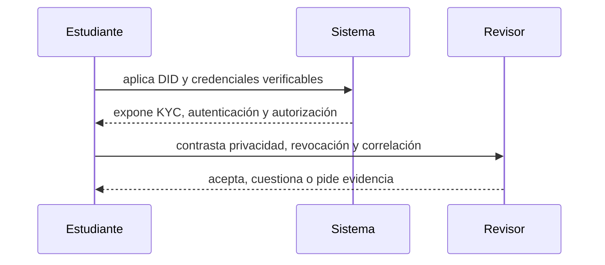

# Clase 54 · Identidad y autorización verificable

> **Clase independiente 54 de 66** · **Nivel:** Avanzado · **Fuente base:** BIPs 32/39/44, ERC-4337, estándares W3C de identificadores descentralizados y credenciales verificables, y normativa de custodia y finanzas abiertas citada
>
> [⬅️ Clase anterior](../26-custodia-identidad/clase-53-custodia-institucional-de-claves.md) · [📚 Índice de las 66 clases](../README.md) · [🗂️ Mapa del tema](README.md) · [➡️ Clase siguiente](../27-regulacion-cumplimiento/clase-55-leer-regulacion-desde-la-fuente.md)

## Punto de partida

**Pregunta guía:** ¿Cómo demostramos atributos sin convertir la wallet en una identidad universal?

**Caso que abre la clase:** Un inversor demuestra elegibilidad sin publicar todos sus datos personales.

Una persona demuestra elegibilidad sin convertir su dirección en expediente público. Identidad, credencial, wallet y autorización se modelan como objetos distintos.

## Fundamentos que sostienen la respuesta

1. **DID y credenciales verificables.** En esta clase delimita qué objeto o relación estamos observando antes de sacar conclusiones. Localízalo explícitamente en «Un inversor demuestra elegibilidad sin publicar todos sus datos personales.» y anota qué dato faltaría para refutar tu lectura.
2. **KYC, autenticación y autorización.** En esta clase explica el mecanismo que conecta la situación inicial con el cambio observable. Localízalo explícitamente en «Un inversor demuestra elegibilidad sin publicar todos sus datos personales.» y anota qué dato faltaría para refutar tu lectura.
3. **privacidad, revocación y correlación.** En esta clase permite contrastar el resultado y formular el límite de la evidencia. Localízalo explícitamente en «Un inversor demuestra elegibilidad sin publicar todos sus datos personales.» y anota qué dato faltaría para refutar tu lectura.

### Identidad: probar sin entregar

Las clases 49–50 dejaron un requisito abierto: el token restringe transferencias a inversores
elegibles, y alguien tiene que acreditar la elegibilidad. La solución ingenua —que cada
plataforma recoja y almacene documentos— crea un problema serio: **cada verificador se
convierte en un depósito de datos personales**, con su riesgo de filtración y su coste de
cumplimiento.

El modelo de credenciales verificables invierte la relación. Un **emisor** de confianza (un
banco que ya hizo la debida diligencia, un registro público) firma una afirmación sobre una
persona. El **tenedor** la guarda en su wallet. El **verificador** comprueba la firma del
emisor sin contactar con él y **sin recibir el documento**. Con divulgación selectiva —o con
las pruebas de conocimiento cero de las [clases 29–30](../14-privacidad-zk/README.md)— se puede
demostrar "soy mayor de edad" o "soy inversor elegible" sin revelar la fecha de nacimiento ni
el patrimonio.

Lo que este modelo **no** resuelve, y conviene no prometer: la revocación (¿sigue siendo
válida la credencial hoy?), la vinculación entre la persona y su llave, la recuperación si
pierde el dispositivo, y quién responde si el emisor certificó mal. Son problemas abiertos
con soluciones parciales, y presentarlos como resueltos es el error más común del sector de
identidad.

**Finanzas abiertas es otra cosa, y conviene no mezclarlas.** El consentimiento de un sistema
de finanzas abiertas —como el que establece en Chile la Ley 21.521, desarrollado en
[regulación chilena](../../regulation/chile/README.md)— autoriza a un tercero a **acceder a
datos o iniciar un pago en tu nombre** dentro del sistema bancario. Es autorización delegada
y revocable sobre una relación existente. Una llave privada es control directo e
irrevocable sobre un activo. Un producto que integre ambos mundos necesita las dos capas,
claramente separadas, y equivocarse al describirlas ante un usuario es un problema serio.

> 💡 **En una frase:** custodiar no es guardar una llave, es diseñar **quién puede
> autorizar qué, en cuánto tiempo y con qué evidencia** — y probar que sigue funcionando
> cuando faltan personas.

<strong>🎓 Si ya dominas esto</strong> — lo que se descubre en el primer incidente

- **Firmar a ciegas es la vulnerabilidad más rentable.** Si el firmante no puede verificar
  de forma independiente qué autoriza, la seguridad del cuórum es cosmética: bastan
  interfaces comprometidas para que cinco personas firmen algo distinto de lo que leen.
  La mitigación es verificación fuera de banda del destino y del importe.
- **La rotación sin ensayo no existe.** Rotar firmantes es la operación más peligrosa del
  sistema: se ejecuta pocas veces, casi nunca se practica y un error deja los fondos
  inaccesibles. Debe ensayarse en un entorno idéntico antes de tocar producción.
- **La cuenta inteligente cambia el modelo de amenazas.** Límites diarios, listas de
  destinos y recuperación social son mejoras reales; a cambio, la lógica de la cuenta es
  código que puede tener errores y que alguien puede actualizar. Se gana flexibilidad y se
  añade una superficie que antes no existía.
- **La segregación se comprueba, no se cree.** Ante un custodio, la pregunta es si los
  activos están en cuentas separadas identificables como del cliente, y qué ocurriría en un
  concurso del custodio. La respuesta debe estar en un documento, no en una web comercial.
- **El respaldo es una copia más.** Cada copia de la semilla es una superficie de ataque.
  El reparto (Shamir, MPC) es preferible a la duplicación, y cada fragmento necesita su
  propio control físico y su propia traza.
- **La revocación de credenciales filtra información.** Consultar si una credencial sigue
  vigente puede revelar al emisor dónde se está usando. Las listas de revocación y los
  acumuladores criptográficos existen precisamente para evitarlo, y tienen su propio coste.

### Wallets dentro del problema

Wallet e identidad se relacionan con minimización: una dirección no prueba identidad civil y una credencial no debería revelar más atributos que los necesarios.

## Gráfico pedagógico

Recorre el gráfico en voz alta: identifica supuestos, transformaciones y el punto exacto donde aparece evidencia.

## Demostración de aprendizaje

**Entregable:** Flujo de emisión y verificación con minimización y revocación.

**Comprobación formativa:** ¿Qué dato puede omitirse sin impedir verificar el atributo requerido?

Para aprobar debes conectar el hecho observado con el concepto correcto, descartar al menos una interpretación alternativa y redactar una conclusión cuyo alcance no exceda la prueba.

## Trabajo práctico

**Método propio:** diseño de divulgación mínima.

**Actividad:** Separar identidad, credencial, wallet y permiso de transferencia.

Trabaja en entorno local, regtest, signet o testnet según corresponda. Conserva entradas, comandos, salidas y bloque o instante de corte. Una captura aislada no demuestra reproducibilidad.

## Errores que esta clase corrige

- Tratar **DID y credenciales verificables** como una etiqueta suficiente, sin identificar actores, dato y frontera.
- Usar **KYC, autenticación y autorización** como explicación aunque el caso no aporte la evidencia necesaria.
- Dar por respondido «¿Cómo demostramos atributos sin convertir la wallet en una identidad universal?» sin contrastar **privacidad, revocación y correlación**.

Vuelve al caso inicial, elige el error más peligroso y describe una comprobación concreta que lo detectaría.

## Fuentes para comprobar y ampliar

- BIP-32 (derivación jerárquica), BIP-39 (mnemónicas) y BIP-44 (rutas): <https://github.com/bitcoin/bips>
- ERC-4337 — abstracción de cuenta: <https://eips.ethereum.org/EIPS/eip-4337>
- W3C — *Decentralized Identifiers (DIDs)*: <https://www.w3.org/TR/did-core/>
- W3C — *Verifiable Credentials Data Model*: <https://www.w3.org/TR/vc-data-model-2.0/>
- Safe — multifirma para tesorerías: <https://docs.safe.global/>
- NIST — gestión de claves criptográficas (SP 800-57): <https://csrc.nist.gov/projects/key-management>
- CMF Chile — Ley Fintech y Sistema de Finanzas Abiertas: <https://www.cmfchile.cl/>

Consulta además la [bibliografía razonada](../../docs/bibliografia.md), que declara procedencia y uso.

## Cierre de la clase

Responde otra vez la pregunta guía sin mirar notas. Si tu respuesta no menciona evidencia, supuesto y límite, todavía describe el tema pero no lo domina. Continúa solo cuando otra persona pueda reproducir tu entregable.
