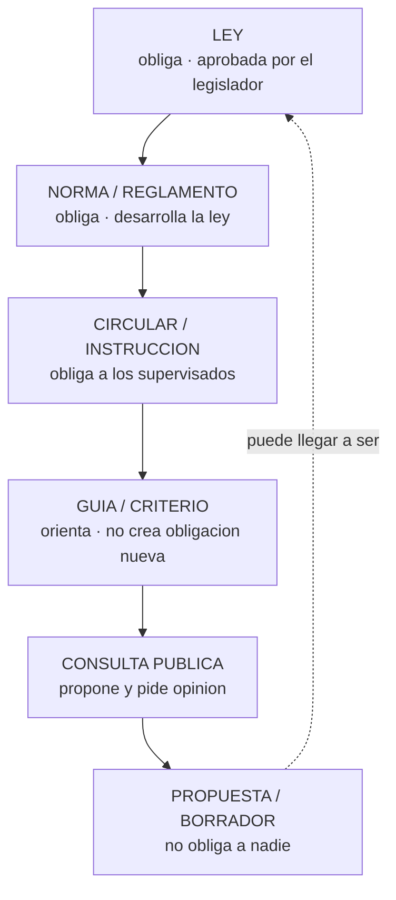
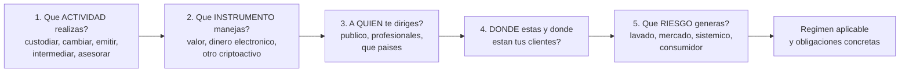

# 27 · Regulación y cumplimiento

> **Nivel:** Avanzado · ⏱️ **Duración estimada:** 180 min · **Fuente:** textos normativos oficiales (Reglamento MiCA, Ley 21.521 de Chile), Recomendaciones del GAFI/FATF, estándares del Comité de Basilea y de IOSCO
> [⬅️ Currículo](../README.md) · [📚 Bibliografía](../../docs/bibliografia.md)
> 🧭 ⬅️ **Anterior:** [26 · Custodia, wallets institucionales e identidad](../26-custodia-identidad/README.md) · [📚 Índice](../README.md) · ➡️ **Siguiente:** [28 · Blockchain Data Analytics y minería de datos on-chain](../28-data-analytics-onchain/README.md)
> 📖 [Glosario de términos](../../docs/glosario.md) · 🌱 [¿Nuevo en esto? Empieza aquí](../../docs/empieza-aqui.md)

---

Cierre de la etapa institucional, y el módulo que más disciplina exige: **la regulación no se
aprende de memoria, se aprende a leer**. Las normas cambian, difieren entre países y llegan
tarde a la tecnología. Lo que no cambia es la estructura: quién dicta qué, con qué rango,
sobre qué actividad, y qué obligación concreta genera.

El objetivo no es que sepas "lo que dice MiCA" —eso caduca—. Es que ante cualquier proyecto
sepas hacer **las cinco preguntas** que determinan su régimen, sepas dónde buscar la
respuesta en fuente primaria, y sepas distinguir una ley de una propuesta que aún no lo es.

> **Descargo.** Material **educativo**, no asesoría legal, tributaria ni regulatoria. El
> régimen aplicable depende de la actividad concreta, del instrumento, de la residencia de
> las partes y de hechos que solo un profesional puede valorar. Toda norma citada debe
> verificarse en su fuente oficial en el momento de usarla.

## 🎯 Objetivos

- Distinguir por rango y efecto: ley, norma, circular, guía, consulta pública y propuesta.
- Aplicar las cinco preguntas que determinan el régimen de un proyecto de activos digitales.
- Explicar la arquitectura de MiCA y sus tres categorías de criptoactivo.
- Aplicar el enfoque basado en riesgo del GAFI y explicar la Regla de Viaje.
- Situar el marco chileno vigente: Ley 21.521, CMF, UAF y Sistema de Finanzas Abiertas.

## 📚 Resultados de aprendizaje

Al finalizar, el estudiante podrá:

1. **Clasificar** un documento regulatorio por su rango y decir si obliga, orienta o solo propone.
2. **Determinar** qué actividades reguladas realiza un proyecto y cuáles no.
3. **Distinguir** ART, EMT y "otros criptoactivos" bajo MiCA, y por qué la categoría lo cambia todo.
4. **Diseñar** un programa de cumplimiento proporcionado al riesgo, no una lista de comprobación genérica.
5. **Explicar** la Regla de Viaje y sus problemas prácticos con wallets autoalojadas.
6. **Citar** normativa con fuente oficial, rango y fecha de consulta, sin presentar propuestas como derecho vigente.

## 🗺️ Temas

| # | Tema | Por qué importa |
|---|------|-----------------|
| 1 | Jerarquía de fuentes y su efecto | La distinción que evita desinformar |
| 2 | Las cinco preguntas del régimen | El método aplicable a cualquier jurisdicción |
| 3 | Actividad regulada vs. tecnología | Se regula lo que haces, no con qué lo haces |
| 4 | MiCA: arquitectura y categorías | El marco integral más desarrollado hoy |
| 5 | GAFI: activos virtuales, VASP y Regla de Viaje | El estándar global de prevención |
| 6 | AML/KYC/KYT en la práctica | Del principio al control ejecutable |
| 7 | Basilea/BIS: exposición prudencial | Qué le cuesta a un banco tener criptoactivos |
| 8 | IOSCO y protección del inversor | Mercados, conflictos de interés y conducta |
| 9 | Chile: Ley 21.521, CMF, UAF y finanzas abiertas | El marco de referencia del programa |
| 10 | Cumplimiento por diseño | Cómo se construye desde la primera línea |

## 🧠 Modelo mental

La regulación financiera no pregunta **qué tecnología usas**: pregunta **qué actividad
haces con dinero ajeno**. Custodiar, intermediar, cambiar, asesorar, emitir instrumentos,
gestionar una plataforma de negociación — cada una de esas actividades tiene reglas desde
mucho antes de que existieran las cadenas de bloques, y esas reglas se aplican por analogía
funcional.

La analogía útil: **el código de circulación no habla de motores eléctricos, habla de
conducir**. Cambiar el motor no te exime del límite de velocidad. Del mismo modo, ejecutar
la custodia con un contrato inteligente en vez de con una caja fuerte no cambia que estás
custodiando bienes ajenos.

Límite de la analogía, y es donde está la dificultad real: algunas configuraciones no
encajan limpiamente en ninguna categoría anterior —un protocolo sin operador identificable,
una wallet que no custodia pero facilita—. Ahí la respuesta honesta suele ser **"depende, y
está evolucionando"**, y sostener esa incomodidad sin inventarse certezas es exactamente lo
que este módulo enseña.

## 🧩 Esquema visual

Jerarquía de fuentes y su efecto real:



Las cinco preguntas que determinan el régimen de un proyecto:



## 📖 Conceptos y definiciones

- **Ley**: norma con rango legal aprobada por el poder legislativo. **Reglamento/norma de carácter general**: la desarrolla y también obliga. **Circular/instrucción**: obliga a las entidades supervisadas. **Guía/criterio**: orienta sobre cómo el supervisor interpreta, sin crear obligación nueva. **Consulta pública**: propuesta abierta a comentarios. **Propuesta o borrador**: no obliga a nadie.
- **Actividad regulada**: la que exige autorización, registro o cumplimiento de deberes, con independencia de la tecnología empleada.
- **MiCA**: Reglamento (UE) 2023/1114 sobre mercados de criptoactivos. Marco integral europeo con tres categorías y un régimen de proveedores.
- **ART (ficha referenciada a activos)**: criptoactivo que busca estabilidad refiriéndose a varias monedas, activos o cestas.
- **EMT (ficha de dinero electrónico)**: criptoactivo que busca estabilidad refiriéndose a **una sola** moneda oficial. Régimen próximo al del dinero electrónico, con redención a la par.
- **CASP (proveedor de servicios de criptoactivos)**: quien presta profesionalmente servicios como custodia, intercambio, ejecución, colocación, asesoramiento o gestión de plataforma.
- **GAFI/FATF**: organismo intergubernamental que fija los estándares globales contra el lavado de activos y la financiación del terrorismo. Sus Recomendaciones **no son derecho directo**: obligan a los países a incorporarlas.
- **Activo virtual y VASP**: definiciones del GAFI para el activo y para quien presta servicios sobre él.
- **Regla de Viaje**: obligación de que la información del ordenante y del beneficiario acompañe a la transferencia entre proveedores, por encima de determinados umbrales.
- **Enfoque basado en riesgo**: asignar controles proporcionalmente al riesgo evaluado, en vez de aplicar lo mismo a todo.
- **KYC / KYB / KYT**: conocer al cliente, conocer al negocio y **monitorizar la transacción**. El tercero es el específico de este entorno.
- **Wallet autoalojada**: la que controla directamente su titular, sin intermediario. Es el punto donde la Regla de Viaje encuentra su límite práctico.
- **Exposición a criptoactivos (Basilea)**: tratamiento prudencial de esas exposiciones en el capital de un banco, con clasificación por grupos según su respaldo y riesgo.

## 🔬 Profundización

### Las cinco preguntas, aplicadas

Un equipo construye una aplicación que permite comprar un token estable, mantenerlo y
enviarlo a otros usuarios. "Solo somos software", dicen. Apliquemos el método:

1. **¿Qué actividad?** Si la aplicación mantiene las claves de los usuarios, **custodia**.
   Si convierte moneda fiduciaria a token, **cambio**. Si cobra por ejecutar órdenes,
   **ejecución**. Ninguna de las tres depende de dónde corra el código.
2. **¿Qué instrumento?** Un token referido a una sola moneda oficial encaja en la categoría
   europea de EMT; uno que dé derecho a un rendimiento del esfuerzo ajeno probablemente sea
   un **valor**, con un régimen completamente distinto.
3. **¿A quién?** Público general activa protección al consumidor, requisitos de información
   y normas de comercialización que no aplican entre profesionales.
4. **¿Dónde?** El régimen sigue al cliente, no al servidor. Dirigirse activamente a
   residentes de un país suele bastar para quedar sujeto a su norma.
5. **¿Qué riesgo?** Lavado (siempre), mercado, operacional, y consumidor. Determina la
   intensidad de los controles.

**"Solo somos software" es una afirmación jurídica, no técnica**, y casi nunca resiste las
cinco preguntas cuando hay claves de terceros o conversión de moneda de por medio.

### MiCA: qué aporta y cómo está construido

MiCA es hoy el marco integral más desarrollado sobre criptoactivos y por eso se estudia
aquí como **modelo de arquitectura regulatoria**, no como norma aplicable universalmente.
Su estructura tiene tres piezas:

1. **Criptoactivos que no son ART ni EMT ni instrumentos financieros**: régimen ligero
   basado en un documento informativo (*white paper*) con requisitos de contenido y
   responsabilidad por su exactitud.
2. **ART y EMT**: régimen exigente —autorización, requisitos de reserva y de custodia de la
   reserva, derecho de redención a la par, información— proporcional al hecho de que son
   dinero para el usuario.
3. **CASP**: autorización, requisitos de capital y organización, custodia segregada,
   normas de conducta, gestión de conflictos y prevención del abuso de mercado.

Lo importante para un ingeniero no son los umbrales, que cambian: es la **lógica**. Cuanto
más se parezca tu producto a dinero o a un valor, más exigente el régimen; cuanto más
prestes un servicio sobre bienes de terceros, más se te trata como intermediario financiero.
Esa lógica se repite, con distinto vestido, en casi todas las jurisdicciones — y quien la
entiende puede orientarse en una norma que no ha leído nunca.

Un matiz decisivo: **si el instrumento ya es un instrumento financiero, MiCA no lo cubre**,
sino la normativa de mercados de valores. La primera pregunta ante un token nunca es "¿qué
dice MiCA?" sino "¿es esto un valor?".

### GAFI: enfoque basado en riesgo y el límite de la Regla de Viaje

El GAFI no dicta derecho: fija estándares que los países incorporan. Sus dos aportaciones
centrales aquí son las definiciones de **activo virtual** y **VASP**, y la extensión de la
Regla de Viaje a las transferencias de activos virtuales: la información de ordenante y
beneficiario debe acompañar a la transferencia entre proveedores.

Y aquí aparece la dificultad práctica que hay que entender de verdad. La Regla de Viaje
funciona entre dos proveedores identificados. **No hay a quién enviar la información cuando
el destino es una wallet autoalojada.** Las respuestas del sector son parciales y
verificables en distinto grado: pruebas de titularidad de la dirección, análisis de riesgo
de la contraparte, límites por importe. Ninguna reproduce el control que existe entre
entidades, y presentar el problema como resuelto es incorrecto.

El **enfoque basado en riesgo** es la otra idea que hay que interiorizar, porque es lo que
distingue un programa de cumplimiento serio de una lista de comprobación: los controles se
asignan **en proporción al riesgo evaluado**. Un cliente que opera importes pequeños entre
sus propias cuentas no requiere lo mismo que uno que recibe fondos de jurisdicciones de
alto riesgo. Aplicar lo máximo a todo el mundo no es prudente: es caro, excluyente y
desplaza la atención de donde el riesgo está de verdad.

El **KYT** —monitorización de la transacción— es la pieza específica de este entorno y una
de las pocas donde la transparencia del registro público juega a favor del cumplimiento:
permite analizar el origen de los fondos con un detalle que el sistema tradicional no tiene.
Esa misma capacidad tiene su contracara ética: es vigilancia financiera masiva sobre un
registro público y permanente, y merece ser tratada como tal.

### Basilea e IOSCO: cuando el que participa es un banco o un mercado

El Comité de Supervisión Bancaria de **Basilea** ha desarrollado un estándar de tratamiento
prudencial de las exposiciones de los bancos a criptoactivos, que los clasifica en grupos
según su naturaleza y respaldo, con requisitos de capital muy distintos: los activos
tradicionales tokenizados y las stablecoins que superan condiciones estrictas reciben un
tratamiento próximo al del activo subyacente, mientras que los criptoactivos sin respaldo
reciben el tratamiento más conservador. Consecuencia práctica: **para un banco, la
diferencia entre categorías no es doctrinal, es coste de capital**, y por eso los proyectos
bancarios se concentran en depósitos tokenizados y valores tokenizados.

**IOSCO** aporta la perspectiva de mercados: protección del inversor, integridad, conflictos
de interés y conducta. Su preocupación característica es la **integración vertical**: en el
mundo tradicional, negociar, custodiar, liquidar y hacer de creador de mercado son
actividades separadas por norma precisamente para evitar conflictos; muchas plataformas de
criptoactivos las concentran en una sola entidad. Ese es el foco de su trabajo, y ayuda a
entender por qué varios episodios de fracaso del sector tuvieron la misma forma.

### Chile: el marco de referencia del programa

El marco chileno se articula sobre la **Ley 21.521 (Ley Fintech)**, que define un conjunto
de servicios financieros sujetos a registro y supervisión de la **CMF**, e instaura el
**Sistema de Finanzas Abiertas**. A ello se suman la **UAF** en prevención de lavado, el
**SII** en materia tributaria y el **Banco Central de Chile** en sistemas de pago y en el
análisis de una eventual MDBC.

El detalle, con fuentes oficiales, fechas de revisión y la distinción de rango aplicada a
cada documento, está en [`regulation/chile/`](../../regulation/chile/README.md) y en
[`docs/chile-regulacion-tributacion.md`](../../docs/chile-regulacion-tributacion.md). La
regla de este programa es explícita: **ninguna afirmación regulatoria sin fuente oficial y
fecha de consulta**, y ninguna propuesta presentada como norma vigente.

> 💡 **En una frase:** no se regula la tecnología, se regula la actividad — así que la
> pregunta correcta nunca es "¿esto es legal?", sino "**¿qué actividad regulada estoy
> realizando y qué obligaciones genera?**".

<details>
<summary><strong>🎓 Si ya dominas esto</strong> — lo que decide un proyecto real</summary>

- **El arbitraje regulatorio tiene fecha de caducidad.** Establecerse donde no hay norma
  funciona hasta que la hay, y entonces hay que reconstruir el producto con clientes dentro.
  Diseñar para el régimen más exigente al que te vas a dirigir sale más barato que migrar.
- **La descentralización no es una defensa automática.** La pregunta del supervisor es si
  hay alguien que ejerce control determinante —claves de actualización, tesorería, interfaz,
  gobernanza concentrada—. Si lo hay, hay a quién exigir.
- **La interfaz cuenta.** En varias jurisdicciones, quien opera el sitio web por el que el
  usuario interactúa con un protocolo puede quedar sujeto a obligaciones aunque el protocolo
  sea ajeno. "Solo publicamos una interfaz" es una posición jurídica, no una exención.
- **El cumplimiento por diseño es más barato que el añadido.** Transferencia restringida
  desde el primer contrato, registro de eventos suficiente para auditar, y separación de
  deberes desde el primer despliegue cuestan poco al principio y son casi imposibles de
  retrofitear.
- **Retención de registros y derecho a la supresión chocan.** Las obligaciones de
  conservación de prevención de lavado conviven mal con la protección de datos personales, y
  peor aún con un registro inmutable. La solución habitual es **no poner datos personales en
  cadena** y anclar solo compromisos criptográficos.
- **Un supervisor pregunta por controles, no por tecnología.** Ante una inspección lo que se
  presenta es la política, la evidencia de que se aplica y el registro de excepciones. Un
  diagrama de arquitectura no sustituye a ninguna de las tres.

</details>

## 🧪 Laboratorio guiado

> 🧪 Estas prácticas están catalogadas y **resueltas paso a paso** en el [catálogo de laboratorios](../../labs/CATALOG.md).

1. **Cribado por riesgo y Regla de Viaje**, con la simulación determinista del repositorio:

```bash
pnpm lab:cumplimiento
```

Observa cómo el enfoque basado en riesgo asigna niveles distintos a operaciones distintas, y
qué ocurre cuando el destino es una wallet autoalojada: el flujo cambia porque **no hay
proveedor receptor al que enviar la información**.

2. Pruebas del bloque:

```bash
pnpm test
```

3. **Clasificación de fuentes.** Reúne cinco documentos regulatorios reales sobre activos
   digitales (de cualquier país) y clasifícalos por rango, indicando para cada uno: quién lo
   emite, a quién obliga, si crea obligaciones nuevas y su fecha. Al menos uno debe ser una
   consulta pública o propuesta, para practicar la distinción.

4. **Las cinco preguntas sobre tu capstone.** Aplícalas a lo que vas a construir en el
   proyecto final. Si la respuesta a alguna es "no lo sé", esa es exactamente la sección que
   tu documento de arquitectura debe tratar explícitamente.

## 📝 Reto verificable

Redacta el **análisis regulatorio** de un producto de activos digitales que definas
(puede ser tu capstone): descripción funcional; respuesta razonada a las cinco preguntas;
identificación de las actividades reguladas que realiza y las que no; régimen probable en
**dos jurisdicciones** (una de ellas Chile) con la fuente oficial de cada afirmación; programa
de cumplimiento proporcionado al riesgo con controles concretos y **dónde se implementa cada
uno** en la arquitectura; y una sección de **incertidumbres** con las preguntas que requieren
opinión legal profesional.

**Criterio de aceptación:** cada afirmación normativa cita fuente oficial, rango y fecha de
consulta; ninguna propuesta o consulta se presenta como norma vigente; los controles de
cumplimiento están ubicados en componentes concretos (contrato, middleware, alta de
cliente); y la sección de incertidumbres existe y **no está vacía** — un análisis sin dudas
es un análisis incompleto.

## ⚠️ Errores frecuentes

| Síntoma | Causa y cómo comprobarlo |
|---------|--------------------------|
| "Somos solo software, no aplica" | Se regula la actividad; aplica las cinco preguntas |
| Citar una propuesta como si obligara | Verifica el rango y si está en vigor |
| "Está descentralizado, no hay responsable" | Se busca quién ejerce control determinante; revisa claves y gobernanza |
| Confundir Recomendaciones del GAFI con derecho aplicable | Obligan a los países; lo aplicable es la norma nacional que las incorpora |
| Aplicar el máximo control a todos los clientes | Contradice el enfoque basado en riesgo; es caro y excluyente |
| Suponer que la Regla de Viaje cubre wallets autoalojadas | No hay proveedor receptor; el tratamiento es distinto y parcial |
| "MiCA regula todos los tokens" | Si es instrumento financiero, aplica normativa de valores, no MiCA |
| Guardar datos personales en cadena | Choca con protección de datos e inmutabilidad; ancla compromisos, no datos |
| Analizar el régimen al final del proyecto | Cumplimiento por diseño; retrofitear es caro o inviable |

## 🛡️ Seguridad y ética

- **Este módulo no sustituye asesoría legal.** Su objetivo es que sepas hacer las preguntas
  correctas y buscar en la fuente correcta, no que decidas sin abogado.
- Cita siempre **fuente oficial, rango y fecha**. Una afirmación regulatoria sin las tres
  cosas no es utilizable, ni siquiera si es correcta.
- El KYT es vigilancia financiera sobre un registro permanente. Aplica minimización, plazos
  de conservación y control de acceso: recoger más de lo necesario es un riesgo para las
  personas cuyos datos manejas, no una prudencia.
- Los controles de cumplimiento excluyen. Un umbral mal calibrado deja fuera del sistema a
  personas legítimas, con frecuencia las más vulnerables. La proporcionalidad no es solo un
  principio jurídico: es una responsabilidad de diseño.
- Diseñar para eludir controles de prevención de lavado o de sanciones no es innovación
  técnica: es participar en un delito, con independencia de qué permita el protocolo.

## 🔗 Referencias

- Reglamento (UE) 2023/1114 (MiCA) — EUR-Lex: <https://eur-lex.europa.eu/legal-content/ES/TXT/?uri=CELEX%3A32023R1114>
- GAFI/FATF — Recomendaciones y guía sobre activos virtuales y VASP: <https://www.fatf-gafi.org/>
- Comité de Basilea — normas prudenciales y publicaciones: <https://www.bis.org/bcbs/>
- IOSCO — recomendaciones sobre mercados de criptoactivos: <https://www.iosco.org/>
- CMF Chile — Ley Fintech, registro de prestadores y Sistema de Finanzas Abiertas: <https://www.cmfchile.cl/>
- UAF Chile — prevención de lavado de activos: <https://www.uaf.cl/>
- Biblioteca del Congreso Nacional de Chile — texto de la Ley 21.521: <https://www.bcn.cl/leychile>
- Documentos del programa: [regulación comparada](../../regulation/README.md) · [Chile](../../regulation/chile/README.md) · [casos reales](../../docs/casos-reales/README.md)

## ✅ Criterio de dominio

- Clasificas un documento regulatorio por rango y dices si obliga, orienta o propone.
- Aplicas las cinco preguntas a un proyecto y llegas a obligaciones concretas.
- Distingues las categorías de MiCA y sabes cuándo el régimen aplicable es otro.
- Citas normativa chilena e internacional con fuente oficial y fecha, sin confundir estados.

---

## 🧭 Navegación

⬅️ [Módulo 26 · Custodia, wallets institucionales e identidad](../26-custodia-identidad/README.md) · [📚 Índice del currículo](../README.md) · ➡️ [Módulo 28 · Blockchain Data Analytics y minería de datos on-chain](../28-data-analytics-onchain/README.md)
