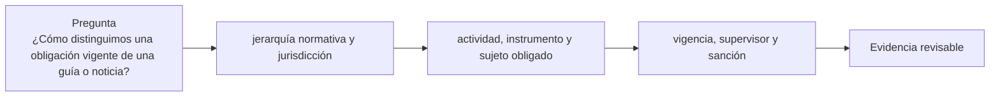

# Clase 55 · Leer regulación desde la fuente

> **Clase independiente 55 de 66** · **Nivel:** Avanzado · **Fuente base:** textos normativos oficiales (Reglamento MiCA, Ley 21.521 de Chile), Recomendaciones del GAFI/FATF, estándares del Comité de Basilea y de IOSCO
>
> [⬅️ Clase anterior](../26-custodia-identidad/clase-54-identidad-y-autorizacion-verificable.md) · [📚 Índice de las 66 clases](../README.md) · [🗂️ Mapa del tema](README.md) · [➡️ Clase siguiente](../27-regulacion-cumplimiento/clase-56-cumplimiento-basado-en-riesgo.md)

## Punto de partida

**Pregunta guía:** ¿Cómo distinguimos una obligación vigente de una guía o noticia?

**Caso que abre la clase:** Un resumen comercial presenta una consulta pública como ley aprobada.

Una afirmación pasa por noticia, resumen, guía, norma y artículo. El estudiante aprende a fechar, acotar jurisdicción y reconocer autoridad competente.

## Fundamentos que sostienen la respuesta

1. **jerarquía normativa y jurisdicción.** En esta clase delimita qué objeto o relación estamos observando antes de sacar conclusiones. Localízalo explícitamente en «Un resumen comercial presenta una consulta pública como ley aprobada.» y anota qué dato faltaría para refutar tu lectura.
2. **actividad, instrumento y sujeto obligado.** En esta clase explica el mecanismo que conecta la situación inicial con el cambio observable. Localízalo explícitamente en «Un resumen comercial presenta una consulta pública como ley aprobada.» y anota qué dato faltaría para refutar tu lectura.
3. **vigencia, supervisor y sanción.** En esta clase permite contrastar el resultado y formular el límite de la evidencia. Localízalo explícitamente en «Un resumen comercial presenta una consulta pública como ley aprobada.» y anota qué dato faltaría para refutar tu lectura.

### Las cinco preguntas, aplicadas

Un equipo construye una aplicación que permite comprar un token estable, mantenerlo y
enviarlo a otros usuarios. "Solo somos software", dicen. Apliquemos el método:

1. **¿Qué actividad?** Si la aplicación mantiene las claves de los usuarios, **custodia**.
   Si convierte moneda fiduciaria a token, **cambio**. Si cobra por ejecutar órdenes,
   **ejecución**. Ninguna de las tres depende de dónde corra el código.
2. **¿Qué instrumento?** Un token referido a una sola moneda oficial encaja en la categoría
   europea de EMT; uno que dé derecho a un rendimiento del esfuerzo ajeno probablemente sea
   un **valor**, con un régimen completamente distinto.
3. **¿A quién?** Público general activa protección al consumidor, requisitos de información
   y normas de comercialización que no aplican entre profesionales.
4. **¿Dónde?** El régimen sigue al cliente, no al servidor. Dirigirse activamente a
   residentes de un país suele bastar para quedar sujeto a su norma.
5. **¿Qué riesgo?** Lavado (siempre), mercado, operacional, y consumidor. Determina la
   intensidad de los controles.

**"Solo somos software" es una afirmación jurídica, no técnica**, y casi nunca resiste las
cinco preguntas cuando hay claves de terceros o conversión de moneda de por medio.

### MiCA: qué aporta y cómo está construido

MiCA es hoy el marco integral más desarrollado sobre criptoactivos y por eso se estudia
aquí como **modelo de arquitectura regulatoria**, no como norma aplicable universalmente.
Su estructura tiene tres piezas:

1. **Criptoactivos que no son ART ni EMT ni instrumentos financieros**: régimen ligero
   basado en un documento informativo (*white paper*) con requisitos de contenido y
   responsabilidad por su exactitud.
2. **ART y EMT**: régimen exigente —autorización, requisitos de reserva y de custodia de la
   reserva, derecho de redención a la par, información— proporcional al hecho de que son
   dinero para el usuario.
3. **CASP**: autorización, requisitos de capital y organización, custodia segregada,
   normas de conducta, gestión de conflictos y prevención del abuso de mercado.

Lo importante para un ingeniero no son los umbrales, que cambian: es la **lógica**. Cuanto
más se parezca tu producto a dinero o a un valor, más exigente el régimen; cuanto más
prestes un servicio sobre bienes de terceros, más se te trata como intermediario financiero.
Esa lógica se repite, con distinto vestido, en casi todas las jurisdicciones — y quien la
entiende puede orientarse en una norma que no ha leído nunca.

Un matiz decisivo: **si el instrumento ya es un instrumento financiero, MiCA no lo cubre**,
sino la normativa de mercados de valores. La primera pregunta ante un token nunca es "¿qué
dice MiCA?" sino "¿es esto un valor?".

### Basilea e IOSCO: cuando el que participa es un banco o un mercado

El Comité de Supervisión Bancaria de **Basilea** ha desarrollado un estándar de tratamiento
prudencial de las exposiciones de los bancos a criptoactivos, que los clasifica en grupos
según su naturaleza y respaldo, con requisitos de capital muy distintos: los activos
tradicionales tokenizados y las stablecoins que superan condiciones estrictas reciben un
tratamiento próximo al del activo subyacente, mientras que los criptoactivos sin respaldo
reciben el tratamiento más conservador. Consecuencia práctica: **para un banco, la
diferencia entre categorías no es doctrinal, es coste de capital**, y por eso los proyectos
bancarios se concentran en depósitos tokenizados y valores tokenizados.

**IOSCO** aporta la perspectiva de mercados: protección del inversor, integridad, conflictos
de interés y conducta. Su preocupación característica es la **integración vertical**: en el
mundo tradicional, negociar, custodiar, liquidar y hacer de creador de mercado son
actividades separadas por norma precisamente para evitar conflictos; muchas plataformas de
criptoactivos las concentran en una sola entidad. Ese es el foco de su trabajo, y ayuda a
entender por qué varios episodios de fracaso del sector tuvieron la misma forma.

### Chile: el marco de referencia del programa

El marco chileno se articula sobre la **Ley 21.521 (Ley Fintech)**, que define un conjunto
de servicios financieros sujetos a registro y supervisión de la **CMF**, e instaura el
**Sistema de Finanzas Abiertas**. A ello se suman la **UAF** en prevención de lavado, el
**SII** en materia tributaria y el **Banco Central de Chile** en sistemas de pago y en el
análisis de una eventual MDBC.

El detalle, con fuentes oficiales, fechas de revisión y la distinción de rango aplicada a
cada documento, está en [`regulation/chile/`](../../regulation/chile/README.md) y en
[`docs/chile-regulacion-tributacion.md`](../../docs/chile-regulacion-tributacion.md). La
regla de este programa es explícita: **ninguna afirmación regulatoria sin fuente oficial y
fecha de consulta**, y ninguna propuesta presentada como norma vigente.

> 💡 **En una frase:** no se regula la tecnología, se regula la actividad — así que la
> pregunta correcta nunca es "¿esto es legal?", sino "**¿qué actividad regulada estoy
> realizando y qué obligaciones genera?**".

<strong>🎓 Si ya dominas esto</strong> — lo que decide un proyecto real

- **El arbitraje regulatorio tiene fecha de caducidad.** Establecerse donde no hay norma
  funciona hasta que la hay, y entonces hay que reconstruir el producto con clientes dentro.
  Diseñar para el régimen más exigente al que te vas a dirigir sale más barato que migrar.
- **La descentralización no es una defensa automática.** La pregunta del supervisor es si
  hay alguien que ejerce control determinante —claves de actualización, tesorería, interfaz,
  gobernanza concentrada—. Si lo hay, hay a quién exigir.
- **La interfaz cuenta.** En varias jurisdicciones, quien opera el sitio web por el que el
  usuario interactúa con un protocolo puede quedar sujeto a obligaciones aunque el protocolo
  sea ajeno. "Solo publicamos una interfaz" es una posición jurídica, no una exención.
- **El cumplimiento por diseño es más barato que el añadido.** Transferencia restringida
  desde el primer contrato, registro de eventos suficiente para auditar, y separación de
  deberes desde el primer despliegue cuestan poco al principio y son casi imposibles de
  retrofitear.
- **Retención de registros y derecho a la supresión chocan.** Las obligaciones de
  conservación de prevención de lavado conviven mal con la protección de datos personales, y
  peor aún con un registro inmutable. La solución habitual es **no poner datos personales en
  cadena** y anclar solo compromisos criptográficos.
- **Un supervisor pregunta por controles, no por tecnología.** Ante una inspección lo que se
  presenta es la política, la evidencia de que se aplica y el registro de excepciones. Un
  diagrama de arquitectura no sustituye a ninguna de las tres.

## Gráfico pedagógico

Recorre el gráfico en voz alta: identifica supuestos, transformaciones y el punto exacto donde aparece evidencia.

## Trabajo práctico

**Método propio:** taller de trazabilidad normativa.

**Actividad:** Trazar una afirmación hasta norma, artículo, fecha y autoridad.

Trabaja en entorno local, regtest, signet o testnet según corresponda. Conserva entradas, comandos, salidas y bloque o instante de corte. Una captura aislada no demuestra reproducibilidad.

## Demostración de aprendizaje

**Entregable:** Ficha normativa con alcance, vigencia y enlace primario.

**Comprobación formativa:** ¿Qué dato falta para saber si el texto produce hoy una obligación exigible?

Para aprobar debes conectar el hecho observado con el concepto correcto, descartar al menos una interpretación alternativa y redactar una conclusión cuyo alcance no exceda la prueba.

## Errores que esta clase corrige

- Tratar **jerarquía normativa y jurisdicción** como una etiqueta suficiente, sin identificar actores, dato y frontera.
- Usar **actividad, instrumento y sujeto obligado** como explicación aunque el caso no aporte la evidencia necesaria.
- Dar por respondido «¿Cómo distinguimos una obligación vigente de una guía o noticia?» sin contrastar **vigencia, supervisor y sanción**.

Vuelve al caso inicial, elige el error más peligroso y describe una comprobación concreta que lo detectaría.

## Límite ético y legal de esta clase

La norma aplicable, la jurisdicción y la autoridad competente deben citarse; una interpretación del estudiante no se presenta como consejo jurídico ni como orden para bloquear activos.

Aplica la guía transversal [¿Y si cruzas la línea?](../../docs/y-si-cruzas-la-linea-blockchain.md) antes de proponer una intervención.

## Fuentes para comprobar y ampliar

- Reglamento (UE) 2023/1114 (MiCA) — EUR-Lex: <https://eur-lex.europa.eu/legal-content/ES/TXT/?uri=CELEX%3A32023R1114>
- GAFI/FATF — Recomendaciones vigentes: <https://www.fatf-gafi.org/en/publications/Fatfrecommendations/Fatf-recommendations.html>
- GAFI/FATF — actualización focalizada 2025 sobre implementación para activos virtuales y VASP: <https://www.fatf-gafi.org/content/dam/fatf-gafi/recommendations/2025-Targeted-Upate-VA-VASPs.pdf.coredownload.pdf>
- Comité de Basilea — normas prudenciales y publicaciones: <https://www.bis.org/bcbs/>
- IOSCO — recomendaciones sobre mercados de criptoactivos: <https://www.iosco.org/>
- CMF Chile — Ley Fintech, registro de prestadores y Sistema de Finanzas Abiertas: <https://www.cmfchile.cl/>
- UAF Chile — prevención de lavado de activos: <https://www.uaf.cl/>
- Biblioteca del Congreso Nacional de Chile — texto de la Ley 21.521: <https://www.bcn.cl/leychile>

Consulta además la [bibliografía razonada](../../docs/bibliografia.md), que declara procedencia y uso.

## Cierre de la clase

Responde otra vez la pregunta guía sin mirar notas. Si tu respuesta no menciona evidencia, supuesto y límite, todavía describe el tema pero no lo domina. Continúa solo cuando otra persona pueda reproducir tu entregable.
