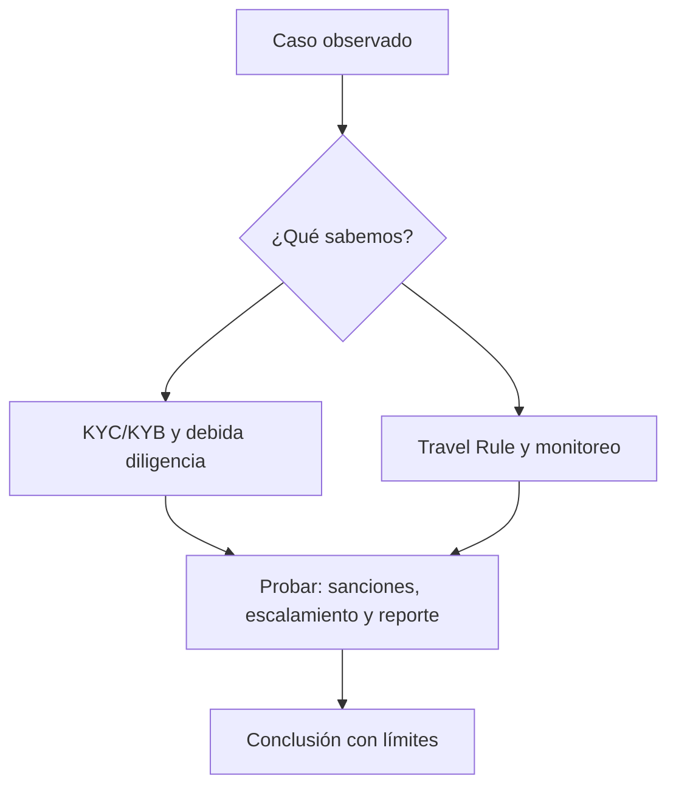

# Clase 56 · Cumplimiento basado en riesgo

> **Clase independiente 56 de 66** · **Nivel:** Avanzado · **Fuente base:** textos normativos oficiales (Reglamento MiCA, Ley 21.521 de Chile), Recomendaciones del GAFI/FATF, estándares del Comité de Basilea y de IOSCO
>
> [⬅️ Clase anterior](../27-regulacion-cumplimiento/clase-55-leer-regulacion-desde-la-fuente.md) · [📚 Índice de las 66 clases](../README.md) · [🗂️ Mapa del tema](README.md) · [➡️ Clase siguiente](../28-data-analytics-onchain/clase-57-extraer-y-normalizar-datos-on-chain.md)

## Punto de partida

**Pregunta guía:** ¿Qué controles responden al riesgo sin convertir toda señal en culpabilidad?

**Caso que abre la clase:** Una transacción toca una dirección de riesgo por varios saltos indirectos.

Se revisan señales con fuerza desigual y contexto incompleto. La decisión debe ser proporcional, revisable y documentada sin presentar heurísticas como culpabilidad.

## Gráfico pedagógico

Recorre el gráfico en voz alta: identifica supuestos, transformaciones y el punto exacto donde aparece evidencia.

## Fundamentos que sostienen la respuesta

1. **KYC/KYB y debida diligencia.** En esta clase delimita qué objeto o relación estamos observando antes de sacar conclusiones. Localízalo explícitamente en «Una transacción toca una dirección de riesgo por varios saltos indirectos.» y anota qué dato faltaría para refutar tu lectura.
2. **Travel Rule y monitoreo.** En esta clase explica el mecanismo que conecta la situación inicial con el cambio observable. Localízalo explícitamente en «Una transacción toca una dirección de riesgo por varios saltos indirectos.» y anota qué dato faltaría para refutar tu lectura.
3. **sanciones, escalamiento y reporte.** En esta clase permite contrastar el resultado y formular el límite de la evidencia. Localízalo explícitamente en «Una transacción toca una dirección de riesgo por varios saltos indirectos.» y anota qué dato faltaría para refutar tu lectura.

### GAFI: enfoque basado en riesgo y el límite de la Regla de Viaje

El GAFI no dicta derecho: fija estándares que los países incorporan. Sus dos aportaciones
centrales aquí son las definiciones de **activo virtual** y **VASP**, y la extensión de la
Regla de Viaje a las transferencias de activos virtuales: la información de ordenante y
beneficiario debe acompañar a la transferencia entre proveedores.

Y aquí aparece la dificultad práctica que hay que entender de verdad. La Regla de Viaje
funciona entre dos proveedores identificados. **No hay a quién enviar la información cuando
el destino es una wallet autoalojada.** Las respuestas del sector son parciales y
verificables en distinto grado: pruebas de titularidad de la dirección, análisis de riesgo
de la contraparte, límites por importe. Ninguna reproduce el control que existe entre
entidades, y presentar el problema como resuelto es incorrecto.

El **enfoque basado en riesgo** es la otra idea que hay que interiorizar, porque es lo que
distingue un programa de cumplimiento serio de una lista de comprobación: los controles se
asignan **en proporción al riesgo evaluado**. Un cliente que opera importes pequeños entre
sus propias cuentas no requiere lo mismo que uno que recibe fondos de jurisdicciones de
alto riesgo. Aplicar lo máximo a todo el mundo no es prudente: es caro, excluyente y
desplaza la atención de donde el riesgo está de verdad.

El **KYT** —monitorización de la transacción— es la pieza específica de este entorno y una
de las pocas donde la transparencia del registro público juega a favor del cumplimiento:
permite analizar el origen de los fondos con un detalle que el sistema tradicional no tiene.
Esa misma capacidad tiene su contracara ética: es vigilancia financiera masiva sobre un
registro público y permanente, y merece ser tratada como tal.

## Trabajo práctico

**Método propio:** comité de alertas con falsos positivos.

**Actividad:** Diseñar reglas, revisión humana y documentación de decisión.

Trabaja en entorno local, regtest, signet o testnet según corresponda. Conserva entradas, comandos, salidas y bloque o instante de corte. Una captura aislada no demuestra reproducibilidad.

## Errores que esta clase corrige

- Tratar **KYC/KYB y debida diligencia** como una etiqueta suficiente, sin identificar actores, dato y frontera.
- Usar **Travel Rule y monitoreo** como explicación aunque el caso no aporte la evidencia necesaria.
- Dar por respondido «¿Qué controles responden al riesgo sin convertir toda señal en culpabilidad?» sin contrastar **sanciones, escalamiento y reporte**.

Vuelve al caso inicial, elige el error más peligroso y describe una comprobación concreta que lo detectaría.

## Demostración de aprendizaje

**Entregable:** Matriz riesgo-control con falsos positivos, responsable y retención.

**Comprobación formativa:** ¿Qué evidencia adicional pedirías antes de escalar la alerta?

Para aprobar debes conectar el hecho observado con el concepto correcto, descartar al menos una interpretación alternativa y redactar una conclusión cuyo alcance no exceda la prueba.

## Límite ético y legal de esta clase

Una alerta inicia revisión proporcional. No prueba identidad, intención ni delito, y nunca debe producir automáticamente una acusación o sanción.

Aplica la guía transversal [¿Y si cruzas la línea?](../../docs/y-si-cruzas-la-linea-blockchain.md) antes de proponer una intervención.

## Fuentes para comprobar y ampliar

- Reglamento (UE) 2023/1114 (MiCA) — EUR-Lex: <https://eur-lex.europa.eu/legal-content/ES/TXT/?uri=CELEX%3A32023R1114>
- GAFI/FATF — Recomendaciones vigentes: <https://www.fatf-gafi.org/en/publications/Fatfrecommendations/Fatf-recommendations.html>
- GAFI/FATF — actualización focalizada 2025 sobre implementación para activos virtuales y VASP: <https://www.fatf-gafi.org/content/dam/fatf-gafi/recommendations/2025-Targeted-Upate-VA-VASPs.pdf.coredownload.pdf>
- Comité de Basilea — normas prudenciales y publicaciones: <https://www.bis.org/bcbs/>
- IOSCO — recomendaciones sobre mercados de criptoactivos: <https://www.iosco.org/>
- CMF Chile — Ley Fintech, registro de prestadores y Sistema de Finanzas Abiertas: <https://www.cmfchile.cl/>
- UAF Chile — prevención de lavado de activos: <https://www.uaf.cl/>
- Biblioteca del Congreso Nacional de Chile — texto de la Ley 21.521: <https://www.bcn.cl/leychile>

Consulta además la [bibliografía razonada](../../docs/bibliografia.md), que declara procedencia y uso.

## Cierre de la clase

Responde otra vez la pregunta guía sin mirar notas. Si tu respuesta no menciona evidencia, supuesto y límite, todavía describe el tema pero no lo domina. Continúa solo cuando otra persona pueda reproducir tu entregable.
