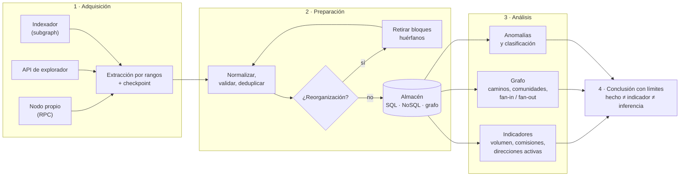

# 28 · Blockchain Data Analytics y minería de datos on-chain

> **Nivel:** Inicial → Avanzado · ⏱️ **Duración estimada:** 240 min · **Fuente:** documentación de Bitcoin Core y de ethereum.org, especificación JSON-RPC de Ethereum, *Mastering Bitcoin* (Antonopoulos) y las guías de FATF/GAFI sobre activos virtuales
> [⬅️ Currículo](../README.md) · [📚 Bibliografía](../../docs/bibliografia.md)
> 🧭 ⬅️ **Anterior:** [27 · Regulación y cumplimiento](../27-regulacion-cumplimiento/README.md) · [📚 Índice](../README.md) · ➡️ **Siguiente:** [🎓 Proyecto final](../../capstone/README.md)
> 📖 [Glosario de términos](../../docs/glosario.md) · 🌱 [¿Nuevo en esto? Empieza aquí](../../docs/empieza-aqui.md)

---

## 🎯 Objetivos

- Distinguir **minería de criptomonedas**, **minería de datos blockchain**, **blockchain analytics**, **on-chain analytics** y **blockchain intelligence**, y usar cada término donde corresponde.
- Leer un bloque y una transacción campo por campo, en el modelo **UTXO** (Bitcoin) y en el modelo de **cuentas** (Ethereum), y explicar qué revela y qué no revela cada uno.
- Construir una tubería de datos completa: extracción por RPC, normalización, validación, control de duplicados, manejo de reorganizaciones y almacenamiento consultable.
- Calcular indicadores on-chain (actividad, volumen, comisiones, concentración, métricas de token) sabiendo qué mide realmente cada uno y qué sobreestima.
- Modelar la actividad como un **grafo** y aplicar análisis de caminos, comunidades y patrones (fan-in, fan-out, cadena de pelado).
- Aplicar detección de anomalías y **evaluar el modelo con precisión, recall y falsos positivos**, explicando cada detección.
- Argumentar los límites éticos, técnicos y legales de la atribución de identidad, distinguiendo hecho, indicador, inferencia e hipótesis.

## 📚 Resultados de aprendizaje

Al finalizar, el estudiante podrá:

1. **Explicar** en una frase la diferencia entre minar criptomonedas y minar datos de una blockchain, sin confundir consenso con analítica.
2. **Comparar** una transacción UTXO y una de cuentas, identificando dónde vive el saldo, cómo se deduce la comisión y dónde está el importe de un token.
3. **Implementar** un extractor idempotente con checkpoint que sobreviva a un fallo transitorio y a una reorganización de cadena.
4. **Calcular** direcciones activas, volumen, comisiones y concentración, y **defender** por qué las cifras no equivalen a "usuarios" ni a "actividad económica".
5. **Construir** un grafo de direcciones y rastrear el recorrido de unos fondos, declarando el criterio de atribución empleado.
6. **Medir** un detector de anomalías con precisión y recall sobre una verdad de campo, y razonar el compromiso al mover el umbral.
7. **Redactar** una conclusión analítica separando lo observado de lo inferido, con sus limitaciones explícitas.

## 🗺️ Temas

| # | Tema | Por qué importa |
|---|------|-----------------|
| 1 | Minería de monedas vs. minería de datos | Son actividades distintas que comparten palabra: una produce bloques, la otra produce conocimiento. |
| 2 | Qué datos contiene realmente una cadena | Todo el análisis posterior depende de saber qué hay y qué nunca estuvo ahí. |
| 3 | UTXO frente a cuentas | El modelo de datos determina qué preguntas se pueden responder y con qué error. |
| 4 | Seudonimato frente a anonimato | La cadena es pública y persistente: no oculta, solo no nombra. |
| 5 | Adquisición: nodo, RPC, API e indexador | Cada fuente impone su propio sesgo, límite y coste. |
| 6 | Reorganizaciones y datos duplicados | Un ETL que ignora el reorg cuenta dinero que nunca se movió. |
| 7 | Eventos de contrato | La analítica de tokens vive en los logs, no en el campo `valor` de la transacción. |
| 8 | Indicadores on-chain | Una métrica mal entendida convence más que un error evidente. |
| 9 | Grafos de direcciones | Los movimientos son una red; las preguntas interesantes son de red. |
| 10 | Patrones y anomalías | Detectar es fácil; detectar sin ahogarse en falsos positivos, no. |
| 11 | Evaluación y explicabilidad | Sin métricas, un detector es una opinión con formato de informe. |
| 12 | Ética, privacidad y límites | La misma técnica sirve para proteger o para difamar. |

## 🧠 Modelo mental

Una blockchain pública es **un registro contable abierto, escrito con seudónimos y que nunca se borra**. Analizarla se parece más a la epidemiología que a la contabilidad: no puedes preguntar a los sujetos, no controlas el muestreo y solo observas rastros. Puedes decir con certeza *qué se movió, cuándo y entre qué identificadores*; puedes conjeturar con evidencia *qué comportamiento explica ese patrón*; y **no puedes concluir por tu cuenta quién es la persona detrás**, porque ese salto exige información que no está en la cadena.

**Los límites de la analogía.** A diferencia del epidemiólogo, aquí tienes el censo completo: no hay muestreo, están *todas* las transacciones. Eso engaña: la exhaustividad del dato hace sentir que la conclusión también es exhaustiva. No lo es. Tienes el 100 % de las transacciones y el 0 % de las intenciones.

## 🧩 Esquema visual



## 📖 Conceptos

- **Minería de criptomonedas**: proceso de consenso que valida transacciones y crea bloques a cambio de una recompensa. Produce **seguridad**, no conocimiento.
- **Minería de datos blockchain**: análisis de bloques, transacciones, direcciones, tokens, contratos y eventos para descubrir patrones. Produce **conocimiento**, no bloques.
- **Blockchain analytics**: análisis general de la actividad registrada en una o varias cadenas.
- **On-chain analytics**: subconjunto que se limita estrictamente a lo escrito en la cadena, sin datos externos.
- **Blockchain intelligence**: combina datos on-chain con reglas, etiquetas y fuentes externas (registros públicos, información de servicios) para evaluar comportamiento y riesgo. Es donde entran los juicios, y donde hay que ser más prudente.
- **UTXO**: salida de transacción no gastada. En Bitcoin el "saldo" es la suma de UTXO gastables; no existe un campo de saldo.
- **Salida de cambio**: la parte de una transacción UTXO que vuelve al remitente. Confundirla con un pago infla el volumen y falsea el análisis.
- **Modelo de cuentas**: en la EVM cada cuenta tiene saldo y `nonce`; la transacción resta de una y suma a otra.
- **Log / evento**: registro emitido por un contrato. La transferencia de un token ERC-20 vive aquí, no en el campo `valor`.
- **Mempool**: transacciones vistas pero no confirmadas. Pueden no confirmarse nunca o ser reemplazadas.
- **Reorganización (reorg)**: sustitución de bloques ya vistos por otra rama. Los bloques descartados quedan **huérfanos**.
- **ETL / ELT**: extraer-transformar-cargar o extraer-cargar-transformar; la diferencia es dónde ocurre la transformación y cuánto cuesta rehacerla.
- **Idempotencia**: propiedad de un proceso que, ejecutado dos veces con la misma entrada, no duplica el resultado. Imprescindible porque los reintentos y los reorgs re-entregan datos.
- **Fan-in / fan-out**: muchas direcciones convergen en una / una reparte a muchas.
- **Cadena de pelado (peel chain)**: secuencia en la que se desprenden importes pequeños y el resto sigue avanzando.
- **Agrupamiento de direcciones (clustering)**: heurística que atribuye varias direcciones a un mismo controlador. Es una **aproximación**, no un hecho.
- **Taint / marca**: propagación de la "procedencia" de unos fondos por el grafo. El resultado **depende del criterio** (proporcional, FIFO, LIFO, haircut).
- **Precisión y recall**: de lo que marqué, cuánto era correcto / de lo que había, cuánto encontré. Suben y bajan en sentidos opuestos al mover el umbral.
- **Falso positivo**: señalar como sospechoso algo legítimo. En este terreno tiene coste humano, no solo estadístico.

## 🔬 Profundización

### Nivel 1 — Fundamentos: qué hay dentro y qué nunca estuvo

La primera confusión que hay que desmontar es de vocabulario. **Minar criptomonedas** es competir por proponer el siguiente bloque y cobrar por ello: es una actividad de consenso, estudiada en el [módulo 03](../03-consenso/README.md). **Minar datos** de una blockchain es leer lo ya escrito para encontrar regularidades: es una actividad de análisis, y no produce ni una sola moneda. Comparten el verbo por herencia histórica del inglés *mining*, y nada más.

Un bloque contiene una cabecera (altura o número, hash propio, hash del bloque anterior, marca de tiempo, y en la EVM el gas usado y el límite) y una lista ordenada de transacciones. El **encadenamiento** por el hash previo es lo que hace que alterar un bloque antiguo invalide todos los posteriores. Dos campos se malinterpretan sistemáticamente. El primero es la **marca de tiempo**: la declara quien propone el bloque, dentro de un margen tolerado; es una aproximación útil para agregar por día, y una fuente de error si se usa para afirmar el orden exacto de dos hechos separados por segundos. El segundo son las **confirmaciones**: no son un sello de validez sino una medida de coste de reversión. Seis confirmaciones no significan "ya es definitivo"; significan "revertirlo ahora saldría muy caro".

La transacción es donde los dos modelos divergen. En **UTXO**, una transacción consume salidas anteriores y crea salidas nuevas; la comisión **no es un campo**, se deduce restando: entradas menos salidas. Cada salida se gasta entera, y por eso aparece la **salida de cambio**, que vuelve al remitente. Un analista novato suma todas las salidas y concluye que se movieron cantidades enormes: buena parte era cambio volviendo a su dueño. En el **modelo de cuentas**, la transacción declara `de`, `para`, `valor` y `nonce`, y la comisión es `gasUsado × precioGas`. Aquí la trampa es otra: en una transferencia de token ERC-20 el campo `valor` vale **cero**, porque lo que se mueve no es el activo nativo sino una anotación dentro de un contrato, publicada como **evento**. Quien analiza tokens leyendo `valor` concluye que no se movió nada.

Sobre la privacidad, el término correcto es **seudonimato**, no anonimato. Una dirección es un identificador estable sin nombre asociado; la cadena es pública, permanente y correlacionable. Reutilizar una dirección enlaza toda su historia, y un único punto de contacto con el mundo real (un servicio que conoce a su cliente, un pago publicado, una dirección puesta en una web) puede unir esa historia con una identidad. Lo que se puede saber públicamente son **movimientos entre identificadores**; lo que no se puede saber desde la cadena es **quién los controla, por qué motivo y con qué acuerdo detrás**.

### Nivel 2 — Adquisición y preparación: donde se pierden los datos

Hay cuatro fuentes y cada una impone su sesgo. Un **nodo propio** da el dato de primera mano y control total, a cambio de operarlo y almacenarlo ([módulo 16](../16-infraestructura-nodos/README.md)). Una **API de explorador** es cómoda y trae datos ya enriquecidos, pero introduce una dependencia, límites de tarifa y decisiones ajenas sobre qué es una "transferencia". Un **indexador** ([módulo 10](../10-oraculos-indexacion/README.md)) devuelve datos consultables por evento, pero solo los que alguien decidió indexar. La **mempool** ofrece lo que aún no se ha confirmado: útil para estudiar comportamiento y latencia, peligroso para contar dinero, porque lo pendiente puede no ocurrir nunca.

La extracción real es siempre **paginada y reanudable**. Un proveedor trunca las respuestas: pedir mil bloques puede devolver diez sin que eso sea un error, y un extractor que asume que recibió todo lo que pidió se salta bloques en silencio. Por eso se guarda un **checkpoint** (el último bloque consolidado) y se reanuda desde ahí, y por eso los reintentos deben ser **idempotentes**: si el mismo bloque llega dos veces, el almacén no puede duplicarlo. La clave primaria natural (el hash de la transacción) resuelve la mitad del problema; la otra mitad es la **reorganización**, en la que un bloque ya guardado deja de existir y otro ocupa su altura. Detectarla es comparar el `hashPrevio` del bloque nuevo con el hash que uno ya tiene almacenado; ignorarla significa contar transacciones que la cadena definitiva nunca incluyó.

La preparación termina en **normalización y validación**: unificar unidades (siempre unidades mínimas enteras, nunca decimales flotantes, para no perder precisión), derivar campos útiles (día, comisión efectiva), rechazar registros imposibles y dejar registrada la **procedencia**: de qué fuente, en qué rango de bloques y con qué versión del extractor. El almacén se elige según la pregunta: **SQL** para agregaciones y series temporales, **NoSQL** para documentos heterogéneos como los logs, y **base de grafos** cuando la pregunta es de caminos y vecindades. Es legítimo empezar en SQL y proyectar un grafo solo para las consultas que lo necesitan.

### Nivel 3 — Análisis on-chain: métricas que dicen menos de lo que parece

Los indicadores básicos son cuenta, volumen y comisiones. Todos son correctos y todos se malinterpretan. **Direcciones activas** no es "usuarios": una persona puede tener cientos de direcciones y un servicio puede atender a miles con una sola. **Direcciones nuevas** no es "adopción": crear una dirección es gratis y no requiere permiso. El **volumen** incluye auto-transferencias, cambio, movimientos internos de servicios y reequilibrios, así que sobreestima sistemáticamente la actividad económica. Las **comisiones** sí son un indicador honesto de demanda de espacio en bloque, porque cuestan dinero real. La **concentración** (cuota del top-N, índice de Herfindahl o Gini) mide desigualdad de tenencia entre *direcciones*, no entre *personas*: un exchange con una dirección enorme distorsiona la lectura por completo.

El salto cualitativo es pasar de contar a **modelar la red**. Cada dirección es un nodo, cada transferencia una arista dirigida y con peso; entonces se pueden hacer preguntas que la tabla no admite: ¿por dónde pasó este dinero?, ¿qué direcciones forman una comunidad?, ¿qué nodo es un cuello de botella? El grado de entrada y salida distingue de un vistazo a un **coleccionista** (muchas entradas) de un **distribuidor** (muchas salidas), y un nodo con grado altísimo suele ser un servicio con miles de clientes, no un sospechoso. El análisis temporal añade la dimensión que más discrimina: fondos que entran y salen en minutos, actividad concentrada en franjas horarias, o el patrón de **pelado** en el que un saldo va dejando migajas mientras el grueso avanza.

### Nivel 4 — Análisis avanzado: detectar, medir y no pasarse de la raya

Detectar anomalías es proponer una definición de "normal" y medir la distancia. El z-score (media y desviación) es intuitivo pero **frágil**: la propia anomalía infla la media y se auto-oculta. La regla de Tukey sobre mediana e intercuartil resiste mucho mejor los valores extremos. Ambos son transparentes, y esa transparencia vale más que la sofisticación: un detector que no puede explicar por qué marcó algo no se puede defender ante quien lo cuestiona ni corregir cuando se equivoca.

Medir es la parte que más se omite. Con una verdad de campo se calculan **precisión** (de lo marcado, cuánto era real), **recall** (de lo real, cuánto se marcó) y su compromiso: bajar el umbral encuentra más casos y multiplica los falsos positivos. Aquí un falso positivo no es un número, es una persona a la que se congela una cuenta. Y hay una honestidad adicional que enseñar: en una cadena real **el recall no se puede calcular**, porque nadie sabe qué se dejó de detectar; los números limpios de este módulo existen solo porque el dataset es sintético y los patrones fueron plantados a propósito.

El techo del método es la **atribución**. El agrupamiento de direcciones se apoya en heurísticas (entradas gastadas juntas, patrones de cambio) que fallan con servicios, coinjoins y contratos. El rastreo de fondos depende del criterio elegido —proporcional, FIFO, LIFO, haircut— y **el mismo movimiento produce conclusiones distintas según el criterio**, lo que basta para entender que un rastreo es un argumento, no una prueba. Cruzar cadenas mediante puentes añade una discontinuidad que solo se salva con supuestos. Por eso la disciplina profesional consiste en etiquetar cada afirmación: **hecho** (está en la cadena y es verificable), **indicador** (un patrón compatible con varias explicaciones), **inferencia** (una lectura razonada con supuestos declarados) e **hipótesis** (una conjetura pendiente de contraste). Un informe que mezcla las cuatro categorías en el mismo párrafo es, técnicamente, un informe falso.

<details>
<summary>🎓 Si ya dominas esto</summary>

- **Aprendizaje automático aplicado**: clasificación supervisada de direcciones por rasgos (grado, importes, ritmo temporal) y no supervisada para agrupar comportamiento. El obstáculo real no es el modelo: es el **etiquetado**, escaso, sesgado y caro. Un modelo entrenado con etiquetas de un solo proveedor aprende las decisiones de ese proveedor.
- **Desequilibrio de clases**: lo ilícito es una fracción diminuta del total, así que la exactitud (*accuracy*) es una métrica inútil — marcar "todo legítimo" acierta el 99,9 %. Se usan precisión-recall, área bajo la curva PR y matrices de coste asimétrico.
- **Comportamiento coordinado**: detección de sincronía temporal y de estructuras repetidas (*structuring*) sin caer en el sesgo de confirmación.
- **Análisis entre cadenas**: seguimiento conceptual por puentes; la correspondencia entre el depósito en la cadena A y la emisión en la B es una **inferencia por correlación de importe y tiempo**, no una continuidad verificable.
- **Privacidad**: mezcladores, CoinJoin y cadenas con privacidad nativa; qué se degrada del análisis y por qué existe una tensión legítima entre privacidad financiera y supervisión.
- **Forense**: cadena de custodia de la evidencia, reproducibilidad del análisis, versionado de datos y umbrales, y el papel de un perito que debe poder ser contrainterrogado sobre su método.
- **Regulación**: cómo encaja esto con el enfoque basado en riesgo, la Regla de Viaje y la protección de datos personales, tratado en el [módulo 27](../27-regulacion-cumplimiento/README.md).

</details>

## 🧪 Laboratorio guiado

Doce prácticas progresivas (**72 a 83** del [catálogo](../../labs/CATALOG.md)) sobre una **cadena sintética determinista** con dos modelos —UTXO y cuentas—, eventos de token, mempool, reorganizaciones y patrones plantados con su verdad de campo. Sin red, sin claves, sin fondos y sin datos personales. La resolución explicada de cada una está en el [cuaderno del bloque](../../labs/guides/07-data-analytics.md).

| Nivel | Prácticas | Comandos |
|---|---|---|
| 1 · Fundamentos | 72–73 | `pnpm lab:bloque` · `pnpm lab:tx-comparada` |
| 2 · Adquisición y preparación | 74–75 | `pnpm lab:extraccion` · `pnpm lab:normalizar` |
| 3 · Análisis on-chain | 76–80 | `pnpm lab:metricas-onchain` · `pnpm lab:eventos-token` · `pnpm lab:grafo` · `pnpm lab:rastreo` · `pnpm lab:patrones` |
| 4 · Avanzado y síntesis | 81–83 | `pnpm lab:anomalias` · `pnpm lab:panel` · `pnpm lab:explorador` |

Empieza por el primero, que es el que fija el vocabulario:

```bash
pnpm lab:bloque
```

## 🏁 Reto verificable

Construye tu propia detección de **cadena de pelado** con un criterio distinto al del laboratorio 80 (por ejemplo, exigiendo que el importe residual decrezca de forma monótona y que cada salto ocurra dentro de una ventana temporal que tú fijes) y **mídela** contra la verdad de campo del dataset con `evaluarDetecciones`.

**Criterio de aceptación:** tu detector alcanza al menos el mismo recall que el del laboratorio sobre la cadena plantada, declaras su precisión, e incluyes un párrafo explicando **un caso legítimo** que tu criterio marcaría por error. Añade tu prueba a `labs/28-data-analytics/` y comprueba que `pnpm test` sigue en verde.

## ⚠️ Errores frecuentes

| Síntoma | Causa real |
|---|---|
| "El volumen diario es enorme" | Se está sumando la **salida de cambio** (UTXO) o movimientos internos: no es actividad económica |
| "Las transferencias de este token valen 0" | Se lee `valor` de la transacción; el importe está en el **log** del evento `Transfer` |
| "Mi ETL cuenta más transacciones que el explorador" | No se retiran los bloques **huérfanos** tras una reorganización, o se reinsertan por reintentos no idempotentes |
| "Faltan bloques y no hubo ningún error" | La consulta por rango se **truncó** a la página máxima y se dio por completa |
| "Estas 5 000 direcciones activas son 5 000 usuarios" | Una persona tiene muchas direcciones y un servicio atiende a muchas personas con una |
| "El top-10 concentra el 60 %: hay una élite" | Las direcciones grandes suelen ser **custodios**: agregan a miles de clientes |
| "El modelo tiene 99 % de exactitud" | Clases desequilibradas: decir "todo legítimo" ya acierta casi siempre; hay que mirar precisión y recall |
| "El rastreo demuestra que esos fondos son los mismos" | Depende del **criterio de atribución**; con FIFO en vez de proporcional, la conclusión cambia |
| "Esta dirección es de esta persona" | La cadena no contiene identidades: eso es una inferencia con fuente externa, y hay que declararla |

## 🛡️ Seguridad y ética

Este módulo enseña técnicas de doble uso: las mismas que protegen a una víctima sirven para difamar a un inocente. Las reglas no son adorno:

- **Una dirección no es una persona.** La atribución requiere información fuera de la cadena y, según la jurisdicción, fundamento legal.
- **Correlación no es culpabilidad.** Recibir fondos de una dirección marcada no convierte a nadie en cómplice: los pagos entrantes no se eligen.
- **El agrupamiento es aproximado.** Las heurísticas fallan con servicios, contratos y protocolos de privacidad.
- **Todo modelo produce falsos positivos**, y aquí el coste lo paga una persona real. Publica siempre la tasa junto al resultado.
- **Nunca pidas ni manejes claves privadas o frases semilla**, ni siquiera "para verificar" ([Wallets desde cero](../../docs/wallets-desde-cero.md)).
- **Ningún laboratorio firma ni envía transacciones reales**: todo es dato sintético.
- **No intentes desanonimizar personas** sin fundamento legal; y si tu trabajo es legítimo, documenta el método para que pueda ser auditado y refutado.
- **Etiqueta cada afirmación** como hecho, indicador, inferencia o hipótesis. Es la diferencia entre un informe técnico y una acusación.
- El proyecto final es **material educativo**: no es una herramienta certificada para acusar, bloquear ni identificar a nadie.

## 🔗 Referencias

Fuentes primarias y documentación oficial, consultadas el **2026-08-24**:

| Título | Organización / autor | Enlace | Publicación | Tema del módulo |
|---|---|---|---|---|
| Bitcoin Core — Documentación y referencia RPC | Bitcoin Core | <https://bitcoincore.org/en/doc/> | continua | Niveles 1–2: bloques, transacciones, extracción |
| Bitcoin Developer Guide — Transactions | bitcoin.org | <https://developer.bitcoin.org/devguide/transactions.html> | continua | Nivel 1: modelo UTXO, cambio, comisiones |
| Ethereum JSON-RPC API Specification | Ethereum Foundation | <https://ethereum.org/en/developers/docs/apis/json-rpc/> | continua | Nivel 2: RPC, rangos, logs |
| Ethereum — Blocks | Ethereum Foundation | <https://ethereum.org/en/developers/docs/blocks/> | continua | Nivel 1: modelo de cuentas, gas |
| Ethereum — Accounts | Ethereum Foundation | <https://ethereum.org/en/developers/docs/accounts/> | continua | Nivel 1: cuentas, nonce, saldo |
| EIP-20 — Token Standard (evento `Transfer`) | Fabian Vogelsteller, Vitalik Buterin | <https://eips.ethereum.org/EIPS/eip-20> | 2015-11-19 | Nivel 3: eventos y métricas de token |
| The Graph — Documentación de subgraphs | The Graph | <https://thegraph.com/docs/en/> | continua | Nivel 2: indexadores |
| Updated Guidance for a Risk-Based Approach to Virtual Assets and VASPs | FATF/GAFI | <https://www.fatf-gafi.org/en/publications/Fatfrecommendations/Guidance-rba-virtual-assets-2021.html> | 2021-10-28 | Nivel 4: riesgo, límites regulatorios |
| *Mastering Bitcoin* (3.ª ed., libre) | Andreas M. Antonopoulos, David A. Harding | <https://github.com/bitcoinbook/bitcoinbook> | 2023 | Niveles 1 y 3: UTXO, privacidad, análisis |
| Bitcoin: A Peer-to-Peer Electronic Cash System (§10, privacidad) | Satoshi Nakamoto | <https://bitcoin.org/bitcoin.pdf> | 2008-10-31 | Nivel 1: seudonimato frente a anonimato |

Cómo se relaciona cada obra con el resto del programa: [bibliografía central](../../docs/bibliografia.md).

---

## 🧭 Navegación

⬅️ [Módulo 27 · Regulación y cumplimiento](../27-regulacion-cumplimiento/README.md) · [📚 Índice del currículo](../README.md) · ➡️ [🎓 Proyecto final](../../capstone/README.md)
