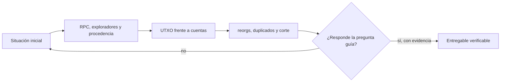

# Clase 57 · Extraer y normalizar datos on-chain

> **Clase independiente 57 de 66** · **Nivel:** Inicial → Avanzado · **Fuente base:** documentación de Bitcoin Core y de ethereum.org, especificación JSON-RPC de Ethereum, *Mastering Bitcoin* (Antonopoulos) y las guías de FATF/GAFI sobre activos virtuales
>
> [⬅️ Clase anterior](../27-regulacion-cumplimiento/clase-56-cumplimiento-basado-en-riesgo.md) · [📚 Índice de las 66 clases](../README.md) · [🗂️ Mapa del tema](README.md) · [➡️ Clase siguiente](../28-data-analytics-onchain/clase-58-grafo-anomalias-y-limites-de-atribucion.md)

## Punto de partida

**Pregunta guía:** ¿Cómo convertimos bloques y transacciones en un dataset reproducible?

**Caso que abre la clase:** Dos consultas del mismo rango difieren por una reorganización reciente.

El dataset se extrae dos veces alrededor de una reorganización. Procedencia, bloque de corte y deduplicación convierten una descarga en evidencia analizable.

## Fundamentos que sostienen la respuesta

1. **RPC, exploradores y procedencia.** En esta clase delimita qué objeto o relación estamos observando antes de sacar conclusiones. Localízalo explícitamente en «Dos consultas del mismo rango difieren por una reorganización reciente.» y anota qué dato faltaría para refutar tu lectura.
2. **UTXO frente a cuentas.** En esta clase explica el mecanismo que conecta la situación inicial con el cambio observable. Localízalo explícitamente en «Dos consultas del mismo rango difieren por una reorganización reciente.» y anota qué dato faltaría para refutar tu lectura.
3. **reorgs, duplicados y corte.** En esta clase permite contrastar el resultado y formular el límite de la evidencia. Localízalo explícitamente en «Dos consultas del mismo rango difieren por una reorganización reciente.» y anota qué dato faltaría para refutar tu lectura.

### Nivel 1 — Fundamentos: qué hay dentro y qué nunca estuvo

La primera confusión que hay que desmontar es de vocabulario. **Minar criptomonedas** es competir por proponer el siguiente bloque y cobrar por ello: es una actividad de consenso, estudiada en las [clases 7–8](../03-consenso/README.md). **Minar datos** de una blockchain es leer lo ya escrito para encontrar regularidades: es una actividad de análisis, y no produce ni una sola moneda. Comparten el verbo por herencia histórica del inglés *mining*, y nada más.

Un bloque contiene una cabecera (altura o número, hash propio, hash del bloque anterior, marca de tiempo, y en la EVM el gas usado y el límite) y una lista ordenada de transacciones. El **encadenamiento** por el hash previo es lo que hace que alterar un bloque antiguo invalide todos los posteriores. Dos campos se malinterpretan sistemáticamente. El primero es la **marca de tiempo**: la declara quien propone el bloque, dentro de un margen tolerado; es una aproximación útil para agregar por día, y una fuente de error si se usa para afirmar el orden exacto de dos hechos separados por segundos. El segundo son las **confirmaciones**: no son un sello de validez sino una medida de coste de reversión. Seis confirmaciones no significan "ya es definitivo"; significan "revertirlo ahora saldría muy caro".

La transacción es donde los dos modelos divergen. En **UTXO**, una transacción consume salidas anteriores y crea salidas nuevas; la comisión **no es un campo**, se deduce restando: entradas menos salidas. Cada salida se gasta entera, y por eso aparece la **salida de cambio**, que vuelve al remitente. Un analista novato suma todas las salidas y concluye que se movieron cantidades enormes: buena parte era cambio volviendo a su dueño. En el **modelo de cuentas**, la transacción declara `de`, `para`, `valor` y `nonce`, y la comisión es `gasUsado × precioGas`. Aquí la trampa es otra: en una transferencia de token ERC-20 el campo `valor` vale **cero**, porque lo que se mueve no es el activo nativo sino una anotación dentro de un contrato, publicada como **evento**. Quien analiza tokens leyendo `valor` concluye que no se movió nada.

Sobre la privacidad, el término correcto es **seudonimato**, no anonimato. Una dirección es un identificador estable sin nombre asociado; la cadena es pública, permanente y correlacionable. Reutilizar una dirección enlaza toda su historia, y un único punto de contacto con el mundo real (un servicio que conoce a su cliente, un pago publicado, una dirección puesta en una web) puede unir esa historia con una identidad. Lo que se puede saber públicamente son **movimientos entre identificadores**; lo que no se puede saber desde la cadena es **quién los controla, por qué motivo y con qué acuerdo detrás**.

### Nivel 2 — Adquisición y preparación: donde se pierden los datos

Hay cuatro fuentes y cada una impone su sesgo. Un **nodo propio** da el dato de primera mano y control total, a cambio de operarlo y almacenarlo ([clases 33–34](../16-infraestructura-nodos/README.md)). Una **API de explorador** es cómoda y trae datos ya enriquecidos, pero introduce una dependencia, límites de tarifa y decisiones ajenas sobre qué es una "transferencia". Un **indexador** ([clases 21–22](../10-oraculos-indexacion/README.md)) devuelve datos consultables por evento, pero solo los que alguien decidió indexar. La **mempool** ofrece lo que aún no se ha confirmado: útil para estudiar comportamiento y latencia, peligroso para contar dinero, porque lo pendiente puede no ocurrir nunca.

La extracción real es siempre **paginada y reanudable**. Un proveedor trunca las respuestas: pedir mil bloques puede devolver diez sin que eso sea un error, y un extractor que asume que recibió todo lo que pidió se salta bloques en silencio. Por eso se guarda un **checkpoint** (el último bloque consolidado) y se reanuda desde ahí, y por eso los reintentos deben ser **idempotentes**: si el mismo bloque llega dos veces, el almacén no puede duplicarlo. La clave primaria natural (el hash de la transacción) resuelve la mitad del problema; la otra mitad es la **reorganización**, en la que un bloque ya guardado deja de existir y otro ocupa su altura. Detectarla es comparar el `hashPrevio` del bloque nuevo con el hash que uno ya tiene almacenado; ignorarla significa contar transacciones que la cadena definitiva nunca incluyó.

La preparación termina en **normalización y validación**: unificar unidades (siempre unidades mínimas enteras, nunca decimales flotantes, para no perder precisión), derivar campos útiles (día, comisión efectiva), rechazar registros imposibles y dejar registrada la **procedencia**: de qué fuente, en qué rango de bloques y con qué versión del extractor. El almacén se elige según la pregunta: **SQL** para agregaciones y series temporales, **NoSQL** para documentos heterogéneos como los logs, y **base de grafos** cuando la pregunta es de caminos y vecindades. Es legítimo empezar en SQL y proyectar un grafo solo para las consultas que lo necesitan.

## Trabajo práctico

**Método propio:** pipeline reproducible por checkpoints.

**Actividad:** Construir pipeline incremental con checkpoints y validaciones.

Trabaja en entorno local, regtest, signet o testnet según corresponda. Conserva entradas, comandos, salidas y bloque o instante de corte. Una captura aislada no demuestra reproducibilidad.

## Gráfico pedagógico

Recorre el gráfico en voz alta: identifica supuestos, transformaciones y el punto exacto donde aparece evidencia.

## Demostración de aprendizaje

**Entregable:** Dataset con esquema, bloque de corte, hash y reglas de calidad.

**Comprobación formativa:** ¿Qué campos permiten reproducir exactamente el conjunto observado?

Para aprobar debes conectar el hecho observado con el concepto correcto, descartar al menos una interpretación alternativa y redactar una conclusión cuyo alcance no exceda la prueba.

## Errores que esta clase corrige

- Tratar **RPC, exploradores y procedencia** como una etiqueta suficiente, sin identificar actores, dato y frontera.
- Usar **UTXO frente a cuentas** como explicación aunque el caso no aporte la evidencia necesaria.
- Dar por respondido «¿Cómo convertimos bloques y transacciones en un dataset reproducible?» sin contrastar **reorgs, duplicados y corte**.

Vuelve al caso inicial, elige el error más peligroso y describe una comprobación concreta que lo detectaría.

## Fuentes para comprobar y ampliar

- Bitcoin Core — Documentación y referencia RPC — <https://bitcoincore.org/en/doc/>
- Bitcoin Developer Guide — Transactions — <https://developer.bitcoin.org/devguide/transactions.html>
- Ethereum JSON-RPC API Specification — <https://ethereum.org/en/developers/docs/apis/json-rpc/>
- Ethereum — Blocks — <https://ethereum.org/en/developers/docs/blocks/>
- Ethereum — Accounts — <https://ethereum.org/en/developers/docs/accounts/>
- EIP-20 — Token Standard (evento `Transfer`) — <https://eips.ethereum.org/EIPS/eip-20>
- The Graph — Documentación de subgraphs — <https://thegraph.com/docs/en/>
- Updated Guidance for a Risk-Based Approach to Virtual Assets and VASPs — <https://www.fatf-gafi.org/en/publications/Fatfrecommendations/Guidance-rba-virtual-assets.html>
- *Mastering Bitcoin* (3.ª ed., libre) — <https://github.com/bitcoinbook/bitcoinbook>
- Bitcoin: A Peer-to-Peer Electronic Cash System (§10, privacidad) — <https://bitcoin.org/bitcoin.pdf>

Consulta además la [bibliografía razonada](../../docs/bibliografia.md), que declara procedencia y uso.

## Cierre de la clase

Responde otra vez la pregunta guía sin mirar notas. Si tu respuesta no menciona evidencia, supuesto y límite, todavía describe el tema pero no lo domina. Continúa solo cuando otra persona pueda reproducir tu entregable.
