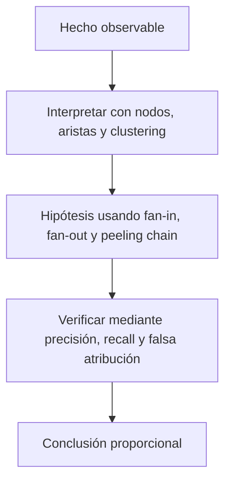

# Clase 58 · Grafo, anomalías y límites de atribución

> **Clase independiente 58 de 66** · **Nivel:** Inicial → Avanzado · **Fuente base:** documentación de Bitcoin Core y de ethereum.org, especificación JSON-RPC de Ethereum, *Mastering Bitcoin* (Antonopoulos) y las guías de FATF/GAFI sobre activos virtuales
>
> [⬅️ Clase anterior](../28-data-analytics-onchain/clase-57-extraer-y-normalizar-datos-on-chain.md) · [📚 Índice de las 66 clases](../README.md) · [🗂️ Mapa del tema](README.md) · [➡️ Clase siguiente](../29-exchanges-operaciones-custodia/clase-59-exchanges-custodia-y-libros-internos.md)

## Punto de partida

**Pregunta guía:** ¿Qué patrón observamos y qué identidad no podemos afirmar?

**Caso que abre la clase:** Un servicio compartido hace parecer relacionadas a personas independientes.

Cada patrón recibe al menos dos explicaciones posibles. Precisión y recall se conectan con el costo humano de una falsa atribución.

## Trabajo práctico

**Método propio:** investigación de grafo con hipótesis rivales.

**Actividad:** Construir grafo y clasificar hallazgos por fuerza de evidencia.

Trabaja en entorno local, regtest, signet o testnet según corresponda. Conserva entradas, comandos, salidas y bloque o instante de corte. Una captura aislada no demuestra reproducibilidad.

## Fundamentos que sostienen la respuesta

1. **nodos, aristas y clustering.** En esta clase delimita qué objeto o relación estamos observando antes de sacar conclusiones. Localízalo explícitamente en «Un servicio compartido hace parecer relacionadas a personas independientes.» y anota qué dato faltaría para refutar tu lectura.
2. **fan-in, fan-out y peeling chain.** En esta clase explica el mecanismo que conecta la situación inicial con el cambio observable. Localízalo explícitamente en «Un servicio compartido hace parecer relacionadas a personas independientes.» y anota qué dato faltaría para refutar tu lectura.
3. **precisión, recall y falsa atribución.** En esta clase permite contrastar el resultado y formular el límite de la evidencia. Localízalo explícitamente en «Un servicio compartido hace parecer relacionadas a personas independientes.» y anota qué dato faltaría para refutar tu lectura.

### Nivel 3 — Análisis on-chain: métricas que dicen menos de lo que parece

Los indicadores básicos son cuenta, volumen y comisiones. Todos son correctos y todos se malinterpretan. **Direcciones activas** no es "usuarios": una persona puede tener cientos de direcciones y un servicio puede atender a miles con una sola. **Direcciones nuevas** no es "adopción": crear una dirección es gratis y no requiere permiso. El **volumen** incluye auto-transferencias, cambio, movimientos internos de servicios y reequilibrios, así que sobreestima sistemáticamente la actividad económica. Las **comisiones** sí son un indicador honesto de demanda de espacio en bloque, porque cuestan dinero real. La **concentración** (cuota del top-N, índice de Herfindahl o Gini) mide desigualdad de tenencia entre *direcciones*, no entre *personas*: un exchange con una dirección enorme distorsiona la lectura por completo.

El salto cualitativo es pasar de contar a **modelar la red**. Cada dirección es un nodo, cada transferencia una arista dirigida y con peso; entonces se pueden hacer preguntas que la tabla no admite: ¿por dónde pasó este dinero?, ¿qué direcciones forman una comunidad?, ¿qué nodo es un cuello de botella? El grado de entrada y salida distingue de un vistazo a un **coleccionista** (muchas entradas) de un **distribuidor** (muchas salidas), y un nodo con grado altísimo suele ser un servicio con miles de clientes, no un sospechoso. El análisis temporal añade la dimensión que más discrimina: fondos que entran y salen en minutos, actividad concentrada en franjas horarias, o el patrón de **pelado** en el que un saldo va dejando migajas mientras el grueso avanza.

### Nivel 4 — Análisis avanzado: detectar, medir y no pasarse de la raya

Detectar anomalías es proponer una definición de "normal" y medir la distancia. El z-score (media y desviación) es intuitivo pero **frágil**: la propia anomalía infla la media y se auto-oculta. La regla de Tukey sobre mediana e intercuartil resiste mucho mejor los valores extremos. Ambos son transparentes, y esa transparencia vale más que la sofisticación: un detector que no puede explicar por qué marcó algo no se puede defender ante quien lo cuestiona ni corregir cuando se equivoca.

Medir es la parte que más se omite. Con una verdad de campo se calculan **precisión** (de lo marcado, cuánto era real), **recall** (de lo real, cuánto se marcó) y su compromiso: bajar el umbral encuentra más casos y multiplica los falsos positivos. Aquí un falso positivo no es un número, es una persona a la que se congela una cuenta. Y hay una honestidad adicional que enseñar: en una cadena real **el recall no se puede calcular**, porque nadie sabe qué se dejó de detectar; los números limpios de esta unidad de clases existen solo porque el dataset es sintético y los patrones fueron plantados a propósito.

El techo del método es la **atribución**. El agrupamiento de direcciones se apoya en heurísticas (entradas gastadas juntas, patrones de cambio) que fallan con servicios, coinjoins y contratos. El rastreo de fondos depende del criterio elegido —proporcional, FIFO, LIFO, haircut— y **el mismo movimiento produce conclusiones distintas según el criterio**, lo que basta para entender que un rastreo es un argumento, no una prueba. Cruzar cadenas mediante puentes añade una discontinuidad que solo se salva con supuestos. Por eso la disciplina profesional consiste en etiquetar cada afirmación: **hecho** (está en la cadena y es verificable), **indicador** (un patrón compatible con varias explicaciones), **inferencia** (una lectura razonada con supuestos declarados) e **hipótesis** (una conjetura pendiente de contraste). Un informe que mezcla las cuatro categorías en el mismo párrafo es, técnicamente, un informe falso.

🎓 Si ya dominas esto

- **Aprendizaje automático aplicado**: clasificación supervisada de direcciones por rasgos (grado, importes, ritmo temporal) y no supervisada para agrupar comportamiento. El obstáculo real no es el modelo: es el **etiquetado**, escaso, sesgado y caro. Un modelo entrenado con etiquetas de un solo proveedor aprende las decisiones de ese proveedor.
- **Desequilibrio de clases**: lo ilícito es una fracción diminuta del total, así que la exactitud (*accuracy*) es una métrica inútil — marcar "todo legítimo" acierta el 99,9 %. Se usan precisión-recall, área bajo la curva PR y matrices de coste asimétrico.
- **Comportamiento coordinado**: detección de sincronía temporal y de estructuras repetidas (*structuring*) sin caer en el sesgo de confirmación.
- **Análisis entre cadenas**: seguimiento conceptual por puentes; la correspondencia entre el depósito en la cadena A y la emisión en la B es una **inferencia por correlación de importe y tiempo**, no una continuidad verificable.
- **Privacidad**: mezcladores, CoinJoin y cadenas con privacidad nativa; qué se degrada del análisis y por qué existe una tensión legítima entre privacidad financiera y supervisión.
- **Forense**: cadena de custodia de la evidencia, reproducibilidad del análisis, versionado de datos y umbrales, y el papel de un perito que debe poder ser contrainterrogado sobre su método.
- **Regulación**: cómo encaja esto con el enfoque basado en riesgo, la Regla de Viaje y la protección de datos personales, tratado en las [clases 55–56](../27-regulacion-cumplimiento/README.md).

## Gráfico pedagógico

Recorre el gráfico en voz alta: identifica supuestos, transformaciones y el punto exacto donde aparece evidencia.

## Errores que esta clase corrige

- Tratar **nodos, aristas y clustering** como una etiqueta suficiente, sin identificar actores, dato y frontera.
- Usar **fan-in, fan-out y peeling chain** como explicación aunque el caso no aporte la evidencia necesaria.
- Dar por respondido «¿Qué patrón observamos y qué identidad no podemos afirmar?» sin contrastar **precisión, recall y falsa atribución**.

Vuelve al caso inicial, elige el error más peligroso y describe una comprobación concreta que lo detectaría.

## Demostración de aprendizaje

**Entregable:** Informe que separe hecho, indicador, inferencia e hipótesis.

**Comprobación formativa:** Reescribe una acusación como hecho, indicador, inferencia e hipótesis separados.

Para aprobar debes conectar el hecho observado con el concepto correcto, descartar al menos una interpretación alternativa y redactar una conclusión cuyo alcance no exceda la prueba.

## Límite ético y legal de esta clase

Un grafo produce relaciones técnicas e indicadores. Atribuir una persona exige evidencia externa legítima, alternativas examinadas y revisión humana autorizada.

Aplica la guía transversal [¿Y si cruzas la línea?](../../docs/y-si-cruzas-la-linea-blockchain.md) antes de proponer una intervención.

## Fuentes para comprobar y ampliar

- Bitcoin Core — Documentación y referencia RPC — <https://bitcoincore.org/en/doc/>
- Bitcoin Developer Guide — Transactions — <https://developer.bitcoin.org/devguide/transactions.html>
- Ethereum JSON-RPC API Specification — <https://ethereum.org/en/developers/docs/apis/json-rpc/>
- Ethereum — Blocks — <https://ethereum.org/en/developers/docs/blocks/>
- Ethereum — Accounts — <https://ethereum.org/en/developers/docs/accounts/>
- EIP-20 — Token Standard (evento `Transfer`) — <https://eips.ethereum.org/EIPS/eip-20>
- The Graph — Documentación de subgraphs — <https://thegraph.com/docs/en/>
- Updated Guidance for a Risk-Based Approach to Virtual Assets and VASPs — <https://www.fatf-gafi.org/en/publications/Fatfrecommendations/Guidance-rba-virtual-assets.html>
- *Mastering Bitcoin* (3.ª ed., libre) — <https://github.com/bitcoinbook/bitcoinbook>
- Bitcoin: A Peer-to-Peer Electronic Cash System (§10, privacidad) — <https://bitcoin.org/bitcoin.pdf>

Consulta además la [bibliografía razonada](../../docs/bibliografia.md), que declara procedencia y uso.

## Cierre de la clase

Responde otra vez la pregunta guía sin mirar notas. Si tu respuesta no menciona evidencia, supuesto y límite, todavía describe el tema pero no lo domina. Continúa solo cuando otra persona pueda reproducir tu entregable.
