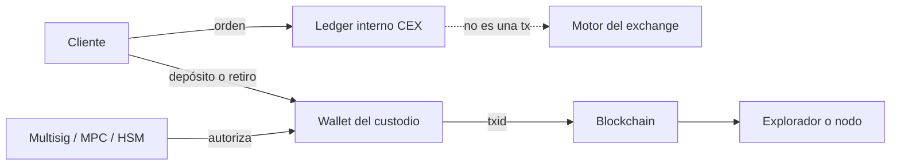

# Exchanges y operaciones de custodia · Clases 59–60

> **Nivel:** Profesional · ⏱️ **Duración estimada:** 180 min · **Fuente:** documentación técnica de Bitcoin y Ethereum, estándares de gestión de claves de NIST y principios de custodia del IOSCO
>
> [⬅️ Currículo](../README.md) · [🌱 Empieza aquí](../../docs/empieza-aqui.md) · [📖 Glosario](../../docs/glosario.md) · [📚 Bibliografía](../../docs/bibliografia.md)
> 🧭 ⬅️ **Anterior:** [Clases 57–58 · Blockchain Data Analytics](../28-data-analytics-onchain/README.md) · [📚 Índice](../README.md) · ➡️ **Siguiente:** [Clases 61–62 · Contabilidad blockchain y conciliación](../30-contabilidad-conciliacion/README.md)

<!-- clases-independientes:inicio -->
## Las dos clases independientes de este tema

Esta página conserva el mapa, los conceptos compartidos y las referencias. La enseñanza evaluable ocurre en dos documentos separados; cada uno tiene fundamento, gráfico, caso, práctica, evidencia y fuentes propios.

### [Clase 59 · Exchanges, custodia y libros internos](clase-59-exchanges-custodia-y-libros-internos.md)

¿Dónde se ejecuta una operación y quién controla las claves?

**Experiencia propia:** recorrido operativo de una orden. **Evidencia:** Diagrama que ubique obligación, activo, firma y evidencia por paso.

### [Clase 60 · Wallets operacionales y evidencia blockchain](clase-60-wallets-operacionales-y-evidencia-blockchain.md)

¿Cómo vinculamos una orden interna con direcciones y transaction IDs?

**Experiencia propia:** investigación multi-red sin fondos reales. **Evidencia:** Expediente con fuente, corte, identificadores y explicación del batching.
<!-- clases-independientes:fin -->

---

## 🎯 Objetivos

- Distinguir CEX, DEX, custodial y non-custodial sin confundir ejecución con custodia.
- Elegir hot, warm o cold wallets y comparar multisig, MPC y HSM según el riesgo.
- Relacionar direcciones, transaction IDs, exploradores, UTXO y cuentas de Ethereum con una operación real.
- Explicar cuándo una operación de exchange es off-chain y cuándo produce evidencia on-chain.

## 📚 Resultados de aprendizaje

Al terminar podrás dibujar el flujo completo de un depósito, una compraventa interna y un retiro; localizar su evidencia; separar el saldo de interfaz del control de claves; y proponer controles de autorización, segregación y recuperación sin tocar fondos reales.

## 🗺️ Temas

| Tema | Pregunta profesional |
|---|---|
| CEX frente a DEX | ¿Quién ejecuta, custodia y liquida? |
| Custodial frente a non-custodial | ¿Quién puede producir la firma válida? |
| Hot, warm y cold wallets | ¿Qué disponibilidad y exposición acepta la operación? |
| Claves privadas y seed phrases | ¿Qué secreto permite gastar y cómo se recupera? |
| Multisig, MPC y HSM | ¿Dónde vive la política y qué evidencia deja? |
| Dirección, txid y explorador | ¿Qué identifica cada dato y qué no prueba? |
| UTXO frente a cuentas EVM | ¿Qué se concilia en cada modelo? |
| Stablecoins | ¿Qué red, contrato, emisor y unidad se están contabilizando? |

## 🧩 Esquema visual

## 📖 Conceptos y definiciones

- **CEX:** plataforma que normalmente mantiene cuentas de clientes y un libro interno. Una operación entre clientes puede no mover nada on-chain.
- **DEX:** protocolo donde la ejecución y liquidación se expresan en transacciones o contratos; la interfaz no necesariamente custodia.
- **Wallet custodial:** el proveedor controla la capacidad de firma. **Non-custodial:** el usuario conserva ese control.
- **Hot, warm y cold:** categorías operativas por conectividad y procedimiento, no garantías absolutas de seguridad.
- **Txid:** identificador de una transacción concreta. Una captura de saldo o un número interno de orden no es un txid.
- **Block explorer:** vista de datos servidos e interpretados por un tercero; para evidencia crítica se contrasta con un nodo.

## 🔬 Profundización

### Dos ejes que suelen mezclarse

CEX/DEX describe principalmente **cómo se organiza la negociación o ejecución**; custodial/non-custodial describe **quién controla la firma**. No son sinónimos perfectos. Un agregador puede enrutar una orden hacia contratos sin custodiar claves; un protocolo puede incluir un componente administrativo con poder relevante; y un CEX puede ofrecer una wallet de retiro mientras el saldo mostrado sigue siendo un asiento interno. Para revisar un sistema se pregunta por separado quién recibe la orden, quién modifica el saldo del cliente, quién controla las claves y en qué momento aparece una transacción finalizada.

En un CEX, comprar BTC con USDC suele producir dos movimientos contables en su base de datos. El exchange puede mantener los BTC de miles de clientes en pocas direcciones ómnibus. No existe necesariamente una dirección individual ni un txid por cada compraventa. Solo un depósito o retiro conecta de forma visible el sistema interno con una blockchain. Por eso una captura de la aplicación no demuestra que exista una reserva específica, y ver una wallet grande tampoco demuestra a quién se debe su saldo.

### La wallet es un sistema de autorización

La clave privada permite producir firmas; la seed phrase puede regenerar un árbol de claves y por eso suele ser un secreto de impacto mayor. Una dirección se deriva del material público y sirve para referenciar un destino o una cuenta, pero no identifica por sí sola a una persona. Multisig distribuye firmas y deja la regla observable cuando vive on-chain. MPC distribuye el cálculo para que la clave completa no se reconstruya; la cadena ve una firma ordinaria. Un HSM protege generación y uso de claves dentro de hardware, pero no decide por sí solo si una retirada era legítima. Los controles humanos y de software que alimentan al firmante siguen importando.

Hot, warm y cold son capas de disponibilidad. La wallet hot atiende retiros y está expuesta a sistemas conectados; la warm requiere una activación controlada para reponerla; la cold conserva la mayor parte con ceremonias y tiempos más largos. El diseño profesional define límites, segregación de funciones, listas de destinos, doble control, pausas de emergencia, rotación y una recuperación ensayada. Una cold wallet cuya única seed se perdió no es segura: es indisponible.

### UTXO, cuentas y stablecoins

Bitcoin representa valor mediante salidas no gastadas. Conciliar exige inventariar UTXO controlados, considerar cambio, comisiones, confirmaciones y transacciones reemplazadas. Ethereum usa cuentas con saldo y nonce; los tokens son estados de contratos y se observan mediante llamadas y eventos. Una misma dirección puede existir en varias redes, así que la red forma parte de la identidad operativa del activo. Para una stablecoin también se fijan contrato, decimales, emisor y posibilidad de congelación. Sumar símbolos `USDC` de redes o contratos diferentes es una conciliación inválida.

El explorador facilita la lectura, no sustituye la verificación. Puede etiquetar direcciones, interpretar transferencias internas o quedar rezagado. Un procedimiento serio guarda altura de bloque, hash, red, dirección, contrato, txid y fuente. Para prácticas se usa Bitcoin `regtest` o `signet`, una red Ethereum local y APIs públicas solo en lectura. Nunca se importan seeds reales ni se envían fondos reales.

## 🧪 Laboratorio guiado

Ejecuta `pnpm lab:modelos-custodia`. Compara una orden CEX que solo altera un ledger con una operación DEX y un retiro confirmado. Después sigue la guía de las prácticas 84–85 para documentar qué sistema es fuente de cada campo. El laboratorio es determinista y no usa red, claves ni fondos.

## 📝 Reto verificable

Dibuja tres flujos —depósito, trade interno y retiro— e identifica para cada paso: actor, registro modificado, evidencia, control de firma y punto de finalidad. Se aprueba si no asignas un txid ficticio al trade interno y distingues claramente saldo del cliente, wallet ómnibus y blockchain.

## ⚠️ Errores frecuentes

| Error | Corrección |
|---|---|
| “DEX significa sin riesgo de custodia” | Revisa contratos, permisos, interfaz, puentes y claves administrativas |
| “Cold significa seguro” | Exige ceremonia, respaldo, recuperación y control de acceso |
| “La dirección pertenece a una persona” | Solo es un identificador; la atribución necesita evidencia externa |
| “El explorador es la blockchain” | Contrasta casos críticos con nodo y bloque de corte |

## 🛡️ Seguridad y ética

No pegues claves privadas ni seed phrases en scripts, tickets o evidencias. Usa únicamente cuentas locales desechables. Toda atribución de una dirección debe expresar fuente, confianza y finalidad legítima.

## 🔗 Referencias

- [Bitcoin Developer Reference](https://developer.bitcoin.org/reference/)
- [Ethereum: accounts](https://ethereum.org/en/developers/docs/accounts/)
- [NIST SP 800-57, gestión de claves](https://csrc.nist.gov/pubs/sp/800/57/pt1/r5/final)
- [IOSCO Policy Recommendations for Crypto and Digital Asset Markets](https://www.iosco.org/library/pubdocs/pdf/IOSCOPD747.pdf)

## ✅ Criterio de dominio

Puedes revisar una arquitectura de exchange sin asumir que interfaz, custodia y liquidación son la misma capa, y puedes pedir evidencia adecuada para cada afirmación.

## 🧭 Navegación

⬅️ [Clases 57–58 · Blockchain Data Analytics](../28-data-analytics-onchain/README.md) · [📚 Índice del currículo](../README.md) · ➡️ [Clases 61–62 · Contabilidad blockchain y conciliación](../30-contabilidad-conciliacion/README.md)
