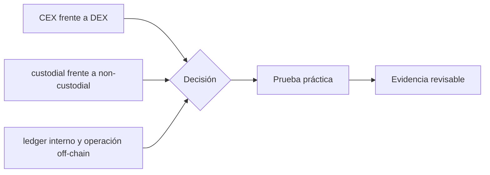

# Clase 59 · Exchanges, custodia y libros internos

> **Clase independiente 59 de 66** · **Nivel:** Profesional · **Fuente base:** documentación técnica de Bitcoin y Ethereum, estándares de gestión de claves de NIST y principios de custodia del IOSCO
>
> [⬅️ Clase anterior](../28-data-analytics-onchain/clase-58-grafo-anomalias-y-limites-de-atribucion.md) · [📚 Índice de las 66 clases](../README.md) · [🗂️ Mapa del tema](README.md) · [➡️ Clase siguiente](../29-exchanges-operaciones-custodia/clase-60-wallets-operacionales-y-evidencia-blockchain.md)

## Punto de partida

**Pregunta guía:** ¿Dónde se ejecuta una operación y quién controla las claves?

**Caso que abre la clase:** Dos clientes negocian en un CEX sin que cambie ninguna dirección on-chain.

Depósito, compraventa interna y retiro se siguen por sistemas distintos. El estudiante localiza cuándo cambia una obligación y cuándo se mueve un activo on-chain.

## Gráfico pedagógico

Recorre el gráfico en voz alta: identifica supuestos, transformaciones y el punto exacto donde aparece evidencia.

## Trabajo práctico

**Método propio:** recorrido operativo de una orden.

**Actividad:** Trazar depósito, trade, saldo y retiro entre sistemas.

Trabaja en entorno local, regtest, signet o testnet según corresponda. Conserva entradas, comandos, salidas y bloque o instante de corte. Una captura aislada no demuestra reproducibilidad.

## Fundamentos que sostienen la respuesta

1. **CEX frente a DEX.** En esta clase delimita qué objeto o relación estamos observando antes de sacar conclusiones. Localízalo explícitamente en «Dos clientes negocian en un CEX sin que cambie ninguna dirección on-chain.» y anota qué dato faltaría para refutar tu lectura.
2. **custodial frente a non-custodial.** En esta clase explica el mecanismo que conecta la situación inicial con el cambio observable. Localízalo explícitamente en «Dos clientes negocian en un CEX sin que cambie ninguna dirección on-chain.» y anota qué dato faltaría para refutar tu lectura.
3. **ledger interno y operación off-chain.** En esta clase permite contrastar el resultado y formular el límite de la evidencia. Localízalo explícitamente en «Dos clientes negocian en un CEX sin que cambie ninguna dirección on-chain.» y anota qué dato faltaría para refutar tu lectura.

### Dos ejes que suelen mezclarse

CEX/DEX describe principalmente **cómo se organiza la negociación o ejecución**; custodial/non-custodial describe **quién controla la firma**. No son sinónimos perfectos. Un agregador puede enrutar una orden hacia contratos sin custodiar claves; un protocolo puede incluir un componente administrativo con poder relevante; y un CEX puede ofrecer una wallet de retiro mientras el saldo mostrado sigue siendo un asiento interno. Para revisar un sistema se pregunta por separado quién recibe la orden, quién modifica el saldo del cliente, quién controla las claves y en qué momento aparece una transacción finalizada.

En un CEX, comprar BTC con USDC suele producir dos movimientos contables en su base de datos. El exchange puede mantener los BTC de miles de clientes en pocas direcciones ómnibus. No existe necesariamente una dirección individual ni un txid por cada compraventa. Solo un depósito o retiro conecta de forma visible el sistema interno con una blockchain. Por eso una captura de la aplicación no demuestra que exista una reserva específica, y ver una wallet grande tampoco demuestra a quién se debe su saldo.

### Operación interna frente a movimiento de activos

En un CEX, casar una compra puede ser una escritura doble en el ledger: baja el saldo de un cliente y sube el de otro sin transacción blockchain. El exchange mantiene la obligación frente a ambos. Depósitos y retiros son las puertas que conectan ese libro con wallets y redes; comisiones, estados pendientes y revisiones de cumplimiento crean diferencias temporales que deben conservar trazabilidad.

CEX/DEX y custodial/no custodial son ejes distintos. Un protocolo puede ejecutar on-chain pero depender de una interfaz y claves administrativas; un servicio puede enrutar a un DEX mientras custodia la clave del usuario. La clase identifica quién puede firmar, qué registro reconoce el derecho del cliente y dónde se resuelve una disputa.

### Wallets dentro del problema

En un exchange custodial, un saldo de cliente puede existir sin wallet on-chain individual. Se separa la cuenta interna de las wallets operativas del custodio.

## Demostración de aprendizaje

**Entregable:** Diagrama que ubique obligación, activo, firma y evidencia por paso.

**Comprobación formativa:** ¿Qué operación altera dos saldos de clientes sin crear una transacción blockchain?

Para aprobar debes conectar el hecho observado con el concepto correcto, descartar al menos una interpretación alternativa y redactar una conclusión cuyo alcance no exceda la prueba.

## Errores que esta clase corrige

- Tratar **CEX frente a DEX** como una etiqueta suficiente, sin identificar actores, dato y frontera.
- Usar **custodial frente a non-custodial** como explicación aunque el caso no aporte la evidencia necesaria.
- Dar por respondido «¿Dónde se ejecuta una operación y quién controla las claves?» sin contrastar **ledger interno y operación off-chain**.

Vuelve al caso inicial, elige el error más peligroso y describe una comprobación concreta que lo detectaría.

## Fuentes para comprobar y ampliar

- [Bitcoin Developer Reference](https://developer.bitcoin.org/reference/)
- [Ethereum: accounts](https://ethereum.org/en/developers/docs/accounts/)
- [NIST SP 800-57, gestión de claves](https://csrc.nist.gov/pubs/sp/800/57/pt1/r5/final)
- [IOSCO Policy Recommendations for Crypto and Digital Asset Markets](https://www.iosco.org/library/pubdocs/pdf/IOSCOPD747.pdf)

Consulta además la [bibliografía razonada](../../docs/bibliografia.md), que declara procedencia y uso.

## Cierre de la clase

Responde otra vez la pregunta guía sin mirar notas. Si tu respuesta no menciona evidencia, supuesto y límite, todavía describe el tema pero no lo domina. Continúa solo cuando otra persona pueda reproducir tu entregable.
