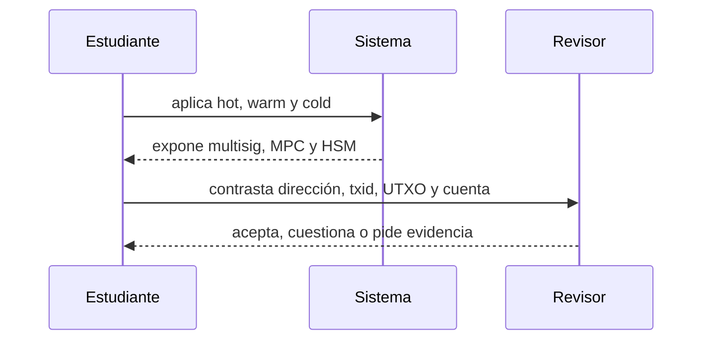

# Clase 60 · Wallets operacionales y evidencia blockchain

> **Clase independiente 60 de 66** · **Nivel:** Profesional · **Fuente base:** documentación técnica de Bitcoin y Ethereum, estándares de gestión de claves de NIST y principios de custodia del IOSCO
>
> [⬅️ Clase anterior](../29-exchanges-operaciones-custodia/clase-59-exchanges-custodia-y-libros-internos.md) · [📚 Índice de las 66 clases](../README.md) · [🗂️ Mapa del tema](README.md) · [➡️ Clase siguiente](../30-contabilidad-conciliacion/clase-61-tres-realidades-contables.md)

## Punto de partida

**Pregunta guía:** ¿Cómo vinculamos una orden interna con direcciones y transaction IDs?

**Caso que abre la clase:** Un retiro se agrupa con otros y su importe no coincide con una salida única.

Txids, direcciones, UTXO y cuentas se leen en regtest y Anvil. Un retiro agrupado evita la falsa expectativa de una correspondencia uno a uno.

## Fundamentos que sostienen la respuesta

1. **hot, warm y cold.** En esta clase delimita qué objeto o relación estamos observando antes de sacar conclusiones. Localízalo explícitamente en «Un retiro se agrupa con otros y su importe no coincide con una salida única.» y anota qué dato faltaría para refutar tu lectura.
2. **multisig, MPC y HSM.** En esta clase explica el mecanismo que conecta la situación inicial con el cambio observable. Localízalo explícitamente en «Un retiro se agrupa con otros y su importe no coincide con una salida única.» y anota qué dato faltaría para refutar tu lectura.
3. **dirección, txid, UTXO y cuenta.** En esta clase permite contrastar el resultado y formular el límite de la evidencia. Localízalo explícitamente en «Un retiro se agrupa con otros y su importe no coincide con una salida única.» y anota qué dato faltaría para refutar tu lectura.

### La wallet es un sistema de autorización

La clave privada permite producir firmas; la seed phrase puede regenerar un árbol de claves y por eso suele ser un secreto de impacto mayor. Una dirección se deriva del material público y sirve para referenciar un destino o una cuenta, pero no identifica por sí sola a una persona. Multisig distribuye firmas y deja la regla observable cuando vive on-chain. MPC distribuye el cálculo para que la clave completa no se reconstruya; la cadena ve una firma ordinaria. Un HSM protege generación y uso de claves dentro de hardware, pero no decide por sí solo si una retirada era legítima. Los controles humanos y de software que alimentan al firmante siguen importando.

Hot, warm y cold son capas de disponibilidad. La wallet hot atiende retiros y está expuesta a sistemas conectados; la warm requiere una activación controlada para reponerla; la cold conserva la mayor parte con ceremonias y tiempos más largos. El diseño profesional define límites, segregación de funciones, listas de destinos, doble control, pausas de emergencia, rotación y una recuperación ensayada. Una cold wallet cuya única seed se perdió no es segura: es indisponible.

### UTXO, cuentas y stablecoins

Bitcoin representa valor mediante salidas no gastadas. Conciliar exige inventariar UTXO controlados, considerar cambio, comisiones, confirmaciones y transacciones reemplazadas. Ethereum usa cuentas con saldo y nonce; los tokens son estados de contratos y se observan mediante llamadas y eventos. Una misma dirección puede existir en varias redes, así que la red forma parte de la identidad operativa del activo. Para una stablecoin también se fijan contrato, decimales, emisor y posibilidad de congelación. Sumar símbolos `USDC` de redes o contratos diferentes es una conciliación inválida.

El explorador facilita la lectura, no sustituye la verificación. Puede etiquetar direcciones, interpretar transferencias internas o quedar rezagado. Un procedimiento serio guarda altura de bloque, hash, red, dirección, contrato, txid y fuente. Para prácticas se usa Bitcoin `regtest` o `signet`, una red Ethereum local y APIs públicas solo en lectura. Nunca se importan seeds reales ni se envían fondos reales.

### Wallets dentro del problema

Direcciones, txids y modelos UTXO/cuentas enlazan retiros con operaciones reales. Una wallet agrupadora impide suponer una transacción por cliente.

## Gráfico pedagógico

Recorre el gráfico en voz alta: identifica supuestos, transformaciones y el punto exacto donde aparece evidencia.

## Demostración de aprendizaje

**Entregable:** Expediente con fuente, corte, identificadores y explicación del batching.

**Comprobación formativa:** ¿Qué evidencia vincula un retiro interno con una salida dentro de una transacción agrupada?

Para aprobar debes conectar el hecho observado con el concepto correcto, descartar al menos una interpretación alternativa y redactar una conclusión cuyo alcance no exceda la prueba.

## Trabajo práctico

**Método propio:** investigación multi-red sin fondos reales.

**Actividad:** Investigar transacciones en regtest y red local Ethereum.

Trabaja en entorno local, regtest, signet o testnet según corresponda. Conserva entradas, comandos, salidas y bloque o instante de corte. Una captura aislada no demuestra reproducibilidad.

## Errores que esta clase corrige

- Tratar **hot, warm y cold** como una etiqueta suficiente, sin identificar actores, dato y frontera.
- Usar **multisig, MPC y HSM** como explicación aunque el caso no aporte la evidencia necesaria.
- Dar por respondido «¿Cómo vinculamos una orden interna con direcciones y transaction IDs?» sin contrastar **dirección, txid, UTXO y cuenta**.

Vuelve al caso inicial, elige el error más peligroso y describe una comprobación concreta que lo detectaría.

## Fuentes para comprobar y ampliar

- [Bitcoin Developer Reference](https://developer.bitcoin.org/reference/)
- [Ethereum: accounts](https://ethereum.org/en/developers/docs/accounts/)
- [NIST SP 800-57, gestión de claves](https://csrc.nist.gov/pubs/sp/800/57/pt1/r5/final)
- [IOSCO Policy Recommendations for Crypto and Digital Asset Markets](https://www.iosco.org/library/pubdocs/pdf/IOSCOPD747.pdf)

Consulta además la [bibliografía razonada](../../docs/bibliografia.md), que declara procedencia y uso.

## Cierre de la clase

Responde otra vez la pregunta guía sin mirar notas. Si tu respuesta no menciona evidencia, supuesto y límite, todavía describe el tema pero no lo domina. Continúa solo cuando otra persona pueda reproducir tu entregable.
