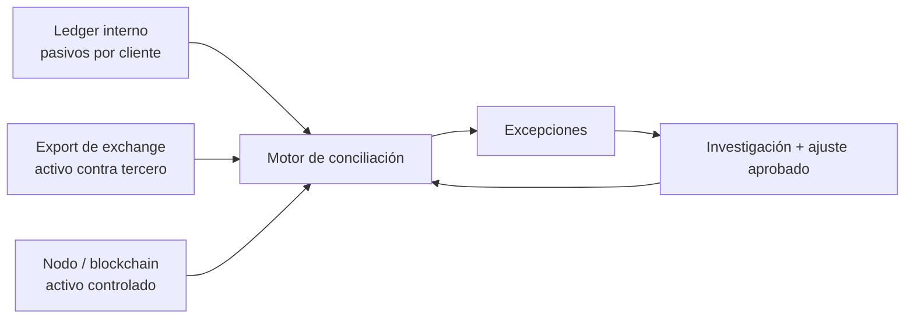

# 30 · Contabilidad blockchain y conciliación

> **Nivel:** Profesional · ⏱️ **Duración estimada:** 180 min · **Fuente:** principios de control interno de COSO, documentación de nodos Bitcoin/Ethereum y literatura contable sobre criptoactivos
>
> [⬅️ Currículo](../README.md) · [🌱 Empieza aquí](../../docs/empieza-aqui.md) · [📖 Glosario](../../docs/glosario.md) · [📚 Bibliografía](../../docs/bibliografia.md)
> 🧭 ⬅️ **Anterior:** [29 · Exchanges y operaciones de custodia](../29-exchanges-operaciones-custodia/README.md) · [📚 Índice](../README.md) · ➡️ **Siguiente:** [31 · Proof of Reserves y solvencia](../31-proof-reserves-solvencia/README.md)

## 🎯 Objetivos

- Mantener separados pasivos de clientes, activos en exchanges y activos on-chain.
- Diseñar una conciliación por activo, red, contrato, custodio y corte temporal.
- Investigar diferencias por depósitos pendientes, retiros, comisiones, reorgs o errores de unidad.
- Producir evidencia repetible con procedencia y reglas de excepción.

## 📚 Resultados de aprendizaje

Podrás reconstruir un saldo desde movimientos, cotejarlo con fuentes independientes y explicar una diferencia sin compensar déficits de un activo con excedentes de otro.

## 🧠 Concepto transversal

```text
Internal Ledger != Exchange Reality != Blockchain State
```

El objetivo profesional no es elegir uno como “verdad absoluta”, sino comprobar cómo se relacionan, qué corte representan y qué afirmación soporta cada uno.

## 🧩 Esquema visual



## 📖 Conceptos

- **Subledger de clientes:** detalle de obligaciones por cliente y activo.
- **Mayor general:** registro contable agregado sujeto a políticas de reconocimiento y valoración.
- **Conciliación:** comparación controlada entre registros que deberían relacionarse.
- **Corte:** instante o altura a la que se refiere el saldo.
- **Diferencia temporal:** operación válida capturada en una fuente antes que en otra.
- **Excepción:** diferencia que requiere evidencia, responsable, estado y resolución.

## 🔬 Profundización

### Tres realidades, tres afirmaciones

El ledger interno responde cuánto reconoce la entidad que debe a sus clientes. Un export de otro exchange responde cuánto afirma ese tercero que mantiene disponible o bloqueado para la entidad. El estado blockchain responde qué activos existen en determinadas direcciones o UTXO a una altura, pero no prueba automáticamente que la entidad controle las claves ni que los activos estén libres de gravámenes. Ninguna fuente sustituye a las otras.

Una conciliación comienza definiendo población, unidad y corte. “BTC” no basta: se identifica activo y red; para tokens, contrato y decimales. Los importes se procesan en unidades enteras mínimas para evitar redondeos. Todas las fuentes se llevan a UTC y, para cadena, a altura y hash de bloque. Si el ledger cerró a medianoche y la consulta on-chain se ejecutó diez minutos después, las retiradas intermedias pueden parecer un déficit. No se corrige la cifra para hacerla coincidir: se construye un puente temporal con movimientos identificados.

### De movimientos a saldos

El saldo final debe poder reconstruirse como saldo inicial más depósitos y créditos, menos retiros, débitos y comisiones, con reversos explícitos. En Bitcoin se controlan depósitos por txid y vout, gasto de UTXO, salidas de cambio y confirmaciones. En Ethereum se separa ETH nativo de tokens; para tokens se coteja `balanceOf` con eventos sin suponer que todo contrato cumple perfectamente el estándar. Los nonces ayudan a detectar huecos operativos, no son un libro contable.

Los exchanges internos introducen eventos que jamás tendrán txid: una operación entre dos clientes, una comisión comercial o un bloqueo de margen. Deben tener su propio identificador inmutable y trazabilidad de aprobación. Pedir un txid para todo revela que el modelo contable no entiende la separación on-chain/off-chain.

### Excepciones y controles

Las diferencias se clasifican: timing, dato incompleto, dirección no inventariada, activo o red incorrectos, transacción fallida, comisión, reorg, duplicado, ajuste manual o incidente. Cada excepción lleva antigüedad, impacto, propietario, evidencia y fecha límite. La materialidad prioriza, pero una diferencia pequeña repetida puede revelar un fallo sistémico.

No se netean activos distintos ni clientes distintos para ocultar faltantes. Tampoco se cuenta dos veces una wallet reflejada en un exchange o en un servicio de custodia. La prueba de control de dirección —mensaje firmado o movimiento diseñado— debe evitar reutilización y no exige transferir fondos reales en este programa. La segregación de funciones separa quien extrae, quien concilia y quien aprueba ajustes.

Una conciliación aprobada no es una auditoría completa. Demuestra que fuentes definidas coinciden bajo reglas y corte concretos. La auditoría además evalúa integridad de la población, derechos y obligaciones, valuación, presentación, controles y hechos posteriores. Esta distinción prepara el módulo de reservas y el caso final.

## 🧪 Laboratorio guiado

Ejecuta `pnpm lab:conciliacion`. El script carga un ledger de clientes, un export de exchange y wallets de Bitcoin/Ethereum local; presenta pasivos, activos de tercero, activos on-chain y diferencia por activo. Investiga por qué USDC queda en déficit. Todo son datos ficticios y unidades enteras documentadas.

## 📝 Reto verificable

Añade una diferencia temporal sin borrar el dato original. Documenta el asiento puente, la evidencia y el estado. Se aprueba si el resultado vuelve a cuadrar y el informe conserva el desfase y la procedencia.

## ⚠️ Errores frecuentes

| Error | Corrección |
|---|---|
| Sumar valor fiat de activos distintos | Conciliar primero cantidad por activo/red/contrato |
| Consultar “saldo actual” contra cierre histórico | Fijar altura/hash y corte común |
| Ajustar directamente para cuadrar | Abrir excepción y aprobar un asiento trazable |
| Contar saldo en custodio y su wallet subyacente | Definir propiedad y eliminar doble conteo |

## 🛡️ Seguridad y ética

Usa endpoints read-only, direcciones públicas y datasets minimizados. No incluyas PII en exports de laboratorio y no conviertas una diferencia sin investigar en acusación de fraude.

## 🔗 Referencias

- [COSO Internal Control Framework](https://www.coso.org/internal-control)
- [Bitcoin Core RPC documentation](https://bitcoincore.org/en/doc/)
- [Ethereum JSON-RPC](https://ethereum.org/en/developers/docs/apis/json-rpc/)
- [IFRS: holdings of cryptocurrencies](https://www.ifrs.org/projects/completed-projects/2019/holdings-of-cryptocurrencies/)

## ✅ Criterio de dominio

Puedes ejecutar y revisar una conciliación reproducible de tres registros, explicar cada diferencia y mantener una pista de auditoría.

## 🧭 Navegación

⬅️ [Módulo 29 · Exchanges y operaciones de custodia](../29-exchanges-operaciones-custodia/README.md) · [📚 Índice del currículo](../README.md) · ➡️ [Módulo 31 · Proof of Reserves y solvencia](../31-proof-reserves-solvencia/README.md)
