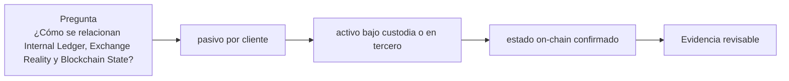

# Clase 61 · Tres realidades contables

> **Clase independiente 61 de 66** · **Nivel:** Profesional · **Fuente base:** principios de control interno de COSO, documentación de nodos Bitcoin/Ethereum y literatura contable sobre criptoactivos
>
> [⬅️ Clase anterior](../29-exchanges-operaciones-custodia/clase-60-wallets-operacionales-y-evidencia-blockchain.md) · [📚 Índice de las 66 clases](../README.md) · [🗂️ Mapa del tema](README.md) · [➡️ Clase siguiente](../30-contabilidad-conciliacion/clase-62-conciliacion-y-gestion-de-diferencias.md)

## Punto de partida

**Pregunta guía:** ¿Cómo se relacionan Internal Ledger, Exchange Reality y Blockchain State?

**Caso que abre la clase:** La interfaz muestra saldo, el exchange externo otro y la wallet un tercero.

Cada fuente se totaliza antes de reconciliar para impedir que una cifra contamine a las demás. La procedencia importa tanto como el importe.

## Fundamentos que sostienen la respuesta

1. **pasivo por cliente.** En esta clase delimita qué objeto o relación estamos observando antes de sacar conclusiones. Localízalo explícitamente en «La interfaz muestra saldo, el exchange externo otro y la wallet un tercero.» y anota qué dato faltaría para refutar tu lectura.
2. **activo bajo custodia o en tercero.** En esta clase explica el mecanismo que conecta la situación inicial con el cambio observable. Localízalo explícitamente en «La interfaz muestra saldo, el exchange externo otro y la wallet un tercero.» y anota qué dato faltaría para refutar tu lectura.
3. **estado on-chain confirmado.** En esta clase permite contrastar el resultado y formular el límite de la evidencia. Localízalo explícitamente en «La interfaz muestra saldo, el exchange externo otro y la wallet un tercero.» y anota qué dato faltaría para refutar tu lectura.

### Tres realidades, tres afirmaciones

El ledger interno responde cuánto reconoce la entidad que debe a sus clientes. Un export de otro exchange responde cuánto afirma ese tercero que mantiene disponible o bloqueado para la entidad. El estado blockchain responde qué activos existen en determinadas direcciones o UTXO a una altura, pero no prueba automáticamente que la entidad controle las claves ni que los activos estén libres de gravámenes. Ninguna fuente sustituye a las otras.

Una conciliación comienza definiendo población, unidad y corte. “BTC” no basta: se identifica activo y red; para tokens, contrato y decimales. Los importes se procesan en unidades enteras mínimas para evitar redondeos. Todas las fuentes se llevan a UTC y, para cadena, a altura y hash de bloque. Si el ledger cerró a medianoche y la consulta on-chain se ejecutó diez minutos después, las retiradas intermedias pueden parecer un déficit. No se corrige la cifra para hacerla coincidir: se construye un puente temporal con movimientos identificados.

### Tres registros que responden preguntas distintas

El ledger interno responde cuánto debe la entidad a cada cliente. La realidad operativa del exchange añade órdenes, comisiones, créditos, préstamos, garantías y activos mantenidos en terceros. El estado blockchain muestra saldos y transacciones de direcciones y contratos, pero no conoce por sí mismo la titularidad económica ni todas las obligaciones. Igualar dos cifras sin reconciliar población, activo, entidad y corte produce una coincidencia, no evidencia.

La reconstrucción empieza separada: se totaliza cada fuente sin contaminarla con ajustes de otra. Luego se crea una clave de enlace —retiro, txid, lote, dirección, activo, red y tiempo— y se documentan diferencias. La ecuación transversal es deliberadamente desigual: `Internal Ledger ≠ Exchange Reality ≠ Blockchain State`; el trabajo profesional comprueba cómo se relacionan.

## Gráfico pedagógico

Recorre el gráfico en voz alta: identifica supuestos, transformaciones y el punto exacto donde aparece evidencia.

## Trabajo práctico

**Método propio:** reconstrucción independiente de tres libros.

**Actividad:** Reconstruir cada universo sin compensarlos prematuramente.

Trabaja en entorno local, regtest, signet o testnet según corresponda. Conserva entradas, comandos, salidas y bloque o instante de corte. Una captura aislada no demuestra reproducibilidad.

## Demostración de aprendizaje

**Entregable:** Balance por fuente con dueño, timestamp, unidad y procedencia.

**Comprobación formativa:** ¿Qué representa un saldo de cliente: activo de la empresa, pasivo o ambos?

Para aprobar debes conectar el hecho observado con el concepto correcto, descartar al menos una interpretación alternativa y redactar una conclusión cuyo alcance no exceda la prueba.

## Errores que esta clase corrige

- Tratar **pasivo por cliente** como una etiqueta suficiente, sin identificar actores, dato y frontera.
- Usar **activo bajo custodia o en tercero** como explicación aunque el caso no aporte la evidencia necesaria.
- Dar por respondido «¿Cómo se relacionan Internal Ledger, Exchange Reality y Blockchain State?» sin contrastar **estado on-chain confirmado**.

Vuelve al caso inicial, elige el error más peligroso y describe una comprobación concreta que lo detectaría.

## Fuentes para comprobar y ampliar

- [COSO Internal Control Framework](https://www.coso.org/internal-control)
- [Bitcoin Core RPC documentation](https://bitcoincore.org/en/doc/)
- [Ethereum JSON-RPC](https://ethereum.org/en/developers/docs/apis/json-rpc/)
- [IFRS: holdings of cryptocurrencies](https://www.ifrs.org/projects/completed-projects/2019/holdings-of-cryptocurrencies/)

Consulta además la [bibliografía razonada](../../docs/bibliografia.md), que declara procedencia y uso.

## Cierre de la clase

Responde otra vez la pregunta guía sin mirar notas. Si tu respuesta no menciona evidencia, supuesto y límite, todavía describe el tema pero no lo domina. Continúa solo cuando otra persona pueda reproducir tu entregable.
