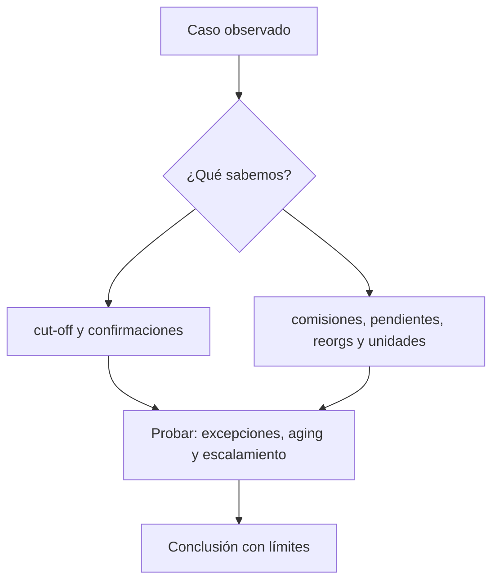

# Clase 62 · Conciliación y gestión de diferencias

> **Clase independiente 62 de 66** · **Nivel:** Profesional · **Fuente base:** principios de control interno de COSO, documentación de nodos Bitcoin/Ethereum y literatura contable sobre criptoactivos
>
> [⬅️ Clase anterior](../30-contabilidad-conciliacion/clase-61-tres-realidades-contables.md) · [📚 Índice de las 66 clases](../README.md) · [🗂️ Mapa del tema](README.md) · [➡️ Clase siguiente](../31-proof-reserves-solvencia/clase-63-del-saldo-del-cliente-a-una-prueba-merkle.md)

## Punto de partida

**Pregunta guía:** ¿Qué explica una diferencia y cuándo se convierte en incidente?

**Caso que abre la clase:** Un retiro pendiente cruza el cierre y parece un déficit temporal.

Excepciones con antigüedad y causa distintas compiten por atención. El equipo separa diferencia temporal, error, pérdida y dato insuficiente.

## Gráfico pedagógico

Recorre el gráfico en voz alta: identifica supuestos, transformaciones y el punto exacto donde aparece evidencia.

## Fundamentos que sostienen la respuesta

1. **cut-off y confirmaciones.** En esta clase delimita qué objeto o relación estamos observando antes de sacar conclusiones. Localízalo explícitamente en «Un retiro pendiente cruza el cierre y parece un déficit temporal.» y anota qué dato faltaría para refutar tu lectura.
2. **comisiones, pendientes, reorgs y unidades.** En esta clase explica el mecanismo que conecta la situación inicial con el cambio observable. Localízalo explícitamente en «Un retiro pendiente cruza el cierre y parece un déficit temporal.» y anota qué dato faltaría para refutar tu lectura.
3. **excepciones, aging y escalamiento.** En esta clase permite contrastar el resultado y formular el límite de la evidencia. Localízalo explícitamente en «Un retiro pendiente cruza el cierre y parece un déficit temporal.» y anota qué dato faltaría para refutar tu lectura.

### De movimientos a saldos

El saldo final debe poder reconstruirse como saldo inicial más depósitos y créditos, menos retiros, débitos y comisiones, con reversos explícitos. En Bitcoin se controlan depósitos por txid y vout, gasto de UTXO, salidas de cambio y confirmaciones. En Ethereum se separa ETH nativo de tokens; para tokens se coteja `balanceOf` con eventos sin suponer que todo contrato cumple perfectamente el estándar. Los nonces ayudan a detectar huecos operativos, no son un libro contable.

Los exchanges internos introducen eventos que jamás tendrán txid: una operación entre dos clientes, una comisión comercial o un bloqueo de margen. Deben tener su propio identificador inmutable y trazabilidad de aprobación. Pedir un txid para todo revela que el modelo contable no entiende la separación on-chain/off-chain.

### Excepciones y controles

Las diferencias se clasifican: timing, dato incompleto, dirección no inventariada, activo o red incorrectos, transacción fallida, comisión, reorg, duplicado, ajuste manual o incidente. Cada excepción lleva antigüedad, impacto, propietario, evidencia y fecha límite. La materialidad prioriza, pero una diferencia pequeña repetida puede revelar un fallo sistémico.

No se netean activos distintos ni clientes distintos para ocultar faltantes. Tampoco se cuenta dos veces una wallet reflejada en un exchange o en un servicio de custodia. La prueba de control de dirección —mensaje firmado o movimiento diseñado— debe evitar reutilización y no exige transferir fondos reales en este programa. La segregación de funciones separa quien extrae, quien concilia y quien aprueba ajustes.

Una conciliación aprobada no es una auditoría completa. Demuestra que fuentes definidas coinciden bajo reglas y corte concretos. La auditoría además evalúa integridad de la población, derechos y obligaciones, valuación, presentación, controles y hechos posteriores. Esta distinción prepara las clases de reservas y el caso final.

### De la excepción al incidente

Conciliar no consiste en forzar que dos totales coincidan. Cada diferencia recibe identidad, importe, activo, primera aparición, edad, propietario y causa provisional. Una transacción pendiente puede ser diferencia temporal; un decimal incorrecto es error de transformación; una salida no autorizada puede ser pérdida; un archivo incompleto es limitación de evidencia. Ajustarlas todas contra una cuenta puente oculta precisamente la señal que debía investigarse.

La prioridad combina materialidad, antigüedad, exposición y posibilidad de repetición. El cierre exige evidencia de causa y corrección, no solo saldo cero. Si el problema afectó autorización o custodia, se preservan logs y se escala antes de modificar registros. La conciliación es así control detectivo y fuente de aprendizaje operacional.

## Trabajo práctico

**Método propio:** war room de conciliación.

**Actividad:** Ejecutar conciliación por activo y clasificar cada excepción.

Trabaja en entorno local, regtest, signet o testnet según corresponda. Conserva entradas, comandos, salidas y bloque o instante de corte. Una captura aislada no demuestra reproducibilidad.

## Errores que esta clase corrige

- Tratar **cut-off y confirmaciones** como una etiqueta suficiente, sin identificar actores, dato y frontera.
- Usar **comisiones, pendientes, reorgs y unidades** como explicación aunque el caso no aporte la evidencia necesaria.
- Dar por respondido «¿Qué explica una diferencia y cuándo se convierte en incidente?» sin contrastar **excepciones, aging y escalamiento**.

Vuelve al caso inicial, elige el error más peligroso y describe una comprobación concreta que lo detectaría.

## Demostración de aprendizaje

**Entregable:** Informe repetible con diferencia bruta, ajuste justificado y saldo final.

**Comprobación formativa:** ¿Cuándo un ajuste contable corrige el registro y cuándo sólo oculta la causa?

Para aprobar debes conectar el hecho observado con el concepto correcto, descartar al menos una interpretación alternativa y redactar una conclusión cuyo alcance no exceda la prueba.

## Fuentes para comprobar y ampliar

- [COSO Internal Control Framework](https://www.coso.org/internal-control)
- [Bitcoin Core RPC documentation](https://bitcoincore.org/en/doc/)
- [Ethereum JSON-RPC](https://ethereum.org/en/developers/docs/apis/json-rpc/)
- [IFRS: holdings of cryptocurrencies](https://www.ifrs.org/projects/completed-projects/2019/holdings-of-cryptocurrencies/)

Consulta además la [bibliografía razonada](../../docs/bibliografia.md), que declara procedencia y uso.

## Cierre de la clase

Responde otra vez la pregunta guía sin mirar notas. Si tu respuesta no menciona evidencia, supuesto y límite, todavía describe el tema pero no lo domina. Continúa solo cuando otra persona pueda reproducir tu entregable.
