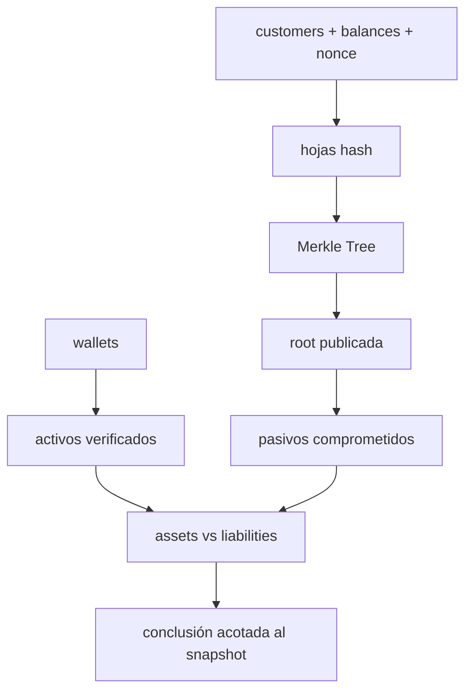

# Proof of Reserves, pasivos y solvencia · Clases 63–64

> **Nivel:** Profesional · ⏱️ **Duración estimada:** 2 clases de 105 min · **Fuente:** especificaciones de Certificate Transparency/Merkle trees, marcos de encargos de aseguramiento y publicaciones regulatorias sobre proof of reserves
>
> [⬅️ Currículo](../README.md) · [🌱 Empieza aquí](../../docs/empieza-aqui.md) · [📖 Glosario](../../docs/glosario.md) · [📚 Bibliografía](../../docs/bibliografia.md)
> 🧭 ⬅️ **Anterior:** [Clases 61–62 · Contabilidad blockchain y conciliación](../30-contabilidad-conciliacion/README.md) · [📚 Índice](../README.md) · ➡️ **Siguiente:** [Clases 65–66 · Forensics, auditoría y gobernanza](../32-forensics-auditoria-gobernanza/README.md)

<!-- clases-independientes:inicio -->
## Las dos clases independientes de este tema

Esta página conserva el mapa, los conceptos compartidos y las referencias. La enseñanza evaluable ocurre en dos documentos separados; cada uno tiene fundamento, gráfico, caso, práctica, evidencia y fuentes propios.

### [Clase 63 · Del saldo del cliente a una prueba Merkle](clase-63-del-saldo-del-cliente-a-una-prueba-merkle.md)

¿Cómo demuestra un cliente que su saldo fue incluido sin publicar todos los saldos?

**Experiencia propia:** laboratorio de construcción y sabotaje controlado. **Evidencia:** Raíz reproducible y verificación documentada de una inclusión y una exclusión.

### [Clase 64 · Del snapshot a una conclusión profesional](clase-64-del-snapshot-a-una-conclusion-profesional.md)

¿Qué falta para pasar de controlar wallets a concluir solvencia?

**Experiencia propia:** comité de aseguramiento con evidencia contradictoria. **Evidencia:** Conclusión acotada que no confunda snapshot con auditoría financiera.
<!-- clases-independientes:fin -->

---

## 🎯 Objetivos

- Construir un compromiso Merkle de balances de clientes y verificar inclusión.
- Diferenciar Proof of Reserves, Proof of Liabilities y una conclusión de solvencia.
- Comparar activos y pasivos por activo bajo un mismo corte.
- Identificar qué queda fuera de un snapshot y de un procedimiento acordado.

## 📚 Resultados de aprendizaje

Podrás producir una raíz reproducible, verificar una prueba de inclusión, revisar control de wallets y redactar una conclusión acotada que no presente PoR como auditoría financiera completa.

## 🧩 Esquema visual

## 📖 Conceptos

- **Proof of Reserves (PoR):** evidencia sobre activos identificados en un corte.
- **Proof of Liabilities (PoL):** evidencia sobre obligaciones incluidas en una población.
- **Merkle Tree:** árbol de hashes que permite probar inclusión sin publicar todas las hojas.
- **Solvencia:** capacidad de cubrir obligaciones considerando la entidad completa, no solo direcciones seleccionadas.
- **Encargo de aseguramiento:** trabajo con alcance, criterios, evidencia y conclusión definidos; no equivale automáticamente a auditoría de estados financieros.

## 🔬 Profundización

### Del balance del cliente a la raíz

El laboratorio canoniza cada hoja como cliente, activo, saldo y nonce, y la resume con SHA-256. Los hashes se combinan hasta obtener una raíz. Si cambia un solo saldo, cambia la raíz. El cliente recibe su hoja y los hashes hermanos necesarios para recalcular el camino; así verifica inclusión sin descargar toda la lista. El nonce reduce ataques triviales por diccionario contra identificadores y saldos predecibles, pero debe gestionarse de forma segura.

La inclusión responde “este registro formó parte del árbol comprometido”. No responde “todos los clientes fueron incluidos”, “el saldo es correcto”, “no existen pasivos fuera del sistema” ni “la entidad no pidió prestados los activos durante la foto”. La integridad de la población es la afirmación difícil de Proof of Liabilities. Se revisan interfaces entre productos, cuentas suspendidas, saldos negativos, derivados, garantías, préstamos y entidades relacionadas. Permitir saldos negativos puede reducir artificialmente el total; por eso el laboratorio los rechaza.

### Probar activos sin inflarlos

Para activos on-chain se inventarían direcciones y se demuestra control con una firma ligada al encargo o con una transacción controlada. Ver un saldo no prueba control. La evidencia fija red, activo, contrato, altura y hora. También revisa que la wallet no esté comprometida, pignorada o compartida con otra entidad. Activos en otro exchange son una reclamación contra tercero y necesitan confirmación independiente; no son equivalentes a activos autocustodiados.

La comparación se hace por activo. Un excedente de token ilíquido no cubre automáticamente un déficit de BTC. Si se presenta un ratio agregado en moneda fiat, se documentan fuente de precio, instante, liquidez y haircuts. Las stablecoins requieren identificar emisor, red y contrato, y considerar facultades de congelación o rescate.

### Por qué PoR no es auditoría financiera completa

Una auditoría de estados financieros evalúa múltiples afirmaciones: existencia, integridad, derechos y obligaciones, valuación, corte, clasificación y presentación, además del contexto de controles y materialidad. Un snapshot de PoR puede apoyar existencia de ciertos activos y compromiso de ciertos pasivos. Normalmente no cubre ingresos, gastos, capital, pasivos comerciales, litigios, préstamos, partes relacionadas, continuidad operacional ni hechos posteriores.

Incluso un informe emitido por un profesional debe leerse por su nombre y alcance: auditoría, revisión, atestiguación o procedimientos acordados producen conclusiones distintas. “Empresa auditada” no describe qué fue auditado. El lector busca fecha, entidad legal, criterios, población, excepciones, responsabilidad de la administración y limitaciones.

Un programa continuo mejora el snapshot con raíces periódicas, monitoreo de wallets, conciliación diaria, pruebas sorpresivas, rotación del verificador y canal para que cada cliente compruebe inclusión. Aun así, no elimina riesgos operativos, legales o de gobernanza. La conclusión profesional correcta es proporcional: “para este corte, bajo estas fuentes y procedimientos, los activos verificados cubren los pasivos incluidos”, nunca “el exchange es seguro”.

## 🧪 Proof of Reserves Lab

Ejecuta `pnpm lab:por`. El flujo implementa exactamente `customers → balances → Merkle Tree → root`, verifica inclusión de un cliente y compara wallets/activos con liabilities. Después altera un balance y observa cómo cambian raíz y prueba. No usa fondos ni servicios externos.

## 📝 Reto verificable

Genera un snapshot deficitario y redacta una conclusión de cinco líneas que incluya entidad, corte, activos, pasivos, diferencia y limitación. Se rechaza cualquier conclusión que use “auditoría completa” o “solvente” sin evidencia adicional.

## ⚠️ Errores frecuentes

| Error | Corrección |
|---|---|
| “Estoy incluido, entonces todos están incluidos” | La inclusión individual no prueba completitud de la población |
| “La wallet tiene saldo, entonces la controla el exchange” | Exige prueba de control ligada al encargo |
| “Assets ≥ liabilities implica solvencia total” | Solo aplica a activos y pasivos incluidos en el corte |
| Ignorar saldos negativos | Rechazarlos o tratarlos sin reducir obligaciones brutas |

## 🛡️ Seguridad y ética

Publicar identificadores o saldos sin protección puede reidentificar clientes. El diseño minimiza datos, usa nonces y entrega pruebas por canal autenticado. Nunca uses una PoR promocional para afirmar más que su alcance.

## 🔗 Referencias

- [RFC 6962: Certificate Transparency y árboles Merkle](https://www.rfc-editor.org/rfc/rfc6962)
- [IAASB: International Framework for Assurance Engagements](https://www.iaasb.org/publications/international-standard-assurance-engagements-isae-3000-revised-assurance-engagements-other-audits-or)
- [IAASB: ISRS 4400 (Revised), procedimientos acordados](https://www.iaasb.org/publications/international-standard-related-services-isrs-4400-revised)
- [PCAOB: Proof of Reserve Reports and Crypto Exchanges](https://pcaobus.org/resources/information-for-investors/investor-advisories/investor-advisory-exercise-caution-with-third-party-verification-proof-of-reserve-reports)
- [IOSCO Final Report on Crypto and Digital Asset Markets](https://www.iosco.org/library/pubdocs/pdf/IOSCOPD747.pdf)

## ✅ Criterio de dominio

Puedes verificar criptográficamente inclusión y, al mismo tiempo, explicar con precisión todo lo que esa verificación no demuestra.

## 🧭 Navegación

⬅️ [Clases 61–62 · Contabilidad blockchain y conciliación](../30-contabilidad-conciliacion/README.md) · [📚 Índice del currículo](../README.md) · ➡️ [Clases 65–66 · Forensics, auditoría y gobernanza](../32-forensics-auditoria-gobernanza/README.md)
